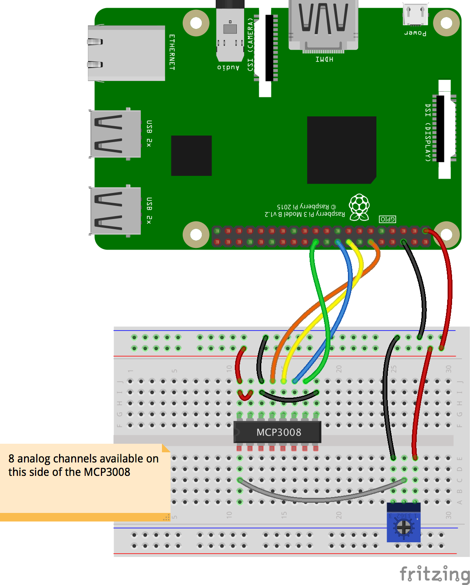
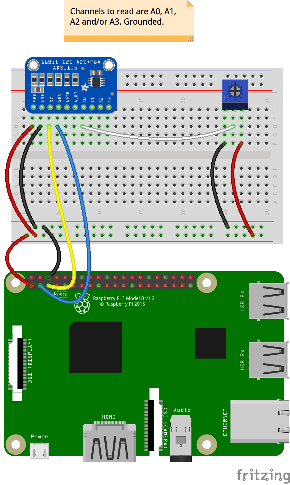

# ADC Benchmark

We want to compare several Analog to Digital Converters

- MCP3008 (10 bits) (May 2018: $ 3.75)
- TODO : MCP3002
- ADS1015 (12 bits) (May 2018: $ 9.95)
- ADS1115 (16 bits) (May 2018: $14.95)

The final goal for this case study will be to evaluate the orientation of a panel (like a solar panel),
using a _linear_ potentiometer like [this one](https://www.adafruit.com/product/562).

This potentiometer's knob rotates on about 300&deg;.

We will call the center (150&deg;) the zero. Thus, reading will go from -150&deg; to +150&deg;.

Servos are _not_ an option here, as the panel we want to orient is too heavy.
Stepper motors are required.

We will need two potentiometers, one for the tilt (rotation on an horizontal axis),
and another one for the azimuth (rotation on a vertical axis).

A precision of one or two degrees will happen to be sufficient in this use-case.

### MCP3008
##### SPI, 8 channels of 10-bit analog input

As such, returns 2<sup><small>10</small></sup> values, in \[0..1023\].



```
 $ ./run.sh --channel:5
Read an ADC for 3.3 Volt estimation
+------------+
| 1: MCP3008 |
| 2: ADS1015 |
| 3: ADS1115 |
+------------+
| Q: Bye     |
+------------+
 You choose > 1

Read an ADC for 3.3 Volt estimation
Usage is ./run --miso:9 --mosi:10 --clk:11 --cs:8 --channel:0
 For miso, mosi, clk & cs, use BCM pin numbers
Usage is java adcbenchmark.mcp3008.MainMCP3008Sample33 --miso:9 --mosi:10 --clk:11 --cs:8 --channel:0
Values above are default values (GPIO/BCM numbers).

Reading MCP3008 on channel 5
 Wiring of the MCP3008-SPI (without power supply):
 +---------++-----------------------------------------------+
 | MCP3008 || Raspberry Pi                                  |
 +---------++------+------------+------+---------+----------+
 |         || Pin# | Name       | Role | GPIO    | wiringPI |
 |         ||      |            |      | /BCM    | /PI4J    |
 +---------++------+------------+------+---------+----------+
 | CLK (13)|| #23  | SPI0_CLK   | CLK  | GPIO_11 | 14       |
 | Din (11)|| #19  | SPI0_MOSI  | MOSI | GPIO_10 | 12       |
 | Dout(12)|| #21  | SPI0_MISO  | MISO | GPIO_09 | 13       |
 | CS  (10)|| #24  | SPI0_CS0_N | CS   | GPIO_08 | 10       |
 +---------++------+------------+-----+----------+----------+
Raspberry Pi is the Master, MCP3008 is the Slave:
- Dout on the MCP3008 goes to MISO on the RPi
- Din on the MCP3008 goes to MOSI on the RPi
Pins on the MCP3008 are numbered from 1 to 16, beginning top left, counter-clockwise.
       +--------+
  CH0 -+  1  16 +- Vdd
  CH1 -+  2  15 +- Vref
  CH2 -+  3  14 +- aGnd
  CH3 -+  4  13 +- CLK
  CH4 -+  5  12 +- Dout
* CH5 -+  6  11 +- Din
  CH6 -+  7  10 +- CS
  CH7 -+  8   9 +- dGnd
       +--------+
       +-----+-----+--------------+-----++-----+--------------+-----+-----+
       | BCM | wPi | Name         |  Physical  |         Name | wPi | BCM |
       +-----+-----+--------------+-----++-----+--------------+-----+-----+
       |     |     | 3v3          | #01 || #02 |          5v0 |     |     |
       |  02 |  08 | SDA1         | #03 || #04 |          5v0 |     |     |
       |  03 |  09 | SCL1         | #05 || #06 |          GND |     |     |
       |  04 |  07 | GPCLK0       | #07 || #08 |    UART0_TXD | 15  | 14  |
       |     |     | GND          | #09 || #10 |    UART0_RXD | 16  | 15  |
       |  17 |  00 | GPIO_0       | #11 || #12 | PCM_CLK/PWM0 | 01  | 18  |
       |  27 |  02 | GPIO_2       | #13 || #14 |          GND |     |     |
       |  22 |  03 | GPIO_3       | #15 || #16 |       GPIO_4 | 04  | 23  |
       |     |     | 3v3          | #17 || #18 |       GPIO_5 | 05  | 24  |
   Din |  10 |  12 | SPI0_MOSI    | #19 || #20 |          GND |     |     |
  Dout |  09 |  13 | SPI0_MISO    | #21 || #22 |       GPIO_6 | 06  | 25  |
   CLK |  11 |  14 | SPI0_CLK     | #23 || #24 |   SPI0_CS0_N | 10  | 08  | CS
       |     |     | GND          | #25 || #26 |   SPI0_CS1_N | 11  | 07  |
       |     |  30 | SDA0         | #27 || #28 |         SCL0 | 31  |     |
       |  05 |  21 | GPCLK1       | #29 || #30 |          GND |     |     |
       |  06 |  22 | GPCLK2       | #31 || #32 |         PWM0 | 26  | 12  |
       |  13 |  23 | PWM1         | #33 || #34 |          GND |     |     |
       |  19 |  24 | PCM_FS/PWM1  | #35 || #36 |      GPIO_27 | 27  | 16  |
       |  26 |  25 | GPIO_25      | #37 || #38 |      PCM_DIN | 28  | 20  |
       |     |     | GND          | #39 || #40 |     PCM_DOUT | 29  | 21  |
       +-----+-----+--------------+-----++-----+--------------+-----+-----+
       | BCM | wPi | Name         |  Physical  |         Name | wPi | BCM |
       +-----+-----+--------------+-----++-----+--------------+-----+-----+
Volume: 050% (0513) => 1.650 V, +00 degree(s)
Volume: 049% (0505) => 1.617 V, -03 degree(s)
Volume: 049% (0511) => 1.617 V, -03 degree(s)
Volume: 051% (0522) => 1.683 V, +03 degree(s)
Volume: 052% (0539) => 1.716 V, +06 degree(s)
Volume: 054% (0553) => 1.782 V, +12 degree(s)
Volume: 054% (0561) => 1.782 V, +12 degree(s)
Volume: 056% (0573) => 1.848 V, +18 degree(s)
Volume: 056% (0583) => 1.848 V, +18 degree(s)
Volume: 057% (0591) => 1.881 V, +21 degree(s)
Volume: 058% (0603) => 1.914 V, +24 degree(s)
Volume: 060% (0617) => 1.980 V, +30 degree(s)
Volume: 062% (0639) => 2.046 V, +36 degree(s)
Volume: 064% (0660) => 2.112 V, +42 degree(s)
Volume: 066% (0679) => 2.178 V, +48 degree(s)
Volume: 067% (0695) => 2.211 V, +51 degree(s)
Volume: 068% (0705) => 2.244 V, +54 degree(s)
Volume: 070% (0718) => 2.310 V, +60 degree(s)
Volume: 071% (0732) => 2.343 V, +63 degree(s)
Volume: 075% (0769) => 2.475 V, +75 degree(s)
Volume: 076% (0783) => 2.508 V, +78 degree(s)
Volume: 080% (0821) => 2.640 V, +90 degree(s)
Volume: 082% (0840) => 2.706 V, +96 degree(s)
Volume: 084% (0864) => 2.772 V, +102 degree(s)
Volume: 086% (0886) => 2.838 V, +108 degree(s)
Volume: 087% (0893) => 2.871 V, +111 degree(s)
Volume: 086% (0881) => 2.838 V, +108 degree(s)
Volume: 085% (0870) => 2.805 V, +105 degree(s)
Volume: 083% (0850) => 2.739 V, +99 degree(s)
Volume: 080% (0825) => 2.640 V, +90 degree(s)
Volume: 077% (0796) => 2.541 V, +81 degree(s)
Volume: 074% (0767) => 2.442 V, +72 degree(s)
Volume: 071% (0733) => 2.343 V, +63 degree(s)
Volume: 069% (0706) => 2.277 V, +57 degree(s)
Volume: 067% (0687) => 2.211 V, +51 degree(s)
Volume: 065% (0671) => 2.145 V, +45 degree(s)
Volume: 065% (0665) => 2.145 V, +45 degree(s)
Volume: 062% (0640) => 2.046 V, +36 degree(s)
Volume: 058% (0603) => 1.914 V, +24 degree(s)
Volume: 055% (0569) => 1.815 V, +15 degree(s)
Volume: 052% (0534) => 1.716 V, +06 degree(s)
Volume: 050% (0521) => 1.650 V, +00 degree(s)
Volume: 050% (0512) => 1.650 V, +00 degree(s)
Volume: 048% (0492) => 1.584 V, -06 degree(s)
Volume: 046% (0475) => 1.518 V, -12 degree(s)
Volume: 045% (0465) => 1.485 V, -15 degree(s)
Volume: 044% (0457) => 1.452 V, -18 degree(s)
Volume: 043% (0440) => 1.419 V, -21 degree(s)
Volume: 039% (0404) => 1.287 V, -33 degree(s)
Volume: 036% (0375) => 1.188 V, -42 degree(s)
Volume: 035% (0362) => 1.155 V, -45 degree(s)
Volume: 034% (0351) => 1.122 V, -48 degree(s)
Volume: 033% (0345) => 1.089 V, -51 degree(s)
Volume: 032% (0337) => 1.056 V, -54 degree(s)
Volume: 033% (0343) => 1.089 V, -51 degree(s)
^C
Shutting down.
Done.
 $
```

> Note: Several runtime arguments are available (specially if using an MPC3008)
```
$ ./run.sh --miso:23 --mosi:24 --clk:18 --cs:25 --channel:0
```

The quality of the potentiometer seems to be _the_ important parameter here.


### Wiring
Same for `ADS1015` and `ADS1115`.



### ADS1015
##### I<sup><small>2</small></sup>C, 4 channels of 12-bit analog input

As such, returns 2<sup><small>12</small></sup> values, in \[0..4095\].

```
 $ ./run.sh
Read an ADC for 3.3 Volt estimation
+------------+
| 1: MCP3008 |
| 2: ADS1015 |
| 3: ADS1115 |
+------------+
| Q: Bye     |
+------------+
 You choose > 2
ADC Value: 1676, Voltage: 1.67600 V, 2.36 degrees.
ADC Value: 1674, Voltage: 1.67400 V, 2.18 degrees.
ADC Value: 1670, Voltage: 1.67000 V, 1.82 degrees.
ADC Value: 1662, Voltage: 1.66200 V, 1.09 degrees.
ADC Value: 1652, Voltage: 1.65200 V, 0.18 degrees.
ADC Value: 1648, Voltage: 1.64800 V, -0.18 degrees.
ADC Value: 1642, Voltage: 1.64200 V, -0.73 degrees.
ADC Value: 1634, Voltage: 1.63400 V, -1.45 degrees.
ADC Value: 1624, Voltage: 1.62400 V, -2.36 degrees.
ADC Value: 1618, Voltage: 1.61800 V, -2.91 degrees.
ADC Value: 1610, Voltage: 1.61000 V, -3.64 degrees.
ADC Value: 1598, Voltage: 1.59800 V, -4.73 degrees.
ADC Value: 1592, Voltage: 1.59200 V, -5.27 degrees.
ADC Value: 1588, Voltage: 1.58800 V, -5.64 degrees.
ADC Value: 1586, Voltage: 1.58600 V, -5.82 degrees.
ADC Value: 1582, Voltage: 1.58200 V, -6.18 degrees.
ADC Value: 1584, Voltage: 1.58400 V, -6.00 degrees.
ADC Value: 1582, Voltage: 1.58200 V, -6.18 degrees.
ADC Value: 1584, Voltage: 1.58400 V, -6.00 degrees.
...
^C
Done.
 $
```

### ADS1115
##### I<sup><small>2</small></sup>C, 4 channels of 16-bit analog input

As such, returns 2<sup><small>16</small></sup> values, in \[0..65535\].

```
 $ ./run.sh
Read an ADC for 3.3 Volt estimation
+------------+
| 1: MCP3008 |
| 2: ADS1015 |
| 3: ADS1115 |
+------------+
| Q: Bye     |
+------------+
 You choose > 3
ADC Value: 1676, Voltage: 1.67600 V, 2.36 degrees.
ADC Value: 1674, Voltage: 1.67400 V, 2.18 degrees.
ADC Value: 1670, Voltage: 1.67000 V, 1.82 degrees.
ADC Value: 1662, Voltage: 1.66200 V, 1.09 degrees.
ADC Value: 1652, Voltage: 1.65200 V, 0.18 degrees.
ADC Value: 1648, Voltage: 1.64800 V, -0.18 degrees.
ADC Value: 1642, Voltage: 1.64200 V, -0.73 degrees.
ADC Value: 1634, Voltage: 1.63400 V, -1.45 degrees.
ADC Value: 1624, Voltage: 1.62400 V, -2.36 degrees.
ADC Value: 1618, Voltage: 1.61800 V, -2.91 degrees.
ADC Value: 1610, Voltage: 1.61000 V, -3.64 degrees.
ADC Value: 1598, Voltage: 1.59800 V, -4.73 degrees.
ADC Value: 1592, Voltage: 1.59200 V, -5.27 degrees.
ADC Value: 1588, Voltage: 1.58800 V, -5.64 degrees.
ADC Value: 1586, Voltage: 1.58600 V, -5.82 degrees.
ADC Value: 1582, Voltage: 1.58200 V, -6.18 degrees.
ADC Value: 1584, Voltage: 1.58400 V, -6.00 degrees.
ADC Value: 1582, Voltage: 1.58200 V, -6.18 degrees.
ADC Value: 1584, Voltage: 1.58400 V, -6.00 degrees.
...
^C
Done.
 $
```

## Discussion
If the goal here is still to read the orientation of a (solar) panel, it looks like the
three ADCs work in a similar fashion. There is apparently no real advantage in using one instead of the others.

The key seems to be more on the potentiometer quality.
Making sure that we obtain the same readings when the potentiometer is in the same position
is what will make the difference. The spreadsheet graph above shows those values.
It is _close_ to being linear.


---
