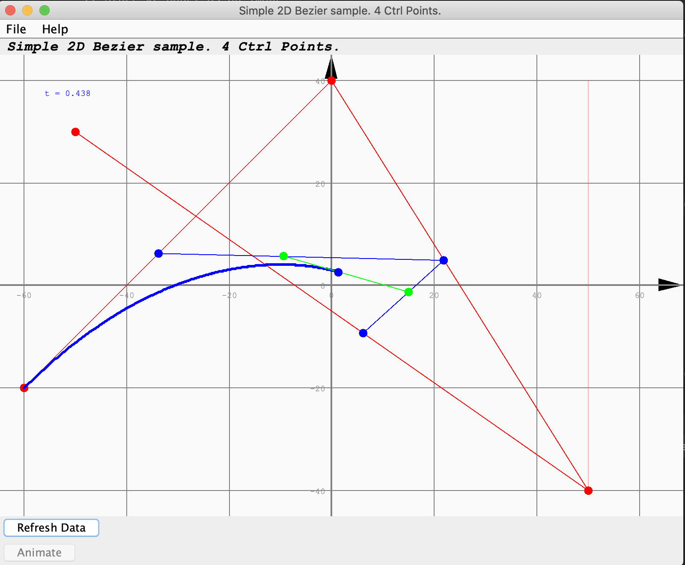
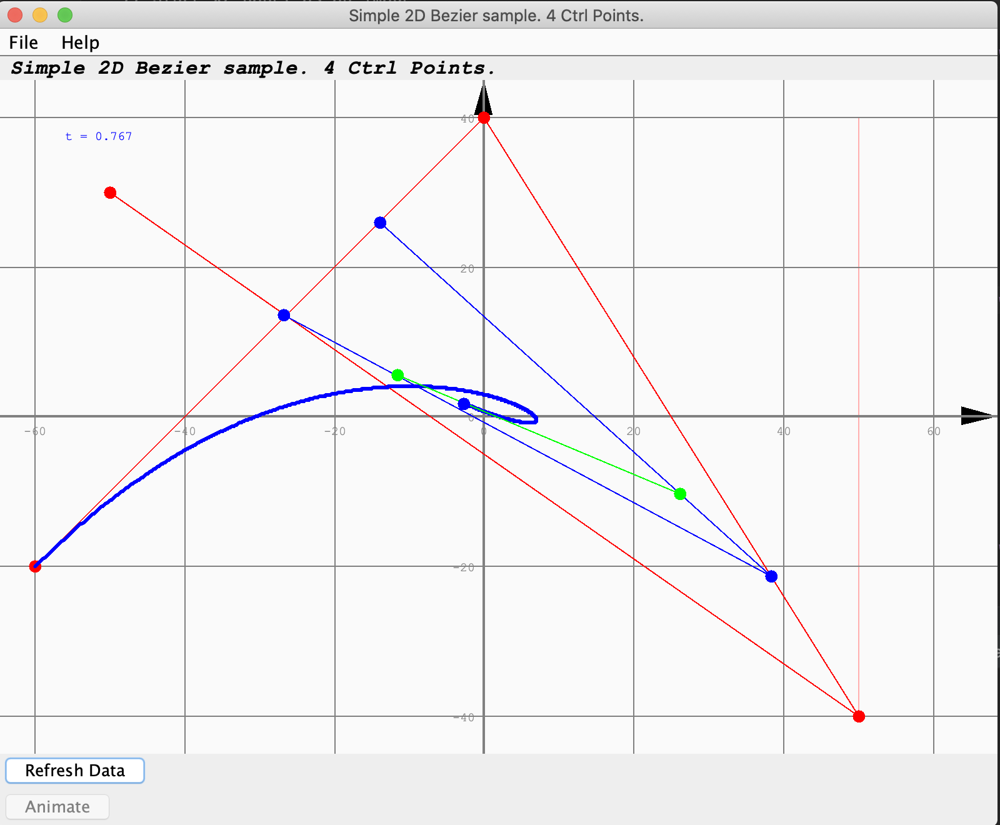
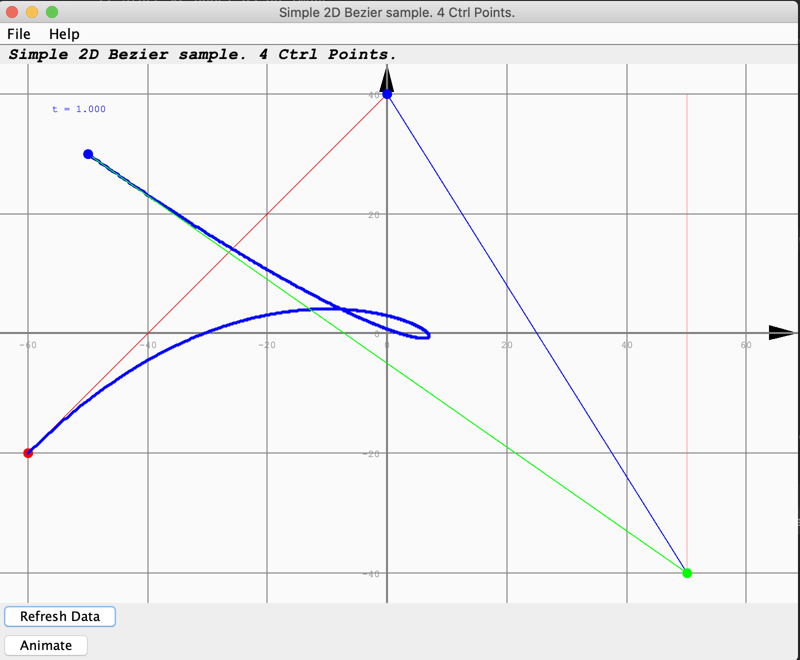
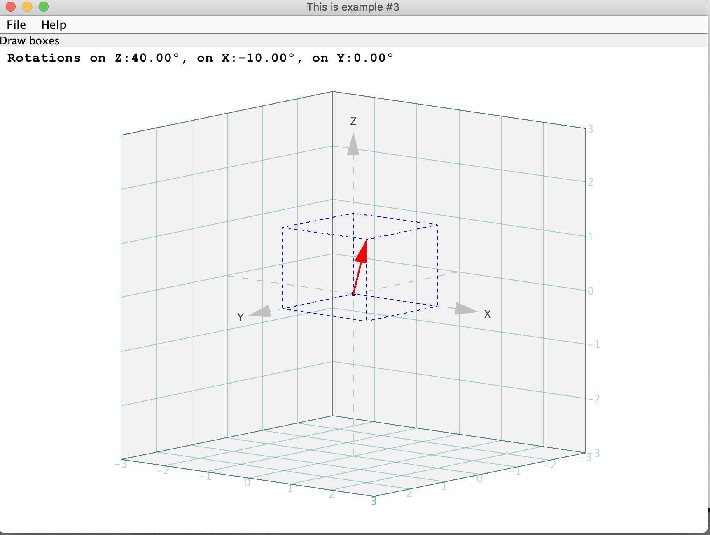
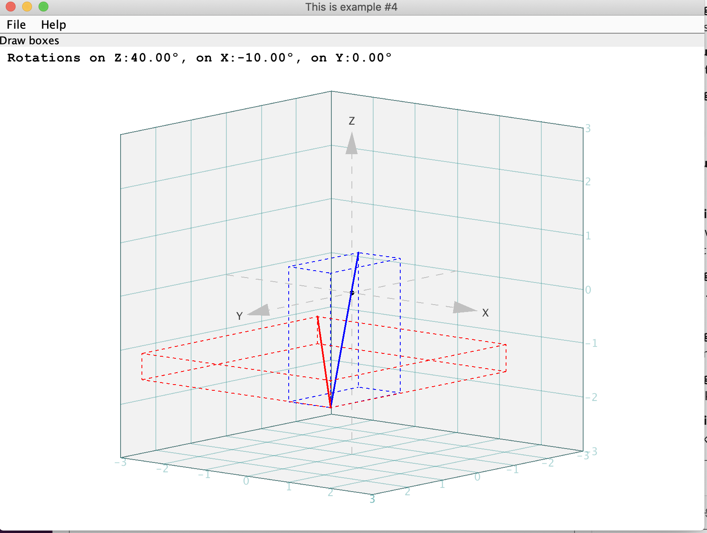
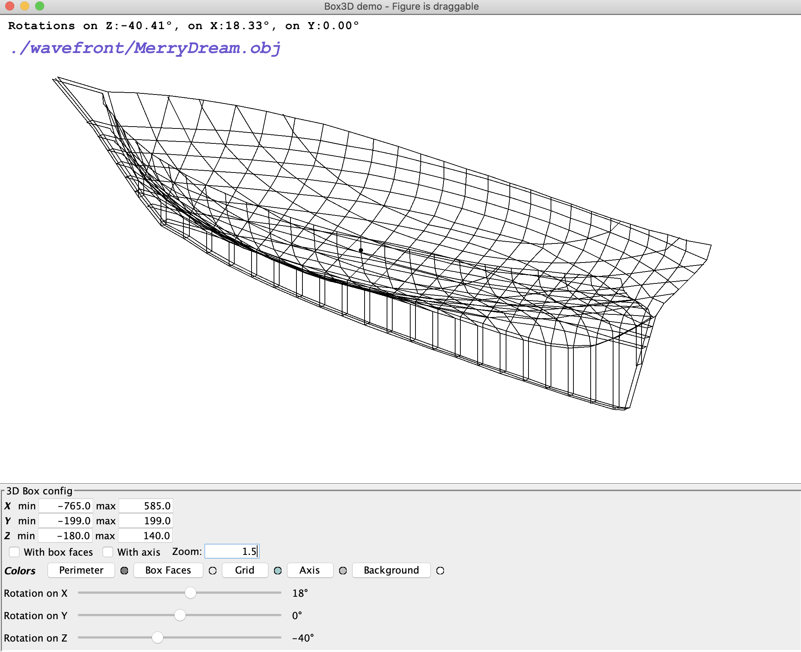
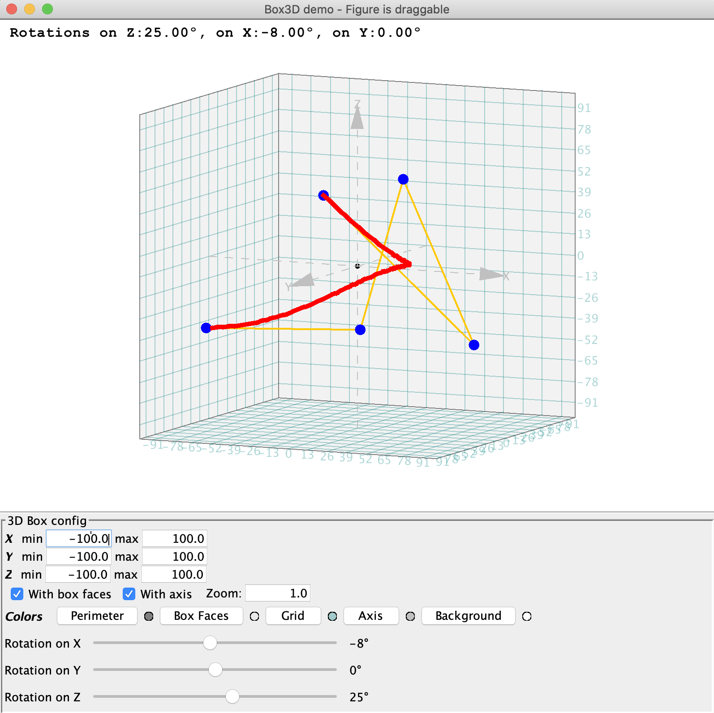
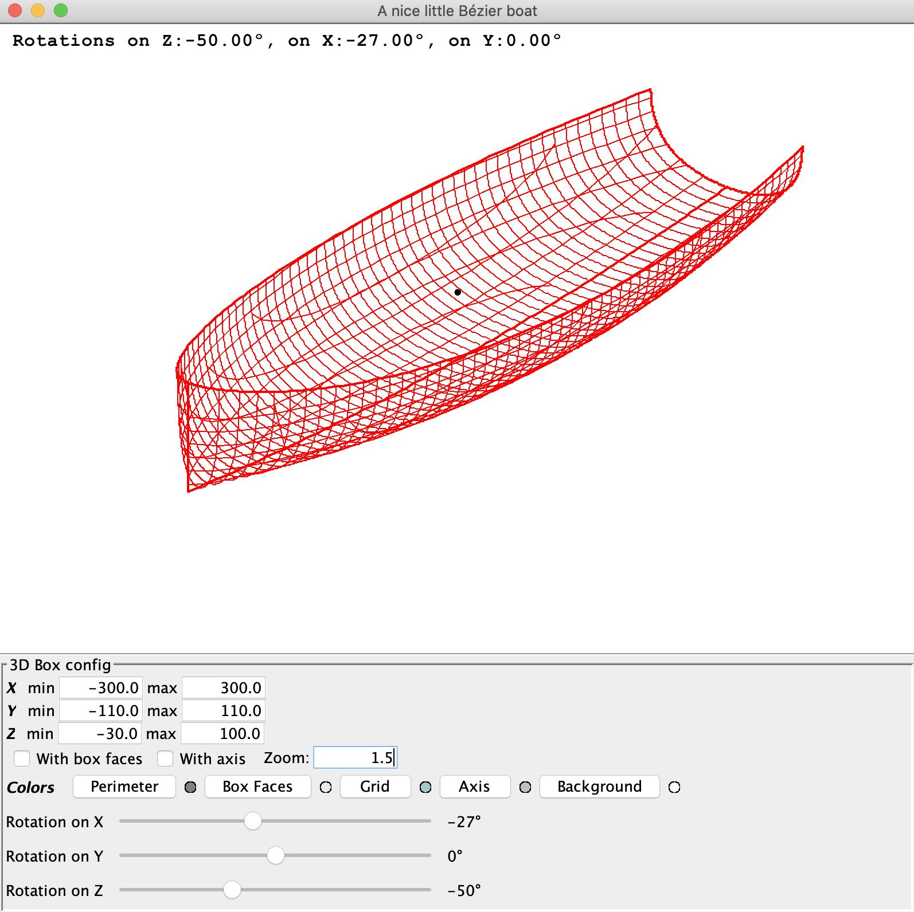
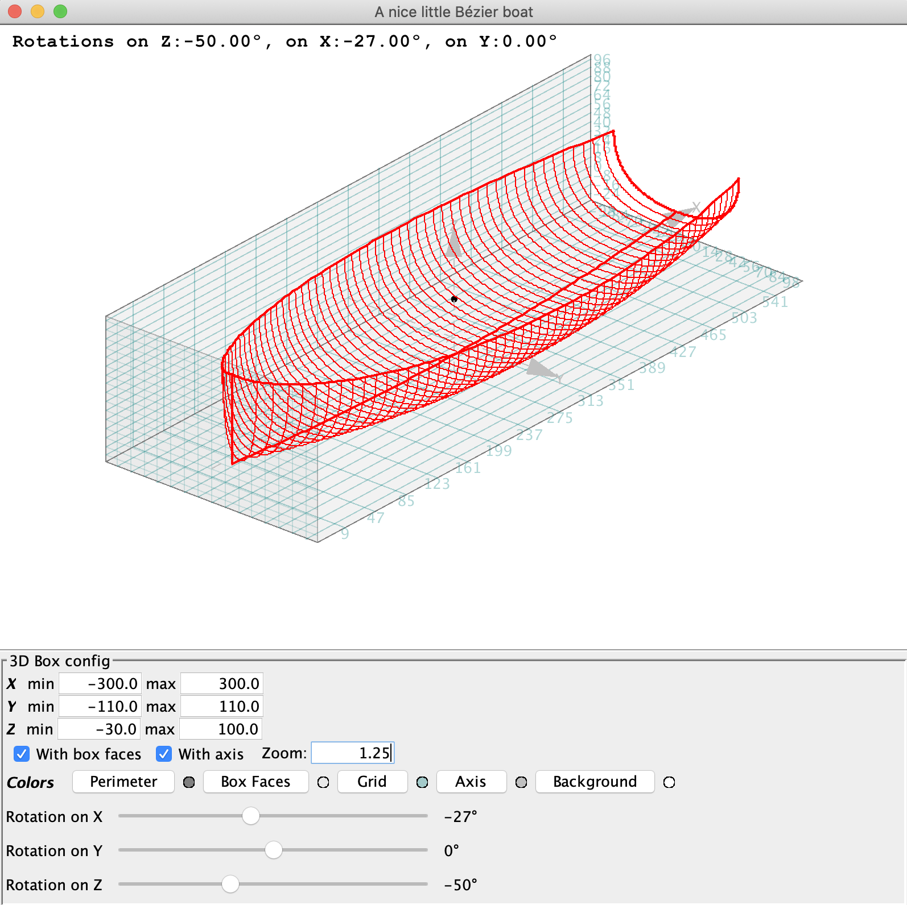

## Linear Algebra, and graphical utilities

Basic linear algebra (from the arabic [الجبر](https://en.wikipedia.org/wiki/Algebra), _al-jabr_, from the book _ilm al-jabr - i-muquabala_, by the Persian mathematician _al-Khwarizmi_, that literally means _reunion of broken parts_), and statistical functions, in Java. 
> This is a work in progress.
- Square matrix
- System resolution
- Least squares method (regression)
- Derivative
- Standard deviation and others
- Low pass filters
- Bezier curves (in 2 & 3D)
- etc.

---

This module was inspired by reading [Math for Programmers](https://www.manning.com/books/math-for-programmers) by Paul Orland.
Many examples in this book are written in Python, in standalone, or through Jupyter Notebooks.  
The goal here is to provide a Java equivalent to Python's graphical utilities.  
In standalone (using Swing), or through Jupyter Notebooks as well (requires at least Java 9, that introduced JShell, and thus making Java available in Jupyter Notebooks).

---

Two different aspects are presented in this module.

- Some algebra implementation functions
- Some ways to render graphics, in 2D and 3D.
    - For an IJava Jupyter Notebook
    - For a Swing application
- 3D and 2D rendering.
  - See in the `src/test/java` folder for demos.

Several Python libraries already provide this kind of features, and they can be consumed
by Jupyter Notebooks.

**_But_** this might not be the only way. That's what we want to show here.
_Why should I learn a scripting language like Python if I already know a programming language like Java?_ (More to come about that one...)

There is no reason why Java should lag behind.
And `HTML5/CSS3/ES6` should also be able to implement the same kind of features as well. 

I'm not looking down on Python, it is popular for good reasons.

We'll see.

> Look in the `jupyter` folder for notebooks.   
> Look in the `test` folder for Swing and other examples.

## Java Graphics (Generic Swing Graphics, GSG)

This module also includes a _Swing based Java_ library for graphics (2 & 3D), that can be used in pure Swing applications,
as well as in Jupyter Notebooks (IJava). 

- Jupyter examples provided in the `jupyter` folder.
- Swing examples provided in the `gsg.examples` package, in the `test` folder. 

### See the `src/test/java` folder
This directory contains demos.
> Those demos have been placed in the `test` folder, in order for them _not_ to
> be packaged with the build. They are actually not unit-tests, but just tests. 

Try this:
```
$ ../gradlew runSample
```
This task can take parameters:
```
$ ../gradlew runSample -Pnum=[01..11]
```
This will run the Swing examples in the `test` directory, from `gsg.examples.box3d.Sample01`
to `gsg.examples.box3d.Sample11`.

- `01` Static 3D Box, triangle
- `02` Spinning 3D Box, pyramid
- `03` 3D Box, boxes and cubes.
- `04` 3D box, cubes and segments
- `05` Spinning 3D box, vectors
- `06` 3D Box, draggable, with control widgets, and vectors.
- `07` 3D Box, draggable with control widgets, spring.
- `08` 3D Box, draggable, controls, cubes within cubes.
- `09` 3D Box, wavefront. Use `../gradlew runSample -Pnum=09 -Pidx=[00..07]`
  - `-Pidx=00` Paperboat
  - `-Pidx=01` Cheoy Lee, hull only
  - `-Pidx=02` Cheoy Lee, hull and rig
  - `-Pidx=03` Cheoy Lee, hull and rig, v2
  - `-Pidx=04` Merry Dream
  - `-Pidx=05` Mehari (tender)
  - `-Pidx=06` Kayak
  - `-Pidx=07` Trimaran
- `10` 3D Box, 3D Bezier.
- `11` 3D Box, Small Bezier boat.

Also try (2D Bezier, 3 Ctrl-points):
```
../gradlew runBezierSample -Pnum=[01..02]
```

Low Pass Filter:
```
../gradlew runSample2
```
2D Bezier, 5 draggable Ctrl-Points:
```
../gradlew runSample3
```
Two 2D Bezier, draggable Ctrl-Points:
```
../gradlew runSample4
```

Animated Bezier Curves

|          t = 0.438           |          t = 0.767           |          t = 1.000           |
|:----------------------------:|:----------------------------:|:----------------------------:|
|  |  |  |

#### Some utility methods
In those utilities, just provide the (spatial, absolute) vertices of the points, segments, arrows and boxes to draw.
Rotations and space-to-screen operations are taken care of, from the context.

##### `drawBox`, `drawArrow`
```java
Consumer<Graphics2D> afterDrawer = g2d -> {
    // Draw a box
    g2d.setColor(Color.BLUE);
    // Dotted lines for the cube
    g2d.setStroke(new BasicStroke(1,
            BasicStroke.CAP_BUTT,
            BasicStroke.JOIN_ROUND,
            1.0f,
            new float[] { 2f, 0f, 2f },
            2f));
    double[][] boxVertex = {
            {0.0, 0.0, 1.5},
            {0.0, 2.0, 1.5},
            {2.0, 2.0, 1.5},
            {2.0, 0.0, 1.5},
            {0.0, 0.0, 0.0},
            {0.0, 2.0, 0.0},
            {2.0, 2.0, 0.0},
            {2.0, 0.0, 0.0}
    };
    box3D.drawBox.accept(g2d, boxVertex);
    // An arrow
    g2d.setColor(Color.RED);
    g2d.setStroke(new BasicStroke(2));
    box3D.drawArrow(g2d,
            new double[] {0.0, 0.0, 0.0},
            new double[] {2.0, 2.0, 1.5});
};
box3D.setAfterDrawer(afterDrawer);
```


##### `drawSurroundingBox`, `drawSegment`
```java
Consumer<Graphics2D> afterDrawer = g2d -> {
    // Define vertices
    double[] spatialPointOne = new double[] { 1d, 1d, 1d};
    double[] spatialPointTwo = new double[] { 2d, 3d, -1.5d};
    double[] spatialPointThree = new double[] { -2.5d, -2d, -1d};

    // Draw surrounding boxes
    g2d.setColor(Color.BLUE);
    // Dotted lines for the cube
    g2d.setStroke(new BasicStroke(1,
            BasicStroke.CAP_BUTT,
            BasicStroke.JOIN_ROUND,
            1.0f,
            new float[] { 2f, 0f, 2f },
            2f));
    box3D.drawSurroundingBox(g2d, spatialPointOne, spatialPointTwo);
    // A segment
    g2d.setStroke(new BasicStroke(2));
    box3D.drawSegment(g2d, spatialPointOne, spatialPointTwo);

    g2d.setColor(Color.RED);
    // Dotted lines for the cube
    g2d.setStroke(new BasicStroke(1,
            BasicStroke.CAP_BUTT,
            BasicStroke.JOIN_ROUND,
            1.0f,
            new float[] { 2f, 0f, 2f },
            2f));
    box3D.drawSurroundingBox(g2d, spatialPointTwo, spatialPointThree);
    // A segment
    g2d.setStroke(new BasicStroke(2));
    box3D.drawSegment(g2d, spatialPointTwo, spatialPointThree);
};
box3D.setAfterDrawer(afterDrawer);
```


### WaveFront format (`obj`) support
If you remember (if you can), Java 2 used to come with some demos (`ThreeD.java`), that used to use
those files with an `.obj` extension... It also used to be used by Applets - now deprecated.
Here is a quick way to restore some of those features.


Use `../gradlew runSample -Pnum=09 -Pidx=4` to see the screen above.  
Figure can be rotated with the sliders at the bottom, or by dragging the mouse on the figure itself.

## Bézier curves
A type of curve created by [Pierre Bézier](https://en.wikipedia.org/wiki/Pierre_B%C3%A9zier).  
_Good doc_ at <https://javascript.info/bezier-curve>, interactive, really cool.  
Bézier at work: <http://jeremie.farret.free.fr/wp-content/uploads/2011/12/ATMA2006.pdf>

See in the class `bezier.Bezier`.  
Examples are available in the `test` folder.  
To see how 2D Bezier work, with animation, try `../gradlew runBezierSample [-Pnum=02]`, and click the `Activate` button.

### Bézier, in 3D
> Sample 3D Bézier 

  
5 Control Points.  
Figure is draggable with the mouse.  
Run the test in `gsg.examples.box3d.Sample10`, or do a `../gradlew runSample -Pnum=10`.


#### A small application (Work in Progress)
| Small Bezier Boat | Same, with different parameters |
|:------------------|:--------------------------------|
|  |  |

Run the test in `gsg.examples.box3d.Sample11`, or do a `../gradlew runSample -Pnum=11`.  
(See the gradle script for extra parameters)
> Note: The above is <u>**_totally_**</u> defined with only **_8_** (3D) control points.
> - 5 for the rail
> - 3 for the keel
> - 2 for the bow (common to rail - on top, and keel - on bottom)

> TODO Soon: Bézier to WebGL... Wow!

### Bonus: LaTex in Markdown
> Works fine in a Jupyter Notebook, not always on a standalone markdown document...

There are good documents about all that [here](https://towardsdatascience.com/write-markdown-latex-in-the-jupyter-notebook-10985edb91fd), 
[here](https://www.mathjax.org/),
and [here](https://colab.research.google.com/drive/18_2yFdH8G-6NXY_7fTcshMoScgJ-SYac#scrollTo=VFaCoSXvS-_H).  
There are many on-line Latex editor, like [here](https://latex.codecogs.com/eqneditor/editor.php).

```
Euler's identity: $ e^{i \pi} + 1 = 0 $
```

```
Given : $\pi = 3.14$ , $\alpha = \frac{3\pi}{4}\, rad$
$$
\omega = 2\pi f \\
f = \frac{c}{\lambda}\\
\lambda_0=\theta^2+\delta\\
\Delta\lambda = \frac{1}{\lambda^2}
$$
```

To see the result, look [here](./jupyter/LeastSquare.ipynb).

### TODO: A JavaScript (HTML5 canvas) equivalent version
- WebComponent?
- SVG?


## Misc Links
- [Spencer Park / IJava](https://github.com/SpencerPark/IJava)
- [Jupyter Widgets](https://towardsdatascience.com/bring-your-jupyter-notebook-to-life-with-interactive-widgets-bc12e03f0916)


---
