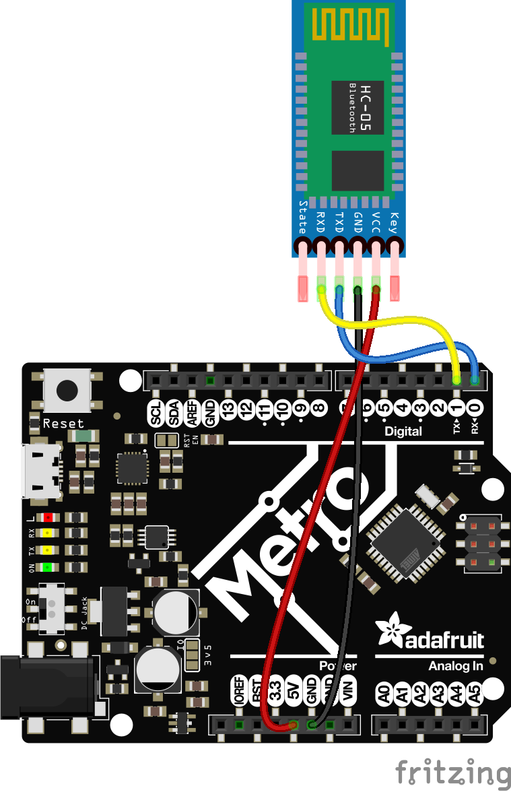

Bluetooth is a pier-to-pier communication protocol based on a Serial Communication.

Once two devices are **paired** with Bluetooth, the communication between them is just a regular Serial Communication, as demoed below. 

See <https://medium.com/@mahesh_joshi/raspberry-pi-3-and-arduino-communication-via-bluetooth-hc-05-5d7b6f162ab3>

Learn about Bluetooth devices in sight:
```
$ hcitool scan
Scanning ...
	98:D3:61:FD:67:23	HC-05
	18:65:90:CF:BF:80	olivs-mac
```

### To get started
I used an Arduino UNO with an [`HC-05` module](https://www.allelectronics.com/item/hc-05/hc-05-bluetooth-module/1.html), to act as a bluetooth device,
and some Python (and then Java) code to run on the Raspberry Pi, acting as a Bluetooth client.

The sketch running on the Arduino turns a led on or off, depending on what's read from the Bluetooth device.

The Raspberry Pi will send serial data to the Bluetooth device, and we should then see the Arduino's led go on and off.
In return, the Raspberry receives the status of the led, sent by the Arduino, through the Bluetooth device.

This way, it demonstrates how the Raspberry Pi can _send_ and _receive_ Bluetooth data.   



Upload the following code on the Arduino (available in `bt.101.py`):
```c
/*
 * Use the LED_BUILTIN, 
 * no resistor needed, no extra led.
 */
#define ledPin LED_BUILTIN
int state = 0; // This is the character code.

void setup() {
  pinMode(ledPin, OUTPUT);
  digitalWrite(ledPin, LOW);
  Serial.begin(9600); // 38400); // Default communication rate of the Bluetooth module
}

void loop() {
  if (Serial.available() > 0) { // Checks whether data is comming from the serial port
    state = Serial.read(); // Reads the data from the serial port
  }

  if (state == '0') {
    digitalWrite(ledPin, LOW); // Turn LED OFF
    Serial.println("LED: OFF"); // Send back, to the phone, the String "LED: ON"
    state = 0;
  } else if (state == '1') {
    digitalWrite(ledPin, HIGH);
    Serial.println("LED: ON");;
    state = 0;
  }
}
```
> _Note_: Both `HC-05` and the code uploader for the Arduino are using the serial port. If
> the `HC-05` is active, the code cannot be uploaded through the serial port.
> Just unplug (red wire) the `HC-05` when you want to upload your code, re-plug it after that.

> _Note_: we use the `BUILTIN_LED`, the red one labeled `L` on the left side of the Arduino on the picture above.

From the Raspberry Pi, run once:
```
$ sudo apt-get install pi-bluetooth
$ sudo apt-get install bluetooth bluez blueman
```
and reboot.

With the Arduino with its `HC-05` module up and running, pair your device from the Raspberry Pi desktop (use `1234` for the code) as explained [here](https://medium.com/@mahesh_joshi/raspberry-pi-3-and-arduino-communication-via-bluetooth-hc-05-5d7b6f162ab3).
`hcitool` command mentioned above can help.

Then, run this code on the Raspberry Pi
```python
#!/usr/bin/env python3
import serial
import time

port = serial.Serial("/dev/rfcomm0", baudrate=9600)
 
# reading and writing data from and to arduino serially.                                      
# rfcomm0 -> this could be different
data = 0
while True:
  print("Digital Logic --> Sending...")
  port.write(str.encode(str(data)))
  data = 1 if data == 0 else 0  # Flip value
  rcv = port.readline()
  if rcv:
    print(rcv)
  time.sleep(3)
```
Notice the port name, and the baud rate.

Run it:
```
 $ ./bt.101.py
```
You should see the led blinking every 3 seconds on the Arduino.

### From Java
Compile and archive the code provided here:
```
 $ ../gradlew clean shadowJar
```

Seems there is a problem to fix with `javalib-rx-tx`, when trying to read `/dev/rfcomm0`:
```
$ ./java.101.sh 
Stable Library
=========================================
Native lib Version = RXTX-2.2pre2
Java lib Version   = RXTX-2.1-7
WARNING:  RXTX Version mismatch
	Jar version = RXTX-2.1-7
	native lib Version = RXTX-2.2pre2
== Serial Port List ==
-> /dev/ttyS0
======================
Opening port /dev/rfcomm0:9600
Port /dev/rfcomm0 not found, aborting
```
The `Pi4J` approach seems to work though. See `bt.pi4j.BtPi4j103.java`.

Run this on the Raspberry Pi:
```
 $ sudo java -cp ./build/libs/Bluetooth-1.0-all.jar bt.pi4j.BtPi4j103 --device /dev/rfcomm0
Let's get started
[HEX DATA]   4C,45,44,3A,20,4F,46,46,0D,0A
[ASCII DATA] LED: OFF

[HEX DATA]   4C,45,44,3A,20,4F,4E,0D,0A
[ASCII DATA] LED: ON

[HEX DATA]   4C,45,44,3A,20,4F,46,46,0D,0A
[ASCII DATA] LED: OFF

[HEX DATA]   4C,45,44,3A,20,4F,4E,0D,0A
[ASCII DATA] LED: ON

[HEX DATA]   4C,45,44,3A,20,4F,46,46,0D,0A
[ASCII DATA] LED: OFF
. . .
```

## To check
- On OBD: <https://pypi.org/project/obd/>
- OBD Dataset <https://www.kaggle.com/vbandaru/data-from-obd-on-board-diagnostics>
- <https://www.obdsol.com/knowledgebase/obd-software-development/reading-real-time-data/>
- OBD Codes: <http://www.fastfieros.com/tech/diagnostic_trouble_codes_for_obdii.htm>
- Sparkfun's [Getting Started with OBD-II](https://learn.sparkfun.com/tutorials/getting-started-with-obd-ii/all).
- Instructable's [Control Bluetooth LE Devices From a Raspberry Pi](https://www.instructables.com/id/Control-Bluetooth-LE-Devices-From-A-Raspberry-Pi/).
