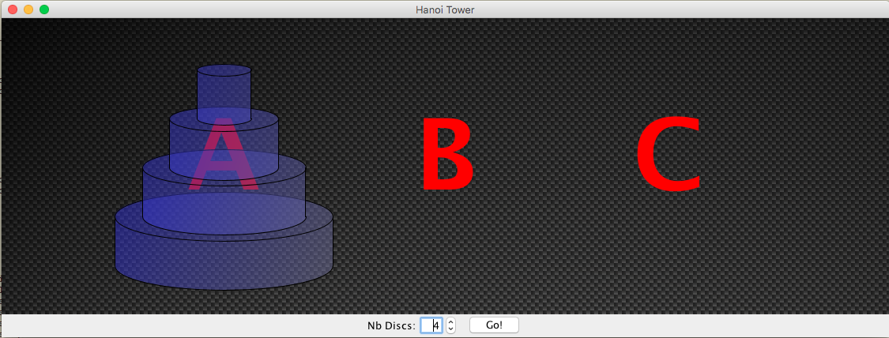

## Hanoi Tower Resolution
Interestingly, this is "just" algorithmic.  
There is _absolutely no AI_ involved in this process. 

It's all in the code, take a look.  

If `N` is the number of disks, the number of moves to anticipate is
(2<sup><small>N</small></sup> - 1).

#### Several User Interfaces
- Command Line
- Command Line ++
- Swing

This is a small graphical (Swing) example of the Hanoi Tower resolution.
This will be used as a base for a MeArm (or any robotic arm) resolution of the same Hanoi Tower...

Run it like:
```
 $ ../gradlew runSample
```



Click the `Go!` button to start the animation.

Or also
```
$ ../gradlew clean build
$ java -cp build/libs/HanoiTower-1.0.jar hanoitower.main.Console 3
Anticipating 7 moves...
Moving the tower from B to A
Moving from B to A
Moving from B to C
Moving from A to C
Moving from B to A
Moving from C to B
Moving from C to A
Moving from B to A

$ java -cp build/libs/HanoiTower-1.0.jar hanoitower.main.ConsoleUI 3
Anticipating 7 moves...
Moving the tower from A to C

   _|_     |      |
  __|__    |      |
 ___|___   |      |

    A      B      C

Moving from A to C

    |      |      |
  __|__    |      |
 ___|___   |     _|_

    A      B      C

Moving from A to B

    |      |      |
    |      |      |
 ___|___ __|__   _|_

    A      B      C

Moving from C to B

    |      |      |
    |     _|_     |
 ___|___ __|__    |

    A      B      C

Moving from A to C

    |      |      |
    |     _|_     |
    |    __|__ ___|___

    A      B      C

Moving from B to A

    |      |      |
    |      |      |
   _|_   __|__ ___|___

    A      B      C

Moving from B to C

    |      |      |
    |      |    __|__
   _|_     |   ___|___

    A      B      C

Moving from A to C

    |      |     _|_
    |      |    __|__
    |      |   ___|___

    A      B      C

Finished in 7 moves.
$
```

### Comments
Interestingly, all the skill - the actual resolution - is in the class `hanoitower.BackendAlgorithm`.  
It is **very** small, and recursive.

All the other classes are here for the graphical rendering.

---
