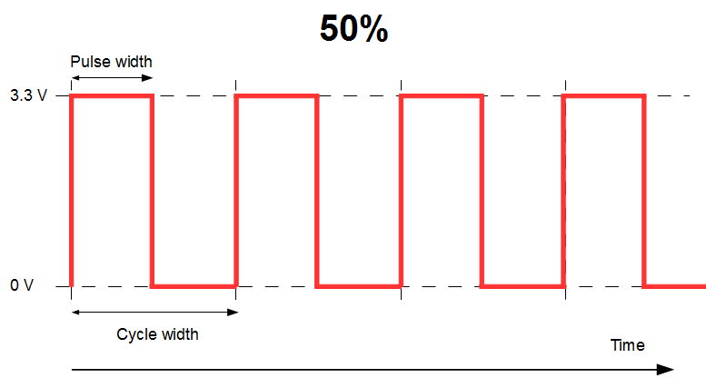
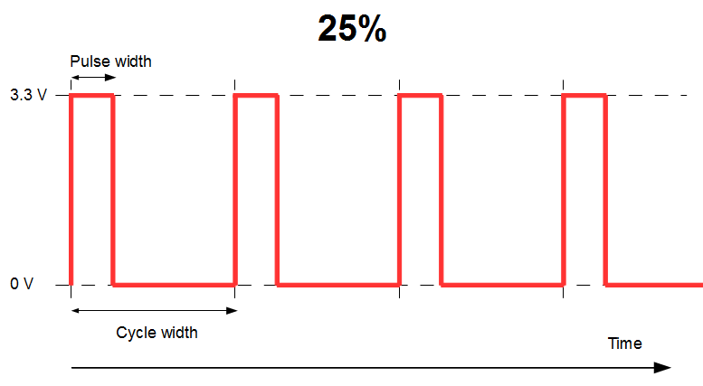

## Pulse Width Modulation

Pulse Width Modulation (PWM) is the technique used from a digital source to simulate
an analog output.

For example, imagine that you want to dim an `led` from a _digital_ device.
The digital device only has pins that can take 2 values: `0` (off) or `3V3` (on).

`0` means that the led will be off, `3V3` means it will be at 100% of its brightness.

To show it at `50%` of its brightness, the idea is to turn it off 50% of _the time_, and on 50% of _the time_.

To show it at `25%` of its brightness, it will be on 25% of _the time_, and off 75% of _the time_.

If the on-off cycles (this is what "_the time_" means above) are **short and fast enough**, a human eye will no be able to see them, it will only have the illusion
of the resulting brightness. This is called "Persistence Of Vision", aka POV.

| PWM | Brightness |
|:---:|:----------:|
|||
|||
|||

If the cycle is less than 30 ms, an human eye is OK with it, it cannot tell the light is actually blinking (which brings us back to POV).

For a "pure" PWM implementation, look into the code of `PWMPin.java`.

---

Same article on [Hocus-Blogus](http://hocus-blogus.blogspot.com/2018/07/raspberry-pi-pwm-servos-and-pca9685.html), with a small video showing how to dim leds with PWM.

---

The Raspberry Pi does not have analog pins, we need to use Pulse Width Modulation to simulate
analog values, a servo - for example - is an analog device.

We use for that the method `setPWM(channel, 0, pulse);`, that will eventually write to the registers
of the device.

An instruction like `setPWM(channel, 0, pulse);` means:
- On channel `channel` (`0` to `15` on the `PCA9685`)
- in each cycle, turn the power `on` between `0` and `pulse`.

`pulse` has a value between `0` and `4095`, that is `4096` distinct values, `4096` is 2<small><sup>12</sup></small>, the `PCA9685` is a 12 bit device.

#### The frequency
The frequency is provided in Hertz (Hz).
A frequency of 60 means 60 cycles per second.

At 60 Hz, a cycle will be `1 / 60` second, which is `0.01666666` second, or `16.66666` milli-seconds (ms).

#### The pulse
For _each of the cycles_ set above by setting the frequency, we need to determine the `int` value,
between `0` and `4095`, corresponding to the pulse in milliseconds we want to simulate with PWM.

In the class `i2c.servo.pwm.PCA9685.java`, this is done in this method:
```java
public static int getServoValueFromPulse(int freq, float targetPulse) {
  double pulseLength = 1_000_000; // 1s = 1,000,000 us per pulse. "us" is to be read "micro (mu) sec".
  pulseLength /= freq;  // 40..1000 Hz
  pulseLength /= 4_096; // 12 bits of resolution. 4096 = 2^12
  int pulse = (int) Math.round((targetPulse * 1_000) / pulseLength); // in millisec
  if (verbose) {
    System.out.println(String.format("%.04f \u00b5s per bit, pulse: %d", pulseLength, pulse));
  }
  return pulse;
}
```
The cycle length - in ms - obviously depends on the frequency.

The pulse required for the servo to react is emitted once per cycle.

##### Example
As an example, let us calculate for a `60 Hz` frequency the `pulse` value to send to `setPWM(channel, 0, pulse);`
for a `1.5` millisecond PWM:

- 1 cycle has a duration of `1 / 60` second, or `16.66666` milliseconds.
- each cycle is divided in `4096` slots, we can say that `4096` slots = `16.6666` ms.
- the solution is provided by a rule of three: `value` = `4096` * (`pulse` / `16.66666`), which is `368.64`, rounded to `369`.

#### A comment about servos
_**Theoretically**_, servos follow those rules:

| Pulse | Standard | Continuous |
|------:|---------:|:----------:|
| 1.5 ms |   0 &deg; | Stop |
| 2.0 ms |  90 &deg; | FullSpeed forward |
| 1.0 ms | -90 &deg; | FullSpeed backward |

That happens not to be always true, some servos (like <a href="https://www.adafruit.com/product/169">https://www.adafruit.com/product/169</a> or <a href="https://www.adafruit.com/product/155">https://www.adafruit.com/product/155</a>)
have values going between `0.5 ms` and `2.5 ms`.

Before using them, servos should be calibrated. You can use the class `i2c.samples.IntercativeServo.java` can be used for that,
you set the pulse values interactively, and you see what the servo is doing.
<pre>
$> ./inter.servo
Connected to bus. OK.
Connected to device. OK.
freq (40-1000)  ? > 60
Setting PWM frequency to 60 Hz
Estimated pre-scale: 100.72526
Final pre-scale: 101.0
Servo Channel (0-15) : 1
Entry method: T for Ticks (0..4095), P for Pulse (in ms) > p
Enter 'quit' to exit.
Pulse in ms > 1.5
setServoPulse(1, 1.5)
4.0690 &mu;s per bit, pulse:369
-------------------
Pulse in ms > 0.5
setServoPulse(1, 0.5)
4.0690 &mu;s per bit, pulse:122
-------------------
Pulse in ms > 0.6
setServoPulse(1, 0.6)
4.0690 &mu;s per bit, pulse:147
-------------------
Pulse in ms > 2.4
setServoPulse(1, 2.4)
4.0690 &mu;s per bit, pulse:589
-------------------
Pulse in ms > 2.5
setServoPulse(1, 2.5)
4.0690 &mu;s per bit, pulse:614
-------------------
... etc.

</pre>

Once you have determined the appropriate min and max values, you also have the `int` values
to feed the `setPWM` with.

---
