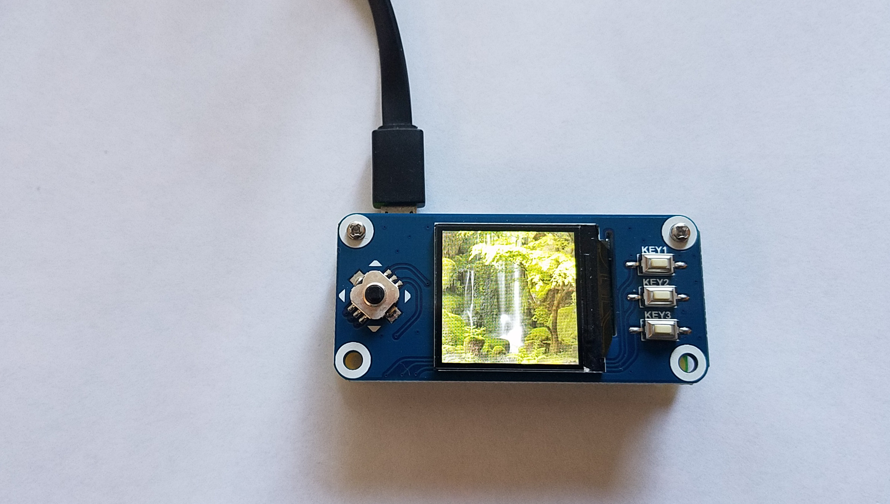
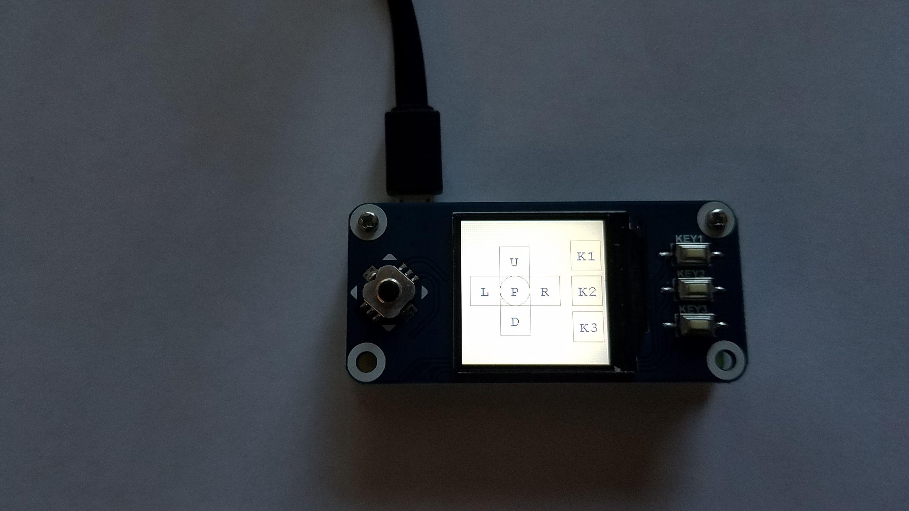

# I<sup>2</sup>C and SPI code and examples

## Sensors

#### BME280, BMP180
I<sup>2</sup>C Pressure, Temperature, Humidity

#### BMP183
SPI Pressure, Temperature

#### HMC5883L
I<sup>2</sup>C 3 axis Compass

#### HTU21DF
I<sup>2</sup>C Humidity & Temperature

#### L3GD20
I<sup>2</sup>C Triple axis Gyroscope

#### LSM303
I<sup>2</sup>C Accelerometer + Magnetometer

There is this [good paper](https://github.com/praneshkmr/node-lsm303/wiki/Understanding-the-calibration-of-the-LSM303-magnetometer-(compass)) about the LSM303 calibration.
Run the `i2c.sensor.LSM303` with `-Dlsm303.log.for.calibration=true` (see in the script `lsm303`), this will generate a CSV log file you can use in a spreadsheet (like in the document above),
to get the calibration offsets and coefficients.

Also see in the code (`i2c.sensor.LSM303.java`) how to apply those calibration parameters:
```java
  sensor.setCalibrationValue(LSM303.MAG_X_OFFSET, 9);
  sensor.setCalibrationValue(LSM303.MAG_Y_OFFSET, -16);
```

#### MPC9808
I<sup>2</sup>C Temperature

#### MPL115A2
I<sup>2</sup>C Pressure, Temperature

#### TCS34725
I<sup>2</sup>C Light sensor, color sensor

#### TSL2561
I<sup>2</sup>C Light Sensor

#### VCNL4000
I<sup>2</sup>C Proximity sensor

#### VL53L0X
I<sup>2</sup>C Time of Flight Distance

## ADCs

#### ADS1x15
ADS1015 and ADS1115. I<sup>2</sup>C ADCs.

Document: [ADC Benchmark](https://github.com/OlivierLD/raspberry-coffee/blob/master/ADC-benchmark/README.md).

## Servos & Motors

#### PCA9685
I<sup>2</sup>C 16-channel 12-bit PWM/Servo driver.
[from Adafruit](https://www.adafruit.com/product/815)

About servo calibration, read [this](./PWM.md).

#### Adafruit Motor HAT
I<sup>2</sup>C, DC and Stepper Motors
[from Adafruit](https://www.adafruit.com/product/2348)

## Screens

#### SSD1306 (SPI and I<sup>2</sup>C)
128x32 and 128x64 OLED monochrome screens, https://www.adafruit.com/product/3527, https://www.adafruit.com/product/931, and https://www.adafruit.com/product/661.

#### Nokia5110
SPI 84x48 Monochrome LCD. https://www.adafruit.com/product/338

#### Waveshare 240x240, 1.3inch IPS LCD display HAT for Raspberry Pi
240x240 _Color_ screen, with 3 buttons and a joystick, https://www.waveshare.com/product/modules/oleds-lcds/raspberry-pi-lcd/1.3inch-lcd-hat.htm

|    |    |
|:--:|:--:|
|  |  |
|  |  |
|  |  |

Through the Java `ImageIO` package, all image formats are supported.

## Miscellaneous
I<sup>2</sup>C communication between Raspberry Pi and Arduino.
Package `i2c.comm`.

## Examples
### MeArm
Requires a `PCA9685`, and 4 servos.

See `i2c.samples.MeArmScriptDemo` and the script `mearm.script`, along with the file `script.01.mearm`.

See [here](https://github.com/OlivierLD/raspberry-pi4j-samples/tree/master/Processing#mearm-gui) for wiring and more details.

... More details to come.


