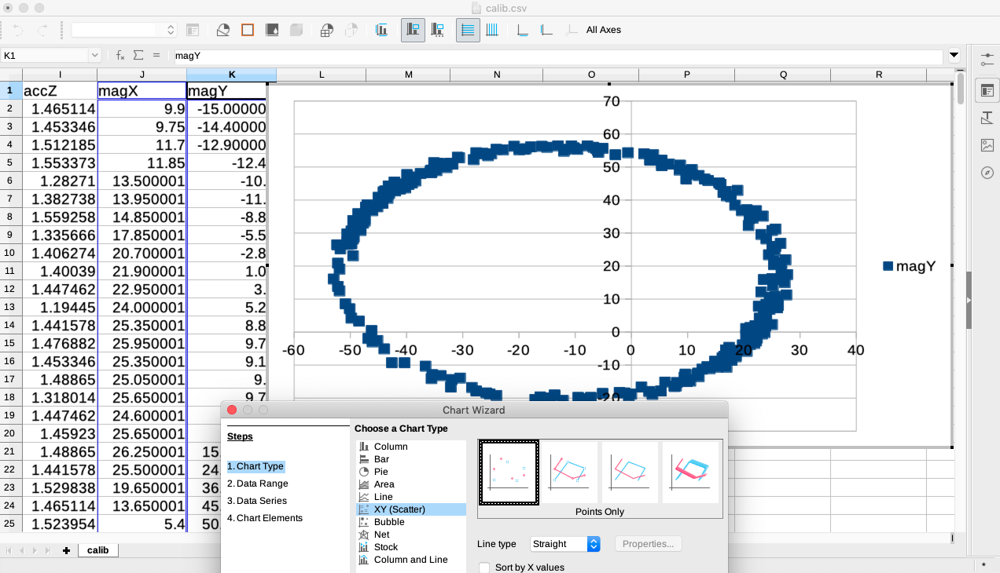
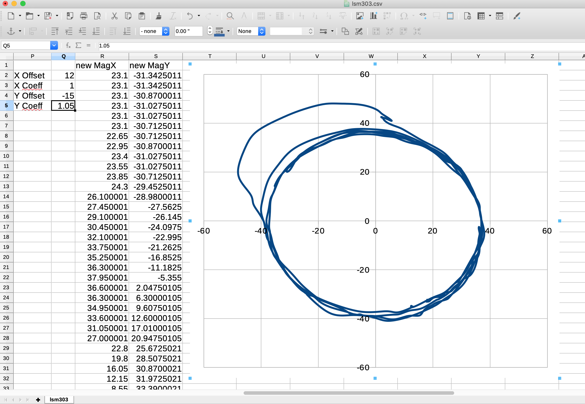

## LSM303, Magnetometer calibration

Magnetometers often - if not always - require calibration.
Here is an easy way to get to the expected calibration parameters.

### Log data for calibration
We need raw data from the device, to elaborate its calibration parameters.

To get those data, run the script `lsm303.sh` with
```
...
JAVA_OPTS="$JAVA_OPTS -Dlsm303.log.for.calibration=true"
sudo java $JAVA_OPTS -cp $CP i2c.sensor.LSM303 > lsm303.csv
```
Move the device in every possible directions and positions..., then stop (`Ctrl+C`) the program.
Save the logged (csv) file.

### What we want, eventually
We want the data points to be disposed on circles, centered on `[0, 0]`.

For that, we will need to determine offsets and coefficients, for each plan (XY, XZ, and YZ), and for both devices (magnetometer, accelerometer).

## Get to the calibration parameters
Use the recently generated `lsm303.csv` file, open it as a spreadsheet (I use LibreOffice).

First, select columns `magX` and `magY` (`J` and `K`), and insert a chart.



### What we see
Clearly on the chart above, the data are _not_ centered on `[0, 0]`, and the figure is an _oval_, wider than high, not a circle.

### Calibration
The calibration parameters should re-center the circle on `[0, 0]` and make the figure circular instead of oval.
> _Note_: For clarity, do make sure the x & y scales are similar... In the figure above, the X steps and scale are quite different from the Y ones. 

This gave you a first view on the data. 
It is not necessary to save this chart, you can get rid of it. 
We will create a new one, taking the parameters to re-shape it in account.

#### Creating parameter cells, and new data columns
- Create new cells (See the `P` and `Q` columns below):
  - `X offset`, with an initial value of `0`
  - `X coeff`, with an initial value of `1`
  - `Y offset`, with an initial value of `0`
  - `Y coeff`, with an initial value of `1`
- Then, as shown below, create new columns applying those parameters to the columns we displayed previously (`J` and `K`):
  - Column `R`: `new MagX`, with the following formula in `R2`: `=$Q$3*(J2 + $Q$2)`
  - Column `S`: `new MagY`, with the following formula in `S2`: `=$Q$5*(K2 + $Q$4)`
- Drag each new cell (`R2` ad `S2`) by its bottom right corner down to the bottom of the table.
- Then with the new columns `new MagX` and `new MagY`, create the same graph as previously (_again_: resize the chart so you have square cells...):


#### Adjusting and getting the calibration parameters
- Then adjust the offsets and coefficients until you reach the expected result. Offsets will move the points around the center, coefficients will reshape the round figure to obtain the expected circle:


See on the figure above, after tweaking the parameters, the circle has a (almost) constant radius of ~40, centered on `[0, 0]`.
The parameters to remember are on the top left.

On the same spreadsheet, repeat the same for plans X & Z, Y & Z.

And finally, you save put those data into a properties file, so it can be used at runtime:
```properties
MagXOffset=12
MagYOffset=-15.0
MagZOffset=-5
#
MagXCoeff=1
MagYCoeff=1.05
MagZCoeff=1
#
AccXOffset=0.05
AccYOffset=0
AccZOffset=0
#
AccXCoeff=1
AccYCoeff=1.05
AccZCoeff=1.05
```

The default properties file name is `lsm303.cal.properties`. 

See the code of `LSM303.java` for details about the way to apply those parameters... ;)

---
