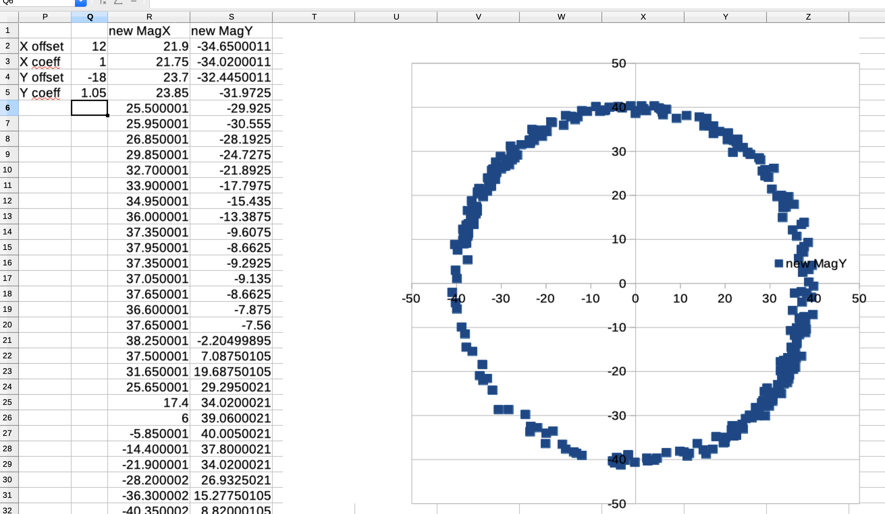

## Magnetometer calibration

### Log data for calibration
Run the script `lsm303.sh` with
```
...
JAVA_OPTS="$JAVA_OPTS -Dlsm303.log.for.calibration=true"
sudo java $JAVA_OPTS -cp $CP i2c.sensor.LSM303 > lsm303.csv
```
Move the device in every possible directions and positions..., then stop (`Ctrl+C`) the program.
Same the logged (csv) file.

### Get to the calibration parameters
Use the `lsm303.csv` file, open it as a spreadsheet (I use LibreOffice).

Select columns `magX` and `magY`, and insert chart.


The calibration parameters should re-center the circle on `[0, 0]` and make the figure round instead of oval.
> _Note_: For clarity, make sure the x & y scales are similar... In the figure above, the X steps and scale are quite different from the Y ones. 

- Create new cells, `X offset`, `X coeff`, `Y offset`, `Y coeff`
- Then, as shown below, create new columns taking those parameters in account, `new MagX` as `=$Q$3*(J2 + $Q$2)`, and `new MagY` as `=$Q$5*(K2 + $Q$4)`, drag each column down to the bottom of the table.
- Then adjust the offsets and coeffs until you reach the expected result



See on the figure above, the circle has a (almost) constant radius of ~40, centered on `[0, 0]`.
The parameters to remember are on the top left.

Do the same for X & Z, Y & Z, and repeat for the ACC data.

And finally, you can put those data into a properties file, so it can be used at runtime:
```properties
MagXOffset=12
MagYOffset=-18.0
MagZOffset=-5
#
MagXCoeff=1
MagYCoeff=1.05
MagZCoeff=1
#
AccXOffset=0.05
AccYOffset=0
AccZOffset=0
#
AccXCoeff=1
AccYCoeff=1.05
AccZCoeff=1.05
```

The default properties file name is `lsm303.cal.properties`. 

See the code for details... ;)

