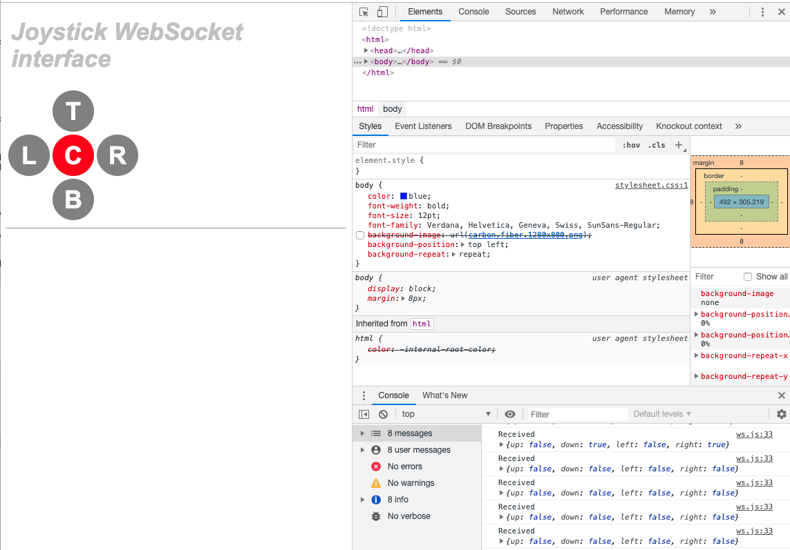
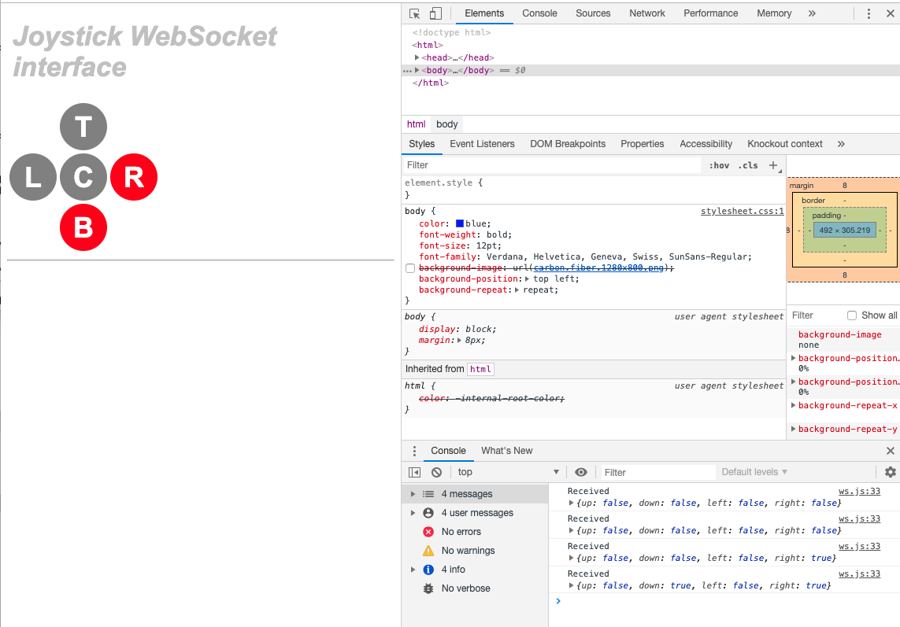

## WIP: Using a Joystick

### Install the NodeJS server part
From the directory where `package.json` is:
```
 $ npm install
```

### Build the Java part
From the same directory (where `build.gradle` is):
```
 $ ../gradlew shadowJar
```

### Start the NodeJS server
```
 $ node joystick.server.js
```

### Start the joystick driver
```
 $ ./joystick.sh
```

### Reach the Web UI
<http://[raspberry.address]:9876/web/index.html>


### Screehshots




## Python version
Requires a [WebSocket client](https://pypi.org/project/websocket_client/).
```
 $ pip install websocket_client
``` 

---
