# Deep Learning Crash Course
A transcript adapted from the Manning Video `Deep Learning Crash Course` by <a href="http://lmgtfy.com/?q=Oliver+Zeigermann" target="google">Oliver Zeigermann</a>.

A lecture by [Emmet "Doc" Brown](https://www.google.com/url?sa=i&source=images&cd=&cad=rja&uact=8&ved=2ahUKEwivz666m-riAhXY3J4KHWuuDisQjRx6BAgBEAU&url=%2Furl%3Fsa%3Di%26source%3Dimages%26cd%3D%26ved%3D%26url%3Dhttps%253A%252F%252Fbacktothefuture.fandom.com%252Fwiki%252FGreat_Scott%26psig%3DAOvVaw22pDeG021kyl_liLkNMEnf%26ust%3D1560644320531602&psig=AOvVaw22pDeG021kyl_liLkNMEnf&ust=1560644320531602)

First, some links:
- [Google Colab](https://colab.research.google.com/notebooks/welcome.ipynb)
- [TensorFlow](https://www.tensorflow.org/)
- [TensorFlow.js](https://www.tensorflow.org/js) 
- Deep Learning Crash Course [GitHub repo](https://github.com/DJCordhose/deep-learning-crash-course-notebooks/blob/master/README.md)

The last link above points to a github repo that includes _a lot_ of Jupyter Notebooks.
Those are great tools, specially for courses and tutorials.
They can contain comments (in Markdown language), code (mostly in Python, but almost all languages having a REPL can use those Notebooks, among them Java, Scala, Clojure...),
graphics, this is quite impressive and convenient.

- [PCA](http://setosa.io/ev/principal-component-analysis/)
- [TSNE](https://distill.pub/2016/misread-tsne/)
- [Numerical Optimization](https://www.benfrederickson.com/numerical-optimization/)
- [Image Kernels](http://setosa.io/ev/image-kernels/)
- [Teachable Machine](https://teachablemachine.withgoogle.com/)
- [Quick, draw](https://quickdraw.withgoogle.com/)
- [Deep Learning in Java](https://deeplearning4j.org/docs/latest/keras-import-overview)

We will also provide here several Python scripts, that can reproduce the features illustrated in the Notebooks, but
without comments and graphics.

- _All_ the softwares mentioned in this document are free and Open Source.
- _All_ the code for you to replay _all_ the examples in this documents are available in the project hosting this document, or on the web (in which cases links will be provided).

### Deep Learning and AI, where it fits
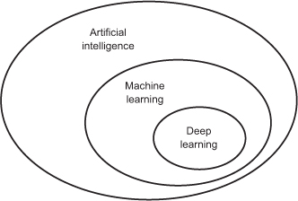

And even AI (Artificial Intelligence) itself is part of the even bigger picture called Data Science.

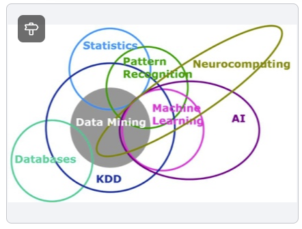

(KDD: Knowledge Discovery in Databases)

### How it is different from (Classical) Programming
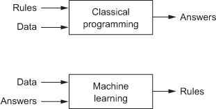

Classical programming applies rules on data to get answers.

> The goal of machine learning is to _**produce the rules**_, by finding the path between the original data and the answers/facts/conclusions produced subsequently.
> In other words, it relies on the way in behaved in the past, to predict/deduct the way it will behave in the future.

#### Is that Deep Learning?

###### Weather Routing?
No. It is not even Artificial Intelligence. There is no training process involved, it is all
about (classical) computing. It may require resources and heavy calculations, but no learning process.
 
###### Deep Blue defeating Garry Kasparov? 
Maybe Artificial Intelligence, but not Deep Learning, as the machine did not go through a learning process.
IBM actually called this GOFAI (Good Old-Fashioned Artificial Intelligence)...
The computer was able to identify _already played games_ (very fast), and was mimicking what was done before.
Kasparov may very well have been defeated by one of his _own_ previous games...

###### Google's AlphaGo beating Go champion?
Yes! The game won by the computer had _never_ been played before. And the machine relied
on a model elaborated by a training process.

### The path from design to production
- You start from real historical data, that will contain the parameters or dimensions used as input for your future system, as well as the data containing the decisions (output) you want to teach your model to make. From those data, you will extract 
    - Training dataset
    - Test dataset
    - Validation dataset
- With those datasets, you will **_train_** your model
    - This **is** _where the machine is learning_.
- Once the model is _trained_, you will use it to make decision on real data (real world, and real time)

### So, we start from real data (from a database)
We will use an example to illustrate the path, let's say we run an insurance company,
and we want to determine the risk associated with a customer, based on
- his age
- the max speed of his car
- the number of miles he drives per year

We will represent the risk level with a color
- <span style="color: red;">**red**</span>: high risk
- <span style="color: orange;">**yellow**</span>: medium risk
- <span style="color: green;">**green**</span>: low risk

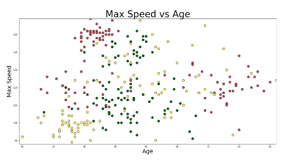

So, in the figure above, we actually have 3 dimensions:
- Age of the driver
- Max Speed of the car
- Risk group, encoded with the color.
> Note: The `miles per year` dimension is dropped in this case.

If we restore the `number of thousands of miles driven per year` dimension, 
a programmer would write _rules_ like this (in Python):
```python
red = 0
green = 1
yellow = 2

def evaluate_risk(age, speed, miles_per_year):
  if age < 25:
    if speed > 140:
      return red # Crazy young guy, car too fast
    else:
      return yellow # Car is slow enough for medium risk
    
  if age > 75:
    return red # Get off the road, old man!
  
  if miles_per_year > 30:
    return red # You drive too much
    
  if miles_per_year > 20:
    return yellow 
  
  return green # otherwise, low risk  
      
```
See in this [Java Notebook](./NeuralNetworks.ipynb#A-"Classical"-way-to-program-a-rule), there is a Java implementation of such a rule.

If we plot this on the diagram (red-yellow-green), we have:

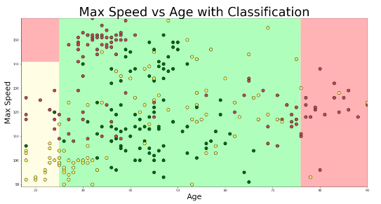

> The problem we want to address here is a _**classification**_ problem. We will put the points in different (3) categories.
> Other problems may be addressed by Deep Learning, like _**objects detection**_, _**objects recognition**_, and many more.

> Example: self driving cars will have to:
> - detect objects on the road
> - recognize them (cars, bikes, pedestrians, traffic lights, curbs, etc)
> - classify them, to then make the right decision (brake, turn right, slow down, etc) 

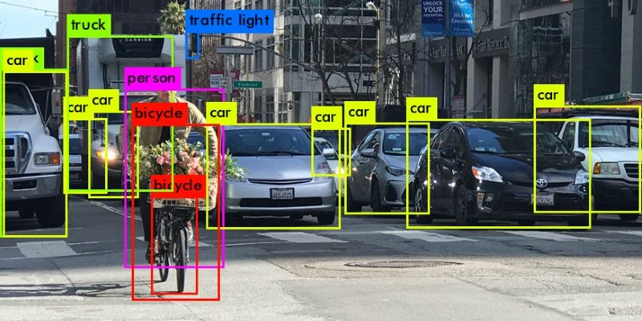

### Deep - supervised - machine learning

The `model` will replace the `rules` we had before.

It will be able to make predictions like this:

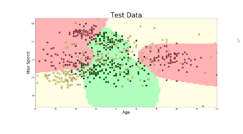

We will use Neural Networks to elaborate the model.

And specifically the `TensorFlow playground`.

<!-- 2. BASIC CONCEPTS OF DEEP SUPERVISED MACHINE LEARNING -->

### TensorFlow Playground
TensorFlow playground at <https://playground.tensorflow.org>

#### How a Neuron (aka Node) works

- It has a _single_ numerical output (usually called `y`).
- It can have several inputs (also called dimensions), usually named `x`<small><sub>`n`</sub></small>, associated with a weight `w`<small><sub>`n`</sub></small>.
- It also has a constant, called the bias (noted `b`)
- Its formula is

 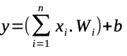
 
Example 

 

See a [Java Notebook](./NeuralNetworks.ipynb#Neurons!) for an example.

In a classification problem, a single neuron can draw a single line as a decision boundary. 

> Note:

In the case of a one neuron layer, the expression 
<pre>
 y = &Sigma; (x<sub><small>i</small></sub> . w<sub><small>i</small></sub>) + b  
</pre>
becomes
<pre>
 y = (a . x) + b
</pre>
This looks like the equation of a straight line, with its directing coefficient and offset.

#### Neurons at work

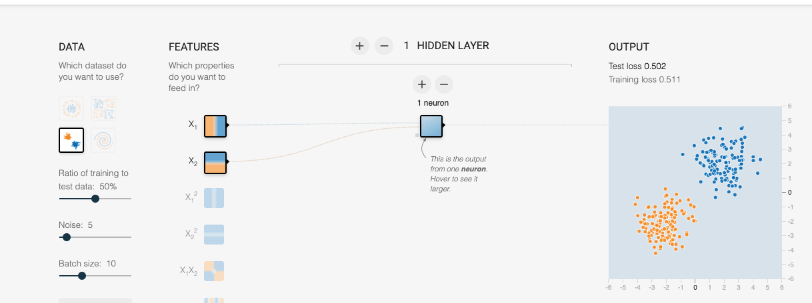

In the screenshot above:
- We have 2 input dimensions, x<small><sub>1</sub></small> (abscissa) and x<small><sub>2</sub></small> (ordinate).
- The weight of each dimension is represented by the thickness of the line between the dimension and the neuron(s)
- The bias of the neuron is represented by the (very) small little gray square at the bottom left of the neuron(s).
- The output will be a single number, ranging from -1 to +1.
- The background of the graphic on the right will reflect the prediction, it will be orange if y < 0, and blue if y > 0.
- You can change the weights associated with each box (dimensions and neuron(s)), as well as the bias of each neuron.
 
With _one_ neuron, you can draw _one_ straight boundary.
The neuron will allow you to change the slope (weight), and the offset (bias).

In the figure above, we have two dimensions X<small><sub>1</sub></small> and X<small><sub>2</sub></small>, and we have 
one neuron (in an _hidden_ layer).

This means that all the points of our training dataset have three values:
- A value for X<small><sub>1</sub></small>  
- A value for X<small><sub>2</sub></small>
- A color (or something translated into a color chosen in a set of two colors)


For example, in the figure above, we have `P1(-2.1, 0.2, 'orange')`, `P2(3.2, 4.6, 'blue')`

We are looking for the best parameters of the neuron (weight and bias) that will generate a line (or boundary)
correctly separating the two groups.      
 
When you hit the \[Start\] <!-- &#10162; --> button, we iterate over the values of those weights and bias parameters.
The tuning of those values **_is_** what Machine Learning is all about.

###### Lab
- Use `ReLU` Activation function
- Manually change dimension weights to 1
- Manually change neuron's bias to 0

##### What we want
We want to obtain the parameters (weights, bias) that will generate the right background for the points of our training dataset.

> Important precision: 
> We are **not**  looking for the _equation_ of the boundary !!
> We are looking for some way to determine for _each point_ of the plan (2D in this case) what category it belongs to. 

We know what data we start from (training data), we are trying to minimize the number 
of misclassified points (an orange dot on a blue background and vice-versa). 

In this example, the classification can be operated by a single neuron.

#### Activation functions
The Activation Function sits between the calculated output, and the actual output of the neuron (`y`).
It compresses the calculated output between 2 other values (like 0 and 1, -1 and +1, etc). This is
a way to normalize the output data _of a layer_, so the next one knows what to deal with.
For example, in  the TensorFlow playground, the orange values will be the one ranging from -1 to 0, and the blue ones from 0 to 1. 
Notice that the output `y` becomes the `x` of the Activation Function.

Among them, we have:
- Step functions (0 or 1),
- Sigmoids (\[0, 1\])
- Hyperbolic Tangents (\[-1, +1\])
- Rectified Linear Unit (aka ReLU), (\[0, n\])
- SoftMax (used later in this document)

For example, if we use a Sigmoid for the value used above (`17`), we would probably return a value around `0.91`...

| Sigmoid  | Hyperbolic Tangent | ReLU     |
|:--------:|:------------------:|:--------:|
| 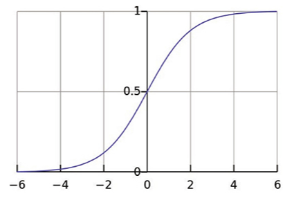 | 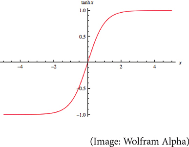 | 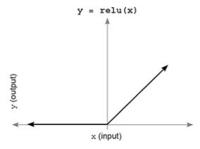 |

See this [Jupyter Java Notebook](./NeuralNetworks.ipynb) for more details.

#### Neuron Networks
One neuron is usually not enough. But a combination of them can approximate almost _any_ function.

Samples are not typically separable by a single line..., like this one for example:

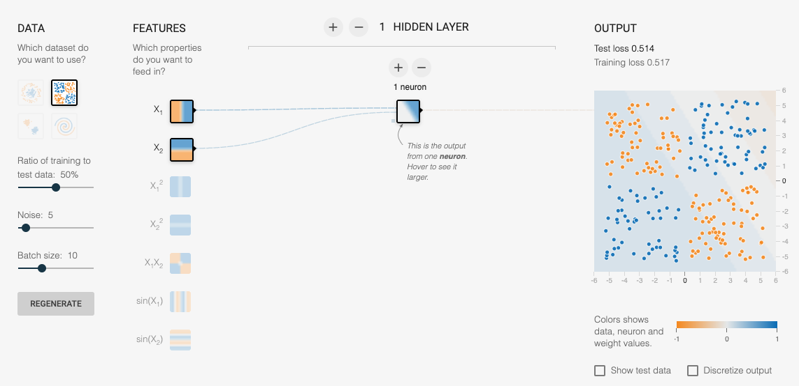

As each neuron will generate one line (boundary, separation, whatever you call it), we will add more 
neuron to the picture to see how it goes.

We add a neuron in the first _hidden layer_, and we combine these two neurons into a so-called _fully connected layer_.

There is _no_ communication between those neurons, and they get the same input from the dimensions (age and speed here).
_**But**_ the inputs can have different weight (thickness of the line).

> Note: we have here _one_ hidden layer, made out of _two_ neurons.
> In a typical setting, you might have 2 or 3 hidden layers, maybe 500 to 5000 neurons per hidden layer.
> In which case it makes it prohibitive to tune all those parameters by hand.

> The number of layers is called the depth of the network.
> This is where the _Deep_ in _Deep Learning_ comes from.

Kick this off by clicking the \[Start\] button again. You see the parameters of the neurons changing,
and the combined output on the right. As you would see, this network might not be able
to separate those two groups we have in our training dataset.


#### How does a network _learn_?
The first thing is to know how well the network works.
In the picture above, it does _not_ work great.
Again, the prediction is reflected by the color of the background, and some points are on the wrong background.

To know how well the network is working, we will consider - for each point - the difference between 
the prediction (reflected by the background color), and the reality (reflected by the point color).
We combine the value of the error for _all_ the data point in our training dataset, which we do using the 
mean squared error (MSE).

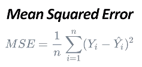

- In the formula above, Y<small><sub>i</sub></small> is the prediction, and Ÿ<small><sub>i</sub></small> is the value from the training dataset.
- We compute the difference, and we square it to get rid of its sign, so positive and negative values do not erase each other
- We sum all the differences for all the data set
- We divide by the cardinality of the dataset (normalization)

To understand better, we restrict the picture to only one neuron again, to deal with only one parameter (of the neuron),
that would be the bias.

Then we can plot the value of this bias (abscissa) to the loss (ordinate).

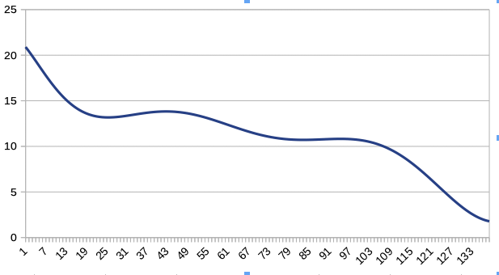

This loss is displayed on the diagrams of the TensorFlow playground, on the top left part (Test loss),
the curve(s) represent the value of the loss as the training goes. If the loss drops, this is good.

Try [this](https://www.benfrederickson.com/numerical-optimization/) interactive page.

This is the goal of the training algorithm, it changes the bias to minimize the loss.

To store the best bias, we check the slope of the curve. If it goes down, it is good.
The next point - on the loss curve - to evaluate will be one step away, this step value is the `learning rate` that
figures in the TensorFlow diagram.

A big `learning rate` will accelerate the learning process, but might very well miss local minima if it is too big.

Do look at [this interactive document](https://www.benfrederickson.com/numerical-optimization/), it is a good one.

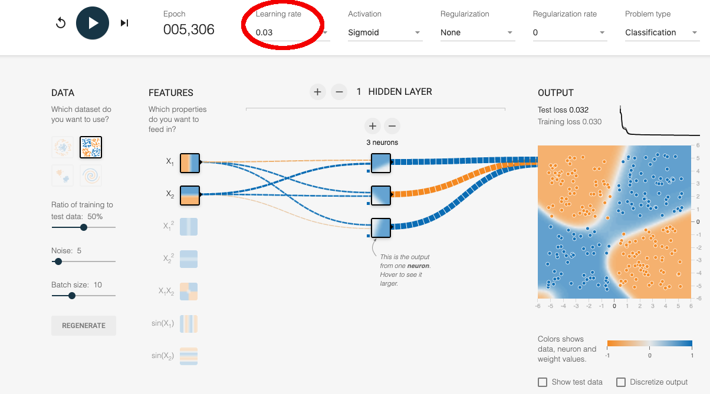

This strategy is called _Gradient Descent_.

The `epoch` represents the number of steps it went through so far. For each step, the algorithm is evaluating the error for all the points of the training dataset.
You can see the loss curve(s) as the process goes on, and the decision boundaries are updated in real time as well.

See this [complex one](http://playground.tensorflow.org/#activation=tanh&batchSize=10&dataset=spiral&regDataset=reg-plane&learningRate=0.03&regularizationRate=0&noise=40&networkShape=4,2&seed=0.31018&showTestData=true&discretize=false&percTrainData=50&x=true&y=true&xTimesY=false&xSquared=false&ySquared=false&cosX=false&sinX=false&cosY=false&sinY=false&collectStats=false&problem=classification&initZero=false&hideText=false&problem_hide=true&regularization_hide=true&batchSize_hide=true&regularizationRate_hide=true).

##### Try for yourself
Now we have a better understanding of the problem, you should see how to address it in the TensorFlow playground.
This will give you a better idea of the problems to tackle when training your own models.

###### Lab 1
In TensorFlow playground, use the bottom left data type (2 groups)
- _ONE_ neuron in _ONE_ hidden layer
- Learning rate 0.03
- Activation Tanh 

This should be resolved quickly.

Try to modify the different weights, and the bias of the neuron.

Let's say we have 
- X<small><sub>1</sub></small> &isin; \[-6, +6\]
- X<small><sub>2</sub></small> &isin; \[-6, +6\]
- W<small><sub>1</sub></small> = -0.69
- W<small><sub>2</sub></small> = -0.67
- b = 0.030
- W<small><sub>final</sub></small> = -2

Orange point `(-4, -3)` will result in:
```
(-4 * -0.69) + (-3 * -0.67) + 0.030 => 4.8 * -2 => -9.6 => tanh(-9.6) = -0.999999990825637
```
Blue point `(3, 4)` will result in
```
(3 * -0.69) + (4 * -0.67) + 0.030 => -4.72 * -2 => 9.44 => tanh(9.44) = 0.999999987365729
```

- -1: orange
- +1: blue

Also see spreadsheet neuron.ods, play around with it.

There is [this Java Jupyter Notebook](./data.one.neuron.ipynb) illustrating this too.

###### Lab 2
Use the top-right data (4 groups, in 4 squares)
- 2 inputs (X1, X2)
- Learning Rate 0.03, Activation Tanh
- Try with _ONE_ neuron in _ONE_ layer, see why it is not possible to solve this.
- Add one neuron (that makes 2)
- Try it.
- Change Activation to Sigmoid, try again
- Add One neuron, try again (still with Sigmoid), go up to 1000 epoch at least
- Try with Tanh
- Try with ReLU <- This one is the best!
 
Flip the 'Discretize output' box.
 
###### Lab 3
Use the 'circular' data (top left)
- with 4 neurons, learning rate 0.03, Act ReLU, Tanh, or Sigmoid,
- compare the output curves, see the different parameters

###### Lab 4
Use the spiral Data (bottom right)
- Use the _**7**_ input dimensions, 2 hidden layers, 5 and 6 neurons
- Act Func Tanh, ReLU, should be OK around 500 epochs
- Do look at the curves when using a Sigmoid
  
Play around, and see how it moves ;)
 
#### Finding the sweet spot

Over fitting vs Under fitting.

The training of a Neural Network relies on _known data_.

Usually, 80% of those known data are used to train the network (training dataset), and the
remaining 20% are used to test if the prediction of the network is correct (test dataset).

In many cases, 20% of the training dataset (20% of 80%) is used for constant check validation.

Like in the `Keras` example `addition_rnn.py`:
```
Train on 45000 samples, validate on 5000 samples
```

#### The TensorFlow playground does a lot of things for you
Behind the scene, the TensorFlow playground does many things for you.
It does not only iterate through the possible values of all the parameters, it is also finding their best combination,
where the loss is the smallest, and this in an optimized fashion.

The curves displayed at the top-right corner of the playground page reflect those
values. 
This will explain several of the statements we will need to use when taking
a programmatic approach to the problem (Python, or Colab Notebooks).

## Training a TensorFlow model
Back to the Car Insurance Company example. Let's now see some code...

See the [TensorFlow tutorials](https://www.tensorflow.org/tutorials/).

With existing customer data, we will use `Keras` API to train a neural network.

The code will be provided in `Colab` Notebooks.

All the required code can be found at <https://github.com/DJCordhose/deep-learning-crash-course-notebooks/blob/master/README.md>.
`Colab` requires a Google account, and works better in a Chrome browser.

> Note: Shift + Enter executes the current cell, and brings you to the next one.

First Notebook is [here](https://colab.research.google.com/github/djcordhose/deep-learning-crash-course-notebooks/blob/master/U3-M3-data.ipynb).

This first Notebook imports data from a CSV (Comma-Separated-Values) file, using `curl`:
```
 curl -O https://raw.githubusercontent.com/DJCordhose/deep-learning-crash-course-notebooks/master/data/insurance-customers-1500.csv
```
If you are behind a proxy, use 
```
 curl -x http://www-proxy.us.oracle.com:80 -O https://raw.githubusercontent.com/DJCordhose/deep-learning-crash-course-notebooks/master/data/insurance-customers-1500.csv
```
See what the data look like doing (after the `curl` command above)
```
 $ head ./insurance-customers-1500.csv 
speed;age;miles;group
98.0;44.0;25.0;1
118.0;54.0;24.0;1
111.0;26.0;34.0;0
97.0;25.0;10.0;2
114.0;38.0;22.0;1
130.0;55.0;34.0;0
118.0;40.0;51.0;0
143.0;42.0;34.0;1
120.0;41.0;42.0;2
$
```
To know how many lines it contains, use the `word count` command:
```
 $ wc -l insurance-customers-1500.csv 
    1501 insurance-customers-1500.csv
```
It has 1501 lines, the first one being the headers (`speed;age;miles;group`), that makes 1500 lines of actual data.

**Very important for the rest of the exercise:**
In the `group` column, `0` is `red`, `1` is `green`, `2` is `yellow`.

The content of this file - all the data it contains - is called a _data frame_.

For the first exercise, get the content of the URL at <https://raw.githubusercontent.com/DJCordhose/deep-learning-crash-course-notebooks/master/exercise/plot.py> (you can use your browser) and paste it in a new cell of you `Colab` notebook.
Then press Shift + Enter to execute it.

```
$ curl -O https://raw.githubusercontent.com/DJCordhose/deep-learning-crash-course-notebooks/master/exercise/plot.py
$ cat plot.py 
```

### Data Encoding

For the model training, we will use two approaches:
- Colab notebooks
- Python scripts

In the section below, we will actually be running Python scripts directly on your machine.
You obviously need Python (or Python3) to be available.

Run `which python` in a console to know if it is available:
```
$ which python
~/anaconda3/bin/python
``` 
If the command returns nothing on the second line, Google will tell you how to install Python on your machine.

Then we need to install the required Python packages (to do once):
```
$ pip install tensorflow
$ pip install keras
$ pip install numpy
$ pip install matplotlib
$ pip install pandas
$ pip install seaborn
$ pip install sklearn 
```

Second Lab: <https://colab.research.google.com/github/djcordhose/deep-learning-crash-course-notebooks/blob/master/U3-M5-nn-intro.ipynb>

Using SoftMax (as activation function on the last layer)

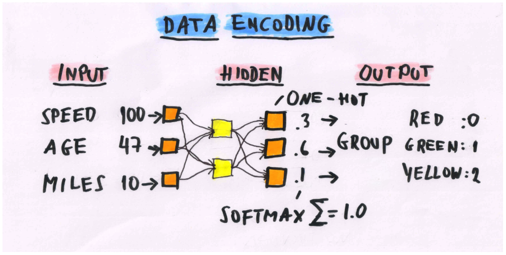

> _**Softmax**_ activation function is well adapted for output taken from a discrete list of values.
>
> We have 3 possibilities for our output, `red`, `green`, and `yellow`.
> The neurons are returning _**numerical**_ values, we need to match those values with the colors.
> `Softmax` is encoding those values, so the sum of all of them is `1`.
> (In the example above, `0.3 + 0.6 + 0.1 = 1.0`).
> The biggest value is the one to use to find the finally expected item in the list of possible options:
> In the example, in `[0.3, 0.6, 0.1]`, the biggest value (`0.6`) is the _second_ one, we pick the _second_ value of
> `[ red, green, yellow ]`, and the item we end up with is `green`. 

You train your machine with your data to make it learn the relationship between some input data and a certain label (`label` = `y`).
_**This is called supervised learning.**_

Here we do not use the TensorFlow playground anymore, we do it _for real_ on a dedicated machine. 

We create a `sequential` model, using the Keras API. Keras is written in Python.

```python
 model = keras.Sequential()
```
And we start from there.

See the [final Python script](./sample.04.py). This can be run for real on your machine, after you've downloaded the data in `insurance-customers-1500.csv`, with `curl`.
```
$ python sample.04.py
```

Also look at the Jupyter Notebooks.

Then, to go to production, we use TensorFlow.js.
We will convert our model (the `h5` file) with `tensorflowjs_converter`.
Install it as explained [here](https://www.tensorflow.org/js/tutorials/conversion/import_keras).

> Note: `h5` is actually short for `hdf5`, Hierarchical Data Format.

```
$ [sudo] pip install tensorflowjs
```
Then convert the model:
```
$ tensorflowjs_converter --input_format keras ./insurance.h5 ./tfjs
```
> Note: that last one has glitches on MacOS... Works fine in a Debian Docker image though.

You can load the `load_model.html` in you browser, the output will be in the `console`.
Preferably, use Chrome or Firefox. This file uses pure JavaScript (ES6).
See the code in it for brute-force code review.

`index.html` does the same, but more interactively, it is an HTML page, with a better UI.

> To run the Web pages (requires `NodeJS` to be available):
```
 $ cd tfjs
 $ node server.js
```
Then open <http://localhost:8080/index.html> in your browser.

##### TODO
- Java version

### Closer to the real world: hand-written digits recognition
We will use `TensorFlow` and `Keras`, from `Python`.

##### 2 Layers, 512 and 10 neurons
Let's take a look at a more realistic example, hand-written digits recognition.

> The elaboration of the neural network structure (number of layers, number of neurons per layer, activation functions to use,
> dropout amount, etc) requires some... intuition. We will not cover this in this document.

`Keras` comes with several datasets, one of them being `mnist`.

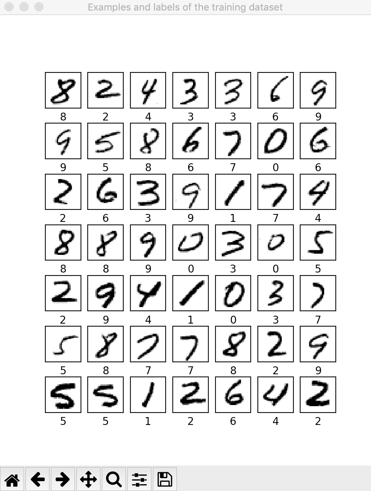

It is a serie of images representing handwritten figures, along with their actual values.
We will use this to train a neural network, and use the trained network to recognize hand-written digits from the
test dataset. 

This can be run locally (after installing the required Python packages):
```
$ python sample.05.py [ L | --help ]
```

Another example, try:
```
$ python sample.06.py
```

### Conclusion
Go ahead! Just do it!

---
