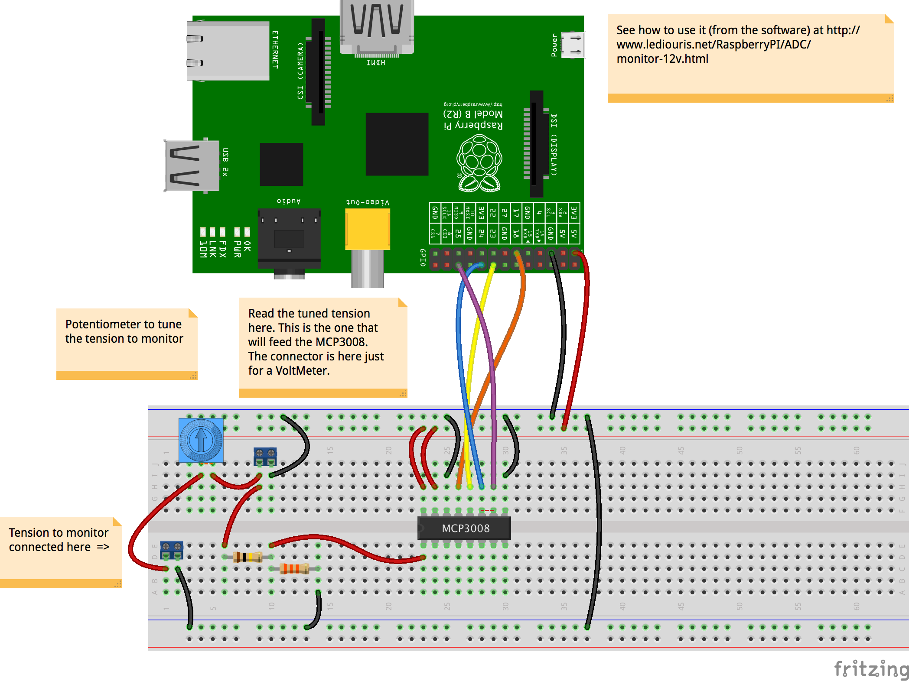

# How to remotely monitor...

## A Battery
 This is an example intending to demonstrate how to publish information  gathered from the Raspberry PI.
 The information here is the tension (aka voltage) of a battery.
 The battery can be in a remote place, and from wherever you are, you want to make sure its level does not
 drop below a given threshold.

##### Read the tension
 As the Raspberry PI's GPIO pins are all digital ones, to read the battery's tension, you need an Analog to Digital Converter (ADC).
 As you can see in the Fritzing diagram below, we will use here an MCP3008. It is cheap, and good enough for our purpose.

##### Publish it
 This is where we have several options, which we discuss below.

### The battery monitoring trinket

How to build and connect.

#### NMEA?
NMEA stands for National Marine Electronics Association. It is one of the oldest IT standards.

Battery Voltage can be described by a sentence like
```
 $AAXDR,U,12.34,V,TRINKET*3C
```
Many NMEA parsers are available. NMEA could be an option to consider, in case the
management of the output of the trinket above was to be automated.

### By email
If there is Internet access in the location where the trinket is, and
if you have an email account, then sending the battery voltage by email could be an option, keeping in mind
that it is not a _real time_ communication, there is always a delay between the moment when an email
is sent and the moment when it is received.

It can go both ways though. The Raspberry PI can send emails, and receive some (by polling the INBOX).
As long as the _received_ email complies with a given format, it can be parsed and then managed accordingly.

##### Pros
- Free
- Easy

##### Cons
- Requires Internet Network connection
- Not real-time, delayed.

### By SMS
If you do not have Internet coverage in your location, you could use a device like a `FONA` tio reach out to a cell-phone network

##### Pros
- Can be available where Internet is not

##### Cons
- Not Free
- Not real-time, delayed.

### Outernet ?
[Outernet](https://outernet.is/) might also be something to consider, if you are _really_ out of reach of any kind of network (at sea, far in the desert, etc).

More soon abouyt that one...

##### Pros
- Available everywhere on Earth.

##### Cons
- Requires extra hardware
- Not real-time, delayed.
- Slow

### WebSocket
WebSocket is a very cool technology, based on TCP. Obviously available on the server side of the world, but also
implemented with HTML5, and available fro browsers supporting ity, in JavaScript.
Can be seen as a publish/subscribe mechanism.

In a protocol like HTTP for example, you need to submit a request to get a response.
**For example**: you want to know at what time a given plane is going to land.
You go to the airline's web site, you navigate to the 'Flight status' page, and
you probably find your information. In case the flight status changes, you need to _refresh_ your page
to see it. With a publish/subscribe protocol (like WebSocket), you would subscribe to an
event like `flight-status-update`, and whenever such an update happens on the server side, the
correspondinbg message would be sent to your browser, without you having to request it.

In our case, we would have:
- The Raspberry PI publishing events to a WebSocket server
- All the clients having subscribed to those events would be notified

It obviously requires a WebSocket Server.
 NodeJS can be one.

##### Pros
- Easy
- Real time
- Supported on clients and servers.
- Great for clients, notified without having to request a message to it.

##### Cons
- Requires Internet Network connection
- Requires a WebSocket server

### IoT (Internet Of Things)

#### Using MQTT
Now we 've talked about the WebSocket approach above, the Internet Of Things (IoT) one
flows naturally. MQTT implements a pure publish/subscribe dialog, very easy to deal with (even easier than WebSocket).

There [here](http://www.hivemq.com/) a lot of good readings about MQTT.

It also requires a server - which we will call an IoT server - where events will be published,
from the Raspberry PI in our case. Then whatever client understanding the protocol(s) available on
the server can read those events, and get the corresponding data.
More and more IoT servers support the MQTT protocol (Message Queuing Telemetry Transport).
`Mosquitto` runs fine on the Raspberry PI, look [here](http://hackaday.com/2016/05/09/minimal-mqtt-building-a-broker/) to see how to install it.

Several IoT servers are free to access, like [Adafruit.IO](https://io.adafruit.com/). You
just need to create your free account, and remember your Token.
`AdafruitIO` supports MQTT and also provides a neat REST interface.

To access MQTT from Java, I use [paho](http://www.eclipse.org/paho/), as you can see in the `dependencies`
section of the `build.gradle` file of this project.

##### Pros
- Can be free
- Flexible
- Pub/Sub

##### Cons
- Requires Internet Network connection
- MQTT is not directly supported in a browser

#### Using REST
...
