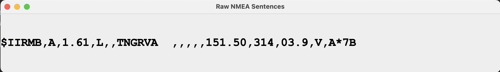

# Java Clients

- TCP Clients
  - `clients.tcp.NMEATCPClient`
    - No GUI, console output.
    - Requires an NMEA-multiplexer to be running, with a TCP forwarder on port `7001`.
  - `clients.tcp.NMEATCPSwing101`
    - Same as above, with a Swing GUI.
    - 

---
