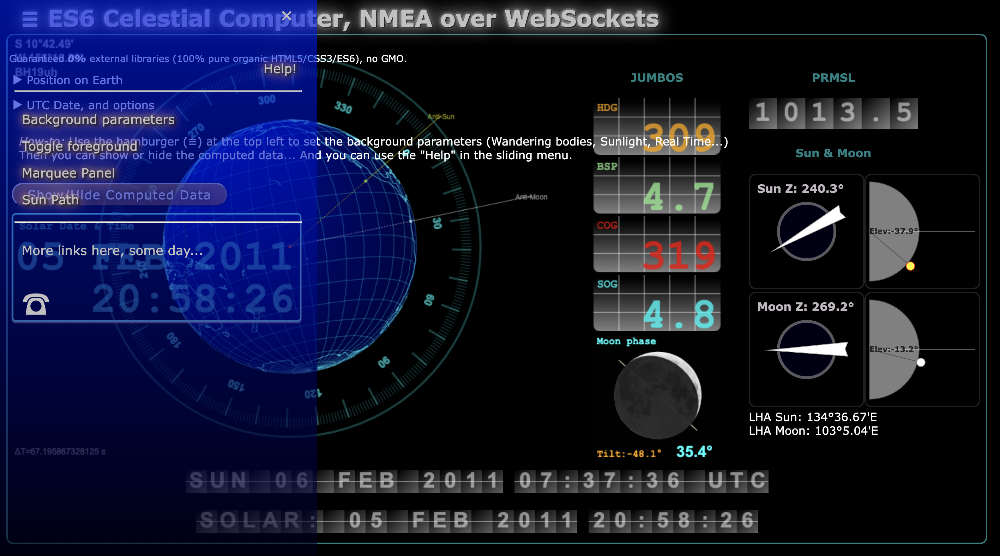

# WebSocket, ES6, HTML5
This requires a WebSocket server to be fed by an NMEA-multiplexer.  
The NMEA-multiplexer has to have a `ws` forwarder, like 
```yaml
. . .
forwarders:
  - type: ws
    wsuri: ws://localhost:9876/
. . .
```

### Install the NodeJS WebSocket server
To do once:
```
$ npm install
```

The `wsuri` is the one of a Server like the one implemented by a
```
$ node node.wsnmea.js
```
or
```
$ npm start
```

A basic html page - for test - can be hosted by the same NodeJS server, once the
NodeJS server is started, reach `http://localhost:9876/data/wsconsole.html` from a browser.

## A Single Page Web App, NMEA over WebSockets
Based on the exact same structure (same servers as above), try to reach `http://localhost:9876/data/console/ws.console.html`
from a browser.  
It consumes the NMEA sentences coming through a WebSocket client, and computes the celestial data,
based on the UTC time read from the RMC sentences.

Example: Replay of some logged data.    


