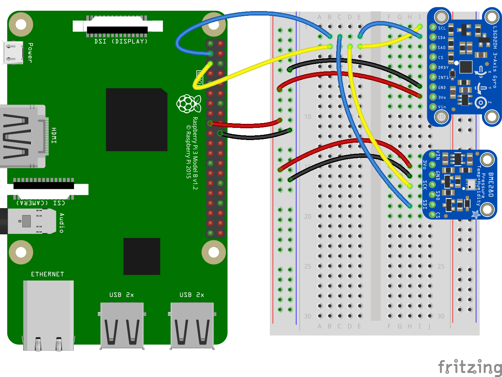
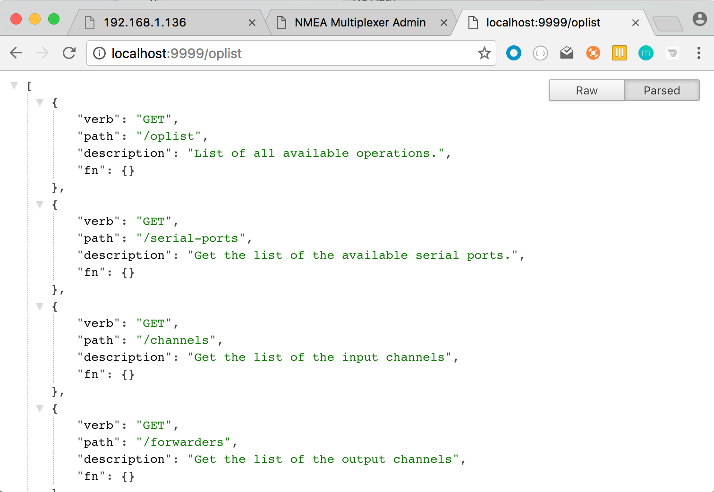
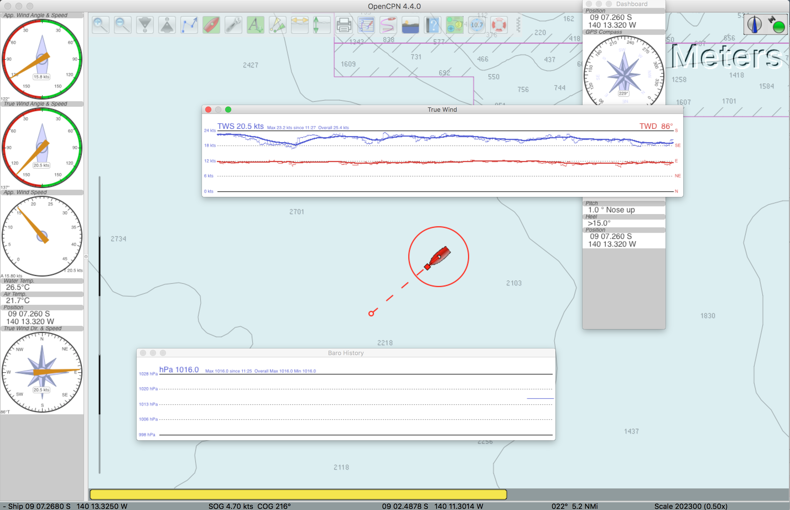
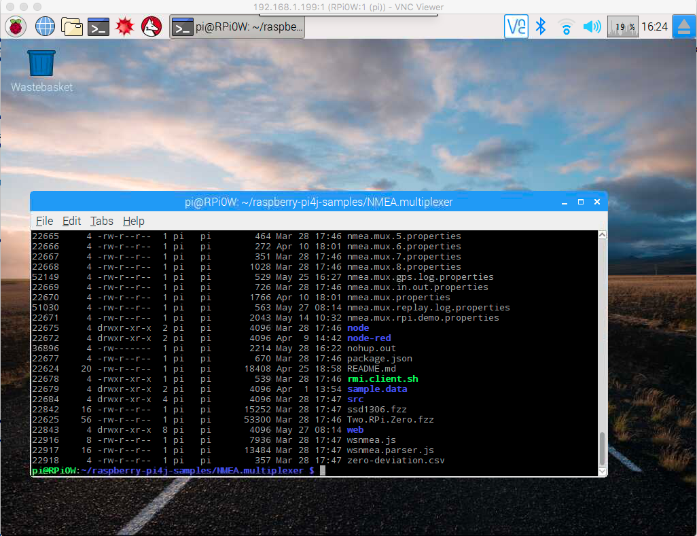
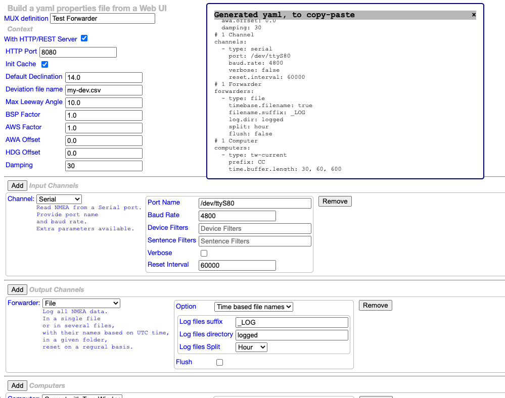

# NMEA Multiplexer

> For the impatient: [Get started fast](./getstarted.md). 

NMEA channels management, in and out.

This is - obviously - a _software_ multiplexer (**no** hardware required), that can read data from
multiple sources, compute extra data (like current) if needed, and broadcast them onto (possibly) several output destinations.

For example:
- Read one or more serial ports (GPS, boat data), write them into a log file
- Read a serial port, read a `BME280` sensor (air temperature, atmospheric pressure, relative humidity), and broadcast everything on a TCP port, for `OpenCPN`.
- Read a file of logged data, and send them over `TCP` to `OpenCPN`, for replay.
- etc...

-------------------------------------

### NMEA

[NMEA](http://nmea.org) (National Marine Electronics Association) is one of the oldest IT standards, defining how sensor data should be conveyed.

> _Note_: here is an _opened_ question:
>
> Some softwares are using more "modern" technologies to shape the data (like `GPSd`, `SignalK`, ..., they use JSON over REST/HTTP), but what is the point?
> `text/plain` has always been a supported mime-type, suitable for NMEA Sentences... 
> 
> The conveyed data _are_ NMEA data, and to be able to communicate with other softs, their (proprietary?) format will eventually have to be converted back to NMEA...
> Here we chose _not_ to convert anything. NMEA remains NMEA, which everyone understands. And everyone's happy.   

--------
Any input (File, Serial, TCP, UDP, WebSocket, Sensors, Computations, ...), any output (File, Serial, TCP, UDP, WebSockets...), and a REST API on top of that.

Designed to run on _very small_ boards, like a Raspberry Pi Zero, and with possibly _no_ Internet access.
> Warning: It is not designed to scale as an enterprise server!

The operations on the Serial port require `libRxTx`. This is included in the gradle dependencies.
To be able to use it outside gradle, run (on Linux/Debian/Raspberry Pi):
```bash
 sudo apt-get install librxtx-java
```
See how this is used and referred to in `mux.sh`.

---

For the impatient: go [here](#to-see-it-at-work-aka-get-started) to get started now. The others will keep reading.

-----------------
### Includes
- NMEA Strings Parser
- AIS Strings Parser (WiP)
- NMEA Strings generator
- Serial port Reader / Writer
- TCP Reader / Writer
- UDP Reader / Writer
- WebSocket client (read/write)

#### Also includes
- A tiny (but amazing) HTTP REST server, for admin and external access (through REST services) purpose.

### Javadoc
Javadoc can be generated by using
```bash
 ../gradlew javadoc
```
The generated files will be in `build/docs/javadoc`. Open the `index.html` in your browser.

### Some definitions
At the center of the picture, there is the Multiplexer (aka MUX).

The MUX _reads_ from `channels` and _writes_ to `forwarders`.

A _channel_ is an NMEA data provider, a _forwarder_ is an NMEA data producer, it can be used as input from another Multiplexer.

<div style="background-color: gray; color: blue;">
<table>
<tr>
<td>
Just to insist: A <i>channel</i> is an NMEA data provider. This means that it produces (pure) NMEA Sentences!!
This is <i>pure</i> NMEA. Nothing fancy like a JSON Object or whatever object representing the same data in another format.
NMEA is already a well known and defined format.
</td>
</tr>
</table>
</div>

In addition, we can have _sensors_. A _sensor_ is reading data from a transducer, and produces NMEA sentences read by the Mux. In other words, a _sensor_ is talking to the Multiplexer,
and can be seen as a _channel_.

Also, a _computer_ is using NMEA data collected by the Multiplexer to produce other NMEA data that will be broadcasted by the _forwarders_.
For example, True Wind computed with Apparent Wind data and the GPS data.

_Note_: to compute the required data, we have a **cache**, where the data required _by_ the computers are pushed.
This cache is initialized before starting the computers, with parameters contained in the
properties file used at startup.

This cache is necessary to perform damping and smoothing operations - among others.

Finally, we have _transformers_, that transform NMEA data into another (proprietary) format, and then behave like a a regular _forwarder_ to provide them to whoever is interested.
 A _transformer_ is also a _forwarder_. See below examples of `transformers`.

##### Examples
Channels:
- **Serial** reads NMEA data from a Serial Port
- **TCP** reads NMEA data from a TCP server
- **WebSocket** reads NMEA data from a WebSocket server (this is a WebSocket client)
- **File** reads NMEA data from a log file
- etc

Forwarders:
- **Serial** writes NMEA data to a Serial Port (not implemented yet)
- **TCP** writes NMEA data to a TCP port
- **WebSocket** writes NMEA data to a WebSocket server (this is _also_ a WebSocket client)
- **File** write NMEA data to a log file
- etc

Sensors:
- **BME280** reads raw data from a BME280 sensor (Temperature, Pressure, Humidity), and produces `XDR` and `MDA` NMEA Sentences.
- **BMP180** reads raw data from a BMP180 sensor (Temperature, Pressure), and produces `XDR` and `MDA` NMEA Sentences.
- **HTU21D-F** reads raw data from a HTU21D-F sensor (Temperature, Humidity), and produces `XDR` NMEA Sentences.
- **LSM303** reads raw data from a LSM303 sensor (3D magnetometer and accelerometer), and produces `XDR` NMEA Sentences for pitch and roll, `HDM` for heading.
- **HMC5883L** reads raw data from a HMC5883L sensor (3D magnetometer), and produces `XDR` NMEA Sentences for pitch and roll, `HDM` for heading.
- ... and the list is not closed.



Computers:
- **True Wind** computer (produces `MDA`, `MWD` data)
- **Current** computer (produces `VDR` data)

_Important_: Computers require the cache to be initialized. This is set in the properties file:
```properties
 init.cache=true
```

Transformers:
- **GPSD** data (See [this](https://hocus-blogus.blogspot.com/2016/12/nmea-multiplexer-opencpn-gpsd.html))
- **Custom** data

##### A word about the Current Computer
A basic approach to compute the current would be to do it by instant triangulation, figuring the Course Made Good (CMG)
and comparing it with the GPS Data (Course and Speed Over Ground).
A better approach turned out to compute the current over a given period of time.
For example, you can perform this calculation by comparing the position you should be at with the CMG only (i.e. as if there was no current)
 and the one given by the GPS, over periods like 30 seconds, 1 minute, 10 minutes, etc, using a smoothing of the Boat Speed (BSP) and the CMG.
 The cache is designed to manage several such computations in parallel, they are discriminated by the length of their time-buffer (30 seconds, 5 minutes, etc).
The accuracy of such a computations is _much higher_ than the instant triangulation.
See [this article](http://www.lediouris.net/RaspberryPI/_Articles/readme.html) for details.

#### Overview


_Note: There is no Transformer on the picture above_

#### Note
There is an **rmi** forwarder. This is a work in progress, but it works.
It is feeding an RMI server that can then be accessed by an RMI client.
See an example of such a client in `samples.rmi.client.SampleRMIClient`.

### To see it at work (aka Get Started)
See the class `nmea.mux.GenericNMEAMultiplexer`, it uses the file `nmea.mux.properties` to define what to read, and what to re-broadcast it to.
See it to understand its content (should be clear enough).
The properties file used by the `nmea.mux.GenericNMEAMultiplexer` can be overridden by the System property named `mux.properties`, like in
```
-Dmux.properties=nmea.mux.gps.log.small.properties
```

Those settings can be modified once the mux is started, through the REST API.

To compile and build:
```
 $> ../gradlew [--daemon] shadowJar
```
To run it, modify `mux.sh` to fit your environment, and run
```
 $> ./mux.sh
```

See the [Manual](./manual.md) for more technical details.

##### Filtering
The Channels - aka Consumers - support sentence filtering.
Filtering can be applied on Device ID, and on Sentence ID. Filters can be positive or negative.

Positive filters are linked with an <b>or</b>, Negative ones with an <b>and</b>.

A (sentence) filter like `"HDM", "GLL", "~RMC", "~XDR"` would mean
```
(HDM or GLL) and (not RMC and not XDR)
```
> Note: the filter above is meaningless, this is just an example.
> If the sentence has to start with `HDM` or `GLL`, there is no point in excluding `RMC` or `XDR`... 🙄. They are already implicitly excluded.   
> - `"HDM", "GLL"` would mean "Only HDM or GLL"  
> - `"~RMC", "~XDR"` would mean "Everything, but RMC and XDR"

It is the user's responsibility not to have contradiction in the filters, like `[ "GLL", "~GLL" ]`,
no verification is done in this area. Such a filter would just return nothing.

> _Note_:
> This is just providing the possibility to negate an expression. Convenient, but limited. The best would probably be to use regular expressions (RegExp).
> Big drawback though: for the majority of the users, the RegExp syntax could be complex, too complex, or even scary...

##### About transformers
There is an example of a `transformer` in `WebSocketProcessor.java`. As you would see, it is just implementing the `Forwarder` interface,
and this is where it fits in the picture above.
A `Transformer` is just reworking the data before forwarding them as a regular `forwarder` would.

The example in `WebSocketProcessor.java` is transforming the NMEA Data in the format expected by a Pebble (this is a smart watch) application.
See it [here](https://github.com/OlivierLD/pebble/tree/master/NMEA). Data are expected as a `json` object, over WebSocket.
The expected data look like:
```json
{
    "gpstime": 1290377346000,
    "gpsdatetime": 1290377346000,
    "wp": "RANGI   ",
    "d2wp": 561.6,
    "b2wp": 230,
    "xte": 3.0,
    "lat": -9.1102,
    "lng": -140.21108333333333,
    "gpssolardate": 1290343695340,
    "log": 3013.0,
    "daylog": 12.4,
    "cog": 218,
    "sog": 7.2,
    "awa": -121,
    "aws": 17.8,
    "dbt": 1.7000000476837158,
    "hdg": 220,
    "bsp": 6.6,
    "wtemp": 26.5,
    "atemp": 0.0,
    "D": 10.0,
    "d": -0.9830777902388692,
    "W": 9.01692220976113,
    "leeway": 0.0,
    "cmg": 229,
    "tws": 21.4,
    "twa": -139,
    "twd": 89,
    "cdr": 149,
    "csp": 0.29,
    "prmsl": 0.0,
    "hum": 0.0
}
```
The `transformer` reads the data from the cache and generates such an object. Then it is sent to a WebSocket server.
###### To run this transformer example
Start the websocket server, on a port of your choice:
```bash
 $> node wsnmea.js -port:1234
```
Define your transformer in the `properties` file:
```properties
forward.07.type=wsp
forward.07.wsuri=ws://localhost:1234/
```
Make sure you have configured the Pebble application [as required](https://github.com/OlivierLD/SmartWatches/blob/master/pebble/NMEA/) (WebSocket URI), and you are good to go.

<table>
  <tr>
    <td>
      Application list
      <br/>
      
    </td>
    <td>
      Press select to start
      <br/>
      
    </td>
    <td>
      Scroll...
      <br/>
      
    </td>
    <td>
      Choose...
      <br/>
      
    </td>
    <td>
      Displayed!
      <br/>
      
    </td>
  </tr>
</table>

> Note: Pebble has been acquired by FitBit... There are other smart watch interfaces (like Samsung Frontier) available in the [SmartWatches](https://github.com/OlivierLD/SmartWatches) repo.

#### WebSockets
WebSocket protocol is supported, in input, and in output.
If needed, you can start your own local WebSocket server, running on `nodejs`.
To install it (once):
```bash
 $> npm install
```
Then, to run it,
```bash
 $> node wsnmea.js
```
or
```bash
 $> npm start
```

##### An alternative, `Node-RED`.
There is a possibility to use [Node-RED](http://nodered.org/) as a forwarder as well, that is a cool one.
You can create a Node-RED flow that ingests data from a TCP port, and spits them out on a WebSocket one.


[Here](./node-red/nodered.json) is the flow to import in Node-RED.

###### To run it
- Start the Mux (`$> ./mux.sh`)
    - Make sure there is a TCP Forwarder (port 7002)
- Start the node script `wsnmea.parser.js`.
```bash
 node wsnmea.parser.js
```
- Start `Node-RED` and run the flow mentioned above.


- The Multiplexer reads the NMEA data and _forwards_ them on a TCP Channel.
- Node-RED listens to the TCP port, and _forwards_ the payloads to a WebSocket server
- The WebSocket server transforms the data it receives into the expected format, and broadcasts them to all the connected clients (Pebbles in this case).

Once everything runs, you can reach [http://localhost:9876/data/web/wsconsole.html](http://localhost:9876/data/web/wsconsole.html)
to see the data as they come through.

## REST Admin Interface
The properties files like `nmea.mux.properties` defines the configuration at startup.

You can remotely manage the input channels and the re-broadcasting ones through a REST interface.
The soft includes a dedicated HTTP Server. The http port is driven by a property (in `nmea.mux.properties`).
Same if you want the HTTP server to be started or not.
```properties
with.http.server=yes
http.port=9999
````
> This HTTP Server is designed and written to run on small computers (like the Raspberry Pi Zero).
> It is **_NOT_** an enterprise server, and it will **_NOT_** scale as one. Think of it as a **_Micro server_**.

### Supported REST end-points

#### List of operations
A full list of the available REST services is available at
```
 GET /oplist
```


##### Examples
All the end points and operations are defined in `nmea.mux.GenericNMEAMultiplexer.java`. See the `List<Operation>` named `operations`.

```
 GET /mux/serial-ports
```
returns a payload as:
```
[
  "/dev/tty.Bluetooth-Incoming-Port",
  "/dev/cu.Bluetooth-Incoming-Port"
]
```
The list of _available_ serial ports.

```
 GET /mux/channels
```
returns a payload like
```json
[
  {
    "cls": "consumers.client.SerialClient",
    "type": "serial",
    "port": "/dev/ttyUSB0",
    "br": 4800
  },
  {
    "cls": "consumers.client.BME280Client",
    "type": "bme280"
  }
]
```

```
 GET /mux/forwarders
```
returns a payload like
```json
[
  {
    "cls": "forwarders.TCPWriter",
    "port": 7001,
    "type": "tcp"
  },
  {
    "cls": "forwarders.ConsoleWriter",
    "type": "console"
  }
]
```

```text
 DELETE /mux/forwarders/{type}
```
`type` is one of
- `file`. requires a body like
 ```json
{
    "log": "./data.nmea",
    "type": "file"
}
```
identical to the elements returned by `GET /mux/forwarders`.
- `console`. requires no body.
- `tcp`. requires a body like
```json
{
     "port": 7002,
     "type": "tcp"
}
```
identical to the elements returned by `GET /mux/forwarders`.
- `ws`. requires a body like
```json
{
   "wsUri": "ws://localhost:9876/",
   "type": "ws"
}
```
identical to the elements returned by `GET /mux/forwarders`.

```
 DELETE /mux/channels/{type}
```

```
 POST /mux/forwarders
```
with payloads like:
- `file`. requires a body like
 ```json
{
    "log": "./data.nmea",
    "type": "file"
}
```
identical to the elements returned by `GET /mux/forwarders`.
- `console`. requires a body like
```json
{
     "type": "console"
}
```
- `tcp`. requires a body like
```json
{
     "port": 7002,
     "type": "tcp"
}
```
identical to the elements returned by `GET /mux/forwarders`.
- `ws`. requires a body like
```json
{
   "wsUri": "ws://localhost:9876/",
   "type": "ws"
}
```
identical to the elements returned by `GET /mux/forwarders`.

```
 POST /mux/channels
```

There is a Web UI using the REST resources above.

> _Note_: This Web UI is to be considered  as an **example** of the way to access the resources. Nothing more. Best case scenario, a
> UI Developer might find it cute...

On the HTTP Port, use a url like `http://machine-name:9999/web/admin.html`,
where `machine-name` is the name of the machine where the multiplexer is running, and `9999` is the port defined in the properties.


And any REST client (Node.js, Postman, curl, your own code, ...) does the job.

Example with `curl`:
```
$ curl -v http://192.168.1.181:9999/mux/last-sentence
  *   Trying 192.168.1.181...
  * Connected to 192.168.1.181 (192.168.1.181) port 9999 (#0)
  > GET /mux/last-sentence HTTP/1.1
  > Host: 192.168.1.181:9999
  > User-Agent: curl/7.43.0
  > Accept: */*
  >
  < HTTP/1.1 200
  < Access-Control-Allow-Origin: *
  < Content-Length: 110
  < Content-Type: application/json
  <
  * Connection #0 to host 192.168.1.181 left intact
  {
      "last-data": "$GPGGA,171812.255,3718.7160,N,12142.3005,W,1,09,0.9,494.3,M,,,,0000*16",
      "timestamp": 1499466116699
  }
 $
```


You can also visualize the REST traffic if needed; `In (server to client)` on the left, `Out (client to server)` on the right.


Click on the Flow value (top-right) to show/hide the graph.

_Note_: Don't be alarmed by the colors of the graph, they all rely on their own `css` class, named `.graphdisplay`.

> The cool thing in this context is that whatever complex the rendering (what the user sees) looks like, the complexity
> belongs to the renderer (i.e. the client, the web browser in this case). The server is only responsible for providing the _raw_ data
> the graph is based on; and typically here, providing the data is certainly not the most complex part, pinging the server does the job...
> As a matter of fact, a small board like a Raspberry Pi Zero can **_totally_** assume it, without noticing.

## Dynamic loading
You have the possibility to dynamically load Channels, Forwarders and Computers.

To load a class, mention its name in the properties file used at startup, like for example:
```properties
#
# Dynamic loading sample
#
forward.03.class=nmea.forwarders.ProcessorSkeleton
#
```
This `ProcessorSkeleton` is part of the project, it is provided as an example you can start from to develop your own forwarders.

> _Note_: Dynamically loaded classes can also be managed from the REST admin interface.
> Use the `Custom` label when creating them.

They will show up in the admin interface, with their id in _italic_.

Notice the line that says `skeleton`.

Among the forwarders available in this project some are to be dynamically loaded.
 - SSD1306Processor
 - MQTTPublisher (a cool one, for IoT)
 - Character Console
 - etc... list keeps growing.


_Warning_: for now, you _cannot_ load more than one dynamically loaded forwarder, consumer or computer of the same class. They are identified by their class name, you cannot have more than one object
with a given class name in the lists. For example, if you have an `MQTTPublisher` that uses a broker URL like `tcp://192.168.1.136:1883`, you might very well want to
have _another one_, using a broker URL like `tcp://io.adafruit.com:1883`. Currently, this is **not** possible.
> This should not be too much of a problem though, specially if you use all this on a boat, you probably do not need in Internet connection. A small LAN would do the job in this case.

### Compatibility with other softwares
Whatever software understands NMEA is happy with all this. For example, OpenCPN:



In the screenshot above:
- The atmospheric pressure and air temperature come from a BME280 (~ $20)
- The True Wind is calculated by a `Computer` (as well as the current, not displayed here, but available)
- Heel and Pitch come from an LSM303 (~ $15)
- Data are re-broadcasted on TCP

All the data can be logged, and replayed. Replayed data can be displayed just like above, in OpenCPN or any NMEA-savvy software.
The screenshot above has been taken during one of those replays (that explains the disparity between air and water temperature...)

Some (good and open source) softwares
- [OpenCPN](https://opencpn.org/)
- [SeaWi](http://www.seawimarine.net/)

## A note on the build
As you must have seen, we use `Gradle` here, along with the `ShadowJar` plugin. This plugin gathers **all** the dependencies, and puts them
  all together in a single `jar` file (named a fat-jar). This makes your life considerably easier,
  just put the jar named `build/libs/NMEA-multiplexer-1.0-all.jar` in your classpath (see for example in the `mux.sh`), and you have everything you need in there.

  This `fat-jar` is currently (Apr-2017) a bit more than 7 Mb big. In some cases, you might want to trim the jar down, to make it smaller. If you do not need the classes that can be dynamically loaded,
  if you are not interested in the I<small><sup>2</sup></small>C sensors, etc, you could very well prune those projects, the resulting jar
  can be substantially smaller. To do so for yourself, refer to the [Gradle documentation](https://www.google.com/url?sa=t&rct=j&q=&esrc=s&source=web&cd=1&cad=rja&uact=8&ved=0ahUKEwiXufPqx5rTAhXKjVQKHf2QBi0QFggaMAA&url=https%3A%2F%2Fgradle.org%2Fdocs&usg=AFQjCNFkgIMSDYmyaVIV4OYlAyeNXPOJdA&sig2=y-NBJymPfGVgEOf_WE8QLw&bvm=bv.152174688,d.cGw).

## Open Issues
- UDP client
  - Needs some cleanup...

## Remote access
Remote access is not a problem on any Raspberry Pi, `ssh` does the trick. It can even be done from phone or other small devices. For example, several `ssh` clients are available on Android, here is a screenshot from a phone:


In this kind of case, it could be a good idea to have scripts with small names... See `go` and `killmux`, for examples.

The Raspberry Pi can also be an hotspot, you connect to its network to be able to access the data. there is a good tutorial for that on the <a href="https://learn.adafruit.com/setting-up-a-raspberry-pi-as-a-wifi-access-point/install-software" target="adafruit">Adafruit website</a>.
<a href="https://seravo.fi/2014/create-wireless-access-point-hostapd" target="seravo">This one</a> also, is worth a look.

The definition of your network is in `/etc/hostapd/hostapd.conf`.

`scp` and other such tools are also conveniently available.

This can prove to be particularly convenient when you want to log data away from a stable Internet connection (in your car, in a plane, on a boat, etc).
 You start the Raspberry Pi, with a hotspot generating its own network.
 Then you can connect on that network, and you can drive the Multiplexer application (start, stop, monitor, etc).


Along the same lines - even if it can sound a bit disproportionate - `VNC` works just fine, even on the Raspberry Pi Zero (see below)



This is Jessie/Pixel running on a Raspberry Pi Zero.

#### Note: Access point _and_ Internet access
Instructions were moved [here](../README.md#raspberry-pi-as-an-access-point-and-internet-access).

## Start / Stop all forwarders
In some cases, you might want to start and stop the forwarders (doing logging for example) on demand.
Like when you want to log data when driving, hiking, running, etc.

There is a possibility _not_ to start the forwarders when the multiplexer is starting.
For that, set the system variable `process.on.start` to `false`, default value is `true`.

In any case, the value can be set using the service
```
 PUT /mux/mux-process/on
```
or
```
 PUT /mux/mux-process/off
```
The current status can be read using
```
 GET /mux/mux-process
```
A Web UI (using the above) is also available:
```
  http://machine:9999/web/runner.html
```

Screenshots from a smart-phone:
<table>
  <tr>
    <td></td>
    <td></td>
    <td></td>
  </tr>
</table>

Notice that this allows you to set the `process.on.start`, but also to shutdown the Multiplexer.
Use it with caution.

Here is a use case:
> You start from your home for a run, you want to log the data from a GPS.
> You start everything at home before you go, with `process.on.start=false`.
> All the stuff (Raspberry Pi Zero W, battery, GPS) is in a plastic box in your backpack, a Nalgene canteen, or something similar.
> You get out, and when you're about to start running, you connect to the Raspberry Pi from your cell phone,
> and from the UI above, you start the recording.
> Once done, you stop it the same way. The data have been collected only when you were running.
> Then you can even stop the Multiplexer, before going home to download and visualize your data file.

## Demos
Follow [this link](./demos.md).

<!-- Commented, not 100% relevant --
### JVM Monitoring

Overview


Thread view, with thread names
-->

## Examples!!
They are [here](./examples.md).

Also see a combination with the `Project.Trunk:SunFlower` project. This takes the position from a GPS (serial port), and the device heading from an `LSM303`.
Then it orients a solar panel so it faces the sun. The specific `forwarder` that does the job is the
[GPS.sun.servo](https://github.com/OlivierLD/raspberry-coffee/tree/master/GPS.sun.servo) project.

And there is an integration with the [REST Nav Server](https://github.com/OlivierLD/raspberry-coffee/tree/master/RESTNavServer).

## Case Studies
- [NMEA Multiplexer on a Raspberry Pi Zero W](./casestudy.md). Compared with Node-RED.

## Bonus
- A Web UI to generate the `yaml` files defining the Multiplexer, just open `muxbuilder/mux-builder.html` in a browser, no HTTP server needed.
  
- A sample of a log file analyzer is in `util.LogAnalyzer`:
```bash
 $ java -cp ./build/libs/NMEA-multiplexer-1.0-all.jar util.LogAnalyzer ./sample.data/2017.06.17.nmea

  Started 17-Jun-2017 09:11:01 PDT
  Arrived 17-Jun-2017 11:42:37 PDT
  9,097 record(s) out of 36,387. Total distance: 12.221 km, in 2 hour(s) 31 minute(s) 36.0 sec(s). Avg speed:4.837 km/h
  Max Speed: 6.112 km/h
  Top-Left    :N  37°20.17' / W 121°43.62'
  Bottom-Right:N  37°18.70' / W 121°41.46'

 $
```

- A sample of a kml file generator is in `util.NMEAtoKML`:
```bash
 $ java -cp ./build/libs/NMEA-multiplexer-1.0-all.jar util.NMEAtoKML sample.data/alcatraz.2018.may.5.nmea --title:Alcatraz --sub-title:"May 5, 2018"
Started 05-May-2018 10:32:23 PDT
Arrived 05-May-2018 15:52:31 PDT
38,426 record(s) out of 76,821. Total distance: 44.222 km, in 5 hour(s) 20 minute(s) 8.0 sec(s). Avg speed:8.288 km/h
Max Speed: 327.804 km/h
Min alt: -248.60 m, Max alt: 212.00 m, delta 460.60 m
Top-Left    :N  37°49.84' / W 122°30.66'
Bottom-Right:N  37°44.91' / W 122°24.12'

Generated file sample.data/alcatraz.2018.may.5.nmea.kml is ready.
 $
```
Then open the generated file in Google Map or Google Earth.

- The same feature is also available for GPX (for navigation software like OpenCPN), use `util.NMEAtoGPX`, from the script `log.to.gpx.sh`.
- Idem for Comma Separated Values (CSV, spreadsheet compatible), use `util.NMEAtoCSV`,  from the script `log.to.csv.sh`.

## Builder
As an example, there is in the `NMEA.mux.WebUI` module a script called `to.prod.sh` that shows a way to
build the soft for distribution without the full git repository.

Just run
```
 $ ./to.prod.sh
```
It will:
- Start a fresh gradle build
- Put all the required resources into a new directory (provided at runtime)
- Archive the directory into a `tar.gz` file
- Drop the directory.

Then you can distribute the archive.

All the user has to do it to un-archive it and run the `mux.sh` script.

-------------------------------

### Misc and others
Porting this on other systems...

#### Windows 10
To read a Serial Port on Windows 10, with PowerShell:
```
Write-Host "Running PowerShell, reading Serial port"
[System.IO.Ports.SerialPort]::getportnames()
$port = new-Object System.IO.Ports.SerialPort COM1,4800,None,8,one
$port.open()
# $val = 0
# while ($val -ne 10) {
while ($true) {
  # $val++
  $port.ReadLine()
}
$port.close()
```
To authorize the execution of such a script:
> Run once, as administrator:
```
 dos> powershell
 PS > get-executionpolicy
 PS > set-executionpolicy unrestricted
 PS > exit
 dos>
```

To execute a script in PowerShell, with redirection:
```
 dos> powershell ".\serial.ps1" > out.txt
```

See instructions for Windows 10 [here](./OnWindows10.md)
