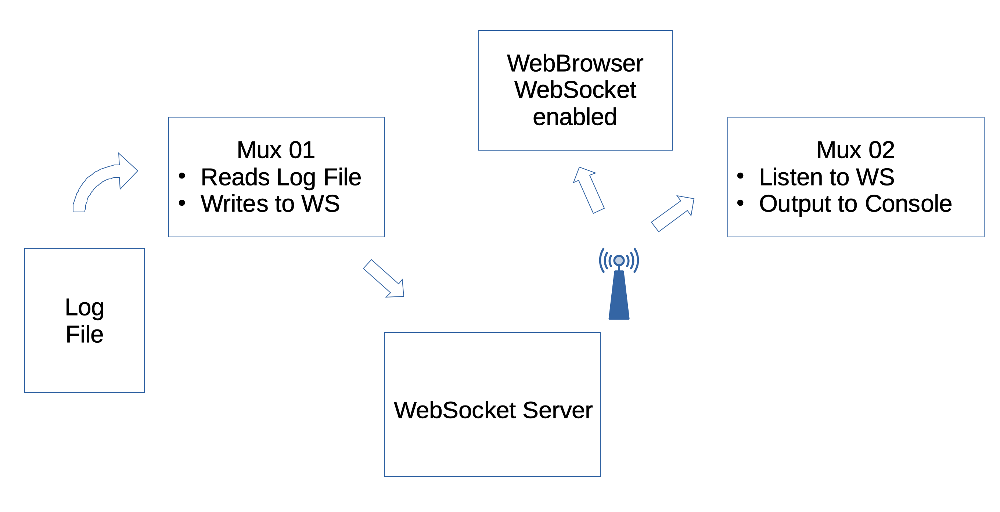

# A Note about WebSockets 

WebSocket is a protocol very similar to TCP, in that sense that it is connected (as opposed to HTTP,
which also uses TCP, but connects, executes, and disconnects, at each request), and remains connected
until the client explicitly requests a disconnection.

Once connected to a WebSocket server, a WebSocket client can
- push data to the WebSocket server
- receive data pushed _by_ the WebSocket server

The cool thing about WebSockets is that it is supported natively in all modern browsers.
A modern browser _**is**_ a potential WebSocket client.
As such, it can "push data to" and/or "receive data from" a WebSocket server.

It is the job of the server logic/implementation to decide what to do when a message is pushed to the
WebSocket server (rebroadcast to all other clients, to a specific client, log it, etc).

WebSocket server implementation are available in many languages, including Java and NodeJS.

### Example, use-case
The NMEA-Multiplexer can act as a REST or HTTP Server, but this is not mandatory.  
You could very well:
- Have _no_ REST or HTTP server enabled at the NMEA-Multiplexer level
- Read a Serial NMEA input from the NMEA-Multiplexer
- Push the NMEA Data to a WebSocket server, so every connected WebSocket client can get them.

#### Try it for yourself
We will use a NodeJS WebSocket server. Make sure `NodeJS` is installed.
```
$ cd NMEA-multiplexer
$ npm install    # To do once.
$ npm start
```
The `npm start` command is equivalent to a
```
$ node wsnmea.js
```
Alternatively, you may also try
```
$ node wsnmea.parser.js [-verbose]
```
> Warning: This last one `wsnmea.parser.js` rebroadcasts the full cache, which is NOT a valid
> NMEA String.

This should start the WebSocket/HTTP server.  
You could reach a client page from a web-socket savvy browser, at <http://localhost:9876/data/web/wsconsole.html>.

Then, from another console, in the same directory, after a build (`../gradlew shadowJar`)
```
$ ./mux.sh log.to.ws.yaml 
```
This reads a log file, and pushes the data to the WebSocket server.    
And those data should be received from the web page at <http://localhost:9876/data/web/wsconsole.html>.

Notice in [`log.to.ws.yaml`](./log.to.ws.yaml) that the HTTP Server is not enabled.
The `NMEA-multiplexer` just behaves as a pipeline.

#### Push-Pull sample
Here is an quick example showing how to _write_ NMEA Sentences using the WebSocket protocol, and
how to _read_ NMEA Sentences, using the WebSocket protocol.

This includes:
1. a WebSocket server
2. one multiplexer to enqueue NMEA sentences in the WebSocket server above
3. another multiplexer that receives the NMEA sentences enqueued previsouly

_**From three different terminals:**_

1. Start the WebSocket Server on port `9876` (also acts as a Web Server), on `NodeJS`:
   ```
    node wsnmea.js [-verbose] [-port:9876]
   ```
2. Start the first multiplexer, that reads a log file, and feed a WebSocket server with the retrieved NMEA Sentences:
   ```
    ./mux.sh log.to.ws.yaml
   ```
   The `yaml` file looks like this:
   ```yaml
   name: "NMEA, log replay, push to WS server"
   context:
   with.http.server: false
   channels:
   - type: file
     filename: ./sample.data/2010-11-08.Nuku-Hiva-Tuamotu.nmea.zip
     zip: true
     path.in.zip: 2010-11-08.Nuku-Hiva-Tuamotu.nmea
     verbose: false
   forwarders:
   - type: ws
     wsuri: ws://localhost:9876/
   ``` 
3. Start a second multiplexer, to receive the NMEA Sentences emitted by the WebSocket server above, and spit them out to the console:
   ```
    ./mux.sh ws.2.console.yaml 
   ```
   Its `yaml` file looks like that:
   ```yaml
   name: "NMEA, WS server to Console"
   context:
   with.http.server: false
   channels:
   - type: ws
     wsuri: ws://localhost:9876/
     verbose: false
   forwarders:
   - type: console
   ```

The `yaml` content is described in the [`manual`](./manual.md).



> _Important notes_:  
> - We use `NodeJS` to implement the WebSocket server, because it is light and easy to put to work.
>   Many other WebSocket servers exist, in many different languages.
> - The logic of the WebSocket server - implemented in ES6 in `wsnmea.js` - is quite essential here.
> - This is explicitly designed to:
>   - receive NMEA Sentences
>   - rebroadcast those NMEA Sentences to _all_ the connected WebSocket Clients.
>   - it _only_ manages character data, nothing binary (not required here)
> - The role of the WebSocket **consumer** is _only_ to listen to the WebSocket server it is connected to (with its WebSocket URI `wsuri`)
> - The role of the WebSocket **forwarder** is _only_ to enqueue NMEA Sentences to the WebSocket server it is connected to (with its WebSocket URI `wsuri`)
> 
All the components (the WebSocket server, the two multiplexers) can run on the same machine, 
or on separate machines, as long as they can see each other on the network. 

A web page displaying the data pushed out by the WebSocket server can be reached at <http://ws-machine:9876/data/web/wsconsole.html>, where
`ws-machine` is the name of the machine the WebSocket server runs on, and `9876` is the port it uses.

---
