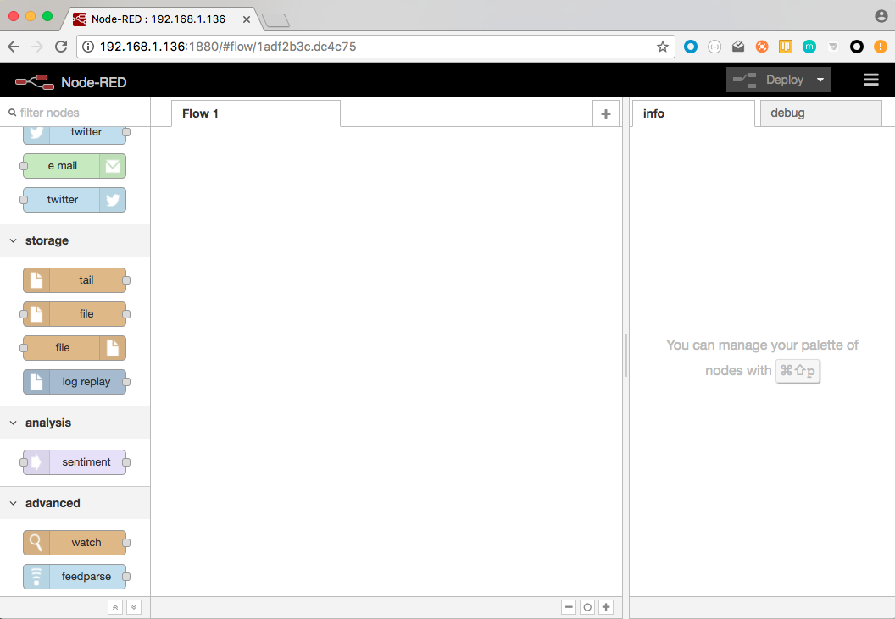
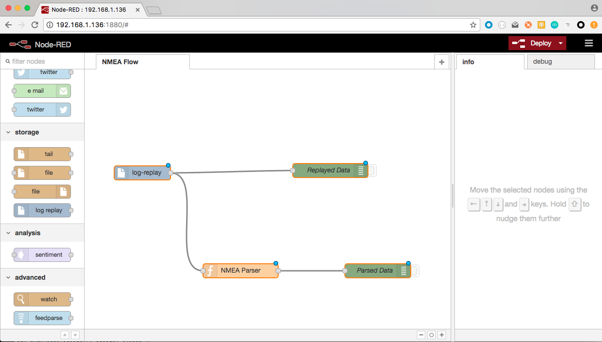
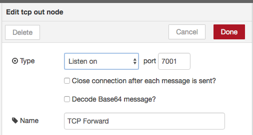
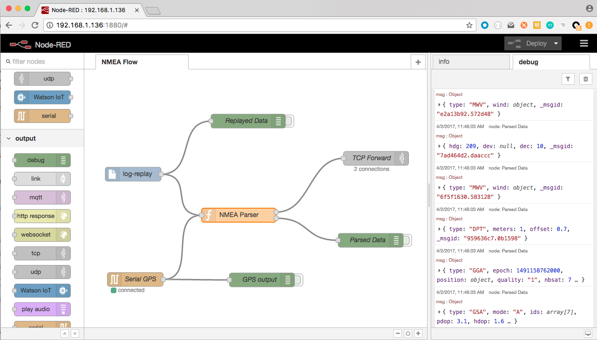
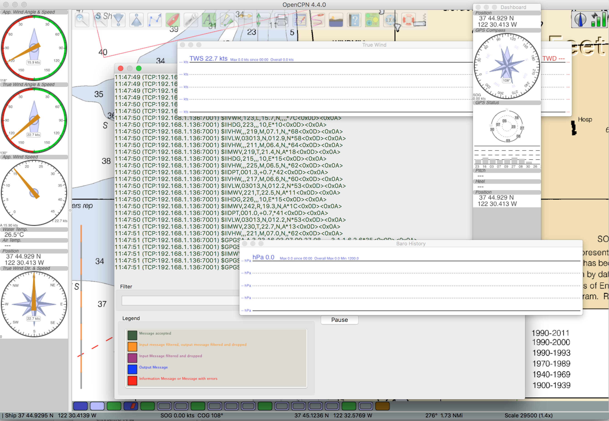

# Raspberry Pi Zero W
## Java Custom NMEA Multiplexer, or Node-RED ?

The Raspberry Pi Zero W is a small single-board computer that
- Runs Linux (Pixel, a clone of Jessie)
- Has 512 Mb of RAM
- Has a 40-pin GPIO Header
- Has a built-in WiFi (hence the **W**) and Bluetooth Low Energy (BLE) support.
- Costs $10.

As a Linux machine, it runs whatever a Linux machine can run (Python, Java and other JVM-based languages,
Node., Node-RED, etc).

We want to compare here the behavior of an NMEA Multiplexer based on Java (this project), and another
one - a prototype - based on Node-RED, specially the memory footprint.

## Multiplexer on Node-RED.

If not already there, Install [Node-RED](http://nodered.org/) on the Raspberry Pi.
Installation instructions for your platform are available [here](http://nodered.org/docs/getting-started/installation.html), and it comes
with Raspberry Pi goodies.

_March 2017_: Node-RED is already installed on the NOOBS Image. It also had some cool Nodes already available. A little drawback though: the version of Node.js is not a recent one.
I upgraded mine (Node v6.10.1, Npm 3.10.10, Node-RED core 0.16.2).

Among others:
- Serial
- RPi GPIO
- Sense HAT
- ...

Node-RED is based on Node.js, itself based on V8, the Google Chrome's OpenSource JavaScript engine.
As such, Node.js - and thus Node-RED - is programmable in JavaScript.
For those wondering, Java & Javascript are as related to each other as Ham & Hamburger (said _John Resig_).

To enable the replay of NMEA log file, we've created an extra node, available [here](https://github.com/OlivierLD/node.pi/tree/master/node-red).
> Reading a file in a synchronous way from JavaScript is not as trivial as it would sound.

To make sure we have equivalent features in both cases (Java & Node-RED), we also need an implementation in Node-RED of the features of
the BME280. More details about that soon.

_This document is still a work in progress..._

### Installation of the sample flow
Manually, for now. There is a way to package all that, I'll look into it later.

- Copy or move `NMEAParser.js` in `$HOME/.node-red`
```bash
$> scp NMEAParser.js pi@192.168.1.136:./.node-red
```

- On the Raspberry Pi where you have installed `Node-RED`, install `n-readlines`
```bash
 $> cd /usr/lib/node_modules/node-red
 $> sudo npm install n-readlines
```

- Then from the `$HOME/.node-red` directory, edit `settings.js`:
```bash
 $> vi settings.js
```
Make sure `functionGlobalContext` looks like this:
```json
functionGlobalContext: {
        os:require('os'),
        here:__dirname,
        NMEAParser:require('./NMEAParser.js')
    }
```
- Then, move or copy `log-replay.html` and `log-replay.js` in the `/usr/lib/node_modules/node-red/nodes` directory.
- Start `Node-RED`
```bash
 $> node-red-start
```
or more recently
```bash
 $> node-red-pi
```

- Then you can access `Node-RED` from a browser, like with [http://192.168.1.136:1880/](http://192.168.1.136:1880/). You should see
  a node named `log-replay` in the left pane, under the `storage` section.
  
- Then `import` the flow named `NMEA-Parser-flow.js`: Copy its content in the clipboard,
  
  Paste it in the box, click the `Import` button.
  
  See the flow, click `Deploy` at the top-right
  
  Your flow is running.
  

The function `NMEA Parser` is done this way:
```javascript
/*
 * Invoke the NMEA Parser mentioned in the Global settings.
 */
var parser = context.global.NMEAParser;
var processed;
if (parser !== undefined) {
    var nmeaSentence = msg.payload;
    var verbose = msg.verbose;

    if (verbose === true) {
        console.log("Raw data:", msg);
    }

    if (nmeaSentence !== undefined && nmeaSentence.trim().length > 0) {
        while (nmeaSentence.endsWith('\n') ||
        nmeaSentence.endsWith('\r')) {
            nmeaSentence = nmeaSentence.substring(0, nmeaSentence.length - 1);
        }
        var id;
        try {
            if (verbose === true) {
                console.log('Validating', nmeaSentence);
            }
            id = parser.validate(nmeaSentence); // Validation!
        } catch (err) {
            console.log('Validation error:', err);
        }
        if (verbose === true) {
            console.log("Sentence ID for " + nmeaSentence + ":", id);
        }
        if (id !== undefined) {
            if (id.talker === 'II' && (id.id === 'RMC' || id.id === 'GLL')) {
                // Skip, let the GPS do the job
            } else {
                try {
                    var autoparsed = parser.autoparse(nmeaSentence);
                    if (autoparsed !== undefined) {
                        processed = autoparsed;
                    }
                } catch (err) {
                    console.log('Parsing Error:', err);
                }
            }
        }
    }
} else {
    console.log("no NMEAParser was found.");
}
// console.log(">>> ", processed);
return processed;
```

### Development

- Add Serial input
  If you do not start the `Node-RED` server as `root`, you might need to change the owner of the Serial port:
```bash
 $> sudo chown pi /dev/ttyUSB1
```
  Then define a Serial input node as follow:

  

- Add TCP Output
  We also add a TCP output node, defined like this:

  

  We have also added a second output to the function, notice below the final `return` statement.
  Also notice that the message forwarded to the TCP node is a `json` object, with a `payload` member:
```json
  { payload: "$GPGSA,A,3,23,16,03,07,09,27,08,,,,,,2.7,1.5,2.3*34" }
```

  

  The function `NMEA Parser` has been modified like this:
```javascript
/*
 * Invoke the NMEA Parser mentioned in the Global settings.
 */
var parser = context.global.NMEAParser;
var nmea;
var processed;
if (parser !== undefined) {
    var nmeaSentence = msg.payload;
    var verbose = msg.verbose;

    if (verbose === true) {
        console.log("Raw data:", msg);
    }

    if (nmeaSentence !== undefined && nmeaSentence.trim().length > 0) {
        while (nmeaSentence.endsWith('\n') ||
        nmeaSentence.endsWith('\r')) {
            nmeaSentence = nmeaSentence.substring(0, nmeaSentence.length - 1);
        }
        var id;
        try {
            if (verbose === true) {
                console.log('Validating', nmeaSentence);
            }
            id = parser.validate(nmeaSentence); // Validation!
        } catch (err) {
            console.log('Validation error:', err);
        }
        if (verbose === true) {
            console.log("Sentence ID for " + nmeaSentence + ":", id);
        }
        if (id !== undefined) {
            if (id.talker === 'II' && (id.id === 'RMC' || id.id === 'GLL')) {
                // Skip, let the GPS do the job
            } else {
                try {
                    var autoparsed = parser.autoparse(nmeaSentence);
                    if (autoparsed !== undefined) {
                        nmea = { payload: nmeaSentence + "\r\n" };
                        processed = autoparsed;
                    }
                } catch (err) {
                    console.log('Parsing Error:', err);
                }
            }
        }
    }
} else {
    console.log("no NMEAParser was found.");
}
// console.log(">>> ", processed);
return [ nmea, processed];
```

`OpenCPN` is a Navigation software that can listen to a TCP port, it has no problem connecting to `Node-RED`.
See below, the data come from the log file _and_ from the Serial GPS.

  


### Debugging

- ~~Node-RED is lagging a bit behind, for now. The only tool you have is pretty much `console.log`...~~
- See [this article](https://discourse.nodered.org/t/how-to-debug-an-own-node-with-the-node-js-debugger/5737)...

## Summary
#### After comparing the Java implementation of the NMEA Multiplexer with what could be done with Node-RED

In both cases, programming skills are required, Java, or JavaScript. And no one is easier than the other.
The amount of code is much smaller with Node-RED. 
- All the Java IDEs support the Java Platform Debugging Architecture (JPDA), that allows local and remote debugging.
- NodeJS now also has debugging capabilities, allowing you to debug your own nodes.

The Node-RED implementation requires `NMEAParser.js`, counterpart of the `nmea.parser.StringParsers.java`.

The Java implementation allows several `properties` file to be written, and chosen at runtime. A given configuration can also
be dynamically modified, even if already running.
That is a bit less flexible with Node-RED.

The memory and resource footprint seem to be smaller in the Java case, which is not unexpected, as the Java implementation is dedicated to this Multiplexer,
Node-RED being way more generic.

###### Installation
 One `jar-file` for the Java version (requires `Java`), a couple of `npm` commands for Node-RED (requires `Node.js`).

###### Debugging Capabilities
 The Java version has all the debugging features that come with Java. Node-RED now benefits from the debugging capabilities of NodeJS.

###### Ease of Configuration
 The Web UI of Node-RED is an asset. As it is now, the Java version requires more typing and coding.

###### Sustainability
 Node-RED is a product, with a development team behind it...

###### Resources footprint
 For equivalent features at runtime, the Java version has a quite smaller memory and CPU footprint.


#### Conclusion?
I like both. Even if I have written the Java implementation myself, Node-RED also has some very cool features out-of-the-box.

One thing I find important though: In the case of the Java Multiplexer, whatever comes in or goes out is a _pure_ `NMEA` String (except when transforming them for a specific client, of course).
I'm a bit reluctant to come up with a specific shape for those objects. Whatever archaic it can look like, `NMEA` is a well defined standard that is well understood and documented.

Lingos like `GPSd` or `SignalK` have good reasons to exist, but you have to comply with yet another way to read their data if you want to see what's in there...

I'd rather stick to `NMEA`.

Note that even if it is happy with `json`, Node-RED has no problem dealing with `NMEA` Strings.

Another cool thing is that the Java NMEA Multiplexer and Node-RED can seamlessly co-exist.

## AIS
See [this document](https://github.com/OlivierLD/raspberry-coffee/tree/master/Project-Trunk/dAISy).

It is also easy to setup the `dAISy HAT` on a Raspberry Pi. I've used a Raspberry Pi A+, it has the same size as the HAT.
I run an `NMEA-Multiplexer` with a configuration file like this:
```yaml
name: "With AIS, and a REST forwarder"
context:
  with.http.server: false
  #http.port: 9999
  #init.cache: true
channels:
  - type: serial
    # AIS
    port: /dev/ttyS80
    baudrate: 38400
    verbose: true
forwarders:
  - type: rest
    server.name: 192.168.42.6
    server.port: 9999
    rest.resource: /mux/nmea-sentence
    rest.verb: POST
    http.headers: Content-Type:plain/text
    verbose: true
``` 
This one is reading the AIS Hat, and uses a `rest` forwarder to send those
AIS sentences on another Multiplexer, using the implicit REST consumer to receive those data.
This is just an example, in case the AIS and NMEA channels are read on distinct machines.

The Implicit REST consumer is reached like this:
```
POST /mux/nmea-sentence -h "Content-Type: plain/text" -d "$GPRMC,....."
```

### 3D Printed enclosure
See <https://github.com/OlivierLD/3DPrinting/tree/master/OpenSCAD/RPiA%2BdAISyHAT> for `stl` files and pictures.

We have:
- A Raspberry Pi (whatever model) running a `RESTNavServer` (address `192.168.42.6`), it has an implicit REST consumer, on port `9999`.
- The `dAISy HAT` attached to a Raspberry Pi A+ (address `192.168.42.33`), reading the HAT and POSTing the AIS sentences to `http://192.168.42.6:9999/mux/nmea-sentence` (see the config file above).
- The Raspberry Pi running a `RESTNavServer` also has a `TCP` forwarder, on port `7002`, used by OpenCPN (wherever it runs)


Again, this is just a configuration example. Nothing is preventing the `dAISy HAT` from being attached to the
Raspberry Pi at `192.168.42.6`.  
 
---
_March, April 2017, January 2020_

