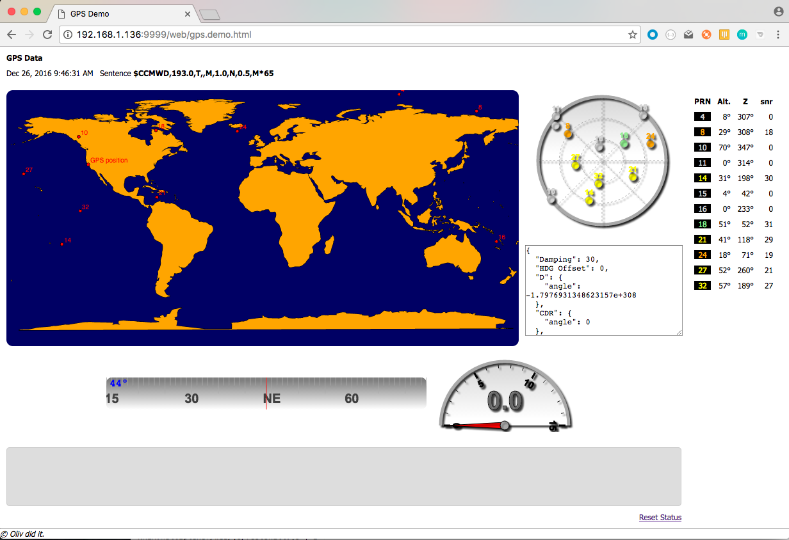

# Demos

---

[<< Back](./README.md)

---

All the demos can be started from the page at [http://localhost:9999/web/index.html](http://localhost:9999/web/index.html).

---

Plug a GPS on the Serial Port, start the multiplexer, and launch [http://localhost:9999/web/gps.demo.html](http://localhost:9999/web/gps.demo.html) in a browser.
This is pinging (AJAX) the `/mux/cache` REST service every second.

Satellites are displayed on the chart, and on the right pane.
When available, Speed Over Ground and Course Over Ground are displayed too.

_This one does **not** require an Internet connection_.

---

With Google Maps (requires an Internet connection):

---

With [LeafletJS](http://leafletjs.com) (requires an Internet connection):

---
