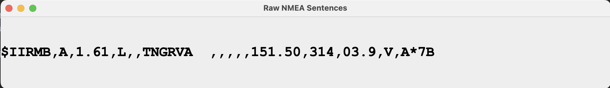
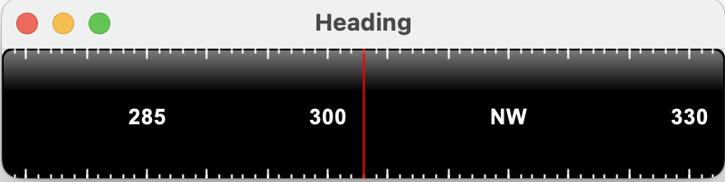
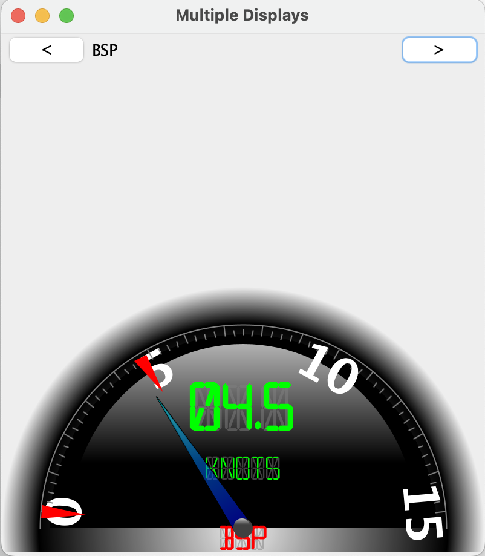
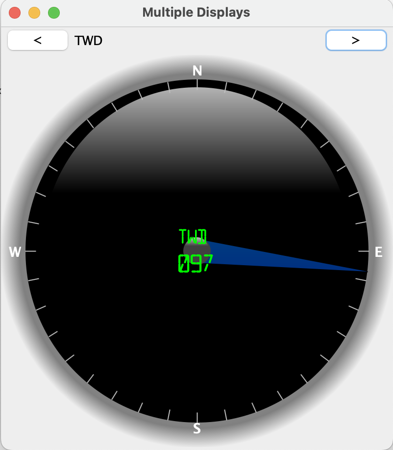
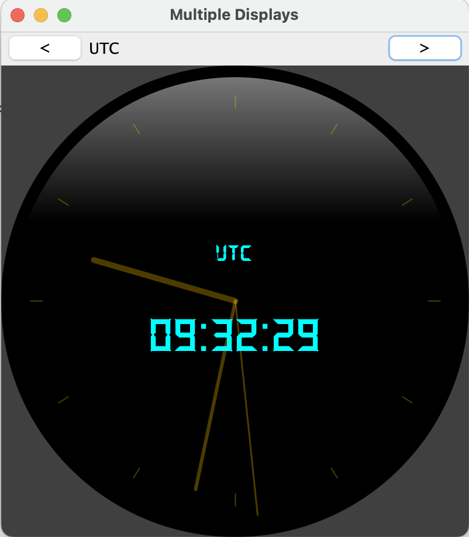

# Java Clients

Contains some Swing components for display.

- TCP Clients
  - `clients.tcp.NMEATCPClient`
    - No GUI, console output.
    - Requires an NMEA-multiplexer to be running, with a TCP forwarder on port `7001`.
  - `clients.tcp.NMEATCPSwing101`
    - Same as above, with a (very basic) Swing GUI.  
      
  - `clients.tcp.NMEATCPSwingHeading`
    - Display the Heading, using a custom Swing Component.  
      
  - `clients.tcp.NMEATCPSwingMultiDisplay`
    - WiP. Several widgets to scroll through, in the same frame (HDG, TWD, UTC, BSP, POS)

      | Boat Speed                 | True Wind Direction        | UTC Clock                  |
      |:--------------------------:|:--------------------------:|:--------------------------:|
      |  |  |  | 

---
