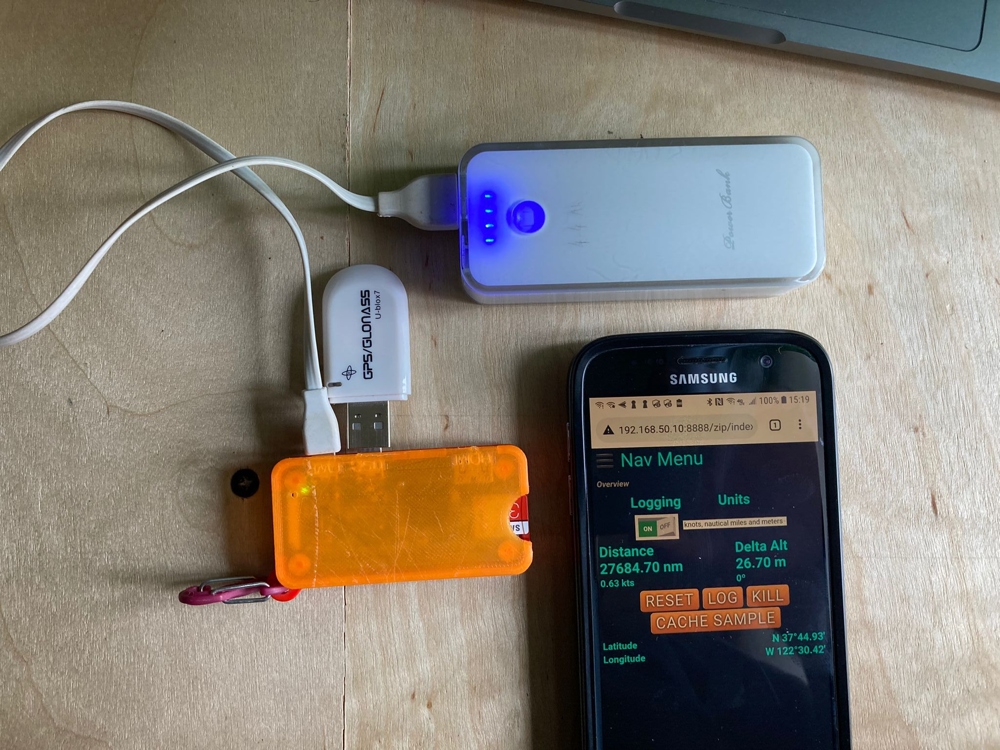

# No Code at all!
See in the `build.gradle`, this project only involves the `NMEA-multiplexer`.

It's all driven by `nmea.mux.gps.log.properties` or `nmea.mux.gps.log.yaml` (they are equivalent).

With _optional_ Web user interface.

> TODO: 
> - Add Optional TCP Forwarder ?
> - To try: HTTP Port provided during the build.

