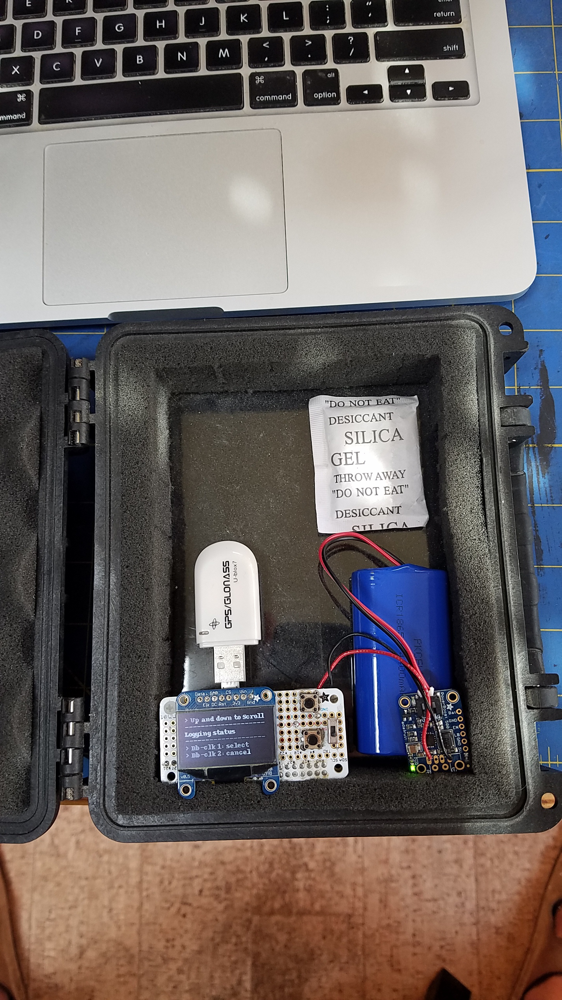
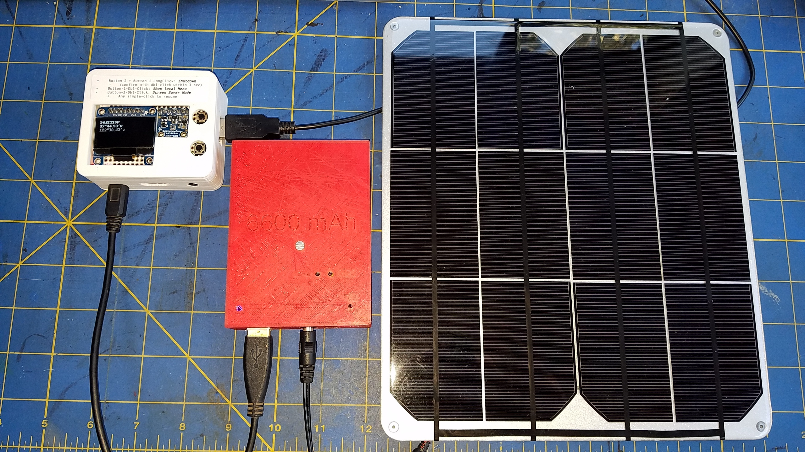

# Case Study (WIP) NMEA Multiplexer running on a Raspberry Pi Zero W, and others
> - Raspberry Zero W and Higher
> - Can emit its own network
> - Two push-buttons for User Interface
> - One OLED Screen
> - Web UI served from the same device - accessible from any browser, running on another device on the same network (cell-phone, tablet, laptop,...)
> - Optional BME280 (Temperature, pressure, humidity)
> - File Logger (with WebUI, logged data can be downloaded from it)
> - Optional TCP forwarder

This is a case study, using different hardware configurations to run the same software configuration (the NMEA Multiplexer).

For the hardware details, see [here](../full-server-extended-v2/README.md), as it is the exact same one as in this project.

This example shows how to _**extend**_  the `GenericNMEAMultiplexer`.

Other examples in this project will also show how to extend the `NavServer`, with more features (like Tide Computations, Astronomical Computing, and so).
Here we _only_ extends the `GenericNMEAMultiplexer`, we read NMEA Data from a Serial port and some small breakout boards, display them
on a small screen, log them, forward them on TCP, etc.

It also shows how to add features like **TWO** push-buttons, and take ownership of a screen (Nokia, SSD1306...)

It comes with a class named `mux.MultiplexerWithTwoButtons`, that extends the `nmea.mux.GenericNMEAMultiplexer`.
As a result, it's driven by the exact same `properties` or `yaml` file.

To see how to interact with the buttons (to start and stop the logging for example, or
to shutdown the whole server), look for the variables named `buttonOne` and `buttonTwo`.

Implements `simple-click`, `double-click`, and `long-click`.

```java
	final static PushButtonController buttonOne = new PushButtonController();
	final static PushButtonController buttonTwo = new PushButtonController();
```

> Note: the code to add here is just there for the buttons management. There is _absolutely no code_
> to add for the `BME280`, the GPS, or the `SSD1306` screen. It is all taken care of by the properties files.

> See `nmea.mux.gps.log.properties` or `nmea.mux.gps.log.yaml` to know how to reference those devices, and 
> `ssd1306.properties` to see how to choose the data to display on the oled screen. 

This is built just like the other examples in this module, just run
```
 $ ./builder.sh
 ```
and follow the instructions in the console.   
Look into the script for technical details, nothing's hidden.

---

See pictures [here](../full-server-extended-v2/README.md#a-first-prototype). 

---

### Configurations
All Raspberry Pi models mentioned below can do the job.

#### [Raspberry Pi Zero W](https://www.raspberrypi.org/products/raspberry-pi-zero-w/)
RAM: 512 Mb
#### [Raspberry Pi 3 A+](https://www.raspberrypi.org/products/raspberry-pi-3-model-a-plus/)
RAM: 512 Mb
#### [Raspberry Pi 3 B](https://www.raspberrypi.org/products/raspberry-pi-3-model-b-plus/)
#### [Raspberry Pi 3 B+](https://www.raspberrypi.org/products/raspberry-pi-3-model-b-plus/)
RAM: 1Gb
#### [Raspberry Pi 4 B](https://www.raspberrypi.org/products/raspberry-pi-4-model-b/)
With 4Gb or 8Gb of RAM

Emits its own network. Reachable from other devices (laptops, tablets, smart-phones, smart-watches)
through all available channels (ssh, vnc, tcp, http, etc).
No attached screen required, as ssh and VNC can do the job remotely.

### Examples

Raspberry Pi Zero W, 1 bonnet with a 128x64 oled screen and 2 push-buttons and one power switch, a 4400 mAh LiPo battery,
all in a small waterproof case. The GPS is a `U-blox7`, small USB dongle.
Good for all terrain logging!



Raspberry Pi A+, with a 3D-printed enclosure, Solar power supply. 
- See [here](https://learn.adafruit.com/solar-boost-bag).



- 3D files [here](https://github.com/OlivierLD/3DPrinting/tree/master/OpenSCAD/RPiA%2BLogger) and [here](https://github.com/OlivierLD/3DPrinting/tree/master/OpenSCAD/Battery.Cases).


> _Note_: As this configuration provides a way for the user to interact with the system, the logging is not starting as the machine starts.
> In the script `mux.sh`, the system variable `process.on.start` is set to false:
>```
>JAVA_OPTIONS="$JAVA_OPTIONS -Dprocess.on.start=false"
>```
> The logging is started by the user with the push buttons, there is a `Resume logging` item in the `user menu`. 

### A Docker image?
It's possible to run directly from a Docker image, see [here](../../docker/README.md#pre-defined-docker-images) for inspiration, option `6`.

### Miscellaneous and various stuff 
Funny REST client [here](https://github.com/OlivierLD/small-boards/tree/master/M5StickC)... 

Sample console output with an LSM303
```
$BMXDR,H,40.3,P,0,C,25.7,C,1,P,102093,P,2*64
$BMMDA,30.148,I,1.021,B,25.7,C,,,40.3,,,,,,,,,,,*34
$BMMTA,25.7,C*0A
$BMMMB,30.1516,I,1.0209,B*7C
$GNRMC,202957.00,A,3744.93346,N,12230.41391,W,0.017,,041019,,,D*7A
$GNVTG,,T,,M,0.017,N,0.031,K,D*3C
$GNGGA,202957.00,3744.93346,N,12230.41391,W,2,12,1.07,15.8,M,-29.9,M,,0000*4D
$LSHDM,326,M*24
$GNGSA,A,3,20,21,10,32,15,14,51,27,,,,,1.74,1.07,1.37*1C
$GNGSA,A,3,66,81,82,67,,,,,,,,,1.74,1.07,1.37*1F
$GPGSV,4,1,13,08,30,308,23,10,70,353,19,14,28,198,27,15,05,042,20*7B
$GPGSV,4,2,13,16,01,233,,18,06,307,,20,53,051,39,21,45,117,36*78
$GPGSV,4,3,13,24,19,074,,27,53,264,25,32,54,190,33,46,46,191,35*72
$GPGSV,4,4,13,51,43,156,34*4D
$GLGSV,3,1,09,66,29,035,30,67,73,328,27,68,33,240,,74,01,059,*6F
$GLGSV,3,2,09,75,01,027,,76,00,071,,81,39,152,36,82,85,304,20*6E
$GLGSV,3,3,09,83,33,329,*5F
$GNGLL,3744.93346,N,12230.41391,W,202957.00,A,D*68
$LSXDR,A,-4,D,PTCH,A,-1,D,ROLL*46
$BMXDR,H,40.3,P,0,C,25.7,C,1,P,102091,P,2*66
$BMMDA,30.147,I,1.021,B,25.7,C,,,40.3,,,,,,,,,,,*3B
$BMMTA,25.7,C*0A
$GNRMC,202958.00,A,3744.93346,N,12230.41394,W,0.049,,041019,,,D*7B
$GNVTG,,T,,M,0.049,N,0.090,K,D*3C
$GNGGA,202958.00,3744.93346,N,12230.41394,W,2,12,1.07,15.8,M,-29.9,M,,0000*47
$GNGSA,A,3,20,21,10,32,15,14,51,27,,,,,1.74,1.07,1.37*1C
$GNGSA,A,3,66,81,82,67,,,,,,,,,1.74,1.07,1.37*1F
$GPGSV,4,1,13,08,30,308,23,10,70,353,19,14,28,198,27,15,05,042,20*7B
$GPGSV,4,2,13,16,01,233,,18,06,307,,20,53,051,39,21,45,117,35*7B
$GPGSV,4,3,13,24,19,074,,27,53,264,26,32,54,190,33,46,46,191,35*71
$GPGSV,4,4,13,51,43,156,34*4D
$GLGSV,3,1,09,66,29,035,30,67,73,328,27,68,33,240,,74,01,059,*6F
$GLGSV,3,2,09,75,01,027,,76,00,071,,81,39,152,36,82,85,304,19*64
$GLGSV,3,3,09,83,33,329,*5F
$GNGLL,3744.93346,N,12230.41394,W,202958.00,A,D*62
$BMMMB,30.1509,I,1.0209,B*72
$LSHDM,326,M*24
$LSXDR,A,-5,D,PTCH,A,-1,D,ROLL*47
$GNRMC,202959.00,A,3744.93345,N,12230.41392,W,0.027,,041019,,,D*77
$GNVTG,,T,,M,0.027,N,0.050,K,D*38
$GNGGA,202959.00,3744.93345,N,12230.41392,W,2,12,1.07,16.0,M,-29.9,M,,0000*48
$GNGSA,A,3,20,21,10,32,15,14,51,27,,,,,1.74,1.07,1.37*1C
$GNGSA,A,3,66,81,82,67,,,,,,,,,1.74,1.07,1.37*1F
$GPGSV,4,1,13,08,30,308,23,10,70,353,19,14,28,198,27,15,05,042,20*7B
$GPGSV,4,2,13,16,01,233,,18,06,307,,20,53,051,39,21,45,117,35*7B
$GPGSV,4,3,13,24,19,074,,27,53,264,26,32,54,190,34,46,46,191,35*76
$GPGSV,4,4,13,51,43,156,34*4D
$GLGSV,3,1,09,66,29,035,30,67,73,328,27,68,33,240,,74,01,059,*6F
$GLGSV,3,2,09,75,01,027,,76,00,071,,81,39,152,36,82,85,304,19*64
$GLGSV,3,3,09,83,33,329,*5F
$GNGLL,3744.93345,N,12230.41392,W,202959.00,A,D*66
$LSHDM,326,M*24
$LSXDR,A,-4,D,PTCH,A,-1,D,ROLL*46
$BMXDR,H,40.3,P,0,C,25.7,C,1,P,102089,P,2*6F
$BMMDA,30.147,I,1.021,B,25.7,C,,,40.3,,,,,,,,,,,*3B
$BMMTA,25.7,C*0A
$BMMMB,30.1505,I,1.0209,B*7E
$GNRMC,203000.00,A,3744.93346,N,12230.41390,W,0.036,,041019,,,D*72
$GNVTG,,T,,M,0.036,N,0.067,K,D*3C
$GNGGA,203000.00,3744.93346,N,12230.41390,W,2,12,1.07,16.1,M,-29.9,M,,0000*4C
$GNGSA,A,3,20,21,10,32,15,14,51,27,,,,,1.74,1.07,1.37*1C
$GNGSA,A,3,66,81,82,67,,,,,,,,,1.74,1.07,1.37*1F
$GPGSV,4,1,13,08,30,308,23,10,70,353,19,14,28,198,27,15,05,042,19*71
$LSHDM,326,M*24
$GPGSV,4,2,13,16,01,233,,18,06,307,,20,53,051,39,21,45,117,35*7B
$GPGSV,4,3,13,24,19,074,,27,53,264,26,32,54,190,34,46,46,191,35*76
$GPGSV,4,4,13,51,43,156,34*4D
$GLGSV,3,1,09,66,29,035,30,67,73,328,27,68,33,240,,74,01,059,*6F
$GLGSV,3,2,09,75,01,027,,76,00,071,,81,39,152,35,82,85,304,19*67
$GLGSV,3,3,09,83,33,329,*5F
$GNGLL,3744.93346,N,12230.41390,W,203000.00,A,D*63
$LSXDR,A,-4,D,PTCH,A,-1,D,ROLL*46
$BMXDR,H,40.3,P,0,C,25.7,C,1,P,102089,P,2*6F
$BMMDA,30.147,I,1.021,B,25.7,C,,,40.3,,,,,,,,,,,*3B
$BMMTA,25.7,C*0A
$BMMMB,30.1502,I,1.0209,B*79
$GNRMC,203001.00,A,3744.93346,N,12230.41388,W,0.024,,041019,,,D*79
$GNVTG,,T,,M,0.024,N,0.044,K,D*3E
$GNGGA,203001.00,3744.93346,N,12230.41388,W,2,12,1.07,16.2,M,-29.9,M,,0000*47
$GNGSA,A,3,20,21,10,32,15,14,51,27,,,,,1.74,1.07,1.37*1C
$GNGSA,A,3,66,81,82,67,,,,,,,,,1.74,1.07,1.37*1F
$GPGSV,4,1,13,08,30,308,23,10,70,353,20,14,28,198,27,15,05,042,19*7B
$GPGSV,4,2,13,16,01,233,,18,06,307,,20,53,051,39,21,45,117,35*7B
$LSHDM,326,M*24
$GPGSV,4,3,13,24,19,074,,27,53,264,27,32,54,190,33,46,46,191,35*70
$GPGSV,4,4,13,51,43,156,34*4D
$GLGSV,3,1,09,66,28,035,30,67,73,328,26,68,33,240,,74,01,059,*6F
$LSXDR,A,-4,D,PTCH,A,-1,D,ROLL*46
$GLGSV,3,2,09,75,01,027,,76,00,071,,81,39,152,36,82,85,304,19*64
$GLGSV,3,3,09,83,33,329,*5F
$GNGLL,3744.93346,N,12230.41388,W,203001.00,A,D*6B
$BMXDR,H,40.3,P,0,C,25.7,C,1,P,102090,P,2*67
$BMMDA,30.147,I,1.021,B,25.7,C,,,40.3,,,,,,,,,,,*3B
$BMMTA,25.7,C*0A
$BMMMB,30.1507,I,1.0209,B*7C
$GNRMC,203002.00,A,3744.93345,N,12230.41386,W,0.041,,041019,,,D*74
$GNVTG,,T,,M,0.041,N,0.075,K,D*3F
$GNGGA,203002.00,3744.93345,N,12230.41386,W,2,12,1.07,16.3,M,-29.9,M,,0000*48
$GNGSA,A,3,20,21,10,32,15,14,51,27,,,,,1.74,1.07,1.37*1C
$GNGSA,A,3,66,81,82,67,,,,,,,,,1.74,1.07,1.37*1F
$GPGSV,4,1,13,08,30,308,24,10,70,353,23,14,28,198,28,15,05,042,20*7A
$GPGSV,4,2,13,16,01,233,,18,06,307,,20,53,051,39,21,45,117,35*7B
$GPGSV,4,3,13,24,19,074,,27,53,264,27,32,54,190,33,46,46,191,35*70
$GPGSV,4,4,13,51,43,156,35*4C
$GLGSV,3,1,09,66,28,035,29,67,73,331,27,68,33,240,,74,01,059,*6E
$GLGSV,3,2,09,75,01,027,,76,00,071,,81,39,152,35,82,85,304,19*67
$GLGSV,3,3,09,83,33,329,*5F
$GNGLL,3744.93345,N,12230.41386,W,203002.00,A,D*65
$LSHDM,326,M*24
$LSXDR,A,-4,D,PTCH,A,-1,D,ROLL*46
$BMXDR,H,40.2,P,0,C,25.7,C,1,P,102090,P,2*66
$BMMDA,30.147,I,1.021,B,25.7,C,,,40.2,,,,,,,,,,,*3A
$BMMTA,25.7,C*0A
$BMMMB,30.1505,I,1.0209,B*7E
$GNRMC,203003.00,A,3744.93346,N,12230.41389,W,0.046,,041019,,,D*7E
$GNVTG,,T,,M,0.046,N,0.085,K,D*37
$GNGGA,203003.00,3744.93346,N,12230.41389,W,2,12,1.07,16.4,M,-29.9,M,,0000*42
$GNGSA,A,3,20,21,10,32,15,14,51,27,,,,,1.74,1.07,1.37*1C
$GNGSA,A,3,66,81,82,67,,,,,,,,,1.74,1.07,1.37*1F
$GPGSV,4,1,13,08,30,308,24,10,70,353,23,14,28,198,28,15,05,042,20*7A
$GPGSV,4,2,13,16,01,233,,18,06,307,,20,53,051,39,21,45,117,35*7B
$GPGSV,4,3,13,24,19,074,,27,53,264,27,32,54,190,34,46,46,191,35*77
$GPGSV,4,4,13,51,43,156,35*4C
$GLGSV,3,1,09,66,28,035,30,67,73,331,27,68,33,240,,74,01,059,*66
$GLGSV,3,2,09,75,01,027,,76,00,071,,81,39,152,35,82,85,304,19*67
$GLGSV,3,3,09,83,33,329,*5F
$GNGLL,3744.93346,N,12230.41389,W,203003.00,A,D*68
$LSHDM,326,M*24
$LSXDR,A,-4,D,PTCH,A,-1,D,ROLL*46
$BMXDR,H,40.2,P,0,C,25.7,C,1,P,102090,P,2*66
$BMMDA,30.147,I,1.021,B,25.7,C,,,40.2,,,,,,,,,,,*3A
$BMMTA,25.7,C*0A
$BMMMB,30.1506,I,1.0209,B*7D
$GNRMC,203004.00,A,3744.93344,N,12230.41387,W,0.081,,041019,,,D*7E
$GNVTG,,T,,M,0.081,N,0.150,K,D*35
$GNGGA,203004.00,3744.93344,N,12230.41387,W,2,12,1.07,16.4,M,-29.9,M,,0000*49
$GNGSA,A,3,20,21,10,32,15,14,51,27,,,,,1.74,1.07,1.37*1C
$GNGSA,A,3,66,81,82,67,,,,,,,,,1.74,1.07,1.37*1F
$GPGSV,4,1,13,08,30,308,24,10,70,353,22,14,28,198,28,15,05,042,20*7B
$GPGSV,4,2,13,16,01,233,,18,06,307,,20,53,051,39,21,45,117,35*7B
$GPGSV,4,3,13,24,19,074,,27,53,264,27,32,54,190,34,46,46,191,35*77
$GPGSV,4,4,13,51,43,156,35*4C
$GLGSV,3,1,09,66,28,035,30,67,73,331,27,68,33,240,,74,01,059,*66
$GLGSV,3,2,09,75,01,027,,76,00,071,,81,39,152,35,82,85,304,19*67
$GLGSV,3,3,09,83,33,329,*5F
$GNGLL,3744.93344,N,12230.41387,W,203004.00,A,D*63
$LSHDM,326,M*24
$LSXDR,A,-4,D,PTCH,A,-1,D,ROLL*46
$BMXDR,H,40.2,P,0,C,25.7,C,1,P,102091,P,2*67
$BMMDA,30.147,I,1.021,B,25.7,C,,,40.2,,,,,,,,,,,*3A
$BMMTA,25.7,C*0A
$BMMMB,30.1508,I,1.0209,B*73
$GNRMC,203005.00,A,3744.93342,N,12230.41388,W,0.047,,041019,,,D*7C
$GNVTG,,T,,M,0.047,N,0.087,K,D*34
$GNGGA,203005.00,3744.93342,N,12230.41388,W,2,12,1.07,16.4,M,-29.9,M,,0000*41
$GNGSA,A,3,20,21,10,32,15,14,51,27,,,,,1.74,1.07,1.37*1C
$GNGSA,A,3,66,81,82,67,,,,,,,,,1.74,1.07,1.37*1F
$GPGSV,4,1,13,08,30,308,24,10,70,353,21,14,28,198,28,15,05,042,20*78
$GPGSV,4,2,13,16,01,233,,18,06,307,,20,53,051,39,21,45,117,35*7B
$GPGSV,4,3,13,24,19,074,,27,53,264,27,32,54,190,34,46,46,191,35*77
$GPGSV,4,4,13,51,43,156,35*4C
$GLGSV,3,1,09,66,28,035,30,67,73,331,27,68,33,240,,74,01,059,*66
$GLGSV,3,2,09,75,01,027,,76,00,071,,81,39,152,35,82,85,304,19*67
$GLGSV,3,3,09,83,33,329,*5F
$GNGLL,3744.93342,N,12230.41388,W,203005.00,A,D*6B
$LSHDM,326,M*24
$LSXDR,A,-4,D,PTCH,A,-1,D,ROLL*46
$BMXDR,H,40.2,P,0,C,25.7,C,1,P,102091,P,2*67
$BMMDA,30.148,I,1.021,B,25.7,C,,,40.2,,,,,,,,,,,*35
$BMMTA,25.7,C*0A
$BMMMB,30.1510,I,1.0209,B*7A
$GNRMC,203006.00,A,3744.93343,N,12230.41388,W,0.080,,041019,,,D*75
$GNVTG,,T,,M,0.080,N,0.147,K,D*32
$GNGGA,203006.00,3744.93343,N,12230.41388,W,2,12,1.07,16.3,M,-29.9,M,,0000*44
$GNGSA,A,3,20,21,10,32,15,14,51,27,,,,,1.74,1.07,1.37*1C
$GNGSA,A,3,66,81,82,67,,,,,,,,,1.74,1.07,1.37*1F
$GPGSV,4,1,13,08,30,308,24,10,70,353,22,14,28,198,28,15,05,042,20*7B
$GPGSV,4,2,13,16,01,233,,18,06,307,,20,53,051,39,21,45,117,35*7B
$GPGSV,4,3,13,24,19,074,,27,53,264,27,32,54,190,34,46,46,191,35*77
$GPGSV,4,4,13,51,43,156,35*4C
$GLGSV,3,1,09,66,28,035,30,67,73,331,27,68,33,240,,74,01,059,*66
$GLGSV,3,2,09,75,01,027,,76,00,071,,81,39,152,35,82,85,304,18*66
$GLGSV,3,3,09,83,33,329,*5F
$GNGLL,3744.93343,N,12230.41388,W,203006.00,A,D*69
$LSHDM,326,M*24
$LSXDR,A,-4,D,PTCH,A,-1,D,ROLL*46
$BMXDR,H,40.2,P,0,C,25.7,C,1,P,102090,P,2*66
$BMMDA,30.147,I,1.021,B,25.7,C,,,40.2,,,,,,,,,,,*3A
$BMMTA,25.7,C*0A
$BMMMB,30.1507,I,1.0209,B*7C
$GNRMC,203007.00,A,3744.93341,N,12230.41389,W,0.094,,041019,,,D*72
$GNVTG,,T,,M,0.094,N,0.174,K,D*37
$GNGGA,203007.00,3744.93341,N,12230.41389,W,2,12,1.07,16.5,M,-29.9,M,,0000*40
$GNGSA,A,3,20,21,10,32,15,14,51,27,,,,,1.74,1.07,1.37*1C
$GNGSA,A,3,66,81,82,67,,,,,,,,,1.74,1.07,1.37*1F
$GPGSV,4,1,13,08,30,308,23,10,70,353,22,14,28,198,28,15,05,042,20*7C
$GPGSV,4,2,13,16,01,233,,18,06,307,,20,53,051,39,21,45,117,35*7B
$GPGSV,4,3,13,24,19,074,,27,53,264,27,32,54,190,34,46,46,191,35*77
$GPGSV,4,4,13,51,43,156,35*4C
$GLGSV,3,1,09,66,28,035,30,67,73,331,27,68,33,240,,74,01,059,*66
$GLGSV,3,2,09,75,01,027,,76,00,071,,81,39,152,35,82,85,304,17*69
$GLGSV,3,3,09,83,33,329,*5F
$GNGLL,3744.93341,N,12230.41389,W,203007.00,A,D*6B
$LSHDM,326,M*24
$LSXDR,A,-4,D,PTCH,A,-2,D,ROLL*45
$GNRMC,203008.00,A,3744.93340,N,12230.41392,W,0.059,,041019,,,D*77
$GNVTG,,T,,M,0.059,N,0.109,K,D*3C
$GNGGA,203008.00,3744.93340,N,12230.41392,W,2,12,1.07,16.6,M,-29.9,M,,0000*47
$GNGSA,A,3,20,21,10,32,15,14,51,27,,,,,1.74,1.07,1.37*1C
$GNGSA,A,3,66,81,82,67,,,,,,,,,1.74,1.07,1.37*1F
$GPGSV,4,1,13,08,30,308,23,10,70,353,23,14,28,198,28,15,05,042,20*7D
$GPGSV,4,2,13,16,01,233,,18,06,307,,20,53,051,39,21,45,117,34*7A
$GPGSV,4,3,13,24,19,074,20,27,53,264,27,32,54,190,33,46,46,191,35*72
$GPGSV,4,4,13,51,43,156,35*4C
$GLGSV,3,1,09,66,28,035,29,67,73,331,27,68,33,240,,74,01,059,*6E
$GLGSV,3,2,09,75,01,027,,76,00,071,,81,39,152,35,82,85,304,18*66
$LSHDM,326,M*24
$GLGSV,3,3,09,83,33,329,*5F
$GNGLL,3744.93340,N,12230.41392,W,203008.00,A,D*6F
$LSXDR,A,-4,D,PTCH,A,-1,D,ROLL*46
$BMXDR,H,40.2,P,0,C,25.7,C,1,P,102091,P,2*67
$BMMDA,30.148,I,1.021,B,25.7,C,,,40.2,,,,,,,,,,,*35
$BMMTA,25.7,C*0A
$BMMMB,30.1511,I,1.0209,B*7B
$GNRMC,203009.00,A,3744.93338,N,12230.41393,W,0.046,,041019,,,D*76
$GNVTG,,T,,M,0.046,N,0.085,K,D*37
$GNGGA,203009.00,3744.93338,N,12230.41393,W,2,12,1.07,16.9,M,-29.9,M,,0000*47
$GNGSA,A,3,20,21,10,32,15,14,51,27,,,,,1.74,1.07,1.37*1C
$GNGSA,A,3,66,81,82,67,,,,,,,,,1.74,1.07,1.37*1F
$GPGSV,4,1,13,08,30,308,24,10,70,353,23,14,28,198,28,15,05,042,20*7A
$GPGSV,4,2,13,16,01,233,,18,06,307,,20,53,051,39,21,45,117,34*7A
$GPGSV,4,3,13,24,19,074,19,27,53,264,28,32,54,190,33,46,46,191,35*77
$GPGSV,4,4,13,51,43,156,35*4C
$GLGSV,3,1,09,66,28,035,29,67,73,331,27,68,33,240,,74,02,059,*6D
$GLGSV,3,2,09,75,01,027,,76,00,071,,81,38,152,35,82,85,304,18*67
$GLGSV,3,3,09,83,33,329,*5F
$GNGLL,3744.93338,N,12230.41393,W,203009.00,A,D*60
$LSHDM,326,M*24
$LSXDR,A,-5,D,PTCH,A,-1,D,ROLL*47
$BMXDR,H,40.2,P,0,C,25.7,C,1,P,102094,P,2*62
$BMMDA,30.148,I,1.021,B,25.7,C,,,40.2,,,,,,,,,,,*35
$BMMTA,25.7,C*0A
$BMMMB,30.1518,I,1.0209,B*72
$GNRMC,203010.00,A,3744.93340,N,12230.41397,W,0.012,,041019,,,D*74
$GNVTG,,T,,M,0.012,N,0.021,K,D*38
$GNGGA,203010.00,3744.93340,N,12230.41397,W,2,12,1.07,16.7,M,-29.9,M,,0000*4A
$GNGSA,A,3,20,21,10,32,15,14,51,27,,,,,1.74,1.07,1.37*1C
$GNGSA,A,3,66,81,82,67,,,,,,,,,1.74,1.07,1.37*1F
$GPGSV,4,1,13,08,30,308,24,10,70,353,23,14,28,198,28,15,05,042,19*70
$GPGSV,4,2,13,16,01,233,,18,06,307,,20,53,051,39,21,45,117,34*7A
$GPGSV,4,3,13,24,19,074,18,27,53,264,28,32,54,190,33,46,46,191,35*76
$GPGSV,4,4,13,51,43,156,34*4D
$GLGSV,3,1,09,66,28,035,29,67,73,331,27,68,33,240,,74,02,059,*6D
$GLGSV,3,2,09,75,01,026,,76,00,071,,81,38,152,35,82,85,304,17*69
$GLGSV,3,3,09,83,33,329,*5F
$GNGLL,3744.93340,N,12230.41397,W,203010.00,A,D*63
$LSHDM,326,M*24
$LSXDR,A,-4,D,PTCH,A,-1,D,ROLL*46
$BMXDR,H,40.2,P,0,C,25.7,C,1,P,102092,P,2*64
$BMMDA,30.148,I,1.021,B,25.7,C,,,40.2,,,,,,,,,,,*35
$BMMTA,25.7,C*0A
$BMMMB,30.1512,I,1.0209,B*78
$GNRMC,203011.00,A,3744.93339,N,12230.41397,W,0.027,,041019,,,D*7D
$GNVTG,,T,,M,0.027,N,0.051,K,D*39
$GNGGA,203011.00,3744.93339,N,12230.41397,W,2,12,1.03,16.9,M,-29.9,M,,0000*4F
$GNGSA,A,3,20,21,10,32,15,14,51,24,27,,,,1.70,1.03,1.36*1B
$GNGSA,A,3,66,81,82,67,,,,,,,,,1.70,1.03,1.36*1E
$GPGSV,4,1,13,08,30,308,24,10,70,353,22,14,28,198,28,15,05,042,20*7B
$GPGSV,4,2,13,16,01,233,,18,06,307,,20,53,051,39,21,45,117,34*7A
$GPGSV,4,3,13,24,19,074,18,27,53,264,29,32,54,190,34,46,46,191,35*70
$GPGSV,4,4,13,51,43,156,35*4C
$GLGSV,3,1,09,66,28,035,28,67,73,331,27,68,33,240,,74,02,059,*6C
$GLGSV,3,2,09,75,01,026,,76,00,070,,81,38,152,35,82,85,304,17*68
$GLGSV,3,3,09,83,33,329,*5F
$GNGLL,3744.93339,N,12230.41397,W,203011.00,A,D*6C
$LSHDM,326,M*24
$LSXDR,A,-4,D,PTCH,A,-1,D,ROLL*46
$BMXDR,H,40.2,P,0,C,25.7,C,1,P,102090,P,2*66
$BMMDA,30.147,I,1.021,B,25.7,C,,,40.2,,,,,,,,,,,*3A
$BMMTA,25.7,C*0A
$BMMMB,30.1505,I,1.0209,B*7E
$GNRMC,203012.00,A,3744.93338,N,12230.41395,W,0.024,,041019,,,D*7E
$GNVTG,,T,,M,0.024,N,0.045,K,D*3F
$GNGGA,203012.00,3744.93338,N,12230.41395,W,2,12,1.03,17.3,M,-29.9,M,,0000*44
$LSHDM,326,M*24
$GNGSA,A,3,20,21,10,32,15,14,51,24,27,,,,1.70,1.03,1.36*1B
$LSXDR,A,-4,D,PTCH,A,-1,D,ROLL*46
$GNGSA,A,3,66,81,82,67,,,,,,,,,1.70,1.03,1.36*1E
$GPGSV,4,1,13,08,30,308,25,10,70,353,22,14,28,198,28,15,05,042,20*7A
$GPGSV,4,2,13,16,01,233,,18,06,307,,20,53,051,39,21,45,117,34*7A
$GPGSV,4,3,13,24,19,074,18,27,53,264,29,32,54,190,34,46,46,191,34*71
$GPGSV,4,4,13,51,43,156,35*4C
$GLGSV,3,1,09,66,28,035,28,67,73,331,28,68,33,240,,74,02,059,*63
$GLGSV,3,2,09,75,01,026,,76,00,070,,81,38,152,35,82,85,304,15*6A
$GLGSV,3,3,09,83,33,329,*5F
$GNGLL,3744.93338,N,12230.41395,W,203012.00,A,D*6C
$BMXDR,H,40.2,P,0,C,25.7,C,1,P,102089,P,2*6E
$BMMDA,30.147,I,1.021,B,25.7,C,,,40.2,,,,,,,,,,,*3A
$BMMTA,25.7,C*0A
$BMMMB,30.1502,I,1.0209,B*79
$GNRMC,203013.00,A,3744.93340,N,12230.41391,W,0.034,,041019,,,D*75
$GNVTG,,T,,M,0.034,N,0.062,K,D*3B
$GNGGA,203013.00,3744.93340,N,12230.41391,W,2,12,1.09,17.4,M,-29.9,M,,0000*43
$GNGSA,A,3,20,21,10,32,14,51,24,27,,,,,2.10,1.09,1.79*1B
$GNGSA,A,3,66,81,82,67,,,,,,,,,2.10,1.09,1.79*1A
$GPGSV,4,1,13,08,30,308,25,10,70,353,22,14,28,198,28,15,05,042,19*70
$GPGSV,4,2,13,16,01,233,,18,06,307,,20,53,051,39,21,45,117,34*7A
$GPGSV,4,3,13,24,19,074,19,27,53,264,29,32,54,190,34,46,46,191,34*70
$GPGSV,4,4,13,51,43,156,35*4C
$GLGSV,3,1,09,66,28,035,27,67,73,331,28,68,33,240,,74,02,059,*6C
$GLGSV,3,2,09,75,01,026,,76,00,070,,81,38,152,35,82,85,304,13*6C
$GLGSV,3,3,09,83,33,329,*5F
$GNGLL,3744.93340,N,12230.41391,W,203013.00,A,D*66
$LSHDM,326,M*24
$LSXDR,A,-4,D,PTCH,A,-1,D,ROLL*46
$BMXDR,H,40.2,P,0,C,25.7,C,1,P,102092,P,2*64
$BMMDA,30.148,I,1.021,B,25.7,C,,,40.2,,,,,,,,,,,*35
$BMMTA,25.7,C*0A
$BMMMB,30.1513,I,1.0209,B*79
```

Sample of NMEA Cache, as a JSON object (`GET /mux/cache`):
```json
{
    "NMEA_AS_IS": {
        "HDM": "$LSHDM,246,M*23",
        "GGA": "$GNGGA,161203.00,3744.93208,N,12230.41451,W,2,12,0.61,9.1,M,-29.9,M,,0000*74\r",
        "TXT": "$GNTXT,01,01,02,PF=3FF*4B\r",
        "MMB": "$BMMMB,30.1366,I,1.0204,B*70",
        "GSA": "$GNGSA,A,3,81,88,79,65,66,78,82,,,,,,1.23,0.61,1.07*1C\r",
        "GLL": "$GNGLL,3744.93208,N,12230.41451,W,161203.00,A,D*64\r",
        "XDR": "$LSXDR,A,-4,D,PTCH,A,-1,D,ROLL*46",
        "VTG": "$GNVTG,,T,,M,0.061,N,0.113,K,D*3C\r",
        "RMC": "$GNRMC,161203.00,A,3744.93208,N,12230.41451,W,0.061,,051019,,,D*76\r",
        "MDA": "$BMMDA,30.133,I,1.020,B,25.2,C,,,40.5,,,,,,,,,,,*3A",
        "MTA": "$BMMTA,25.2,C*0F",
        "GSV": [
            "$GLGSV,3,1,11,65,34,048,33,66,42,134,19,67,07,175,18,72,02,019,*64",
            "$GLGSV,3,2,11,78,10,207,15,79,32,256,17,80,21,315,,81,53,349,32*6F",
            "$GLGSV,3,3,11,82,20,298,18,87,02,089,09,88,38,061,35*58"
        ]
    },
    "Damping": 1,
    "HDG Offset": 0.0,
    "Relative Humidity": 40.5,
    "Delta Altitude": 4.9,
    "Air Temperature": {
        "temperature": 25.2
    },
    "Max Leeway": 0.0,
    "COG": {
        "angle": 0.0
    },
    "AWA Offset": 0.0,
    "RMCStatus": true,
    "Current calculated with damping": {},
    "Position": {
        "lat": 37.748868,
        "lng": -122.5069085
    },
    "Solar Time": {
        "date": "Oct 5, 2019 1:13:30 AM",
        "fmtDate": {
            "epoch": 1570263210119,
            "year": 2019,
            "month": 10,
            "day": 5,
            "hour": 8,
            "min": 13,
            "sec": 30
        }
    },
    "Default Declination": {
        "angle": 14.0
    },
    "Deviation file name": "zero-deviation.csv",
    "HDG mag.": {
        "angle": 246.0
    },
    "SOG": {
        "speed": 0.061
    },
    "GPS Date & Time": {
        "date": "Oct 5, 2019 9:12:03 AM",
        "epoch": 1570291923000,
        "fmtDate": {
            "epoch": 1570291923000,
            "year": 2019,
            "month": 10,
            "day": 5,
            "hour": 16,
            "min": 12,
            "sec": 3
        }
    },
    "BSP Factor": 1.0,
    "Barometric Pressure": {
        "pressure": 1020.4
    },
    "GPS Time": {
        "date": "Oct 5, 2019 9:12:03 AM",
        "fmtDate": {
            "epoch": 1570291923000,
            "year": 2019,
            "month": 10,
            "day": 5,
            "hour": 16,
            "min": 12,
            "sec": 3
        }
    },
    "AWS Factor": 1.0,
    "Satellites in view": {
        "80": {
            "svID": 80,
            "elevation": 21,
            "azimuth": 315,
            "snr": 0
        },
        "65": {
            "svID": 65,
            "elevation": 34,
            "azimuth": 48,
            "snr": 33
        },
        "81": {
            "svID": 81,
            "elevation": 53,
            "azimuth": 349,
            "snr": 32
        },
        "66": {
            "svID": 66,
            "elevation": 42,
            "azimuth": 134,
            "snr": 19
        },
        "82": {
            "svID": 82,
            "elevation": 20,
            "azimuth": 298,
            "snr": 18
        },
        "67": {
            "svID": 67,
            "elevation": 7,
            "azimuth": 175,
            "snr": 18
        },
        "87": {
            "svID": 87,
            "elevation": 2,
            "azimuth": 89,
            "snr": 9
        },
        "72": {
            "svID": 72,
            "elevation": 2,
            "azimuth": 19,
            "snr": 0
        },
        "88": {
            "svID": 88,
            "elevation": 38,
            "azimuth": 61,
            "snr": 35
        },
        "78": {
            "svID": 78,
            "elevation": 10,
            "azimuth": 207,
            "snr": 15
        },
        "79": {
            "svID": 79,
            "elevation": 32,
            "azimuth": 256,
            "snr": 17
        }
    },
    "Small Distance": 0.005438754177712566,
    "NMEA": "$LSXDR,A,-4,D,PTCH,A,-1,D,ROLL*46",
    "Altitude": 9.1
}
```
### Web UI
This small server is also an HTTP server. As long as the server is running, it can serve HTML and REST requests.  
This project also includes a couple of web pages (in turn invoking REST requests), accessible
from any device seeing the server on its network, at `http://<rpi-ip-address>:8888/zip/index.html`.  
It can also use a TCP forwarder (see the `yaml` files for details), making the data it reads available to other
softs, like OpenCPN or SeaWi for example.

### June 2021, from scratch, on a RPi Zero, or 3B, or so.
From a brand-new buster or bullseye image:
- `sudo atp install rxtxlib-java`
- `sudo apt install openjdk-8-jdk-headless`
  - `sudo update-alternatives --config java`
  - `sudo update-alternatives --config javac`
- `git clone https://github.com/OlivierLD/raspberry-coffee.git`

Or you can build it on some machine, and use it on another, as explained one step above, [here](../README.md).
