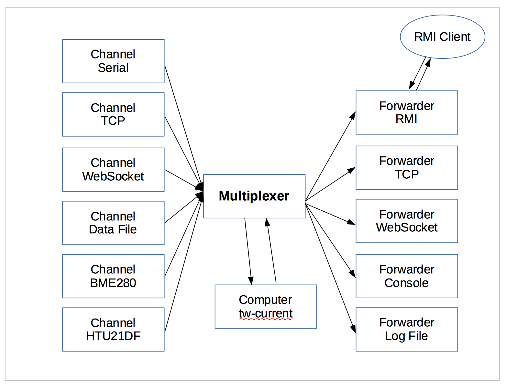
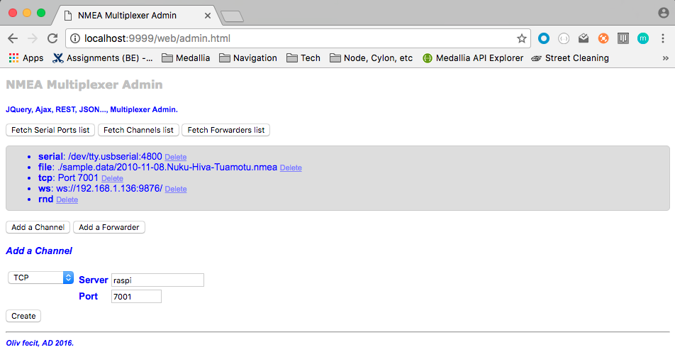

# NMEA Multiplexer
Any input (File, Serial, TCP, UDP, WebSocket, Sensors, Computations, ...), any output (File, Serial, TCP, UDP, WebSockets...), and a REST API on top of that.

### Includes
- NMEA Strings Parser
- NMEA Strings generator
- Serial port Reader / Writer
- TCP Reader / Writer
- UDP Reader / Writer
- WebSocket client (read/write)

### Some definitions
At the center of the picture, there is the Multiplexer (aka MUX).

The MUX _reads_ from `channels` and _writes_ to `forwarders`.

A _channel_ is an NMEA data provider, a _forwarder_ is an NMEA data producer.

In addition, we can have _sensors_. A _sensor_ is reading data from a transducer, and produces NMEA sentences read by the Mux. In other words, a _sensor_ is talking to the Multiplexer,
and can be seen as a _channel_.

Also, a _computer_ is using NMEA data collected by the Multiplexer to produce other NMEA data that will be broadcasted by the _forwarders_.
For example, True Wind computed with Apparent Wind data and the GPS data.

_Note_: to compute the required data, we have a cache, where the data required by the computers are pushed.
This cache is initialized before starting the computers, with parameters contained in the 
properties file used at startup.

Finally, we have _tranformers_, that transform NMEA data into another format, and then behave like a a regular _forwarder_ to provide them to whoever is interested.
 A _transformer_ is also a _forwarder_.

##### Examples
Channels:
- **Serial** reads NMEA data from a Serial Port  
- **TCP** reads NMEA data from a TCP server
- **WebSocket** reads NMEA data from a WebSocket server (this is a WebSocket client)
- **File** reads NMEA data from a log file
- etc

Forwarders:
- **Serial** writes NMEA data to a Serial Port (not implemented yet)
- **TCP** writes NMEA data to a TCP port
- **WebSocket** writes NMEA data to a WebSocket server (this is _also_ a WebSocket client)
- **File** write NMEA data to a log file
- etc

Sensors:
- **BME280** reads raw data from a BME280 sensor (Temperature, Pressure, Humidity), and produces `XDR` and `MDA` NMEA Sentences.
- **LSM303** reads raw data from a LSM303 sensor (3D magnetometer), and produces `XDR` NMEA Sentences.


Computers:
- **True Wind** computer (produces `MDA`, `MWD` data)
- **Current** computer (produces `VDR` data)

Transformers (incubating):
- **GPSD** data
- **Custom** data


_There is no Transformer on the picture above_

#### Note
There is an **rmi** forwarder. This is a work in progress, but it works.
It is feeding an RMI server that can then be accessed by an RMI client.
See an example of such a client in `samples.rmi.client.SampleRMIClient`.

### To see it at work
See the class `nmea.mux.GenericNMEAMultiplexer`, it uses the file `nmea.mux.properties` to define what to read, and what to re-broacdast it to. 
See it to understand its content (should be clear enough).

To compile and build:
```
 $> ../gradlew shadowJar
```
To run it, modify `mux.sh` to fit your environment, and run
```
 $> ./mux.sh
```
#### WebSockets
WebSocket protocol is supported, in input, and in output.
If needed, you can start your own local WebSocket server, running on `nodejs`.
To install it (once):
```bash
 $> npm install
```
Then, to run it,
```bash
 $> node wsnmea.js
```
or
```bash
 $> npm start
```

## REST Admin Interface
The properties files like `nmea.mux.proeprties` defines the configuration at startup.

You can remotely manage the input channels and the re-broadcasting ones through a REST interface.
The soft includes a dedicated HTTP Server. The http port is driven by a property (in `nmea.mux.properties`).
Same if you want the HTTP server to be started or not.
```properties
with.http.server=yes
http.port=9999

```
This HTTP Server is designed and written to run on small computers (like the Raspberry PI Zero).
It is **_NOT_** an enterprise server, and it will **_NOT_** scale as one.

### Supported end-points (for now)

#### List of operations
A full list of the available REST services is available at 
```
 GET /oplist
```


##### Examples
```
 GET /serial-ports
```
returns a payload as:
```
[
  "/dev/tty.Bluetooth-Incoming-Port",
  "/dev/cu.Bluetooth-Incoming-Port"
]
```
The list of _available_ serial ports.

``` 
 GET /channels
```
returns a payload like
```json
[
  {
    "cls": "nmeaproviders.client.SerialClient",
    "type": "serial",
    "port": "/dev/ttyUSB0",
    "br": 4800
  },
  {
    "cls": "nmeaproviders.client.BME280Client",
    "type": "bme280"
  }
]
```

``` 
 GET /forwarders
```
returns a payload like
```json
[
  {
    "cls": "servers.TCPWriter",
    "port": 7001,
    "type": "tcp"
  },
  {
    "cls": "servers.ConsoleWriter",
    "type": "console"
  }
]
```

```text 
 DELETE /forwarders/:type
```
`type` is one of
- `file`. requires a body like 
 ```json
{ 
    "log": "./data.nmea",
    "type": "file"
}
```
identical to the elements returned by `GET /forwarders`.
- `console`. requires no body.
- `tcp`. requires a body like 
```json
{
     "port": 7002,
     "type": "tcp"
}
```
identical to the elements returned by `GET /forwarders`.
- `ws`. requires a body like 
```json
{
   "wsUri": "ws://localhost:9876/",
   "type": "ws"
}
```
identical to the elements returned by `GET /forwarders`.

``` 
 DELETE /channels/:type
```

``` 
 POST /forwarders
```
with payloads like:
- `file`. requires a body like 
 ```json
{ 
    "log": "./data.nmea",
    "type": "file"
}
```
identical to the elements returned by `GET /forwarders`.
- `console`. requires a body like 
```json
{ 
     "type": "console"
}
```
- `tcp`. requires a body like 
```json
{
     "port": 7002,
     "type": "tcp"
}
```
identical to the elements returned by `GET /forwarders`.
- `ws`. requires a body like 
```json
{
   "wsUri": "ws://localhost:9876/",
   "type": "ws"
}
```
identical to the elements returned by `GET /forwarders`.

``` 
 POST /channels
```

There is a Web UI using the REST resources above.

On the HTTP Port, use a url like `http://machine-name:9999/web/admin.html`,
where `machine-name` is the name of the machine where the multiplexer is running, and `9999` is the port defined in the properties.



And any REST client (NodeJS, Postman, your own code, ...) does the job.

## Open Issues
- UDP client

## TODO
- 3D compas (LSM303) interface, see http://opencpn.org/ocpn/Basic_data-connections_nmea-sentences (XDR), and http://forum.arduino.cc/index.php?topic=91268.0
- Externalize all definitions, for dynamic configuration (ie 'add your own computer, channel, forwarder', etc).

```
Once you get the X, Y and Z accelerations into floats you just need some trig to calculate Pitch and Roll (in radians):

pitch = atan (x / sqrt(y^2 + z^2));  
roll = atan (y / sqrt(z^2 + z^2));
```

```
Currently, OpenCPN recognizes the following transducers:

------------------------------------------------------------------------------------------------------
Measured Value | Transducer Type | Measured Data                   | Unit of measure | Transducer Name
------------------------------------------------------------------------------------------------------
barometric     | "P" pressure    | 0.8..1.1 or 800..1100           | "B" bar         | "Barometer"
air temperature| "C" temperature |   2 decimals                    | "C" celsius     | "TempAir" or "ENV_OUTAIR_T"
pitch          | "A" angle       |-180..0 nose down 0..180 nose up | "D" degrees     | "PTCH"
rolling        | "A" angle       |-180..0 L         0..180 R       | "D" degrees     | "ROLL"
water temp     | "C" temperature |   2 decimals                    | "C" celsius     | "ENV_WATER_T"
-----------------------------------------------------------------------------------------------------
```

---
