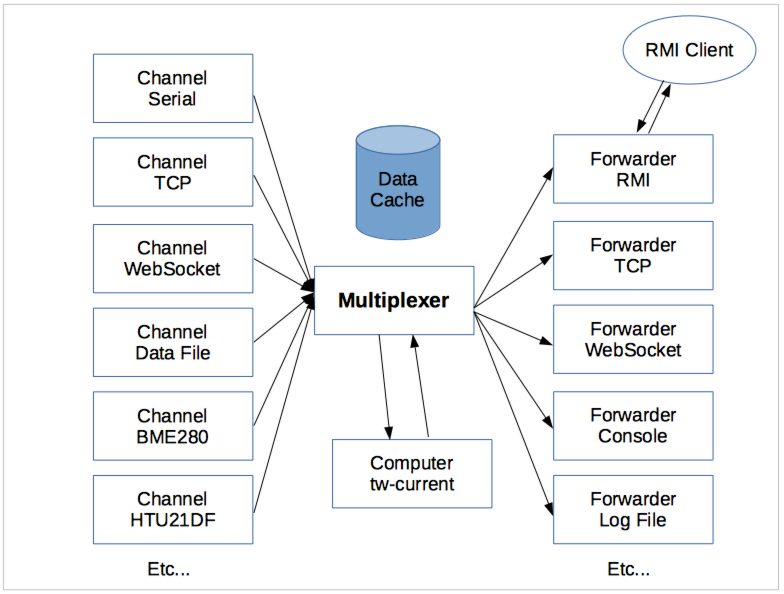
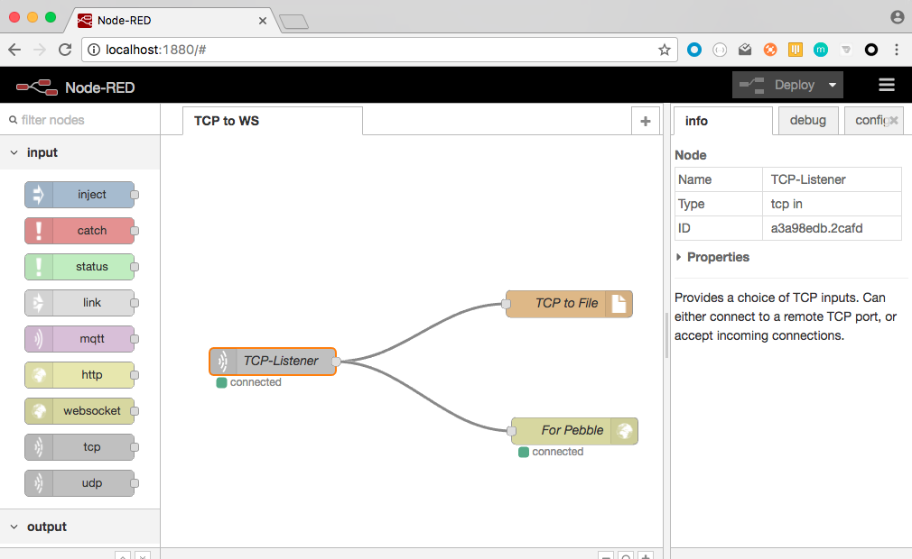
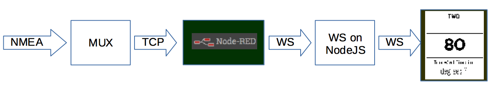
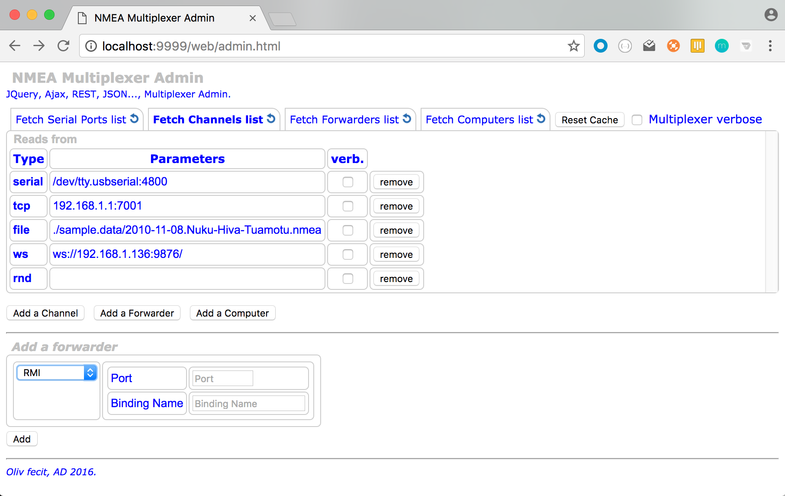
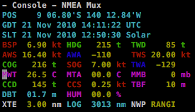
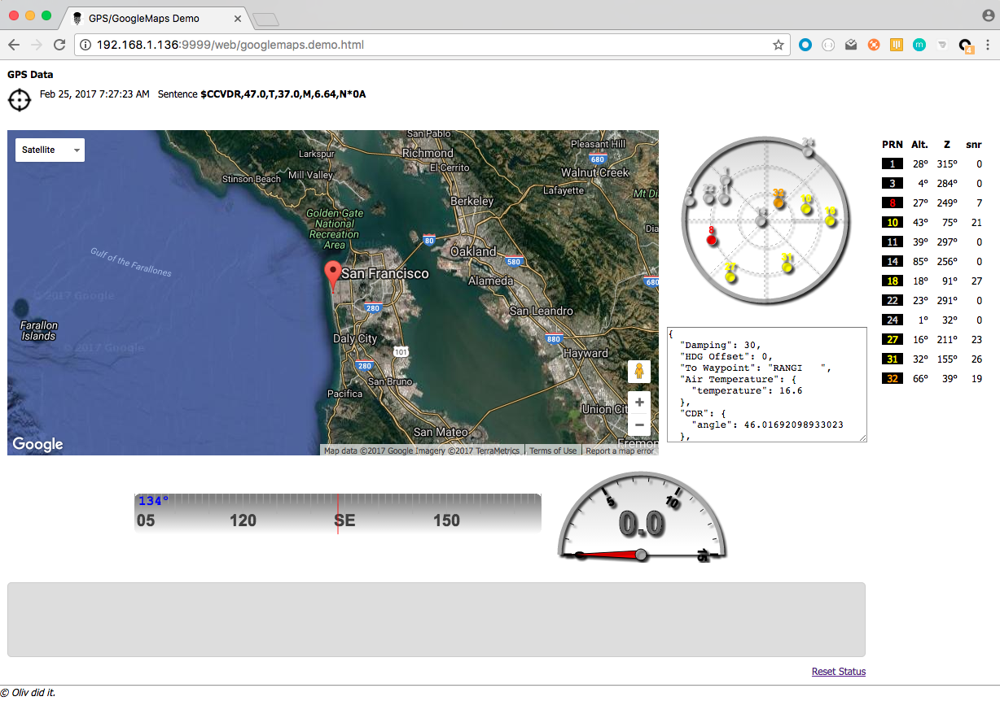
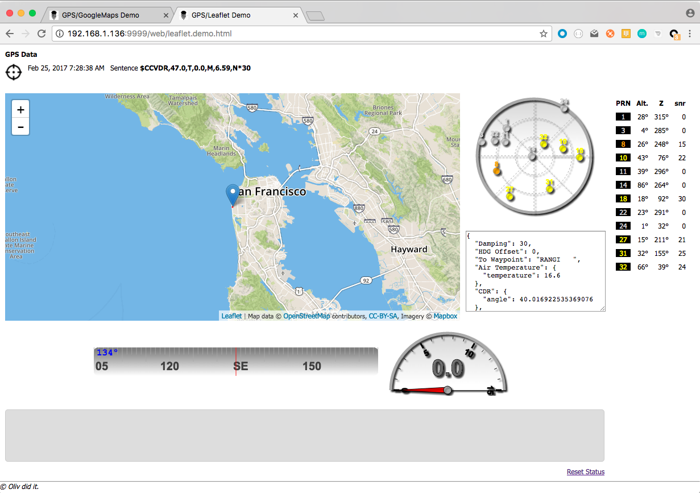

# NMEA Multiplexer
Any input (File, Serial, TCP, UDP, WebSocket, Sensors, Computations, ...), any output (File, Serial, TCP, UDP, WebSockets...), and a REST API on top of that.

Designed to run on very small boards, like a Raspberry PI Zero, and with no Internet access.

The operations on the Serial port require `libRxTx`. This is included in the gradle dependencies.
To be able to use it outside gradle, run (on Linux/Debian/Raspberry PI):
```bash
 sudo apt-get install librxtx-java
```
See how this is used and referred to in `mux.sh`.

### Includes
- NMEA Strings Parser
- NMEA Strings generator
- Serial port Reader / Writer
- TCP Reader / Writer
- UDP Reader / Writer
- WebSocket client (read/write)

#### Also includes
- A tiny HTTP REST server, for admin purpose.

### Javadoc
Javadoc can be generated by using
```bash
 ../gradlew javadoc
```
The generated files will be in `build/docs/javadoc`. Open the `index.html` in your browser.

### Some definitions
At the center of the picture, there is the Multiplexer (aka MUX).

The MUX _reads_ from `channels` and _writes_ to `forwarders`.

A _channel_ is an NMEA data provider, a _forwarder_ is an NMEA data producer.

In addition, we can have _sensors_. A _sensor_ is reading data from a transducer, and produces NMEA sentences read by the Mux. In other words, a _sensor_ is talking to the Multiplexer,
and can be seen as a _channel_.

Also, a _computer_ is using NMEA data collected by the Multiplexer to produce other NMEA data that will be broadcasted by the _forwarders_.
For example, True Wind computed with Apparent Wind data and the GPS data.

_Note_: to compute the required data, we have a **cache**, where the data required _by_ the computers are pushed.
This cache is initialized before starting the computers, with parameters contained in the
properties file used at startup.

This cache is necessary to perform damping and smoothing operations - among others.

Finally, we have _tranformers_, that transform NMEA data into another (proprietary) format, and then behave like a a regular _forwarder_ to provide them to whoever is interested.
 A _transformer_ is also a _forwarder_. See below examples of `transformers`.

##### Examples
Channels:
- **Serial** reads NMEA data from a Serial Port
- **TCP** reads NMEA data from a TCP server
- **WebSocket** reads NMEA data from a WebSocket server (this is a WebSocket client)
- **File** reads NMEA data from a log file
- etc

Forwarders:
- **Serial** writes NMEA data to a Serial Port (not implemented yet)
- **TCP** writes NMEA data to a TCP port
- **WebSocket** writes NMEA data to a WebSocket server (this is _also_ a WebSocket client)
- **File** write NMEA data to a log file
- etc

Sensors:
- **BME280** reads raw data from a BME280 sensor (Temperature, Pressure, Humidity), and produces `XDR` and `MDA` NMEA Sentences.
- **LSM303** reads raw data from a LSM303 sensor (3D magnetometer), and produces `XDR` NMEA Sentences.


Computers:
- **True Wind** computer (produces `MDA`, `MWD` data)
- **Current** computer (produces `VDR` data)

Transformers:
- **GPSD** data (See [this](https://hocus-blogus.blogspot.com/2016/12/nmea-multiplexer-opencpn-gpsd.html))
- **Custom** data

##### A word about the Current Computer
A basic approach to compute the current would be to do it by instant triangulation, figuring the Course Made Good (CMG)
and comparing it with the GPS Data (Course and Speed Over Ground).
A better approach turned out to compute the current over a given period of time.
For example, you can perform this calculation by comparing the position you should be at with the CMG only (i.e. as if there was no current)
 and the one given by the GPS, over periods like 30 seconds, 1 minute, 10 minutesFSupporte, etc, using a smoothing of the Boat Speed (BSP) and the CMG.
 The cache is designed to manage several such computations in parallel, they are discriminated by the length of their time-buffer (30 seconds, 5 minutes, etc).
The accuracy of such a computations is _much higher_ than the instant triangulation.
See [this article](http://www.lediouris.net/RaspberryPI/_Articles/readme.html) for details.

#### Overview


_Note: There is no Transformer on the picture above_

#### Note
There is an **rmi** forwarder. This is a work in progress, but it works.
It is feeding an RMI server that can then be accessed by an RMI client.
See an example of such a client in `samples.rmi.client.SampleRMIClient`.

### To see it at work
See the class `nmea.mux.GenericNMEAMultiplexer`, it uses the file `nmea.mux.properties` to define what to read, and what to re-broacdast it to.
See it to understand its content (should be clear enough).

Those settings can be modified once the mux is started, throught the REST API.

To compile and build:
```
 $> ../gradlew --daemon shadowJar
```
To run it, modify `mux.sh` to fit your environment, and run
```
 $> ./mux.sh
```

##### Filtering
The Channels - aka Consumers - support sentence filtering.
Filtering can be applied on Device ID, and on Sentence ID. Filters can be positive or negative.

Positive filters are linked with and <b>or</b>, Negative ones with an <b>and</b>.

A (sentence) filter like `"HDM", "GLL", "~RMC", "~XDR"` would mean
```
(HDM or GLL) and (not RMC and not XDR)
```
It is the user's responsibility not to have contradiction in the filters, like `[ "GLL", "~GLL" ]`,
no verification is done in this area.

_Note_:
This is just providing the possibility to negate an expression. Convenient, but limited. The best would probably be to use regular expressions (RegExp).
Big drawback though: for the majority of the users, the RegExp syntax could be complex, too complex, or even scary...

##### About transformers
There is an example of a `transformer` in `WebSocketProcessor.java`. As you would see, it is just implementing the `Forwarder` interface,
and this is where it fits in the picture above.
A `Transformer` is just reworking the data before forwarding them as a regular `forwarder` would.

The example in `WebSocketProcessor.java` is transforming the NMEA Data in the format expected by a Pebble (this is a smart watch) application.
See it [here](https://github.com/OlivierLD/pebble/tree/master/NMEA.app). Data are expected as a json object, over WebSocket.
The expected data look like:
```json
{
    "gpstime": 1290377346000,
    "gpsdatetime": 1290377346000,
    "wp": "RANGI   ",
    "d2wp": 561.6,
    "b2wp": 230,
    "xte": 3.0,
    "lat": -9.1102,
    "lng": -140.21108333333333,
    "gpssolardate": 1290343695340,
    "log": 3013.0,
    "daylog": 12.4,
    "cog": 218,
    "sog": 7.2,
    "awa": -121,
    "aws": 17.8,
    "dbt": 1.7000000476837158,
    "hdg": 220,
    "bsp": 6.6,
    "wtemp": 26.5,
    "atemp": 0.0,
    "D": 10.0,
    "d": -0.9830777902388692,
    "W": 9.01692220976113,
    "leeway": 0.0,
    "cmg": 229,
    "tws": 21.4,
    "twa": -139,
    "twd": 89,
    "cdr": 149,
    "csp": 0.29,
    "prmsl": 0.0,
    "hum": 0.0
}
```
The `transformer` reads the data from the cache and generates such an object. Then it is sent to a WebSocket server.
###### To run this transformer example
Start the websocket server, on a port of your choice:
```bash
 $> node wsnmea.js -port:1234
```
Define your transformer in the `properties` file:
```properties
forward.07.type=wsp
forward.07.wsuri=ws://localhost:1234/
```
Make sure you have configured the Pebble application [as required](https://github.com/OlivierLD/pebble/tree/master/NMEA.app) (WebSocket URI), and you are good to go.

<table>
  <tr>
    <td>
      Application list
      <br/>
      
    </td>
    <td>
      Press select to start
      <br/>
      
    </td>
    <td>
      Scroll...
      <br/>
      
    </td>
    <td>
      Choose...
      <br/>
      
    </td>
    <td>
      Displayed!
      <br/>
      
    </td>
  </tr>
</table>


#### WebSockets
WebSocket protocol is supported, in input, and in output.
If needed, you can start your own local WebSocket server, running on `nodejs`.
To install it (once):
```bash
 $> npm install
```
Then, to run it,
```bash
 $> node wsnmea.js
```
or
```bash
 $> npm start
```

##### An alternative, `Node-RED`.
There is a possibility to use [Node-RED](http://nodered.org/) as a forwarder as well, that is a cool one.
You can create a Node-RED flow that ingests data from a TCP port, and spits them out on a WebSocket one.



[Here](./nodered.json) is the flow to import in Node-RED.

###### To run it
- Start the Mux (`$> ./mux.sh`)
    - Make sure there is a TCP Forwarder (port 7002)
- Start the node script `wsnmea.parser.js`.
```bash
 node wsnmea.parser.js
```
- Start `Node-RED` and run the flow mentioned above.



- The Multiplexer reads the NMEA data and _forwards_ them on a TCP Channel.
- Node-RED listens to the TCP port, and _forwards_ the payloads to a WebSocket server
- The WebSocket server transforms the data it receives into the expected format, and broadcasts them to all the connected cliengs (Pebbles in this case).

Once everything runs, you can reach [http://localhost:9876/data/web/wsconsole.html](http://localhost:9876/data/web/wsconsole.html)
to see the data as they come through.

## REST Admin Interface
The properties files like `nmea.mux.proeprties` defines the configuration at startup.

You can remotely manage the input channels and the re-broadcasting ones through a REST interface.
The soft includes a dedicated HTTP Server. The http port is driven by a property (in `nmea.mux.properties`).
Same if you want the HTTP server to be started or not.
```properties
with.http.server=yes
http.port=9999
```
This HTTP Server is designed and written to run on small computers (like the Raspberry PI Zero).
It is **_NOT_** an enterprise server, and it will **_NOT_** scale as one.

### Supported REST end-points

#### List of operations
A full list of the available REST services is available at 
```
 GET /oplist
```


##### Examples
All the end points and operations are defined in `nmea.mux.GenericNMEAMultiplexer.java`. See the `List<Operation>` named `operations`.

```
 GET /serial-ports
```
returns a payload as:
```
[
  "/dev/tty.Bluetooth-Incoming-Port",
  "/dev/cu.Bluetooth-Incoming-Port"
]
```
The list of _available_ serial ports.

``` 
 GET /channels
```
returns a payload like
```json
[
  {
    "cls": "nmeaproviders.client.SerialClient",
    "type": "serial",
    "port": "/dev/ttyUSB0",
    "br": 4800
  },
  {
    "cls": "nmeaproviders.client.BME280Client",
    "type": "bme280"
  }
]
```

``` 
 GET /forwarders
```
returns a payload like
```json
[
  {
    "cls": "servers.TCPWriter",
    "port": 7001,
    "type": "tcp"
  },
  {
    "cls": "servers.ConsoleWriter",
    "type": "console"
  }
]
```

```text 
 DELETE /forwarders/:type
```
`type` is one of
- `file`. requires a body like 
 ```json
{ 
    "log": "./data.nmea",
    "type": "file"
}
```
identical to the elements returned by `GET /forwarders`.
- `console`. requires no body.
- `tcp`. requires a body like 
```json
{
     "port": 7002,
     "type": "tcp"
}
```
identical to the elements returned by `GET /forwarders`.
- `ws`. requires a body like 
```json
{
   "wsUri": "ws://localhost:9876/",
   "type": "ws"
}
```
identical to the elements returned by `GET /forwarders`.

``` 
 DELETE /channels/:type
```

``` 
 POST /forwarders
```
with payloads like:
- `file`. requires a body like 
 ```json
{ 
    "log": "./data.nmea",
    "type": "file"
}
```
identical to the elements returned by `GET /forwarders`.
- `console`. requires a body like 
```json
{ 
     "type": "console"
}
```
- `tcp`. requires a body like 
```json
{
     "port": 7002,
     "type": "tcp"
}
```
identical to the elements returned by `GET /forwarders`.
- `ws`. requires a body like 
```json
{
   "wsUri": "ws://localhost:9876/",
   "type": "ws"
}
```
identical to the elements returned by `GET /forwarders`.

``` 
 POST /channels
```

There is a Web UI using the REST resources above.

_Note_: This Web UI is to be considered  as an example of the way to access the resources. Nothing more.

On the HTTP Port, use a url like `http://machine-name:9999/web/admin.html`,
where `machine-name` is the name of the machine where the multiplexer is running, and `9999` is the port defined in the properties.



And any REST client (NodeJS, Postman, your own code, ...) does the job.


You can also visualize the REST traffic if needed; `In (server to client)` on the left, `Out (client to server)` on the right.

## Dynamic loading
You have the possibility to dynamically load Channels, Forwarders and Computers.

To load a class, mention its name in the properties file used at startup, like for example:
```properties
#
# Dynamic loading sample
#
forward.03.cls=nmea.forwarders.ProcessorSkeleton
#
```
This `ProcessorSkeleton` is part of the project, it is provided as an example you can start from to develop your own forwarders.

_Note_: Dynamically loaded classes can also be managed from the REST admin interface.
Use the `Custom` label when creating them.

They will show up in the admin interface, with their id in _italic_.

Notice the line that says `skeleton`.

Among the forwarders available in this project some are to be dynamically loaded.
 - SSD1306Processor
 - MQTTPublisher (a cool one, for IoT)
 - Character Console
 - etc... list keeps growing.



_Warning_: for now, you _cannot_ load more than one dynamically loaded forwarder, consumer or computer of the same class. They are identified by their class name, you cannot have more than one object
with a given class name in the lists. For example, if you have an `MQTTPublisher` that uses a broker URL like `tcp://192.168.1.136:1883`, you might very well want to
have another one, using a broker URL like `tcp://io.adafruit.com:1883`. Currently, this is **not** possible.

## Open Issues
- UDP client

## Demos
All the demos can be started from [http://localhost:9999/web/index.html](http://localhost:9999/web/index.html).


Plug a GPS on the Serial Port, start the multiplexer, and launch [http://localhost:9999/web/gps.demo.html](http://localhost:9999/web/gps.demo.html) in a browser.
This is pinging the `/cache` REST service every second.

Satellites are displayed on the chart, and on the right pane.
When available, Speed Over Ground and Course Over Ground are displayed too. 

With Google Maps (requires an Iternet connection):


With [LeafletJS](http://leafletjs.com) (requires an Iternet connection):



### JVM Monitoring

Overview


Thread view, with thread names

# Examples!!

#### Small external display
There is a forwarder sample `SSD1306Processor` that uses an oled display to show the True Wind Direction read from the cache:


The OLED display in connected to the Raspberry PI using an SPI interface.

The SSD1306 display is quite small. In the pictures above, there is a Fresnel lens in front of it.

As it is an example, it is a dynamically loaded `forwarder`.

#### Web Console
There is a Web Console, accessible to any device able to run a Web browser (smart phone, tablet, laptop, etc).
It can be accessed from `http://[machine:port]/web/console.html`.
Again, this is just an example, feel free to tweak it your way.


In the picture above, all the data come from the NMEA station, except the air temperature, pressure and humidity, that come from sensors.


##### And more to come...

### TODO...
[Todo next](./web/TODO.md "What's next")

- 3D compass (LSM303) interface, see http://opencpn.org/ocpn/Basic_data-connections_nmea-sentences (XDR), and http://forum.arduino.cc/index.php?topic=91268.0
- Externalize all definitions, for dynamic configuration (ie 'add your own computer, channel, forwarder', etc).

```
Once you get the X, Y and Z accelerations into floats you just need some trig to calculate Pitch and Roll (in radians):

pitch = atan (x / sqrt(y^2 + z^2));
roll = atan (y / sqrt(z^2 + z^2));
```

```
Currently, OpenCPN recognizes the following transducers:

------------------------------------------------------------------------------------------------------
Measured Value | Transducer Type | Measured Data                   | Unit of measure | Transducer Name
------------------------------------------------------------------------------------------------------
barometric     | "P" pressure    | 0.8..1.1 or 800..1100           | "B" bar         | "Barometer"
air temperature| "C" temperature |   2 decimals                    | "C" celsius     | "TempAir" or "ENV_OUTAIR_T"
pitch          | "A" angle       |-180..0 nose down 0..180 nose up | "D" degrees     | "PTCH"
rolling        | "A" angle       |-180..0 L         0..180 R       | "D" degrees     | "ROLL"
water temp     | "C" temperature |   2 decimals                    | "C" celsius     | "ENV_WATER_T"
-----------------------------------------------------------------------------------------------------
```

---
