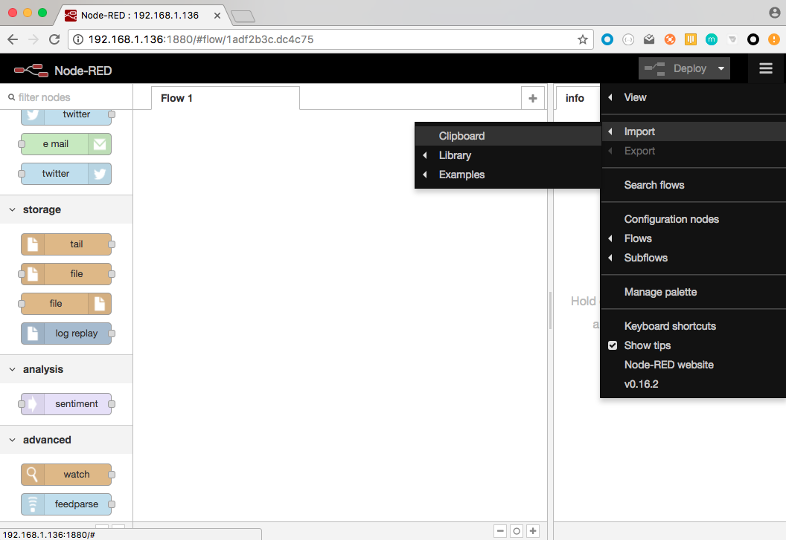
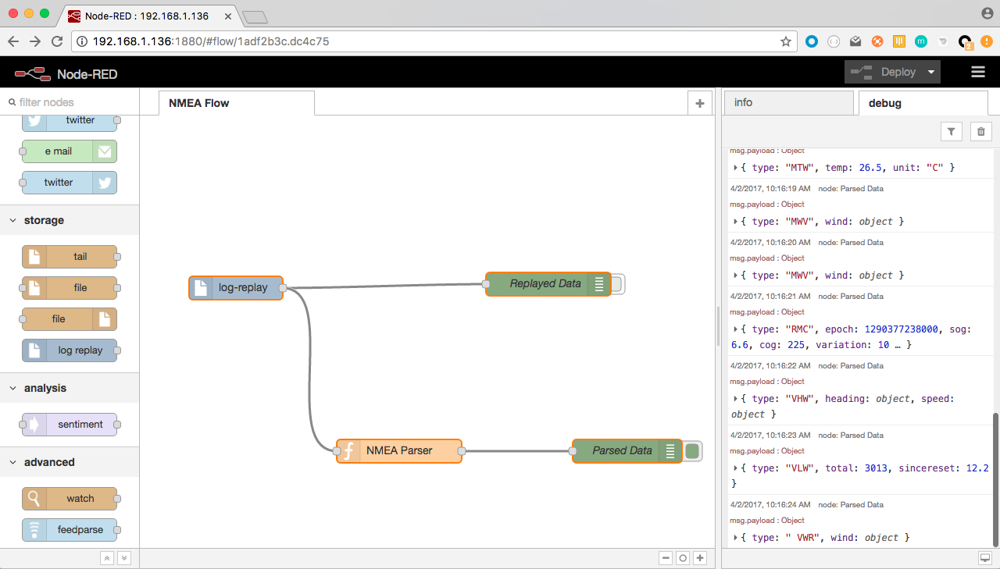

# Raspberry PI Zero W

The Raspberry PI Zero W is a small single-board computer that
- Runs Linux (Pixel, a clone of Jessie)
- Has 512 Mb of RAM
- Has a 40-pin GPIO Header
- Has a built-in WiFi (hence the **W**) and Bluetooth Low Energy (BLE) support.
- Costs $10.

As a Linux machine, it runs whatever a Linux machine can run (Python, Java and other JVM-based languages,
NodeJS, Node-RED, etc).

We want to compare here the behavior of an NMEA Multiplexer based on Java (this project), and another
one - a prototype - based on Node-RED, specially the memory footprint.

## Multiplexer on Node-RED.

If not already there, Install [Node-RED](http://nodered.org/) on the Raspberry PI.
Installation instructions for your platform are available [here](http://nodered.org/docs/getting-started/installation.html), and it comes
with Raspberry PI goodies.

_March 2017_: Node-RED is already installed on the NOOBS Image. It also had some cool Nodes already available. A little drawback though: the version of NodeJS is not a recent one.
I upgraded mine (Node v6.10.1, Npm 3.10.10, Node-RED core 0.16.2).

Among others:
- Serial
- RPi GPIO
- Sense HAT
- ...

Node-RED is based on NodeJS, itself based on V8, the Google Chrome's OpenSource JavaScript engine.
As such, NodeJS - and thus Node-RED - is programmable in JavaScript.
For those wondering, Java & Javascript are as related to each other than Ham & Hamburger (said _John Resig_).

To enable the replay of NMEA log file, we've created an extra node, available [here](https://github.com/OlivierLD/node.pi/tree/master/node-red).
> Reading a file in a synchronous way from JavaScript is not as trivial as it would sound.

To make sure we have equivalent features in both cases (Java & Node-RED), we also need an implementation in Node-RED of the features of
the BME280. More details about that soon.

_Work in Progress..._

### Installation
Manually, for now.

- Copy or move `NMEAParser.js` in `$HOME/.node-red`
```bash
$> scp NMEAParser.js pi@192.168.1.136:./.node-red
```

- On the Raspberry PI where you have installed `Node-RED`, install `n-readlines`
```bash
 $> cd /usr/lib/node_modules/node-red
 $> sudo npm install n-readlines
```

- Then from the `$HOME/.node-red` directory, edit `settings.js`:
```bash
 $> vi setings.js
```
Make sure `functionGlobalContext` looks like this:
```json
functionGlobalContext: {
        os:require('os'),
        here:__dirname,
        NMEAParser:require('./NMEAParser.js')
    }
```
- Then, move or copy `log-replay.html` and `log-replay.js` in the `/usr/lib/node_modules/node-red/nodes` directory.
- Start `Node-RED`
```bash
 $> node-red-start
```

- Then you can access `Node-RED` from a browser, like with [http://192.168.1.136:1880/](http://192.168.1.136:1880/). You should see
  a node named `log-replay` inthe left pane, under the `storage` section.
  
- Then `import` the flow named `NMEA-Parser-flow.js`: Copy its content in the clipboard,
  
  Paste it in the box, click the `Import` button.
  
  See the flow, click `Deploy` at the top-right
  
  Your flow is running.
  

### Development

- Add Serial input
- Add TCP Output


### Debugging

- Node-RED is lagging a bit behind, for now.


---
_March 2017_

