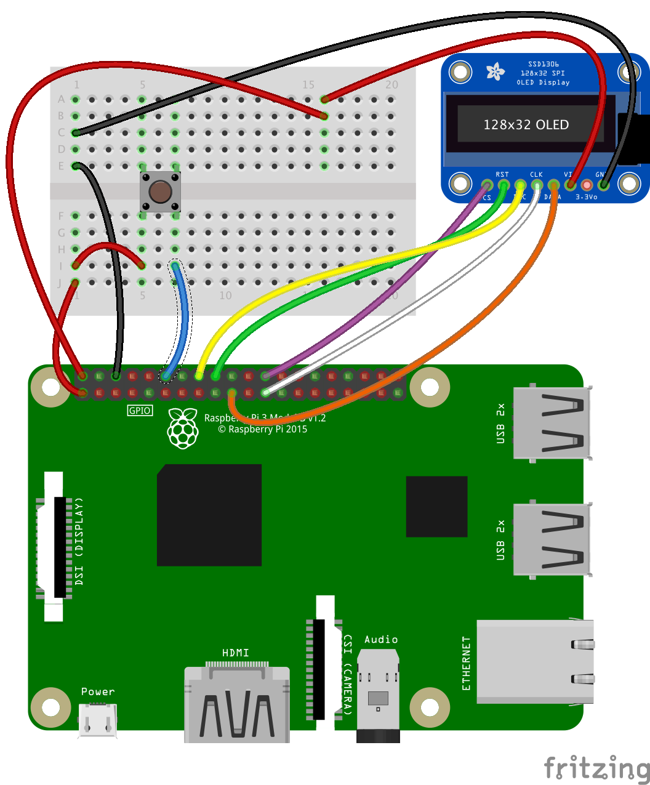

# Implementation Examples

[<< Back](./README.md)

----

- [Small external OLED display](#small-external-display)
- [Web Console](#web-console)
- [Next](#todo)...

#### Small external display
There is a forwarder sample `SSD1306Processor` that uses an oled display to show the True Wind Direction read from the cache:


The OLED display in connected to the Raspberry PI using an SPI interface.

The SSD1306 display is quite small. In the pictures above, there is a Fresnel lens in front of it.



The push button is used to scroll through the data available to display (True Wind Direction, Boat Speed, etc).


...etc. There are like 14 data options (for now).
**Warning**: Do look in the code, to make sure the pin used by the push button is the right one...

As it is an example, it is a dynamically loaded `forwarder`.

#### Web Console
There is a Web Console, accessible to any device able to run a Web browser (smart phone, tablet, laptop, etc).
It can be accessed from `http://[machine:port]/web/console.html`.
Again, this is just an example, feel free to tweak it your way.


In the picture above, all the data come from the NMEA station, except the air temperature, pressure and humidity, that come from sensors.


##### And more to come...

### TODO...
[Todo next](./web/TODO.md "What's next")

- _Example_: A Forwarder with a distinction on the **origin** of the data, based on the device ID.
   - A thermometer inside (BMP180 or BME180), forwarding on TCP, device ID set to `01`
   - A thermometer outside (BMP180 or BME180), forwarding on TCP, device ID set to `02`
   - A MUX reading the 2 TCP streams, and displaying (like with an HTML Interface) the right data in the right place, even if the Sentence IDs of the two streams are identical.


- 3D compass (LSM303) interface, see http://opencpn.org/ocpn/Basic_data-connections_nmea-sentences (XDR), and http://forum.arduino.cc/index.php?topic=91268.0
```
Once you get the X, Y and Z accelerations into floats you just need some trig to calculate Pitch and Roll (in radians):

pitch = atan (x / sqrt(y^2 + z^2));
roll = atan (y / sqrt(z^2 + z^2));
```

```
Currently, OpenCPN recognizes the following transducers:

------------------------------------------------------------------------------------------------------
Measured Value | Transducer Type | Measured Data                   | Unit of measure | Transducer Name
------------------------------------------------------------------------------------------------------
barometric     | "P" pressure    | 0.8..1.1 or 800..1100           | "B" bar         | "Barometer"
air temperature| "C" temperature |   2 decimals                    | "C" celsius     | "TempAir" or "ENV_OUTAIR_T"
pitch          | "A" angle       |-180..0 nose down 0..180 nose up | "D" degrees     | "PTCH"
rolling        | "A" angle       |-180..0 L         0..180 R       | "D" degrees     | "ROLL"
water temp     | "C" temperature |   2 decimals                    | "C" celsius     | "ENV_WATER_T"
-----------------------------------------------------------------------------------------------------
```

