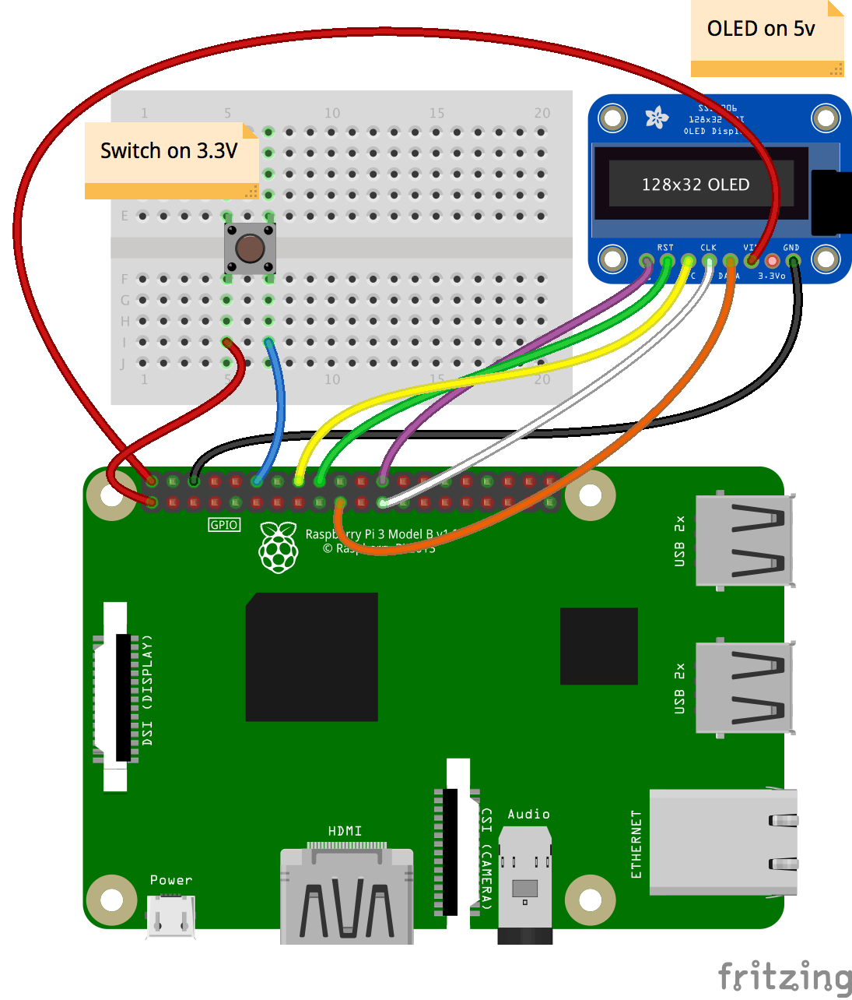
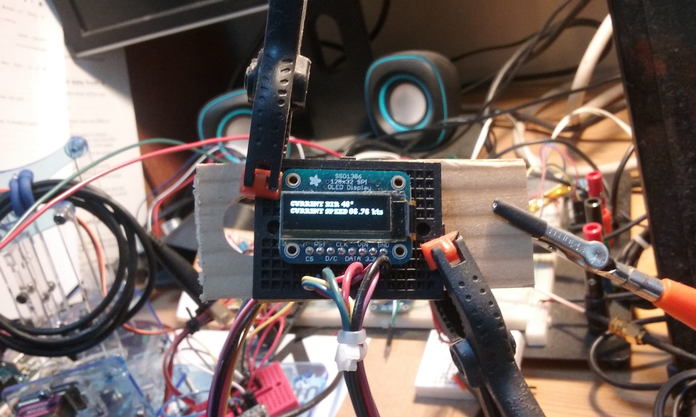
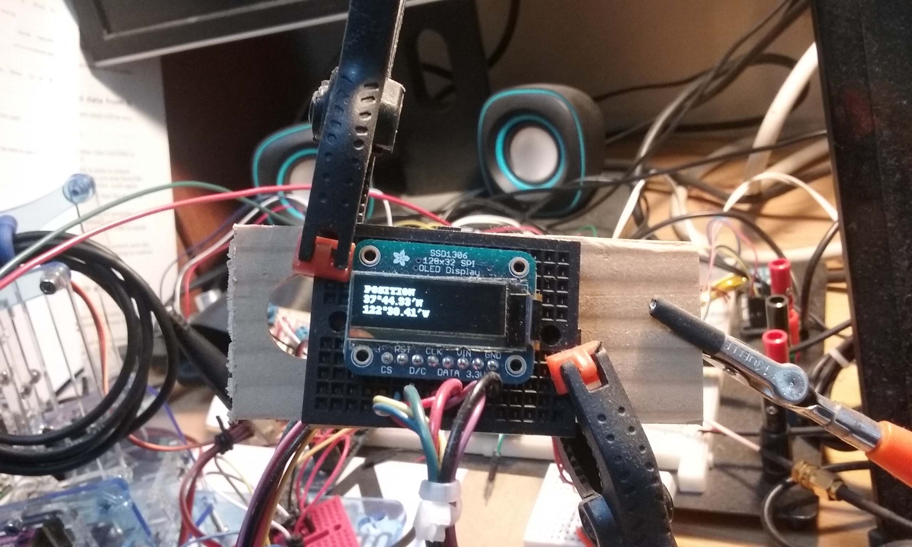
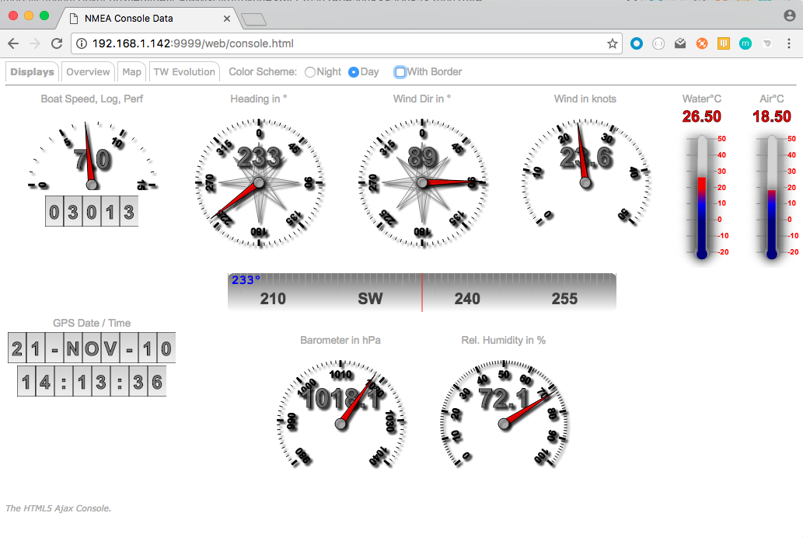
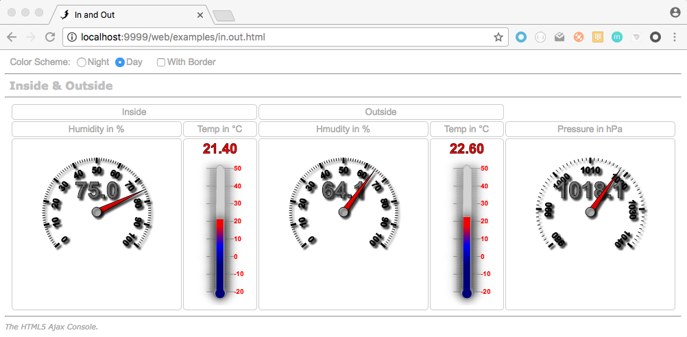
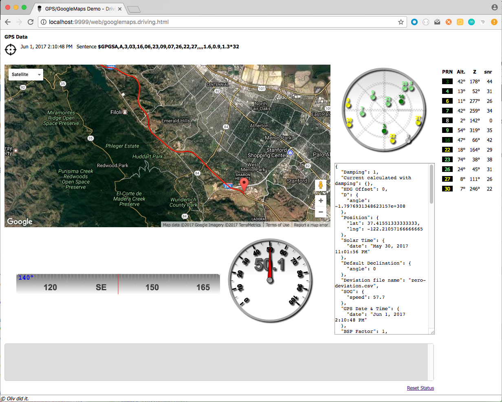
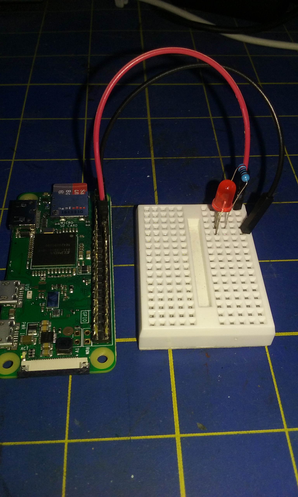
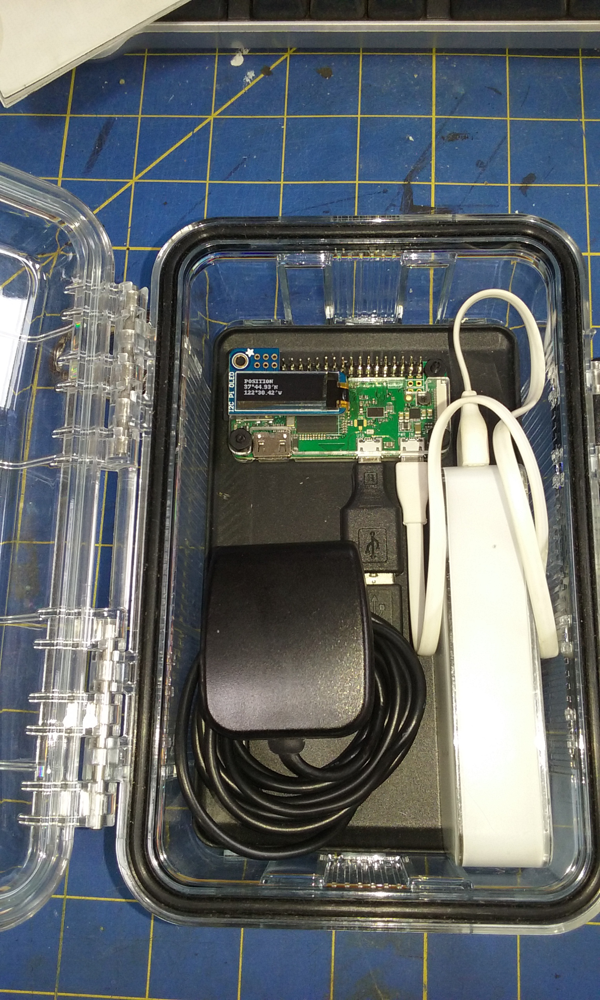

# Implementation Examples

[<< Back](./README.md)

----

- [Small external OLED display](#small-external-display)
- [Small DOT - Display On Top](#small-display-on-top)
- [Web Console](#web-console)
- [Distinction on the device ID](#inside-and-outside)
- [Driving and Logging](#driving-and-logging)
- [Weather Station](#weather-station)

#### Small external display
There is a forwarder sample `SSD1306Processor` that uses an oled display to show the True Wind Direction read from the cache:


The OLED display in connected to the Raspberry PI using an SPI interface.

The SSD1306 display is quite small. In the pictures above, there is a Fresnel lens in front of it.



The push button is used to scroll through the data available to display (True Wind Direction, Boat Speed, etc).





...etc. There are like 14 data options (for now).
**Warning**: Do look in the code, to make sure the pin used by the push button is the right one...

As it is an example, it is a dynamically loaded `forwarder`.

#### Small display "On Top"
Same as above (SSD1306), but attached on top of the Raspberry PI. Using here the I<small><sup>2</sup></small>C interface.

  

 _Another interesting feature_: In case you want to run - for tests for example - somewhere else than on the Raspberry PI, then the OLED Display would not work.
  In this case, it is automatically substituted to a Swing panel:

  

#### Web Console
There is a Web Console, accessible to any device able to run a Web browser (smart phone, tablet, laptop, etc).
It can be accessed from `http://[machine:port]/web/console.html`.
Again, this is just an example, feel free to tweak it your way.


In the picture above, all the data come from the NMEA station, except the air temperature, pressure and humidity, that come from sensors.


#### Inside and Outside
This example involves 2 (or 3) machines.

- A Forwarder with a distinction on the **origin** of the data, based on the device ID.
   - A thermometer inside (BMP180 or BME280), forwarding on TCP, device ID set to `01`
   - A thermometer outside (BMP180 or BME280), forwarding on TCP, device ID set to `02`
   - A MUX reading the 2 TCP streams, and displaying (like with an HTML Interface) the right data in the right place, even if the Sentence IDs of the two streams are identical.


##### On the first Raspberry PI
Let's say its IP address is `192.168.1.166`.
We have a BMP180, and an HTU21D-F.

Its properties file looks like this:
```properties
#
# MUX definition.
#
# HTTP server, and just BMP180 & HTU21D-F
#
with.http.server=yes
http.port=9999
#
mux.01.type=bmp180
mux.01.device.prefix=01
#
mux.02.type=htu21df
mux.02.device.prefix=01
#
# Forwarders
#
forward.01.type=tcp
forward.01.port=7001
#
```

##### On the second Raspberry PI
Let's say its IP address is `192.168.1.136`.
We have a BME280.

Its properties file looks like this:
```properties
#
#  MUX definition.
#
with.http.server=yes
http.port=9999
#
# Channels (input)
#
mux.01.type=bme280
mux.01.device.prefix=02
#
# Forwarders
#
forward.01.type=tcp
forward.01.port=7001
#
```

##### On a third machine, Raspberry PI, or not.
We read the two TCP streams from the machines above.
Its properties file looks like
```properties
#
#  MUX definition.
#
with.http.server=yes
http.port=9999
#
# Reads 2 Raspberry PIs:
# First one  reads a BMP180 and an HTU21DF, forwarded on TCP port 7001.
# Second one reads a BME280, forwarded on its port 7001 too.
#
mux.01.type=tcp
mux.01.port=7001
mux.01.server=192.168.1.166
#
mux.02.type=tcp
mux.02.port=7001
mux.02.server=192.168.1.136
#
# Forwarders
#
forward.01.type=tcp
forward.01.port=7001
#
forward.02.type=console
#
# Dynamic
#
forward.03.cls=nmea.forwarders.InOutDataWriter
#
#
##############################################################
#
# Cache parameters. Taken in account only if init.cache=true
#
init.cache=true
#
##############################################################
#
# No computers
#
```

For details on the way it works, look at the code in `nmea.forwarders.InOutDataWriter.java`.
This one in adding custom entries in the cache...

Then you can reach the page at [http://localhost:9999/web/examples/in.out.html]().


This page in pinging the cache every second, and extracts the custom entries from it to display the
inside and outside conditions, even if they are represented by the same NMEA sentence ID; the distinction is made on the device ID.


_Note_: The Web-UI is actually just pinging (using Ajax) the Cache. The `MUX-3` is the only one that requires `init.cache=true`.
In other words, the `MUX-3` just feeds the cache, and the `Web-UI` reads it. Those two can technically ignore each other.

#### Driving and Logging
This is a small exercise, logging GPS Data when driving from San Francisco to Palo-Alto.

The Multiplexer runs on a Raspberry PI Zero W, with a cheap GPS (USB GPS, less than $20 - June 2017) connected on it. It logs data in a file.
Many options are available to power the Raspberry PI on the go (Lipo batteries, battery bank, USB cable on a cigarette lighter adapter, etc). I've used a battery bank here.


The Raspberry PI, its battery bank and the GPS were sitting in a plastic box, next to the driver's seat.


The Raspberry PI generates its own WiFi hotspot (with `hostapd`, see [here](./README.md#note-access-point-and-internet-access)), and it can be driven remotely through `ssh`, I used an Android phone for that, to start and stop
the Multiplexer, also to shutdown the Raspberry PI (see [here](./README.md#remote-access) for details). Even the admin web console works fine in thsi configuration.

The properties files used with `mux.sh` just looks like this:
```properties
#
# MUX definition.
#
# All indexes must begin with 01, and be consecutive.
#
# GPS Logging
#
with.http.server=yes
http.port=9999
#
# Channels
#
mux.01.type=serial
mux.01.port=/dev/ttyUSB0
mux.01.baudrate=4800
#
# Forwarders
#
forward.01.type=file
forward.01.filename=./data.nmea
forward.01.append=true
#
```
It reads the GPS on serial port `/dev/ttyUSB0` and logs the data in `./data.nmea`.

The data file can then be replayed. The Web UI has been reworked a bit, the speed scale is not the same as on boat (and it is mph, not knots).



You can use a query parameter named `'type'` to set the maximum speed in the display. If the `'type'` is `walk`, then the maximum is `15`. Use it as in
```
 http://localhost:9999/web/googlemaps.driving.html?type=walk
```

With a bonus: a led that blinks every time a _valid_ NMEA sentence is received.


See how `LedBlinker` is referred to in `nmea.mux.gps.log.properties`, it is a custom forwarder.

```properties
forward.02.cls=nmea.forwarders.LedBlinker
```

Another one:
A small [I2C OLED display](https://www.adafruit.com/product/3527) attached to the Zero, fed from a forwarder (`nmea.forwarders.SSD1306ProcessorI2C`).



#### Weather Station
Feed the NMEA Multiplexer with the Weather Station from SwitchDoc labs.
The code of then project is [here](https://github.com/OlivierLD/raspberry-pi4j-samples/tree/master/WeatherStation), 
and an implementation is available [here](https://github.com/OlivierLD/raspberry-pi4j-samples/tree/master/RasPISamples#weatherstation).

There is a  `custom channel` (aka `consumers`) made out of
- `WeatherStationWSClient`
- `WeatherStationWSReader`

The `WeatherStation` feeds a WebSocket server with a `json` object like this:
```json
{ "dir": 350.0,
  "avgdir": 345.67,
  "volts": 3.4567,
  "speed": 12.345,
  "gust": 13.456,
  "rain": 0.1,
  "press": 101300.00,
  "temp": 18.34,
  "hum": 58.5,
  "cputemp": 34.56 }
```
The `consumer` turns this object into several `NMEA` sentences.
It also listens to the WebSocket topic fed by the `WeatherStation`. Its URL is to be provided in
the properties file mentioned in the `channel` definition:
```properties
mux.01.cls=nmea.consumers.client.WeatherStationWSClient
mux.01.reader=nmea.consumers.reader.WeatherStationWSReader
mux.01.properties=weather.station.properties
``` 

```properties
ws.uri=ws://192.168.127.127:9876/
```

###### Summary
From the `RasPISamples` directory, on its own machine (or not...), use `weather.menu`:
```javascript
 $ ./weather.menu
 N: Start Node server
 W: Start Weather Station reader
 D: Start Weather Station dump
 S: Show processes
 K: Kill them all
 Q: Quit
 You Choose > 
```
- Start the node server (including the `WebSocket` server)
- Then start the Weather Station Reader

Then the NMEA Multiplexer will be able to listen to the WebSocket topic.

##### And more to come...
<!--
### TODO...
[Todo next](./web/TODO.md "What's next")

- 3D compass (LSM303) interface, see http://opencpn.org/ocpn/Basic_data-connections_nmea-sentences (XDR), and http://forum.arduino.cc/index.php?topic=91268.0
```
Once you get the X, Y and Z accelerations into floats you just need some trig to calculate Pitch and Roll (in radians):

pitch = atan (x / sqrt(y^2 + z^2));
roll = atan (y / sqrt(z^2 + z^2));
```

```
Currently, OpenCPN recognizes the following transducers:

------------------------------------------------------------------------------------------------------
Measured Value | Transducer Type | Measured Data                   | Unit of measure | Transducer Name
------------------------------------------------------------------------------------------------------
barometric     | "P" pressure    | 0.8..1.1 or 800..1100           | "B" bar         | "Barometer"
air temperature| "C" temperature |   2 decimals                    | "C" celsius     | "TempAir" or "ENV_OUTAIR_T"
pitch          | "A" angle       |-180..0 nose down 0..180 nose up | "D" degrees     | "PTCH"
rolling        | "A" angle       |-180..0 L         0..180 R       | "D" degrees     | "ROLL"
water temp     | "C" temperature |   2 decimals                    | "C" celsius     | "ENV_WATER_T"
-----------------------------------------------------------------------------------------------------
```
-->
