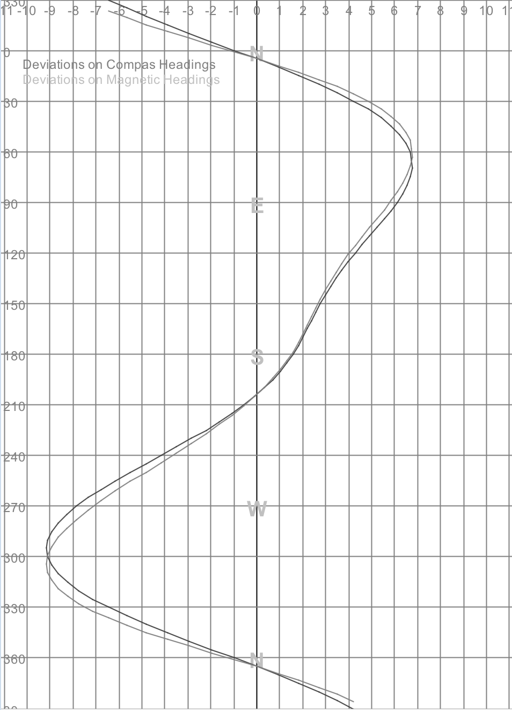
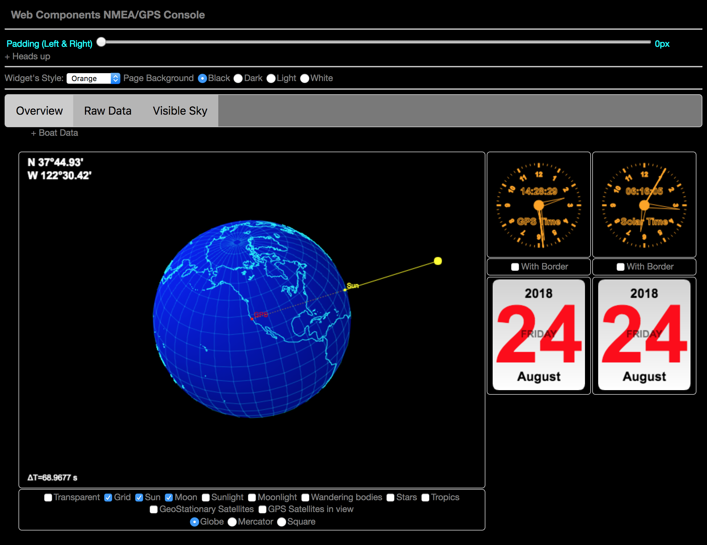

# NMEA Multiplexer - Technical Manual

[<< Back](./README.md)

The following sections will make references to several resources (Java classes, properties files, etc).
They are all part of this project, so you can refer to them if needed for more details.

The program to start is `nmea.mux.GenericNMEAMultiplexer`, it is driven by a `properties` file,
describing the features required by an instance of the Multiplexer (channels, forwarders, computers, http server, etc).

- [Properties](#properties)
- [Pre-defined channel types](#pre-defined-channel-types)
- [Forwarders](#forwarders)
- [Pre-defined forwarder types](#pre-defined-forwarder-types)
- [Pre-defined computer type(s)](#pre-defined-computer-types)
- [Other properties](#other-properties)
- [Example](#example)
- [Minimal](#minimal)
- [And then...](#and-then)
- [To summarize](#to-summarize)
- [Other resources](#other-resources)


### Properties
Here is a brief description of the properties managed by the `nmea.mux.GenericNMEAMultiplexer`, the ones
present in the file `nmea.mux.properties`, or in the file named as set in the System variable `mux.properties`.

Property names of channels, forwarders and computers follow this pattern:
```
 [element-type].[index].[attribute]
```

Element types can take three values: `mux`, `forward`, or `computer`:

- Whatever begins with `mux.` is a channel
- Whatever begins with `forward.` is a forwarder
- Whatever begins with `computer.` is a computer

For the three categories above, the second item is the index of the element.
Indexes are numbers, mentioned on two digits. Indexes _must_ start at `01` and be
after that incremented by `1`.

For example, `mux.01.xxx`, followed by `mux.02.yyy`.

> _Quick explanation_: To find the first channel, the program looks for a `mux.01.*`.
> If no such entry is found, that would mean for the program that there is no channel to deal with.
> After finding and evaluating `mux.01.xxx`, the program looks for `mux.02.*`. If no
> such channel is found, the program understands that the list of the channels is terminated.
> This is the same for channels, forwarders and computers.

The third part of the property name (the `type` in `mux.0X.type` for example) is the attribute.
_**ALL**_ elements _have_ a mandatory `type` attribute, the other attributes depend on this `type`.

> _**Exception**_: if an element does _not_ have a `type` attribute, then it is a custom element, it _must_ have a _cls_ attribute
> containing the name of the Java `class` to load dynamically, with a `Class.forName`.
> For example, a line like that one
```properties
 forward.02.cls=nmea.forwarders.LedBlinker
```
> would tell the Multiplexer to load a forwarder defined in the class `nmea.forwarders.LedBlinker`.
> If the loaded class does not extend the right `superclass` or implement the right `interface`, an error
> will be raised.

> _Note_: Since October 2019, a `yaml` format is also supported for the properties of the multiplexer.
> It's a bit easier than the `properties` syntax.
>
> Example:
```yaml
 #
 # This is an example of the way a MUX could be defined with YAML.
 #
 name: "NMEA with GPS, BME280, LSM303"
 context:
   with.http.server: true
   http.port: 5678
   init.cache: true
   default.declination: 14
   deviation.file.name: dp_2011_04_15.csv
   # Leeway = max.leeway * cos(awa)
   max.leeway: 10
   bsp.factor: 1.0
   aws.factor: 1.0
   awa.offset: 0
   hdg.offset: 0
   damping: 30
 channels:
   - type: serial
     port: /dev/ttyS80
     baud.rate: 4800
     verbose: false
   - type: bme280
     prefix: BM
     verbose: false
   - type: lsm303
     prefix: LS
     feature: BOTH
     verbose: false
     sentence.filters: HDM,XDR
     heading.offset: 0
     read.frequency: 1000
     damping.size: 5  
     lsm303.cal.prop.file: lsm303.cal.properties
 forwarders:
   - type: file
     timebase.filename: true
     filename.suffix: _LOG
     log.dir: logged
     split: hour
   - class: nmea.forwarder.SSD1306Processor
     properties: ssd1306.properties
   - type: tcp
     port: 7001
 computers:
   - type: tw-current
     prefix: CC
     time.buffer.length: 30, 60, 600
```

Channel `properties` like: 
```properties                                       
mux.01.type=lsm303           
mux.01.device.prefix=II
mux.01.verbose=false
mux.01.sentence.filters=HDM,XDR
mux.01.heading.offset=0
mux.01.feature=BOTH
mux.01.damping.size=5
mux.01.read.frequency=1000
```
are equivalent to `yaml` like
```yaml
channels:
 - type: lsm303           
   device.prefix: II
   verbose: false
   sentence.filters: HDM,XDR
   heading.offset: 0
   feature: BOTH
   damping.size: 5
   read.frequency: 1000
```  
> Notice that the yaml does not require `mux.01.xxx` and `mux.02.xxx` as the `properties` do. That 
> makes it a bit more convenient and flexible to use.

#### Pre-defined channel types

- `serial`
    - Serial port input.
    ```properties
    mux.01.type=serial
    mux.01.port=/dev/ttyUSB0
    mux.01.baudrate=4800
    mux.01.verbose=false
    ```
- `tcp`
    - TCP input
    ```properties
    mux.01.type=tcp
    mux.01.server=ais.exploratorium.edu
    mux.01.port=80
    mux.01.verbose=false
    ```
- `file`
    - Log file replay
    ```properties
    mux.01.type=file
    mux.01.filename=./sample.data/2010-11-08.Nuku-Hiva-Tuamotu.nmea
    ```
- `ws`
    - WebSocket input
    ```properties
    mux.02.type=ws
    mux.02.wsuri=ws://192.168.1.136:9876/
    ```
- `htu21df`
    - Temperature, humidity
    ```properties
    mux.02.type=htu21df
    mux.02.device.prefix=01
    mux.02.verbose=false
    ```
- `rnd`
    - Random data generator (for debug)
    ```properties
    mux.04.type=rnd
    ```
- `zda`
    - ZDA Sentence generator (UTC day, month, and year, and local time zone offset)
    ```properties
    mux.01.type=zda
    ```
- `lsm303`
    - Triple axis accelerometer and magnetometer
    ```properties
    mux.01.type=lsm303
    mux.01.device.prefix=II
    mux.01.verbose=false
    mux.01.sentence.filters=HDM,XDR
    mux.01.heading.offset=0
    mux.01.feature=BOTH
    mux.01.damping.size=5
    mux.01.read.frequency=1000
    mux.01.lsm303.cal.prop.file=lsm303.cal.properties
    ```
- `hmc5883l`
    - Triple axis magnetometer
    ```properties
    mux.01.type=hmc5883l
    mux.01.device.prefix=II
    mux.01.verbose=false
    mux.01.sentence.filters=HDM,XDR
    mux.01.heading.offset=0
    mux.01.damping.size=5
    mux.01.read.frequency=1000
    mux.01.hmc5883l.cal.prop.file=hmc5883l.cal.properties
    ```
- `bme280`
    - Humidity, pressure, temperature
    ```properties
    mux.01.type=bme280
    mux.01.device.prefix=02
    mux.01.verbose=false
    ```
- `bmp180`
    - Temperature, pressure
    ```properties
    mux.01.type=bmp180
    mux.01.device.prefix=01
    mux.01.verbose=false
    ```

You can also define your own channels (extending `NMEAClient` and with a `reader` attribute).

Look for `mux.01.cls=nmea.consumers.client.WeatherStationWSClient`.

Channels can use those three attributes: `properties`, `device.filters`, `sentence.filters`:
```properties
mux.01.properties=weather.station.properties
mux.01.device.filters=II, GP
mux.01.sentence.filters=MMB, XDR, MDA
```
`device.filters` and `sentence.filters` both support positive (inclusive) and negative (exclusive) filters.
Negative filters are prefixed with `~`.

A line like
```properties
mux.01.sentence.filters=~MMB, ~GGA, ~GSV
```
means everything, but no MMB, no GGA, no GSV.

A line like
```properties
mux.01.sentence.filters=RMC, XDR, MDA
```
means only RMC, XDR or MDA.

> _Note_: a line like `~RMC, MDA` does not mean much, as it would mean [`no RMC` and `just MDA`]. 
> A line like `MDA` means the same thing.

#### Forwarders

_**ALL**_ forwarders can use 2 _optional_ attributes, `subclass` and `properties`:
```properties
forward.XX.type=file
forward.XX.subclass=nmea.forwarders.ExtendedDataFileWriter
forward.XX.properties=validlogger.properties
...
```
The lines above means that:
- The `nmea.forwarders.ExtendedDataFileWriter` is a `file` Forwarder (it extends `DataFileWriter`)
- Required extra properties are in a file named `validlogger.properties`.

> _Note_: if `ExtendedDataFileWriter` happens not to extend the class anticipated by the `type`, a runtime error will be raised.

> _**Dynamic loading versus sub-classing**_:
> We've seen before that you have the possibility - using a `cls` attribute - to define your own
> elements (Channel, Forwarder or Computer) and dynamically load it at runtime. Here we see the possibility to `extend` a given element type.
> A dynamically loaded element gives the programmer more flexibility and room for invention, but it _cannot_
> be managed by the `admin` web page. A sub-class of a given type of element can be much lighter to write,
> and _is_ manageable by the `admin` web page.

> See `ExtendedDataFileWriter.java` for details.

#### Pre-defined forwarder types

- `serial`
    - Write to a serial port
    ```properties
    forward.02.type=serial
    forward.02.port=/dev/ttyS88
    forward.02.baudrate=9600
    ```
- `tcp`
    - TCP Server
    ```properties
    forward.01.type=tcp
    forward.01.port=7001
    ```
  > _Note_: using `forward.XX.properties`, you can refer to a properties file containing a `with.ais` properties.
  > Default value is `true`, it can be set to `false` to prevent the AIS strings to be re-broadcasted.
  >
  > Along the same lines, there is a `put.ais.in.cache` property defaulted to `true`. Set it to `false` if you do not need the 
  > parsed AIS data to end up in the NMEA Cache. 
- `gpsd`
    - GPSD Server
    ```properties
    forward.06.type=gpsd
    forward.06.port=2947
    ```
- `file`
    - Log file output
    ```properties
    forward.XX.type=file
    # Option 1
    forward.XX.filename=./data.nmea
    # Option 2
    forward.XX.timebase.filename=true
    forward.XX.filename.suffix=_LOG
    forward.XX.log.dir=logged
    forward.XX.split=min|hour|day|week|month|year
    #
    forward.XX.append=true
    forward.XX.flush=true
    ```
    > Explanations:
    > - `timebase.filename` default value is `false`
    > - if `timebase.filename` is `false` then a `filename` is expected to be provided (default is `data.nmea`).
    > - if `timebase.filename` is `true` then log file name will be based on the time the logging was started, like `2018-10-22_20:04:00_UTC.nmea`.
    >   - if `filename.suffix` exists (default is an empty string) like `LOG_`, then log file name will be `LOG_2018-10-22_20:04:00_UTC.nmea`.
    >   - if `log.dir` exists (default is `.`) log files will be generated in this directory (located under the working directory).
    >   - if `split` exists (default is `null`) and one of `min`, `hour`, `day`, `week`, `month`, `year`, then a new log file will generated every `min`, `hour`, `day`, `week`, `month`, or `year`.
    > - `flush` will write to the disk every time a record is written. Default is `false`.


- `ws`
    - WebSocket server
    ```properties
    forward.07.type=ws
    forward.07.wsuri=ws://localhost:9876/
    ```
- `wsp`
    - WebSocket Processor
    ```properties
    forward.07.type=wsp
    forward.07.wsuri=ws://localhost:9876/
    ```
- `console`
    - Console output
    ```properties
    forward.01.type=console
    ```
- `rmi`
    - RMI Server
    ```properties
    forward.05.type=rmi
    forward.05.port=1099
    forward.05.name=RMI-NMEA
    ```

You can also implement your own forwarder (implementing the `Forwarder` interface).

Look for `forward.02.cls=nmea.forwarders.RESTPublisher`

#### Pre-defined computer type(s)

- `tw-current`
    - One computer, to calculate both True Wind and Current (GPS Based, with possibly several time buffers).

> _Important_: Computers may need data coming from the various channels. Those data will
be stored in a cache _if the property `init.cache` is set to `true`_. See below.

You can also define your own computers (extending `Computer`).

Look for `computer.02.cls=nmea.computers.ComputerSkeleton`

Also see the computer `nmea.computers.AISManager`. It is a computer to load as in (`yaml` version)
```yaml
computers:
  - cls: nmea.computers.AISManager
    properties: ais.mgr.properties
```
It's an example of the way to use AIS data to detect collisions.

#### Other properties

```properties
with.http.server=yes
http.port=9999
#
init.cache=true
deviation.file.name=dp_2011_04_15.csv
# Leeway = max.leeway * cos(awa)
max.leeway=10
#
bsp.factor=1.0
aws.factor=1.0
awa.offset=0
hdg.offset=0
#
default.declination=14
damping=30
```

`with.http.server` is set to `no` by default. `yes` means that you will have access to
some `REST` services, for admin and other purposes.

If `with.http.server` is set to `yes`, the default http port is `9999`. It can be overridden by `http.port` if needed.

`init.cache` is set to `false` by default. A cache - accessible by `Computers` will be initialized if
`init.cache` is set to `true`.
The cache is a `Map<String, Object>`, see `context.NMEADataCache` for details.

> _Note_: If the property `with.http.server` is set to `true`, then the cache might also be accessible through a REST interface, as a `json` object reflecting the `Map` above
> (also see in the `RESTNavServer` for details).
```
 GET /mux/cache
```

If `init.cache` is set to `true` or `yes`, the following parameters will be taken in account when inserting data in the cache:
- `bsp.factor` Boat Speed Factor, number, `0` to `n`
- `aws.factor` Apparent Wind Speed Factor, number, `0` to `n`
- `awa.offset` Apparent Wind Angle offset in degrees, from `-180` to `180`
- `hdg.offset` Heading offset in degrees, from `-180` to `180`

`default.declination` will be used if not returned by the GPS (as it could, depends on your GPS). `E` is `+`, `W` is `-`.

`max.leeway` is used to calculate the leeway. The formula used here is:
```
 if awa > 90 and awa < 270 (i.e. cos(awa) < 0) then leeway = 0
 otherwise, leeway = max.leeway * cos(awa)
```
can also be more simply expressed as
```
 leeway = max.leeway * max(0, cos(awa))
```

`damping` (default is `1`) unused for now (Aug-2018), but will be.

`deviation.file.name` mentions the name of a CSV file, like - for example - `dp_2011_04_15.csv`. The
default value is `zero-deviation.csv`.

The format of this Comma-Separated-Values (CSV) file is the following one:
```csv
0.0,-0.9830777902388692
5.0,-0.011026572256005562
10.0,0.9376226337606713
15.0,1.8481417760529473
20.0,2.706968419259063
25.0,3.502010498068172
...
```
Each line contains two fields, the first one is the **Compass** Heading, the second one is the corresponding deviation.
Such a file can be rendered like this:



### Example
Here is an example of a simple properties file driving the Multiplexer:
```properties
#
#  MUX definition.
#
with.http.server=yes
http.port=9999
#
# Channels (input)
#
mux.01.type=serial
mux.01.port=/dev/ttyUSB0
mux.01.baudrate=4800
mux.01.verbose=false
#
# Forwarders
#
forward.01.type=tcp
forward.01.port=7001
#
forward.02.type=file
forward.02.filename=./data.nmea
#
init.cache=true
```
This file tells the Multiplexer to:
- Read the Serial port `/dev/ttyUSB0` with a baud rate of `4800` bauds
- Forward the NMEA data on `tcp` port `7001`
- Log the data into a file named `data.nmea`.

As `with.http.server` is set to `yes`, an `admin` web page will be available on port `9999` (at http://localhost:9999/web/admin.html).

And `init.cache` is set to `true`, meaning that a Computer (not mentioned here) would be able to pick up data from the NMEA Cache.

#### Minimal
_Note_: Two system variables can be used to set the default position (in case no GPS is available) at runtime:
```
...
JAVA_OPTS="$JAVA_OPTS -Ddefault.mux.latitude=37.7489 -Ddefault.mux.longitude=-122.5070" # SF.
java -cp $CP $JAVA_OPTS navrest.NavServer
```
> `navrest.NavServer` is an example - part of this project - involving the `NMEA.Multiplexer`.

A ZDA Sentence can be generated from the system time. A multiplexer driven by
this minimal properties file:
```properties
with.http.server=yes
http.port=9999
#
# Channels (input)
#
mux.01.type=zda
#
#
# No Forwarders
#
#############################################################
#
init.cache=true
#
```
can be accessed from a Web UI (http://localhost:9999/web/webcomponents/console.gps.html?style=orange&bg=black&border=n&boat-data=n), to render astronomical data.



In this case:
- there is only one channel (`zda`) providing the date and time (UT) (`mux.01.type=zda`)
- the position is provided by the user at runtime (`-Ddefault.mux.latitude=37.7489 -Ddefault.mux.longitude=-122.5070`)
- the data are pushed to the cache (`init.cache=true`)
- the cache is accessed from the Web UI through REST services, see in the WebPage code the statements like
```js
function getNMEAData() {
  return getPromise('/mux/cache', DEFAULT_TIMEOUT, 'GET', 200, null, false);
}
```

All you need to know in this case is your location, all the rest is taken care of.

##### Bonus
You can even have _no_ `channel` at all.
In this case, you have the possibility to provide the UTC time to the cache using a service like
```
 PUT /mux/utc { epoch: 1535491435769 }
```
In this case, the cache will reflect this `epoch`, and all celestial data will be computed accordingly, from the position
supplied as above. This allows you to see what the celestial configuration looks like
at any point in time.

### And then...
An example of an implementation of the `NMEA.Multiplexer` along with several chunks of REST Services can be found
in the module `RESTNavServer`, part of this project.

This is typically what makes a Web page like the above available.
The data like `position` and `time` can come from an NMEA data source (they can be emulated, as we've seen), and the astronomical data
would be computed by REST services, based on the time and position coming from the NMEA cache.

Along the same lines, you can have (and you _have_ in the `RESTNavServer`) services to
- compute tide curves
- publish nautical almanacs
- compute astronomical data
- compute routing
- etc...

Once again, the idea (if not the goal) here is to _totally_ de-couple data from their rendition.
NMEA Multiplexer and REST Services provide all the server side data and abstraction,
all the Graphical User Interface (GUI) can then be provided by Web Pages, using technologies like HTML5, CSS3, WebComponents, WebGL, etc, all of those allowing
_local_ as well as _remote_ access from laptops, tablets, smartphones, character consoles, etc.
The _only_ requirement for a client is a network access (with obvious fluency with protocols like HTTP or TCP).

#### To summarize
The NMEA.Multiplexer pulls data from `channels`, possibly computes some using `computers`, and forwards (broadcasts) them through `forwarders`.

All those data are represented using the NMEA format.

In addition, those data can be injected in a cache (as they are - NMEA - and in a `json` format, to avoid re-parsing on the client side), so they can be accessed through REST services. The
HTTP server serving the REST requests can also serve HTML requests, and behave like a web server.

`channels`, `computers` and `forwarders` are defined by some configuration (`properties`) files used when starting the Multiplexer, and they can also be later on added, modified or removed when the Multiplexer is running, through some admin REST services. Along the exact same lines, there is an Admin Web UI also available.

#### Other resources
- [Case Study](./casestudy.md)

-----------------
See the code for more details. _This_ is Open Source 😜
