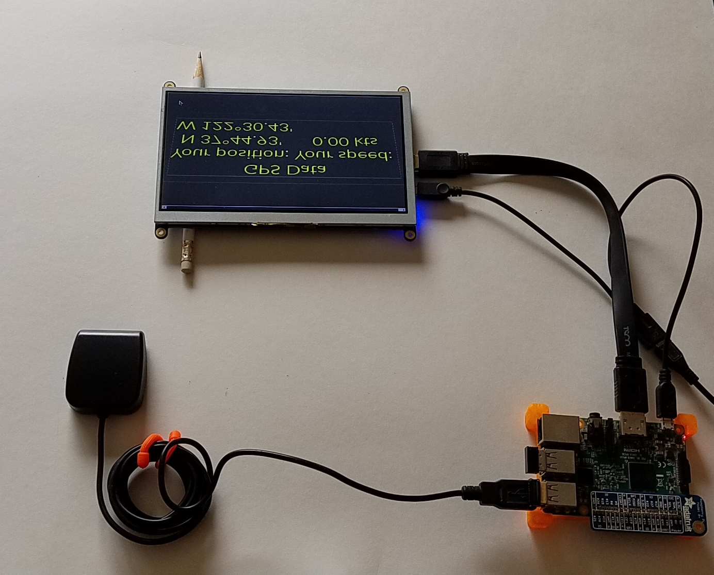
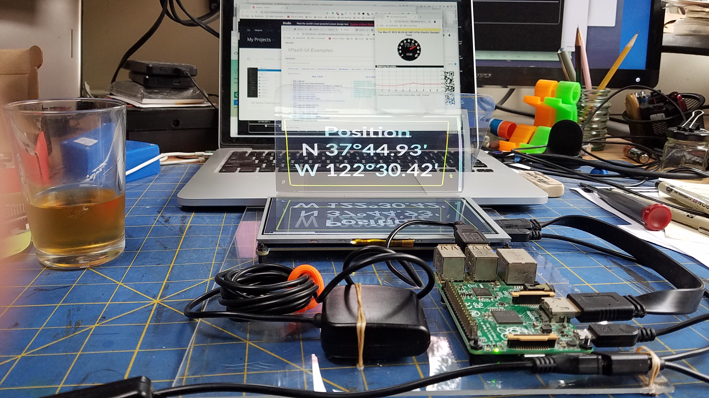
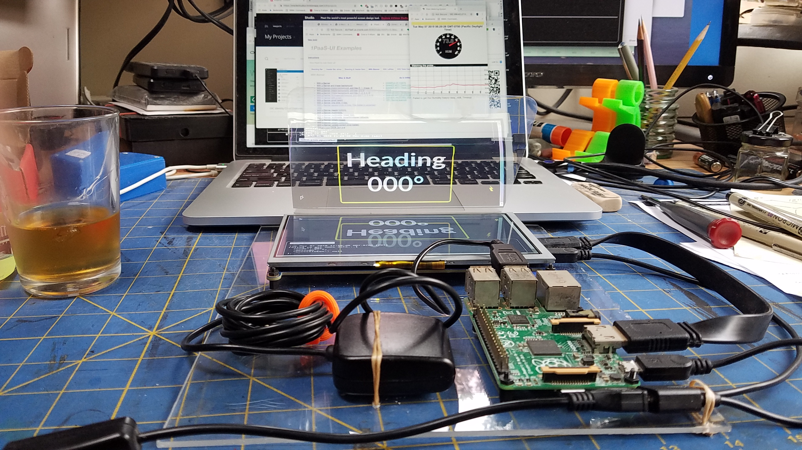
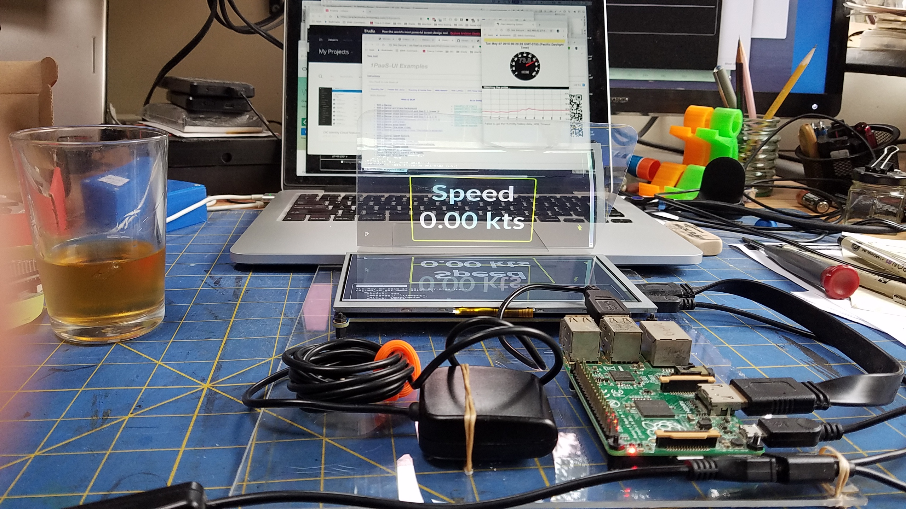
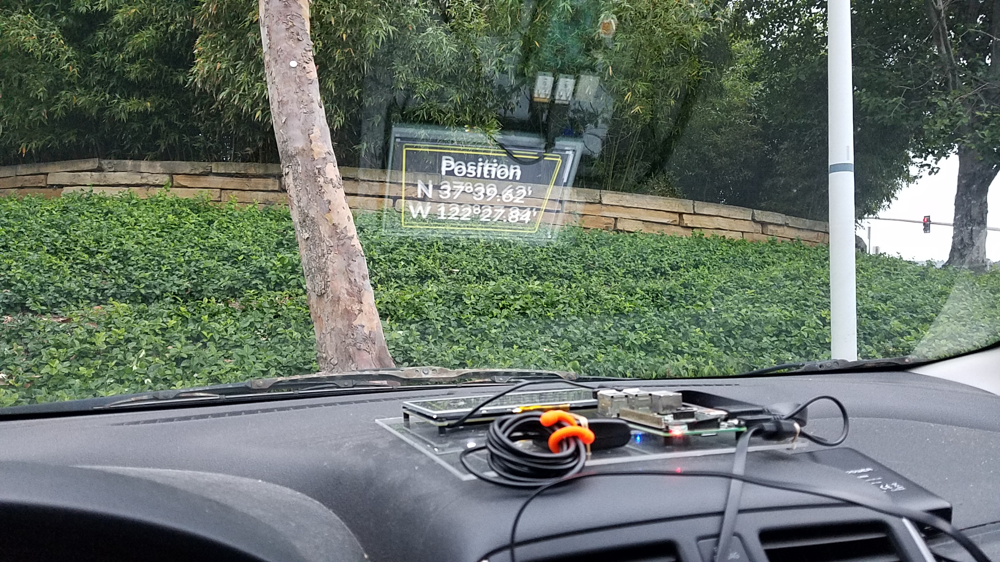
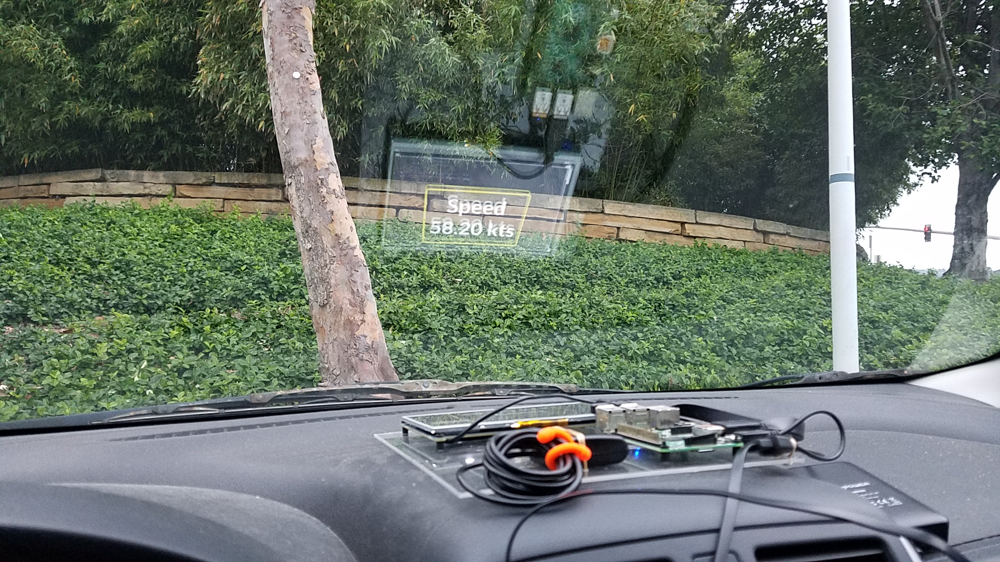

# Building and Customizing your own Nav Server
We want to have a Nav Server:
- Able to read from different sources (NMEA Serial port, TCP, whatever)
- Able to compute data
- Able to send or broadcast data on several channels
- Able to run even if no WiFi network is available
- Able to provide a Web Graphical User Interface, accessing server side REST Services

The [`NMEA.multiplexer`](../NMEA.multiplexer/README.md) is able to read, compute, and broadcast data, also accessible from a REST client.

To work even if no WiFi network is available, the best is probably to have the Raspberry Pi emit its own.
This is totally feasible, follow the instructions provided [here](https://learn.adafruit.com/setting-up-a-raspberry-pi-as-a-wifi-access-point/install-software).

Now, depending on the configuration you want, several different components, from several different modules in this project
will be required or not.

We will show here how to compose a custom server, based on your own needs.

The HTTP/REST server we use here is the one you find in the `common-utils` module.
To minimize the footprint of the final application, all the static pages required by the web interface will
be served from a _**single archive**_, as this feature is available from the HTTP Server we use here.

> Note:
> The operations on a Serial Port would require `libRxTx`, and this dependency cannot be taken care of by Gradle.
> To be able to use it outside gradle, run (on Linux/Debian/Raspberry Pi), you need to install this package:
```bash
 sudo apt-get install librxtx-java
```

> Another note:
> We want to footprint of all this to be as minimal sa possible. We will *not* have to clone
> the git repo on the destination machine, many of its components might not be required.

## Close to "production"
It will not require the `git` repository to be cloned on the machine the server runs on.

We will:
- Clone the repository on one machine, used to build the required components
- Archive all the needed artifacts in a single archive (a `tar.gz` here), which can then be distributed
- Transfer it to the final destination machine, where the archive will be expanded (aka un-archived)
- Possibly modify some files
    - the `/etc/rc.local` for the server to start when the machine boots
    - the `properties` file that contains all the server's runtime parameters and definitions

Several of those steps can be scripted or automated, as you would see in the examples provided here.
This basically all you need to get up and running.

We provide here **_several sub-directories_**, from which you will be able to run some provided scripts
building several flavors of Nav Server flavors.

They all come with at least 3 files:
- `builder.sh`, _the one you run_, that will trigger all the required others
- `build.gradle`, the Gradle script used for the build process, probably the most important here
- `to.prod.sh`, eventually triggered by `builder.sh`, which will take care of building your application and archiving the produced artifacts.

Assuming that you've found (or defined for yourself) the configuration of your dreams, **_all_** you will need to do is:
- From the Raspberry Pi used for the build, where you've clone the `git` repository: `cd full.server` (where `full.server` is your dream directory)
- `./builder.sh`
    - During this step, you will have provided - from the command line - the name of the archive to produce, let's call it `NMEADist` as an example.
- Now transfer the generated archive to the destination Raspberry Pi:
    - `scp NMEADist.tar.gz pi@destination.pi:~`
    - `ssh pi@destination.pi`
    - `tar -xzvf NMEADist.tar.gz`
    - `cd NMEADist`
    - `./start-mux.sh`

That's it, your server is up and running! (you might have modified the `properties` file, like `nmea.mux.gps.log.properties`, though. See the [technical manual](../NMEA.multiplexer/manual.md) for details)

Now, from any browser on any machine connected on the server (Raspberry Pi)'s network,
you can reach <http://destination.pi:[port]/zip/index.html>.

In the URL above, `destination.pi` is the name (or IP address) of the machine the server runs on, and `[port]` is the one defined in the mux's properties file,
like in
```properties
with.http.server=yes
http.port=9999
```
This properties file is yours to tweak as needed.

To summarize, you went through the following steps:
- build
- archive
- transfer
- un-archive        
- run


Pick and choose your features in other modules, grab the web ages you need, modify the `index.html`, etc, and
run the script `to.prod.sh` to package everything for distribution.

The "_pick and choose_" part could be scripted as well, as seen in the provided examples.

This project is not supposed to contain any source file except web resources (archived).

It pulls the `NMEA.multiplexer`, `RESTNavServer`, and the `NMEA.mux.extensions` projects (or whatever you want or need).
This is what you would tweak to fit your requirements.

When available, the file `rc.local` is to give you some inspiration, so you can modify the one in `/etc/rc.local`
on the destination machine to start the Multiplexer at boot time.

The script `to.prod.sh` (available in each directory) is not carved in stone. It is also here for inspiration.

> Note: To make sure the runtime components will be 100% compatible with your Raspberry Pi target, I use to run this build _on a Raspberry Pi_ (not on a Windows or Mac laptop, carefull with Linux, probably OK with a Raspberry Pi Desktop).
> The (only) problem that can potentially show up is a Java version mismatch.
> The build process might be a bit too heavy for a Raspberry Pi Zero...
> I usually build on a bigger board (A, or B), and then `scp` the result to a Raspberry Pi Zero if that is the one I want to run my server on,
> as shown above with the `scp` command.

## Warning!
This project directory is a play ground, again, it is here for **you** to _compose_ your own server.

**You**.

Means not **me**. 🤓

## Examples (for inspiration)
> Note: The Raspberry Pi (pretty much all models) can host the navigation server, along with its REST/HTTP companion,
> without problem.
> One possibly challenging thing though, would be to run the Web GUI on the Graphical Desktop.
> This turns out to be quite demanding, and this requires a more beefy Raspberry Pi.
> As usual, and as everywhere, a GUI is something very demanding.

The examples list contains
- [Full Navigation Server](#full-nav-server)
    - Read Serial port (NMEA, GPS), log, display on small screen, TCP rebroadcast, Web Interface, Celestial Computer, Tide Computer, etc
- [Minimal Navigation server](#minimal-multiplexer)
    - Read a GPS (or NMEA Station), and log data into a file. Suitable for running, kayaking, and such small configurations.
- [Extended Navigation Server](#full-nav-server-extended)
    - Based on the `Full Navigation Server` above, shows how to add 2 push-buttons to the configuration, for the user to interact with the software. 
- [Extended Navigation Server, #2](#small-nav-server-extended)
    - Based on the `Full Navigation Server` above, shows how to add 2 push-buttons to the configuration, for the user to interact with the software, including shutting down the machine. Also has a GPS on a bonnet. 
- [Embarked Head Up display](#head-up-display)
    - Uses the Graphical Desktop to display a Web Interface in a browser. More demanding than the others, requires a more powerful config (Raspberry Pi 3B+). 

### Full Nav Server 
All features: NMEA multiplexer, Web Interface, Celestial Computer, Tides, Almanacs publication, Weather Wizard, Small screens, ...


```
 $ cd full.server
 $ ./builder.sh
```


### Minimal Multiplexer
```
 $ cd minimal.mux
 $ ./builder.sh
```
See in the `builder.sh` how web resources are copied, and from where.
Then look into `to.prod.sh` how it launches a Gradle build, and in the corresponding `build.gradle`
that it only depends on `NMEA.multiplexer`.

TODO Screenshots of the settings (hardware).

### Full Nav Server, extended 
all features: NMEA multiplexer, Celestial Computer, Tides, Almanacs publication, Weather Wizard, Small screens, ...

The idea here is to show how to _extend_ the classes provided in the project to implement your own extra features.
```
 $ cd full.server.extended
 $ ./builder.sh
```
### Small Nav Server, extended 
all features: NMEA multiplexer, Celestial Computer, Tides, Almanacs publication, Weather Wizard, Small screens, ...
Push buttons for interaction with the software, embedded GPS, LiPo battery.

### Head-Up-Display
With a 5" or 7" TFT screen
```
 $ cd head.up
 $ ./builder.sh
```
Or in details:

- Use `switch2tftscreen` (at the root of the project)
- Reboot
<!-- - SSH to the RPi
        - Start the Multiplexer or NavServer of your choice (you can use the `./demoLauncher.sh` in `launchers` under `RESTNavServer`).
        - `sudo startx` (should start the Raspbian desktop on the TFT) -->

You can boot directly to the Graphical Desktop (`sudo raspi-config`), and automatically start a browser on a given URL as
soon as the Desktop is up and running.

To do that, you need to have Chromium installed, and boot to the Graphical Desktop.

To start Chromium when the Desktop starts, and load one or several URLs (in different tabs), edit the file named
`~/.config/lxsession/LXDE-pi/autostart`, and add, at the end, the following lines:
```
@chromium-browser --incognito --kiosk [--force-device-scale-factor=0.90] http://localhost:9999/web/nmea/headup.html \
                                      [url.2] \
                                      [url.3] \
                                      [url.4]
```
It will start Chromium in `kiosk` (aka full screen) mode, and load the URLs mentioned above.

##### Also important here
A Graphical Desktop will by default go to sleep if not solicited for a while, and we do not want that.
To fix it: 
- Edit `/etc/lightdm/lightdm.conf`
- Have a/the line that starts with `xserver-command=` to look like `xserver-command=X -s 0 -dpms`

This will take effect after reboot. 

#### With a small USB GPS like `U-blox 7`
The [`U-blox 7`](https://www.amazon.com/HiLetgo-G-Mouse-GLONASS-Receiver-Windows/dp/B01MTU9KTF/ref=pd_lpo_vtph_107_lp_img_3?_encoding=UTF8&psc=1&refRID=BNCKEAMR8044EX51JYM5) is a small and cheap GPS you can plug with a USB socket.
And it works.

```
$ lsusb
...
Bus 001 Device 006: ID 1546:01a7 U-Blox AG 
...
```

<!--
```
$ sudo lsusb -v
...
Bus 001 Device 006: ID 1546:01a7 U-Blox AG 
Device Descriptor:
  bLength                18
  bDescriptorType         1
  bcdUSB               1.10
  bDeviceClass            2 Communications
  bDeviceSubClass         0 
  bDeviceProtocol         0 
  bMaxPacketSize0        64
  idVendor           0x1546 U-Blox AG
  idProduct          0x01a7 
  bcdDevice            1.00
  iManufacturer           1 u-blox AG - www.u-blox.com
  iProduct                2 u-blox 7 - GPS/GNSS Receiver
  iSerial                 0 
  bNumConfigurations      1
  Configuration Descriptor:
    bLength                 9
    bDescriptorType         2
    wTotalLength           62
    bNumInterfaces          2
    bConfigurationValue     1
    iConfiguration          0 
    bmAttributes         0xc0
      Self Powered
    MaxPower              100mA
    Interface Descriptor:
      bLength                 9
      bDescriptorType         4
      bInterfaceNumber        0
      bAlternateSetting       0
      bNumEndpoints           1
      bInterfaceClass         2 Communications
      bInterfaceSubClass      2 Abstract (modem)
      bInterfaceProtocol      1 AT-commands (v.25ter)
      iInterface              0 
      CDC Header:
        bcdCDC               1.10
      CDC ACM:
        bmCapabilities       0x02
          line coding and serial state
      CDC Call Management:
        bmCapabilities       0x03
          call management
          use DataInterface
        bDataInterface          1
      Endpoint Descriptor:
        bLength                 7
        bDescriptorType         5
        bEndpointAddress     0x83  EP 3 IN
        bmAttributes            3
          Transfer Type            Interrupt
          Synch Type               None
          Usage Type               Data
        wMaxPacketSize     0x0040  1x 64 bytes
        bInterval             255
    Interface Descriptor:
      bLength                 9
      bDescriptorType         4
      bInterfaceNumber        1
      bAlternateSetting       0
      bNumEndpoints           2
      bInterfaceClass        10 CDC Data
      bInterfaceSubClass      0 Unused
      bInterfaceProtocol    255 Vendor specific
      iInterface              0 
      Endpoint Descriptor:
        bLength                 7
        bDescriptorType         5
        bEndpointAddress     0x01  EP 1 OUT
        bmAttributes            2
          Transfer Type            Bulk
          Synch Type               None
          Usage Type               Data
        wMaxPacketSize     0x0040  1x 64 bytes
        bInterval               0
      Endpoint Descriptor:
        bLength                 7
        bDescriptorType         5
        bEndpointAddress     0x82  EP 2 IN
        bmAttributes            2
          Transfer Type            Bulk
          Synch Type               None
          Usage Type               Data
        wMaxPacketSize     0x0040  1x 64 bytes
        bInterval               0
Device Status:     0x0001
  Self Powered
 
``` 
-->
```
$ dmesg | grep -i gps
[  646.871190] usb 1-1.3: Product: u-blox 7 - GPS/GNSS Receiver
```

Seems to mount on `/dev/ttyACM0`

> _Note_:
> In case you have problem reading `/dev/ttyACM0`, create a symbolic link
> ```bash
> $ sudo ln -s /dev/ttyACM0 /dev/ttyS80
> ```
> Then try reading or writing on `/dev/ttyS80`
>
> To unlink:
> ```bash
> $ sudo unlink /dev/ttyS80
> ```

To check the device, run the script `runGPSSample.sh` in the `Serial.IO` module, after modifying the parameters (USB port)
```
$ ./runGPSSample.sh
Make sure the GPS is connected it through its USB cable.
Assuming Linux/Raspberry Pi
Executing sudo java -Dserial.port=/dev/ttyS80 -Dbaud.rate=4800 -Djava.library.path=/usr/lib/jni -cp ./build/libs/Serial.IO-1.0-all.jar:/usr/share/java/RXTXcomm.jar sample.GPSReader ...
Enter [Return]

Stable Library
=========================================
Native lib Version = RXTX-2.2pre2
Java lib Version   = RXTX-2.1-7
WARNING:  RXTX Version mismatch
	Jar version = RXTX-2.1-7
	native lib Version = RXTX-2.2pre2
RXTX Warning:  Removing stale lock file. /var/lock/LCK..ttyS80
== Serial Port List ==
-> /dev/ttyS80
======================
Opening port /dev/ttyS80:4800
GPS connected: true
IO Streams initialized
$GPTXT,01,01,02,u-blox ag - www.u-blox.com*50
$GPTXT,01,01,02,HW  UBX-G70xx   00070000 FF7FFFFFo*69
$GPTXT,01,01,02,ROM CORE 1.00 (59842) Jun 27 2012 17:43:52*59
$GPTXT,01,01,02,PROTVER 14.00*1E
$GPTXT,01,01,02,ANTSUPERV=AC SD PDoS SR*20
$GPTXT,01,01,02,ANTSTATUS=OK*3B
$GPTXT,01,01,02,LLC FFFFFFFF-FFFFFFFF-FFFFFFFF-FFFFFFFF-FFFFFFFD*2C
$GPRMC,162753.00,V,,,,,,,040519,,,N*70
$GPVTG,,,,,,,,,N*30
$GPGGA,162753.00,,,,,0,00,99.99,,,,,,*62
$GPGSA,A,1,,,,,,,,,,,,,99.99,99.99,99.99*30
$GPGSV,1,1,01,27,,,20*7F
$GPGLL,,,,,162753.00,V,N*4E
$GPRMC,162754.00,V,,,,,,,040519,,,N*77
$GPVTG,,,,,,,,,N*30
$GPGGA,162754.00,,,,,0,00,99.99,,,,,,*65
$GPGSA,A,1,,,,,,,,,,,,,99.99,99.99,99.99*30
$GPGSV,1,1,01,27,,,20*7F
$GPGLL,,,,,162754.00,V,N*49
$GPRMC,162755.00,V,,,,,,,040519,,,N*76
$GPVTG,,,,,,,,,N*30
... 
```

Start `./demoLauncher.sh` or its equivalent, choose option `4`.

#### To automate all this, for the web page to be displayed when the server (Raspberry Pi) boots:
- Using `raspi-config`, choose to boot to the Graphical Desktop
- in `/etc/rc.local`, start the Navigation Server with the appropriate properties file
```bash
echo "-- From /etc/rc.local --"
echo "Now starting NMEA Multiplexer"
cd ~pi/raspberry-coffee/RESTNavServer/launchers
# Wait...
sleep 20
nohup ./runNavServer.sh --mux:nmea.mux.gps.properties --no-date &
cd -
```
- Make sure the file `~/.config/lxsession/LXDE-pi/autostart` is modified to open `Chromium` on the right page.
- Make sure you've disabled the screen sleep as described above

> Note: This config does not need any network, it runs in standalone, but nothing is preventing any network operation. You can can add one (hotspot or not) if needed. 


From a browser, reach <http://localhost:9999/web/nmea/headup.html>.
The `mirror` and `star-wars` effect is all done in CSS.


_Click the pictures to see them bigger._

|               Setting                   |           Direct Position         | 
|:---------------------------------------:|:---------------------------------:|
|  | |
| Direct Heading | Direct Speed |
| | |
| Reflected Position | Reflected Heading | 
| | |
| Reflected Speed | In the car | 
| | |
| | |

You can see the data displayed on the windshield and still look through it.

Distortion of the reflected screen can be controlled in the CSS Stylesheet, by adjusting the variables `perspective`, `rotateX` and `scale-y-factor`.
```css
	:root {
		--perspective: 50em;
		--rotateX: -50deg;
		--scale-y-factor: 1.5;
	}
```

> In the car, with an `OBD` (On Board Diagnostic) interface (usually using Bluetooth), we could display all kind of data.
> This will be another project.

> Note: Try on a Raspberry Pi 3B+, the client part (running in the browser) is a bit demanding...

### For logged data
See in the `NMEA.multiplexer` project
- `log.analyzer.sh`
- `log.shrinker.sh`
- `log.to.kml.sh`
- `log.to.gps.sh`

In the `NMEA.mux.WebUI` project, `logged` folder
- `concat.sh`

## TODO REST clients in other projects
<https://github.com/OlivierLD/raspberry-coffee/blob/master/Project.Trunk/REST.clients/TCP.Watch.01/README.md>

---

... More to come (coming)

<!-- TODO: Docker images ? -->

- With SSD1306 32x128
- With SSD1306 64x128. &#9989; Done
- With Nokia5110. &#9989; Done
- With UART GPS
- Push Buttons and Switches. &#9989; Done

### For the logger:
- 2 Bonnets:
    - One for the GPS ([Adafruit Ultimate GPS](https://www.adafruit.com/product/746))
    - Another on top, with a HAT (Hardware Attached on Top) like this:


See [here](../Project.Trunk/REST.clients/TCP.Watch.01#raspberry-pi-zero-w-and-ssd1306-128x64) for the wiring diagrams.

---
