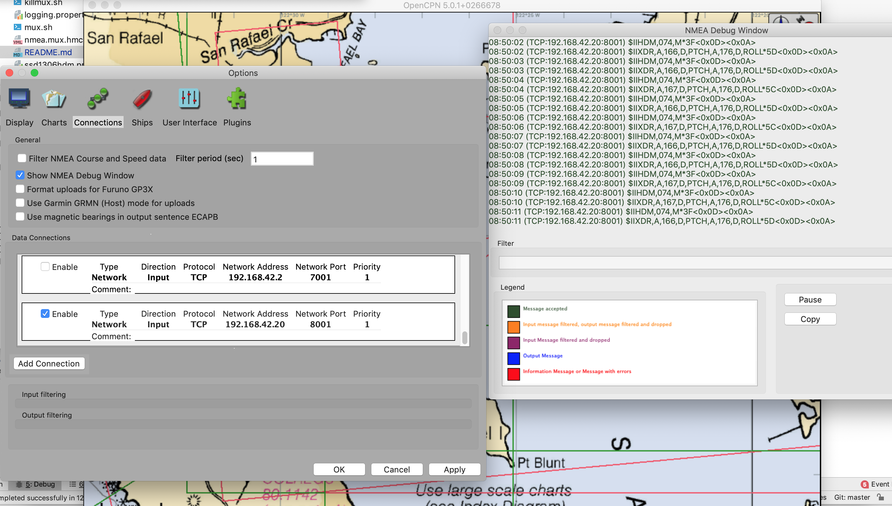

## Extending `NMEA.multiplexer`: A Standalone Compass. 
See in the `build.gradle`, this project involves others: 
- the `NMEA.multiplexer`
- the `NMEA.mux.extensions`

It's all driven by `nmea.mux.hmc5883l.oled.yaml`.

Use it like 
```
$ ./mux.sh nmea.mux.hmc5883l.oled.yaml
```

It has no Web User Interface for now.


The `stl` files to build the gimbal are [here](https://github.com/OlivierLD/3DPrinting/tree/master/OpenSCAD/Gimbal).

## Rationale
The idea is to have a standalone compass, that can communicate with the rest of the network
where other devices can be plugged.

We will be using 
- an `hmc5883l` input channel to read the magnetometer data
- a `tcp` forwarder to broadcast the `HDM` and `XDR` `PTCH` and `ROLL` sentences
- a custom forwarder (small OLED Screen) to display the magnetometer data, next to it.

The `yaml` file looks like this:
```yaml
name: "Read a HMC5883L, forward on TCP & OLED Screen."
context:
  with.http.server: true
  http.port: 9991
  init.cache: true
  default.declination: 14
channels:
  - type: hmc5883l
    device.prefix: II
    verbose: false
    sentence.filters: HDM,XDR
    heading.offset: 0
    damping.size: 5
    read.frequency: 1000  # Or less...
    hmc5883l.cal.prop.file: hmc5883l.cal.properties
forwarders:
  - class: nmea.forwarders.SSD1306_HDMDisplay
    properties: ssd1306hdm.properties
  - type: tcp
    port: 8001
```

The `tcp` data can then be used in input by another instance the `NMEA.multiplexer` (or anything understanding NMEA over TCP, like OpenCPN, on the same network.
 
- On the machine running the magnetometer instance:
```bash
compass.mux $ ./mux.sh nmea.mux.hmc5883l.oled.yaml 
``` 
- In OpenCPN:
  
  
- From another `NMEA.multiplexer` (here a `RESTNavServer`):
With a `yaml` file like that:
```yaml
channels:
  - type: tcp
    server: 192.168.42.20
    port: 8001
    verbose: true
  - type: . . .
```
See output from the first `NMEA.multiplexer` at the bottom of the console below.
```
RESTNavServer/launchers $ ./runNavServer.sh --mux:nmea.mux.gps.hdm.yaml 
----------------------------
Usage is ./runNavServer.sh [-p|--proxy] [-m:propertiesfile|--mux:propertiesfile] [--no-date] [--sun-flower]
     -p or --proxy means with a proxy
     -m or --mux points to the properties file to use for the Multiplexer, default is nmea.mux.properties
     -sf or --sun-flower means with Sun Flower option (extra Request Manager)
     --no-date does not put any GPS date or time (replayed or live) in the cache (allows you to use a ZDA generator)
     --no-rmc-time will NOT set rmc time (only date & time). Usefull when replaying data
----------------------------
⚓ Starting the Navigation Rest Server 🌴
----------------------------------------
Args are --mux:nmea.mux.gps.hdm.yaml
----------------------------------------
Managing prm --mux:nmea.mux.gps.hdm.yaml
Detected properties file nmea.mux.gps.hdm.yaml
>>> Warning: Bumping Max Memory to 1Gb
Using properties: -Djava.library.path=/Library/Java/Extensions -DdeltaT=69.2201 -Dmux.infra.verbose=true -Dtide.verbose=false -Dastro.verbose=false -Dimage.verbose=false -Dgrib.verbose=false -Dais.cache.verbose=false -Dais.verbose=false -Dwith.sun.flower=false -Dmux.properties=nmea.mux.gps.hdm.yaml -Ddefault.mux.latitude=37.7489 -Ddefault.mux.longitude=-122.5070 -Dpolar.file.location=./sample.data/polars/CheoyLee42.polar-coeff -Dcalculate.solar.with.eot=true -Drmc.verbose=false -Dzda.verbose=false -Xms64M -Xmx1G
Running on Mac
Running java -cp ../build/libs/RESTNavServer-1.0-all.jar:./libs/RXTXcomm.jar  -Djava.library.path=/Library/Java/Extensions -DdeltaT=69.2201 -Dmux.infra.verbose=true -Dtide.verbose=false -Dastro.verbose=false -Dimage.verbose=false -Dgrib.verbose=false -Dais.cache.verbose=false -Dais.verbose=false -Dwith.sun.flower=false -Dmux.properties=nmea.mux.gps.hdm.yaml -Ddefault.mux.latitude=37.7489 -Ddefault.mux.longitude=-122.5070 -Dpolar.file.location=./sample.data/polars/CheoyLee42.polar-coeff -Dcalculate.solar.with.eot=true -Drmc.verbose=false -Dzda.verbose=false -Xms64M -Xmx1G -Djava.library.path=/Library/Java/Extensions navrest.NavServer
HTTP Port defaulted to 9999
From navrest.NavServer, running on port 9999
	>> 1,584,893,265,450 - Starting HTTP server
	>> 1,584,893,265,450 - adding AstroRequestManager
Using Delta-T:69.220100
1,584,893,265,475 - Port open: 9999
1,584,893,265,482 - http.HTTPServer now accepting requests
	>> 1,584,893,265,551 - adding TideRequestManager
Definition Name: With a GPS, and a TCP Magnetometer
{with.http.server=true, http.port=7777, init.cache=true}
	>> 1,584,893,269,535 - Constructor nmea.mux.GenericNMEAMultiplexer, Initializing RESTImplementation...
nmea.consumers.reader.TCPReader: There are 3 listener(s)
	>> 1,584,893,269,669 - RESTImplementation initialized.
	>> 1,584,893,269,674 - NMEADataClient: Starting nmea.consumers.client.TCPClient...
>> nmea.consumers.reader.TCPReader: Reader Running
	>> 1,584,893,269,686 - nmea.mux.GenericNMEAMultiplexer constructor completed.
	>> 1,584,893,269,686 - adding GenericNMEAMultiplexer
	>> 1,584,893,269,688 - adding ImgRequestManager
	>> 1,584,893,269,693 - adding GRIBRequestManager
	>> 1,584,893,269,701 - End of NavServer constructor
Received from TCP :$IIHDM,075,M*3E
Received from TCP :$IIXDR,A,167,D,PTCH,A,176,D,ROLL*5C
Received from TCP :$IIHDM,075,M*3E
Received from TCP :$IIXDR,A,167,D,PTCH,A,176,D,ROLL*5C
Received from TCP :$IIHDM,074,M*3F
Received from TCP :$IIXDR,A,167,D,PTCH,A,176,D,ROLL*5C
Received from TCP :$IIHDM,074,M*3F
Received from TCP :$IIXDR,A,167,D,PTCH,A,176,D,ROLL*5C
Received from TCP :$IIHDM,074,M*3F
Received from TCP :$IIXDR,A,167,D,PTCH,A,176,D,ROLL*5C
Received from TCP :$IIHDM,074,M*3F
Received from TCP :$IIXDR,A,166,D,PTCH,A,176,D,ROLL*5D
Received from TCP :$IIHDM,074,M*3F
Received from TCP :$IIXDR,A,167,D,PTCH,A,176,D,ROLL*5C
^CShutting down multiplexer nicely.
 <- HTTP: Ctrl+C intercepted.
- Stop reading nmea.consumers.reader.TCPReader
TCP Socket:Socket closed
>> nmea.consumers.reader.TCPReader: Reader Setting Completed
- Stop writing to nmea.forwarders.TCPServer
Received an exit signal (path)
Exiting -> Exiting
Bye from HTTP
HTTP Thread, end of run.
HTTPServer Dead.
Bye now ✋
```  

> Note:
> In case you are only interested in the heading - for example, you also have the possibility
> to have the first `NMEA.multiplexer` feeding a cache, that can then be accessed by some REST requests, like
```
 GET http://192.168.42.20:9999/mux/cache
```
> This returns a JSON object, from which the expected heading can be obtained
```json
{
  ...
    "HDG mag.": {
        "angle": 74.0
    },
  ...
}
```
