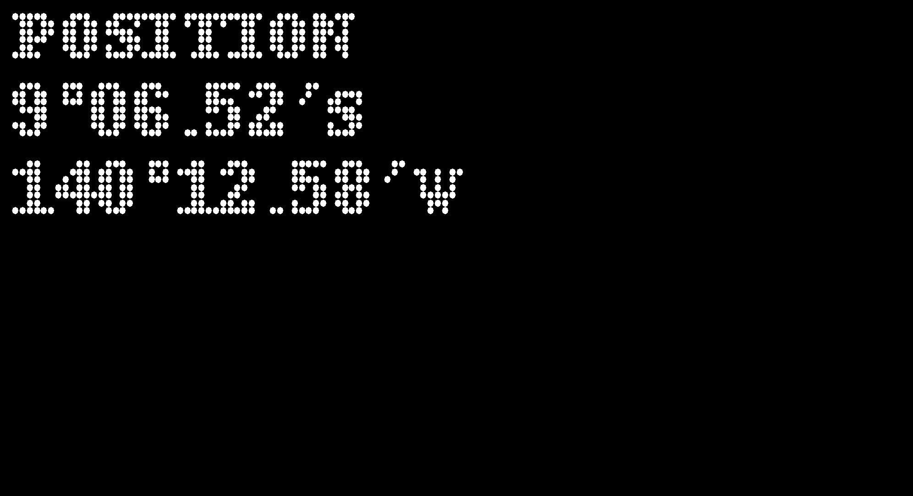
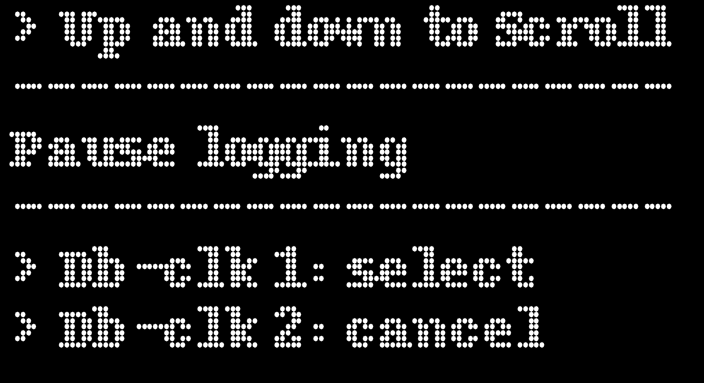
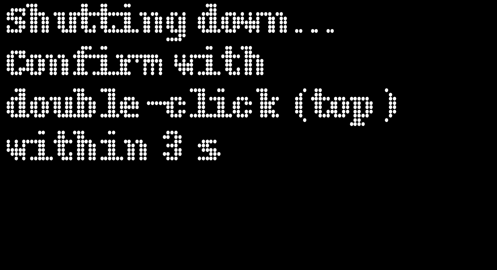
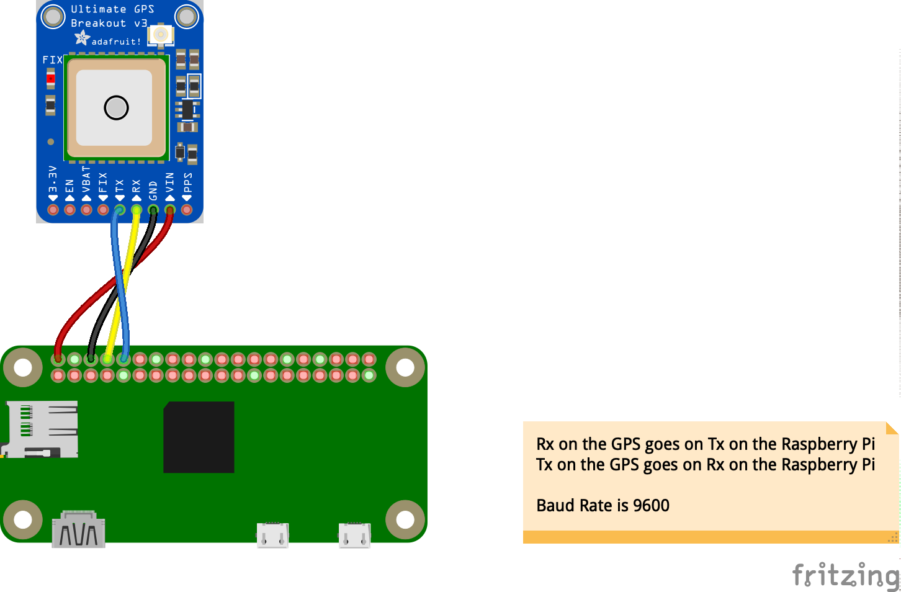
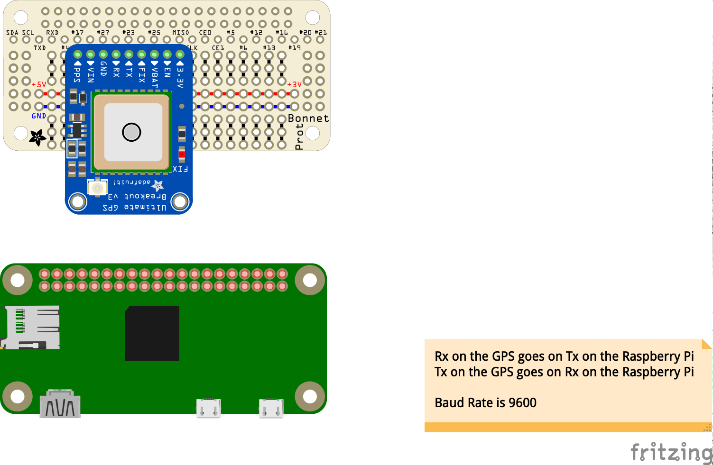
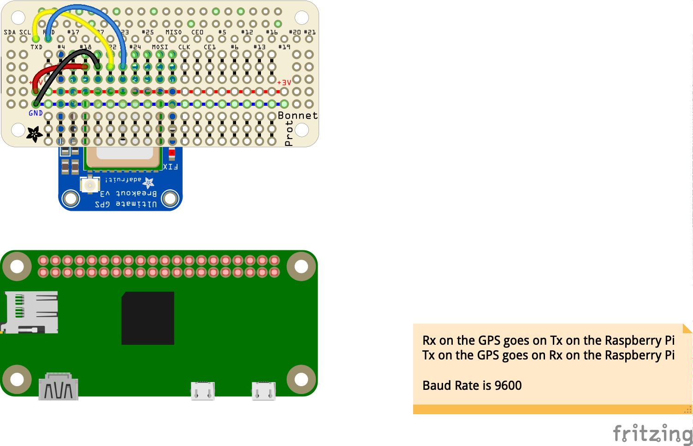
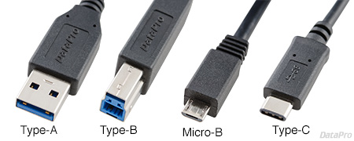

# WIP, Full NavServer running on a Raspberry Pi Zero W
**Features**:
- 2 [Adafruit Bonnets](https://www.adafruit.com/product/3203), $4.50 each
    - One with a [132x64 oled screen](https://www.adafruit.com/product/938), $19.95, 2 push buttons, 1 switch for the power supply
    - One with the [Adafruit Ultimate GPS](https://www.adafruit.com/product/746), $39.95, and a [BME280](https://www.adafruit.com/product/2652) (Humidity, Temperature, Atmospheric Pressure), $19.95
- LiPo battery
- Buttons can be used to scroll through the different displays
    - also features a "local" menu (to be browsed with the buttons) that can execute different tasks, easy to customize like
        - Pausing the logging
        - Resuming the logging
        - Shutting down the Multiplexer
        - Shutting down the machine (see below)
        - etc...
    - Activate a screen saver mode
- A specific combination on the buttons can shut down the machine.

> Prices, August 2019.

---

This example shows how to _**extend**_  the `NavServer`.

It shows how to add features like **TWO** push-buttons, and take ownership of a screen (Nokia, SSD1306...)

It comes with a class named `navserver.ServerWithKewlButtons`, that extends the `navrest.NavServer`.
As a result, it's driven by the exact same `properties` file.

To see how to interact with the buttons (to start and stop the logging for example, or
to shutdown the whole server), look for the variables named `pbmOne` and `pbmShift`.

Implements `simple-click`, `double-click`, and `long-click`.

```java
final static PushButtonMaster pbmOne = new PushButtonMaster();
final static PushButtonMaster pbmTwo = new PushButtonMaster();
```

> Note: the code to add here is just there for the buttons management. There is _absolutely no code_
> to add for the `BME280`, the GPS, or the `SSD1306` screen. It is all taken care of by the properties files.

> See `nmea.mux.gps.log.properties` to know how to reference those devices, and 
> `ssd1306.properties` to see how to choose the data to display on the oled screen. 

This is built just like the other examples in this module, just run
```
 $ ./builder.sh
 ```
 and follow the instructions in the console.

---

### A first prototype
| Pressure (BME280) | Position (GPS) | Side view |
|:--:|:--:|:--:|
|  |  |  |
|  |  | On top, it is powered by a USB Cable, it can also be powered by a LiPo battery at the bottom (left, 2200mAH) |

### Screenshots

| NMEA Data | Local Menu | Local Menu, 2 |
|:---------:|:---------:|:---------:|
|  |  |  |
| Screen Saver (one dot blinking) | Complete Shutdown |
|  |  |

### Wiring






### Extras
- Cue-card for the UI (depends on your implementation):
```
Button-2 + LongClick on Button-1: Shutdown (confirm with double-click within 3 seconds) 
DoubleClick on Button-1: Show local menu                                                
DoubleClick on Button-2: Screen Saver mode. Any simple-click to resume.
```

> To grant serial port access to user `pi`:
> ```
> $ sudo usermod -a -G tty pi
> ```
> In case you use a USB GPS, if it shows up on port `/dev/ttyACM0` and you have trouble reading it,
> do a 
> ```
> $ sudo ln -s /dev/ttyACM0 /dev/ttyS80
> ```
> then read the port `/dev/ttyS80`.

### Configurations
#### [Raspberry Pi Zero W](https://www.raspberrypi.org/products/raspberry-pi-zero-w/)
RAM: 512 Mb
- **_Good for logging_**
- A bit challenging when acting as a server (Web and REST), too small.
- With a 2200mAH LiPo battery, alive between 1:00:31pm and 8:05:57pm (lifespan: 7:05:26)
- With a TCP forwarder, it's OK to reach it from another device, running OpenCPN for example.
- Not enough memory for the xsl/fop/pdf publications

#### [Raspberry Pi 3 A+](https://www.raspberrypi.org/products/raspberry-pi-3-model-a-plus/)
RAM: 512 Mb

- More powerful that the `Raspberry Pi Zero`, obviously, but still a bit challenged 
when displaying the web pages involving intensive REST requests.
- With a TCP forwarder, it's OK to reach it from another device, running OpenCPN for example.
- Not enough memory for the xsl/fop/pdf publications

> _TODO_: Use a [Perma-Proto Pi HAT](https://www.adafruit.com/product/2310)

#### [Raspberry Pi 3 B](https://www.raspberrypi.org/products/raspberry-pi-3-model-b-plus/)
#### [Raspberry Pi 3 B+](https://www.raspberrypi.org/products/raspberry-pi-3-model-b-plus/)
RAM: 1Gb

- Still a bit challenged when displaying the web pages involving intensive REST requests.
- OK for almanac publication.
- With a TCP forwarder, it's OK to reach it from another device, running OpenCPN for example.

> _TODO_: Use a [Perma-Proto Pi HAT](https://www.adafruit.com/product/2310)

##### Raspberry Pi 4 B, with 4Gb of RAM
Easy: Perfect! 
All features available without having to wait.
- REST Server
- HTTP Server
- Publication of almanacs (Celestial and Tide)
- Sight reduction
- Logging
- Admin
- everything!

Emits its own network. Reachable from other devices (laptops, tablets, smart-phones, smart-watches)
through all available channels (ssh, vnc, tcp, http, etc).
No attached screen required, as ssh and VNC can do the job remotely.

> _Note_: HDMI ports are `Micro-HDMI`, power supply requires a `USB-C`, and not a `Micro-B` as the other models.
>  

_Remember_: the U in USB stands for Universal...

> TODO: Evaluate power consumption, and the way it heats up.

### About Some GPS devices I tested
#### Adafruit Ultimate GPS, 66 channels
- $39.95 for the [breakout board](https://www.adafruit.com/product/746) 
- $14.95 for the [antenna](https://www.adafruit.com/product/960)
- $3.95 for the [connector](https://www.adafruit.com/product/851)

Not 100% reliable, "sometimes" stops reading, I don't know why...

#### GT-3731-44 (USB, 44 channels)
It is an old one, I got mine around 2004. Works fine, but the date (RMC) recently got off by 7168 days! Probably some kind of overflow... `7168 = 0x1C00`

#### [U-blox7, small USB dongle](https://www.amazon.com/Diymall-G-Mouse-Glonass-Raspberry-Aviation/dp/B00NWEEWW8/ref=sr_1_3?keywords=Stratux+Vk-162+Remote+Mount+USB+GPS&qid=1569081064&s=wireless&sr=1-3-catcorr)
$13.49. Ok on a laptop, could not get it to read correctly on a Raspberry Pi.

#### [Stratux Vk-162 Remote Mount USB GPS](https://www.amazon.com/Navigation-External-Receiver-Raspberry-Geekstory/dp/B078Y52FGQ/ref=sr_1_1?keywords=Stratux+Vk-162+Remote+Mount+USB+GPS&qid=1569081064&s=wireless&sr=1-1-catcorr)
$17.98. Works OK everywhere I tested it! 👍

# TODO
- Describe the way to get to the log files, download, etc.
- Document Web UI: `runner.html`, `logMgmt.html`, etc.
- Simulator for the buttons. &#9989; Done!
- 3D printed enclosure, to contain the Raspberry Pi, the 2 bonnets, and a LiPo battery.
- Go to screen saver mode after a given amount of time of inactivity. &#9989; Done.
- Compare several Raspberry Pi versions (Zero, A, B). &#9989; Done.
