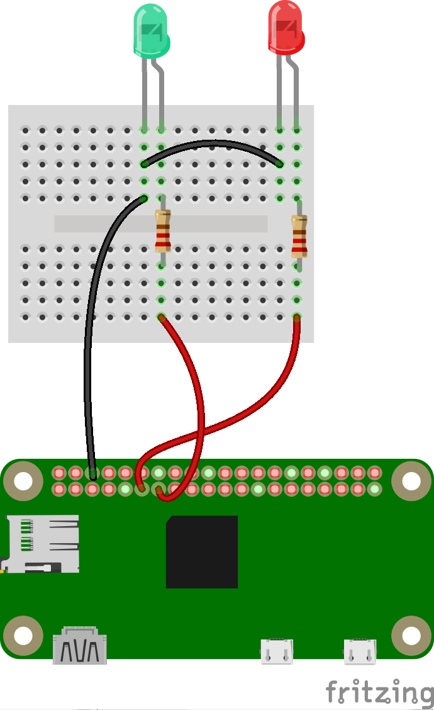

## Interacting manually with the GPIO pins

Scala comes with a REPL (Read Evaluate Print Loop). It can be seen as a Scala console...

It executes the Scala command you enter from the keybord, dynamically, without having to compiule or anything.
You type, it runs.

For example, you setup the following components:
<!--  -->


And from a Terminal running on the Raspberry PI, you can drive the leds plugged on the breadboard.

```bash
$> scala
Welcome to Scala 2.11.8 (Java HotSpot(TM) 64-Bit Server VM, Java 1.8.0_92).
Type in expressions for evaluation. Or try :help.

scala> :load gpio.sc

... Here you see for yourself ;)

scala> :quit
$>
```

The script above loads an `sc` file. Those are called `scala worksheets`, or `scala scripts` (hence the `sc` extension).
You can type the exact same statements they contain directly in the REPL.
The script named `gpio.sc` is part of this repo.

The worksheet is a commodity, it allows you to replay the work you've already done.

As seen above, you exit the REPL by typing `:quit`.

---
