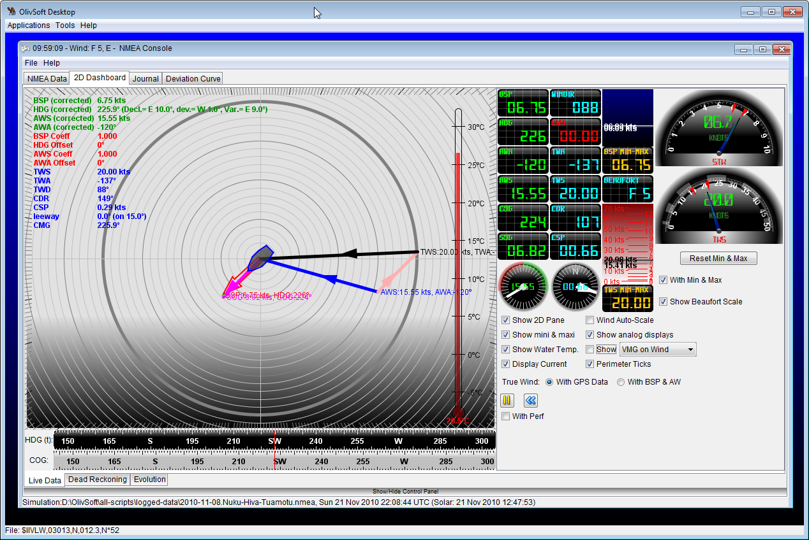
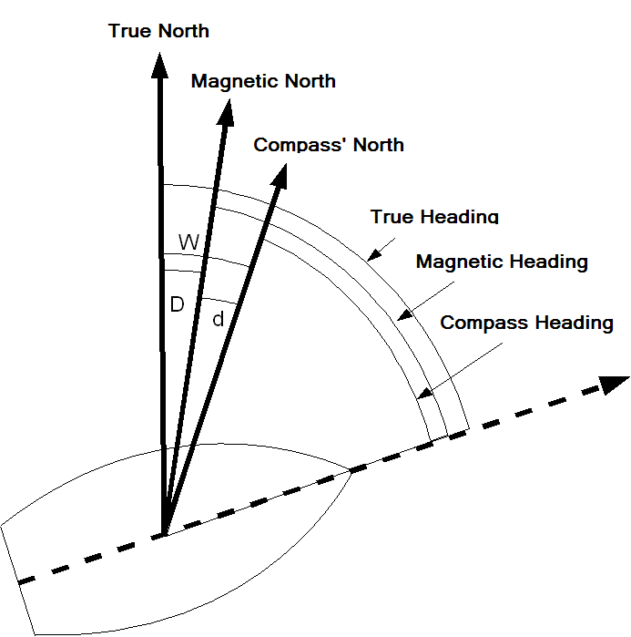
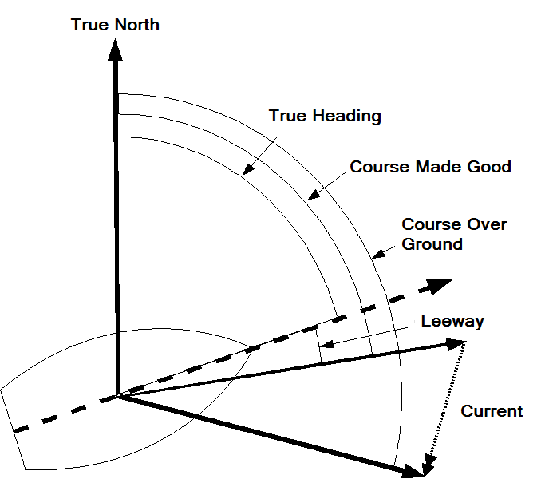
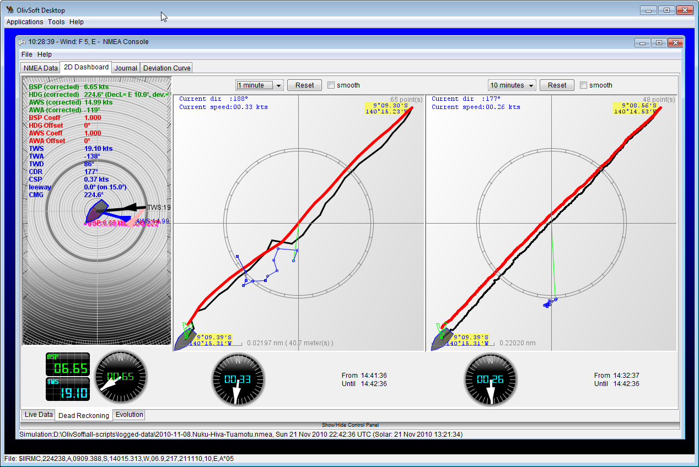

This is a Work In Progress... 🚧

## What a Nav Server has to address to be useful

### What is True Wind and Current calculation?
The calculations of the True Wind and the Current are not very complicated, but they rely on several parameters. Determining the values of those parameters is absolutely **_crucial_**.



The wind measured by the instruments is the **Apparent Wind**. This is the vectorial combination of the **True Wind** with the **Boat Speed and Course _over the ground_**. This is the wind you feel when riding your bike in no wind. You feel wind even if there is none.

The **True Wind** can be calculated by triangulation, as seen above. The **Apparent Wind** is in blue, the **True Wind** is in black, and the pink vector is generated by the boat speed and heading _over the ground_. And this is where it can become tricky.

| The Norths | Everything Else |
|:---:|:---:|
|||

You need the **True North** for any further computation, but what you have on board is a compass, showing you its **Compass' North**.

- The **True North** is the North of the charts
- Between the **True North** and the **Magnetic North** is the **Magnetic Declination (D)**, that varies with the date and the location
- Between the **Magnetic North** and the **Compass' North** is the **Compass' deviation (d)**, generated by the magnetic masses on board. It depends on the boat, and on its heading. You have to have on board a **deviation curve** that tells you the value of the deviation based on your heading.
- The algebraic sum of the deviation and the Declination is called the **Variation**, noted **W**.
- Once you have the **True Heading**, you need to get the **Course Made Good**, by adding (or substracting) the **leeway** to it. The **leeway** is generated by the wind and waves, it has to be **estimated** by the navigator. The leeway is an angle.
- And between the **Course Made Good** and the **Course Over Ground**, is the current. As seen above, the current is a vector (not an angle).

The value of the **deviation (d)** is an important parameter, directly impacting the value of the computing data like

- True Heading
- Course Made Good
- Course Over Ground

> Angles are positive in the East, negative in the West: example, D=14&deg;W will be considered as -14&deg;.
>
> Leeway is left or right (port or starboard). Left is negative, right is positive.
>
> This being said, we can come up with the following formulas:
> ```
> W = D + d
> HDG = HDC + W
> HDM = HDC + d
> HDG = HDM + D
>
> CMG = HDG + Leeway
> ```

**Reminder**
- `D`: Declination (magnetic).
- `d`: deviation (magnetic).
- `W`: Variation (magnetic).
- `HDG`: True Heading, based on the True North.
- `HDM`: Magnetic Heading, based on the Magnetic North.
- `HDC`: Compass Heading, based on the Compass' North.
- `CMG`: Course Made Good, the route on the water.

Elaborating the right deviation curve is an important step of the calibration.

It is _**not**_ possible to come up with an accurate computation of the current _without_ the right estimation of the leeway.

In theory, the current could be calculated by triangulation - like the true wind from the apparent Wind.

In practice, it is much more accurate over time.
<p style="text-align: center;">
  
</p>

On the figure above:
- The left pane shows the triangulation
- The middle pane compares the Course Over Ground (from the GPS) and the estimated position based on all the parameters above **on a 1 minute period**
- The right pane compares the Course Over Ground (from the GPS) and the estimated position based on all the parameters above **on a 10 minute period**

The experience does prove that the estimation on a several minutes period is much more accurate than the triangulation, mostly because of the movements of the boat, that impact the data read by the wind vane.

Honestly, **no** embarqued electronic station can come up with a right evaluation of
- The compass' deviation
- The leeway
- The current

Being able to _compute_ those data, and then _inject_ them in the NMEA stream is a real asset (current will be `VDR` - Set and Drift). The Raspberry Pi is perfectly equipped to take care of all that, and for a ridiculous energy consumption.

### What to calculate True Wind with?

This would seem obvious to some, but absurd to others. That's why we have this small explanation here.

For years, it was admitted that the true wind should be calculated with the **C**ourse **M**ade **G**ood (CMG), the **A**pparent **W**ind **A**ngle (AWA), **A**pparent **W**ind **S**peed (AWS), and **B**oat **SP**eed (BSP). The AWS and AWA are returned by the wind vane and anemometer, BSP by the speedometer (BSP is also called **S**peed **T**hrough **W**ater (STW)). The elaboration of the CMG is not trivial, as explained just above.

The reason for that is probably because this is all we had at that time.


_But picture that (and draw a sketch, if needed):_

You are "sailing" in **no** wind _at all_ (like in the San Francisco Bay in winter), and a 5 knot current is taking you out of the Bay (or inside, or wherever).

BSP is zero, **T**rue **W**ind **S**peed (TWS) is zero too, and in this case, AWS would be the speed of the current (5 knots), the AWA will depend on (but be equivalent to) the direction the current is taking you to.

If you calculate the TWS based on BSP, CMG, AWA and AWS, you will find a TWS equal to AWS - which is wrong because there is _<u>no</u> wind_, and a wrong TWA (and **T**rue **W**ind **D**irection (TWD) as well, no wind has no direction).

**_But_**, if you replace BSP with **S**peed **O**ver **G**round (SOG), and CMG with **C**ourse **O**ver **G**round (COG), you are back in business; COG is the current direction, SOG is the current speed.

Think about it.


This obviously requires the knowledge of SOG &amp; COG, returned by a GPS.


When the boat is moving, that eventually means that an accurate TWA and TWS (and TWD) is elaborated by an accurate knowledge of
- COG
- SOG
- AWA
- AWS
- CMG

In short: this is not trivial at all, by far, mostly because of CMG (see above for details).

You will notice that in the Console, you have the possibility to compute the True Wind from (BSP, CMG), or from (SOG, COG). This way you can have an idea of the difference it generates...
