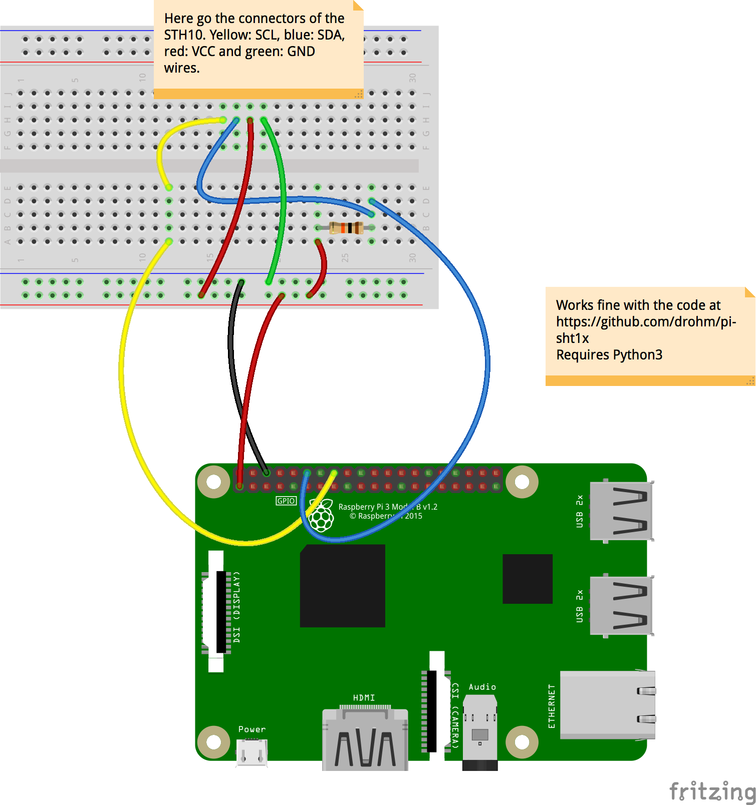
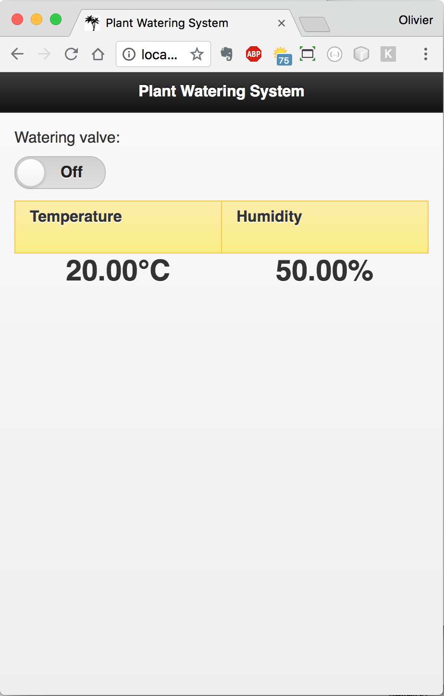

# WIP: Plant Watering System
We want to interface a Moisture/Humidity/Temperature sensor (https://www.adafruit.com/product/1298) with
a solenoid valve (https://www.adafruit.com/product/997), to irrigate the plants in need.

The `STH10` is a temperature and humidity sensor that can be stuck in the soil next to a plant.
The goal here is to read the humidity of the soil, and to water the plan when the humidity goes below a given threshold.

Watering is done by opening a solenoid valve connected to a tank of water.

#### Act 1:  Reading the STH10 Sensor. Getting there...
The goal here is to finally heave a Java implmentation of the code. See below.


We start from an Arduino sketch, that can read the STH10. The 10KOhms resistor is not to be forgotten.


This produces an output like that:


The idea here is to trigger the valve when the humidity goes below a given threshold.
The valve opens a pipe connected to a tank of water.
As the valve requires a 12 Volt power supply, it with be driven by relay.

On the Raspberry PI, the code at https://github.com/drohm/pi-sht1x works fine to read the` STH10`, with the following wiring:



---

Inspired from https://github.com/drohm/pi-sht1x and the [STH1x Specs](https://cdn-shop.adafruit.com/datasheets/Sensirion_Humidity_SHT1x_Datasheet_V5.pdf), the Java code is now also available in this project.
It relies on `PI4J`.
See in this project the class named `sensors.sth10.STH10Driver.java`.

> Note on the relay's wiring:
>
> The doc of the relay specifies that it should be fed with a `5V` power supply. This did not work for me on a single relay board.
> (surprisingly, it was working OK on a 2-relay board). The relay goes on when the program is started, does not go down until
> the program terminates with a `gpio.shutdown()`. The reason is that the states `HIGH` and `LOW` is evaluated by
> compairing the power supply with the signal. As the GPIO header of the Raspberry PI delivers `3.3V`, the comparison with `5V`
> never finds it eqUAL.
>
> Hooking the relay's power supply to `3.3V` fixes the issue, as the comparison with the power supply and the signal find them equals
> when the GPIO pin is `ON`.


---

### Triggering the valve
https://www.adafruit.com/product/997

With a Relay

##### To determine
- The humidity threshold beyond which to start watering
- How long should the watering last
- How long to wait after watering before re-start measurement

### Extras
- IoT and stuff...
- Reading the sensor as an I<small><sup>2</sup></small>C device?

### Power supply
12 & 5 Volts.
- 5 for the Raspberry
- 12 for the valve

### The Hardware
The tank, the hoses

### Usage

Run the script named `read.probe.sh`. It contains the program's arguments.

If it is run somewhere else than on a Rapsberry PI, data will be _simulated_.

To see the available program arguments:
```
$ java $JAVA_OPTIONS -cp $CP main.STH10 --help
+---------------------------------------
| Program arguments are:
+---------------------------------------
| --water-below:	Integer. Humidity threshold in %, default is --water-below:35, start watering below this value.
| --water-during:	Integer. In seconds, default is --water-during:10. Duration of the watering process.
| --resume-after:	Integer. In seconds, default is --resume-after:120. After watering, resume sensor monitoring after this amount of time.
| --verbose:	String. Verbose, default is --verbose:NONE, values can be 'NONE', 'STDOUT' or 'ANSI'.
| --data-pin:	Integer. BCM (aka GPIO) pin number of the DATA pin of the sensor. Default is --data-pin:18.
| --clock-pin:	Integer. BCM (aka GPIO) pin number of the CLOCK pin of the sensor. Default is --clock-pin:23.
| --relay-pin:	Integer. BCM (aka GPIO) pin number of the SIGNAL pin of the RELAY. Default is --relay-pin:17.
| --with-rest-server:	Boolean. Default 'false', starts a REST server is set to 'true'
| --http-port	Integer. The HTTP port of the REST Server. Default is 9999.
| --simulate-sensor-values:	Enforce sensor values simulation, even if running on a Raspberry PI. Default is 'false'
| --help	Display the help and exit.
+---------------------------------------
```

See below the output of a simulated session (see the `UnsatisfiedLinkError`)
```
$ ./read.probe.sh
Usage is ./read.probe.sh [debug]
   Use 'debug' to remote-debug from another machine.
+------- P L A N T   W A T E R I N G   S Y S T E M --------
| Start watering under 50% of humidity.
| Water during 10.000 secs
| Resume sensor watch 30.000 secs after watering.
+----------------------------------------------------------
Wiring:
       +-----+-----+--------------+-----++-----+--------------+-----+-----+
       | BCM | wPi | Name         |  Physical  |         Name | wPi | BCM |
       +-----+-----+--------------+-----++-----+--------------+-----+-----+
       |     |     | 3v3          | #01 || #02 |          5v0 |     |     |
       |  02 |  08 | SDA1         | #03 || #04 |          5v0 |     |     |
       |  03 |  09 | SCL1         | #05 || #06 |          GND |     |     |
       |  04 |  07 | GPCLK0       | #07 || #08 |    UART0_TXD | 15  | 14  |
       |     |     | GND          | #09 || #10 |    UART0_RXD | 16  | 15  |
 RELAY |  17 |  00 | GPIO_0       | #11 || #12 | PCM_CLK/PWM0 | 01  | 18  | DATA
       |  27 |  02 | GPIO_2       | #13 || #14 |          GND |     |     |
       |  22 |  03 | GPIO_3       | #15 || #16 |       GPIO_4 | 04  | 23  | CLOCK
       |     |     | 3v3          | #01 || #18 |       GPIO_5 | 05  | 24  |
       |  10 |  12 | SPI0_MOSI    | #19 || #20 |          GND |     |     |
       |  09 |  13 | SPI0_MISO    | #21 || #22 |       GPIO_6 | 06  | 25  |
       |  11 |  14 | SPI0_CLK     | #23 || #24 |   SPI0_CS0_N | 10  | 08  |
       |     |     | GND          | #25 || #26 |   SPI0_CS1_N | 11  | 07  |
       |     |  30 | SDA0         | #27 || #28 |         SCL0 | 31  |     |
       |  05 |  21 | GPCLK1       | #29 || #30 |          GND |     |     |
       |  06 |  22 | GPCLK2       | #31 || #32 |         PWM0 | 26  | 12  |
       |  13 |  23 | PWM1         | #33 || #34 |          GND |     |     |
       |  19 |  24 | PCM_FS/PWM1  | #35 || #36 |      GPIO_27 | 27  | 16  |
       |  26 |  25 | GPIO_25      | #37 || #38 |      PCM_DIN | 28  | 20  |
       |     |     | GND          | #39 || #40 |     PCM_DOUT | 29  | 21  |
       +-----+-----+--------------+-----++-----+--------------+-----+-----+
       | BCM | wPi | Name         |  Physical  |         Name | wPi | BCM |
       +-----+-----+--------------+-----++-----+--------------+-----+-----+
Jun 14, 2018 1:26:09 PM com.pi4j.util.NativeLibraryLoader load
SEVERE: Unable to load [libpi4j.so] using path: [/lib/raspberrypi/dynamic/libpi4j.so]
java.lang.UnsatisfiedLinkError: /private/var/folders/x4/l4ndqsqs0xb2gfdj99fl9xd80000gn/T/libpi4j8258820691126203472.so: dlopen(/private/var/folders/x4/l4ndqsqs0xb2gfdj99fl9xd80000gn/T/libpi4j8258820691126203472.so, 1): no suitable image found.  Did find:
	/private/var/folders/x4/l4ndqsqs0xb2gfdj99fl9xd80000gn/T/libpi4j8258820691126203472.so: unknown file type, first eight bytes: 0x7F 0x45 0x4C 0x46 0x01 0x01 0x01 0x00
	/private/var/folders/x4/l4ndqsqs0xb2gfdj99fl9xd80000gn/T/libpi4j8258820691126203472.so: stat() failed with errno=38
	at java.base/java.lang.ClassLoader$NativeLibrary.load(Native Method)
	at java.base/java.lang.ClassLoader.loadLibrary0(ClassLoader.java:2614)
	at java.base/java.lang.ClassLoader.loadLibrary(ClassLoader.java:2499)
	at java.base/java.lang.Runtime.load0(Runtime.java:812)
	at java.base/java.lang.System.load(System.java:1821)
	at com.pi4j.util.NativeLibraryLoader.loadLibraryFromClasspath(NativeLibraryLoader.java:159)
	at com.pi4j.util.NativeLibraryLoader.load(NativeLibraryLoader.java:105)
	at com.pi4j.wiringpi.Gpio.<clinit>(Gpio.java:189)
	at com.pi4j.io.gpio.RaspiGpioProvider.<init>(RaspiGpioProvider.java:69)
	at com.pi4j.io.gpio.RaspiGpioProvider.<init>(RaspiGpioProvider.java:51)
	at com.pi4j.platform.Platform.getGpioProvider(Platform.java:125)
	at com.pi4j.platform.Platform.getGpioProvider(Platform.java:118)
	at com.pi4j.io.gpio.GpioFactory.getDefaultProvider(GpioFactory.java:109)
	at com.pi4j.io.gpio.impl.GpioControllerImpl.<init>(GpioControllerImpl.java:53)
	at com.pi4j.io.gpio.GpioFactory.getInstance(GpioFactory.java:91)
	at sensors.sth10.STH10Driver.<init>(STH10Driver.java:83)
	at main.STH10.main(STH10.java:186)

>> Will simulate STH10
>> Will simulate Relay
Temp: 20.03 C, Hum: 50.41% (dew pt Temp: 9.43 C)
Temp: 20.77 C, Hum: 51.13% (dew pt Temp: 10.31 C)
Temp: 19.82 C, Hum: 50.97% (dew pt Temp: 9.40 C)

...

^C>> Relay is DOWN

Exiting
Simulated temperature between 19.82 and 20.77
Simulated humidity between 50.00 and 51.13
Bye-bye!
```

An ANSI version is available:
```
┏━━━━━━━━━━━━━━━━━━━━━━━━━━━━━━━━━━━━━━━━━━━━━━━━━━┓
┃              PLANT WATERING SYSTEM               ┃
┣━━━━━━━━━━━━━━━━━━━━━━━━━━━━━━━━━━━━━━━━━━━━━━━━━━┫
┃ Start watering under 35% of humidity.            ┃
┃ Water during 10.000 secs                         ┃
┃ Resume sensor watch 2 minutes after watering.    ┃
┣━━━━━━━━━━━━━━━━━━━━━━━━━━━━━━━━━━━━━━━━━━━━━━━━━━┫
┃ REST Server on port 1234                         ┃
┣━━━━━━━━━━━━━━━━━━━━━━━━━━━━━━━━━━━━━━━━━━━━━━━━━━┫
┃ Temp: 20.17 C, Hum: 30.23%                       ┃
┣━━━━━━━━━━━━━━━━━━━━━━━━━━━━━━━━━━━━━━━━━━━━━━━━━━┫
┃ Resuming watching in 33.000 secs...              ┃
┗━━━━━━━━━━━━━━━━━━━━━━━━━━━━━━━━━━━━━━━━━━━━━━━━━━┛
```

### Simulation
Can prove useful for testing and calibtrating.

There is a REST server that helps sending values to the program
- if you are not on a Raspberry PI
- if you want to enforce simulation (for tests)

Any REST client does the job. Postman, curl, your own code...

See below (the http port depends on you, see program argument `--http-port:` above)

```
$ curl http://localhost:9999/pws/oplist
[
    {
        "verb": "GET",
        "path": "/pws/oplist",
        "description": "List of all available operations.",
        "fn": {}
    },
    {
        "verb": "GET",
        "path": "/pws/sth10-data",
        "description": "Get device Data. Temperature, humidity",
        "fn": {}
    },
    {
        "verb": "GET",
        "path": "/pws/relay-state",
        "description": "Get relay state - ON of OFF.",
        "fn": {}
    },
    {
        "verb": "POST",
        "path": "/pws/sth10-data",
        "description": "Set device Data. Temperature, humidity, for simulation",
        "fn": {}
    },
    {
        "verb": "PUT",
        "path": "/pws/relay-state",
        "description": "Flip the relay - ON of OFF.",
        "fn": {}
    }
]
```

```
$ curl -H "Content-Type: application/json" -X POST -d '{"temperature":20.17,"humidity":30.23}' http://localhost:9999/pws/sth10-data
```

```
$ curl -X GET http://localhost:1234/pws/sth10-data

{"temperature":20.17,"humidity":30.23}
```

The REST Server is part of this project, it's a very tiny one that runs fine even on the Raspberry PI Zero.
Details [here](https://github.com/OlivierLD/raspberry-pi4j-samples/blob/master/common-utils/src/java/http/HTTPServer.java), also
see the method `addRequestManager`.

### External access
Vast topic... An option to consider is HTTP, on top of which the REST server mentioned above relies.

This will be fleshed out. Eventually, we will fully drive the device.

For now, try this (from your phone, tablet, whatever): `http://Rasp.pi.add.ress:2345/web/index.html`



### Next
- Integration with the NMEA.Multiplexer

---
