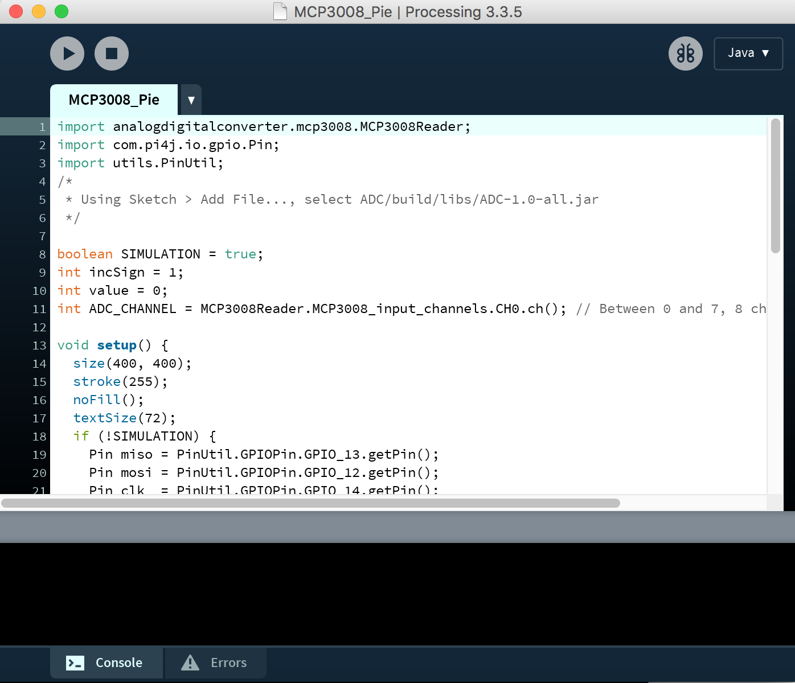
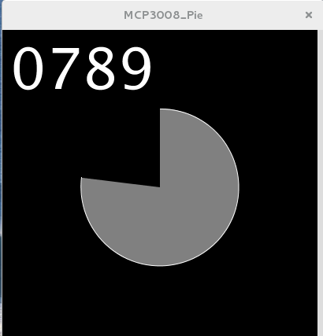
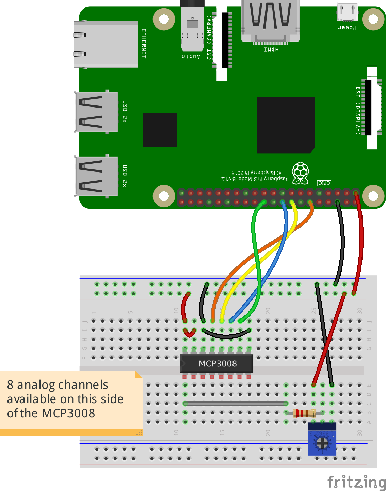
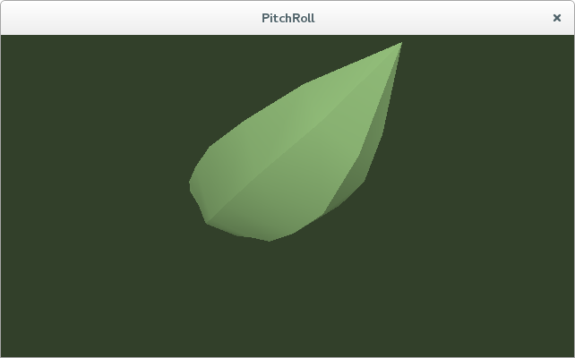
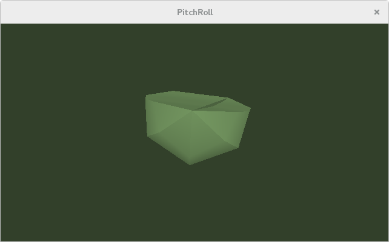
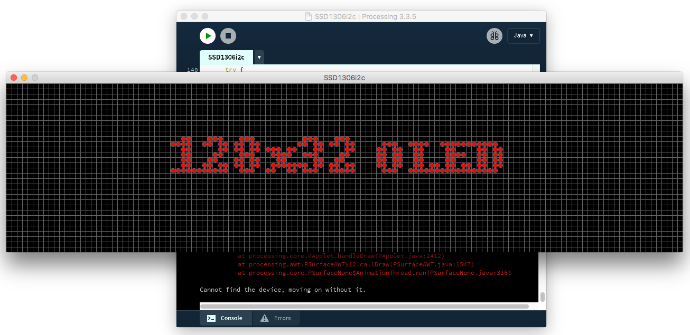
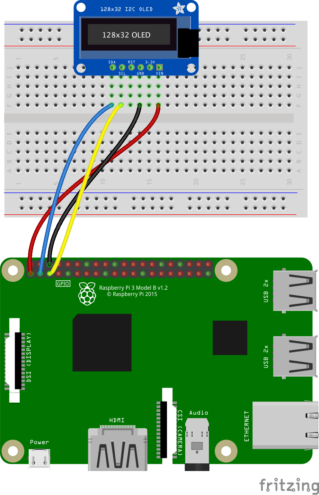
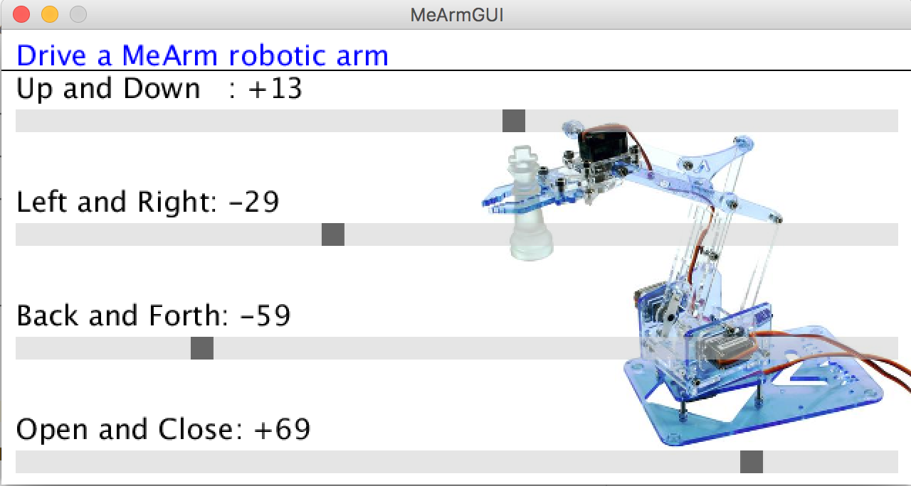

# Processing.org

[Processing](http://processing.org) is a framework that considerably simplifies Java development.

> See how to install it on the Raspberry Pi [here](https://www.raspberrypi.org/blog/now-available-for-download-processing/).

It seems to be compatible with the projects of this repository.

For example, here is the code that graphically displays the value returned by an ADC (MCP3008):
```java
import analogdigitalconverter.mcp3008.MCPReader;
/*
 * Using Sketch > Add File..., select ADC/build/libs/ADC-1.0-all.jar
 */
int value;
int ADC_CHANNEL = MCP3008Reader.MCP3008_input_channels.CH0.ch(); // Between 0 and 7, 8 channels on the MCP3008

void setup() {
  size(200, 200);
  stroke(255);
  noFill();
  textSize(72);
  MCP3008Reader.initMCP3008();
}
void draw() { // Draw the value of the ADC (MCP3008) at each repaint
  background(0);
  fill(255);
  value = MCP3008Reader.readMCP3008(ADC_CHANNEL);
  text(String.format("%04d", value), 10, 100);
}
```
About 20 lines...

### To run the Sketch
- From the project root, to produce the required jar files, run
```bash
 $> ./gradlew clean shadowJar
```
  > Processing might not like a JDK more recent than 1.8. Make sure you set 
  > your Java alternative correctly.
```
$ sudo update-alternatives — config java
$ sudo update-alternatives — config javac
```
- Open the sketch [MCP3008_Pie.pde](./src/processing/MCP3008_Pie/MCP3008_Pie.pde) in `Processing` (no need to copy it anywhere else)

  

- If instructed **_in the comment at the top of the sketch_**, use the menu `Sketch > Add File...` to select the appropriate archive, like here:
```java
/*
 * Using Sketch > Add File..., select ADC/build/libs/ADC-1.0-all.jar
 */
```
- Make sure your wiring is correct.
- Hit the `Run` button in `Processing`.
- Turn the button of the potentiometer, and see for yourself.

<table>
  <tr>
    <td valign="top">
      
    </td>
    <td valign="top">
      
    </td>
  </tr>
</table>

### _A note_: Processing and Java
As you would notice, the code of a `sketch` looks like Java code, but it is not _exactly_ Java code...

Actually, the Processing Development Environment (aka `PDE`) wraps the code with what is missing for Java to be 100% happy.

If you have for example a sketch like that one:
```java
void setup() {
  size(200, 200);
  stroke(255);
  noFill();
  textSize(72);
}

void draw() {
  background(0);
  fill(255);
  int value = (int)Math.floor(1023 * Math.random());  // Simulation
  text(String.format("%04d", value), 10, 100);
}
```
Then _this_ code will actually be compiled and executed:
```java
package your.sketch;

import processing.core.PApplet;

public class Sketch extends PApplet {
  public void setup() {
    stroke(255);
    noFill();
    textSize(72);
  }

  public void draw() {
    background(0);
    fill(255);
    int value = (int)Math.floor(1023 * Math.random());  // Simulation
    text(String.format("%04d", value), 10, 100);
  }

  public void settings() {  size(200, 200); }
  static public void main(String[] passedArgs) {
    String[] appletArgs = new String[] { "your.sketch.Sketch" };
    if (passedArgs != null) {
      PApplet.main(concat(appletArgs, passedArgs));
    } else {
      PApplet.main(appletArgs);
    }
  }

}
```
This can be easily reproduced, on any sketch.
In the Processing IDE, go to `File` > `Export Application`, and see for yourself!

> _Note_: Using a class like above allows you to use the features of Processing, along with the Java 8 syntax and goodies (not supported by the Processing IDE).
> See about this the code in the `src` folder, `processing.sample.FullSketch.java`.
> The `libs` folder mentioned in the `build.gradle` contains archives generated by
> a `File` > `Export Application`. 

## PitchRoll.pde

Displays the pitch and roll, returned by an LSM303 (accelerometer) sensor.
<table>
  <tr>
    <td valign="top">
      
    </td>
    <td valign="top">
      
    </td>
  </tr>
</table>

## SSD1306 (oled display)

Mirror - synchronously - the display of the SSD1306.

<table>
  <tr>
    <td valign="top">
      
    </td>
    <td valign="top">
      
    </td>
  </tr>
</table>

The `RST` pin is not necessary. And yes, the `3.3` goes to `Vin`.

## MeArm GUI
[MeArm](https://shop.mime.co.uk/) is a ~$42 (2017) robotic arm, using four micro servos.
- One to move the arm up and down (located at the LEFT of the arm)
- One to move the arm back and forth (located at the RIGHT of the arm)
- One to move the arm left and right (located at the BOTTOM of the arm)
- One to open and close the claw (located on the CLAW)

In this example, each servo is driven by a slide bar displayed on the Processing GUI.
<table>
  <tr>
    <td valign="top">
      
    </td>
    <td valign="top">
      
    </td>
  </tr>
</table>

----------------------------------------------

And more to come.
