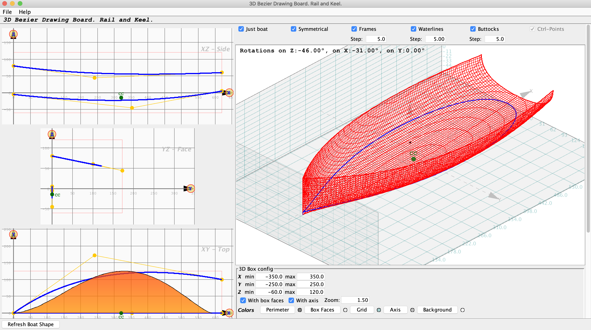

# Boat Design
> Work in Progress, a test.  
> Several (if not many) assumptions on options.

Based on the `Algebra` module, in this project.

- 3 2D views on the left
- A 3D view on the right

## Path 1
- Define Length, Width, Height
- Define a 3D bezier for the rail (on a 2D white board)
<!-- - Define a 2 or 3D bezier for the bow (on a 2D white board) -->
- Define a 2 or 3D bezier for the keel (on a 2D white board)
    - Tweak the way the frames are calculated
- See the result in 3D

Then do the hydrostatic calculations.

### Sep 2021
- Correlated points : the rail and the keel "define" the bow and transom:
  - front of the rail and top of the bow
  - front of the keel and bottom of the bow
  - back of the rail and transom's top
  - back of the keel and transom's bottom

## To fix (in progress)
- Transom and bow, when not vertical.
- Close horizontal and vertical cuts. Done ✅.

## TODO's
- Data to `WebGL`
  - With `ThreeJS` ?
- The same algorithms in OpenSCAD (Bezier & Co)
  - Data to `STL` (rendered by many), `gcode`, etc. Done ✅.
    - See <https://github.com/OlivierLD/3DPrinting/tree/master/OpenSCAD/Bezier>
      - Fill the script `SmallBoat.550.prms.scad` with the data you get when using the `scad` radio-button for the Bezier control points.
        - _Note_: Make sure you use the dot (.) as decimal separator. If you are in French, the separator would be th comma (,),and OpenSCAD may not like it...
    - Look into the [`polyhedron`](https://en.wikibooks.org/wiki/OpenSCAD_User_Manual/Primitive_Solids#polyhedron)
- Data to Processing (see PitchRoll.pde ...)
- Check the CC position...
- **pdf / xsl-fop** output... with XY.png, XZ.png, etc.
  - Images are generated with a `[Shift+Right-Click]` on the 3 drawing boards.
  - Work in progress in the `pub` folder.
  - Make it an option.
- Multi-lang - Soft and publications (resource bundle), in progress.
- For the calculation/drawings: A step for the computation, a step for the drawing.
- Case of other modules, like roofs (keel is on top).
- Refresh (open a small boat, then open a bigger one: resize all the panels). Done ✅.

### Hints
- The main of the Swing app is in `boatdesign.ThreeViews`.
- Shape calculation done in `BoatBox3D`, look for "`// Actual shape calculation takes place here.`"

### Some small boats
- <https://sailboatdata.com/sailboat/corsaire>
- <https://www.asmaraudeur.com/>
- ...

---
