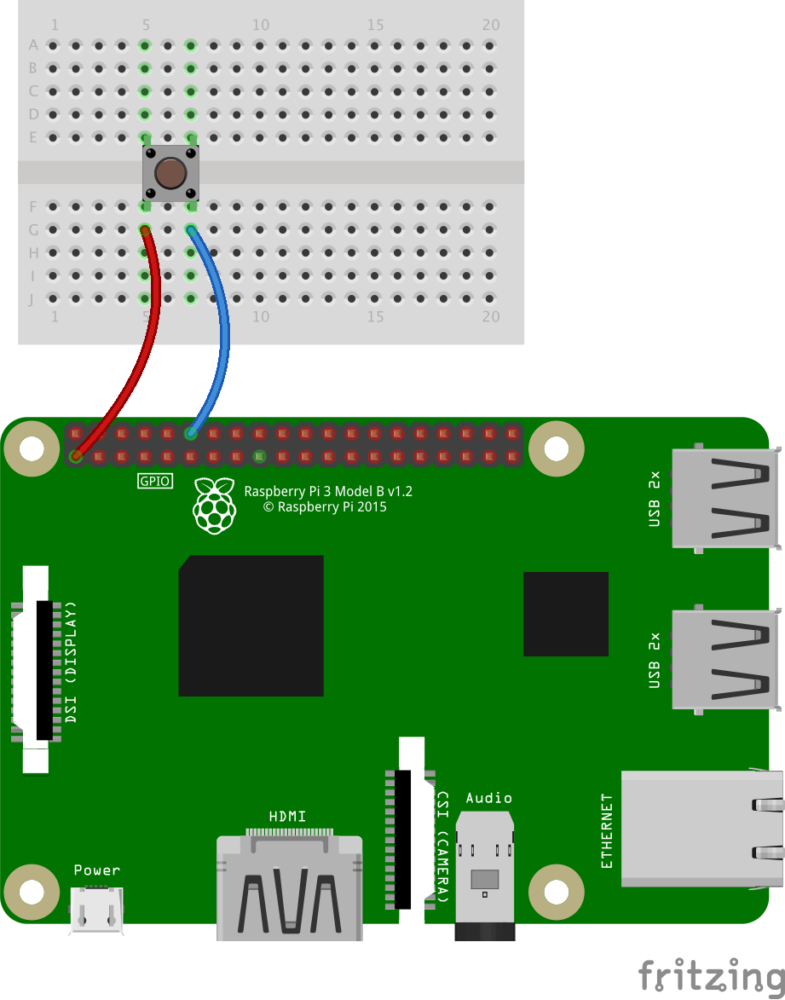

## Some "real" samples involving the components of the other projects
---
#### Summary
- [Push button](#one-push-button)
- [Reflex game](#reflex-game)
- and more... This doc is lagging behind.

### One push button


Run
```bash
 $ ../../gradlew clean shadowJar
```
Then just run the script named `pushbutton`.

#### An interesting question
What would the minimal UI for a hardware project, to allow the user to interact with the device?

How many buttons do we need?

User interaction(s) can be
- Click
- Double click
- Long click
- Two-button click (or more..., Shft, Ctrl, etc). Can generate Shift+DoubleClick, and all kinds of such combinations...
- ... and what else?

Functions
- Back
- Up
- Select
- Down

Those functions above can be performed by 4 distinct buttons, or just 2, `Button1` and `Button2`:
- Back: Single Click on `Button1`
- Up: Single Click on `Button2`
- Select: Double Click on `Button2`
- Down: Long Click on `Button2`

We even have room available for operations triggered by:
- Double Click on `Button1`
- Long Click on `Button1`
- `Button1` pressed and Single Click on `Button2`
- `Button1` pressed and Double Click on `Button2`
- `Button1` pressed and Long Click on `Button2`

For details on the code of this work in progress, see the code in the `breadboard.button.v2` package.

### Reflex Game
Hit the button when the light goes on, and see how long it took you to react.


Run
```bash
 $> ../../gradlew clean shadowJar
```
Then just run the script named `reflex`.

