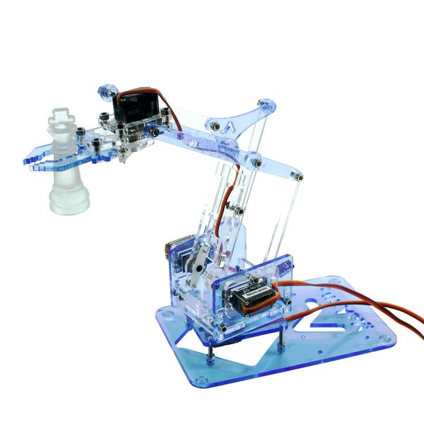
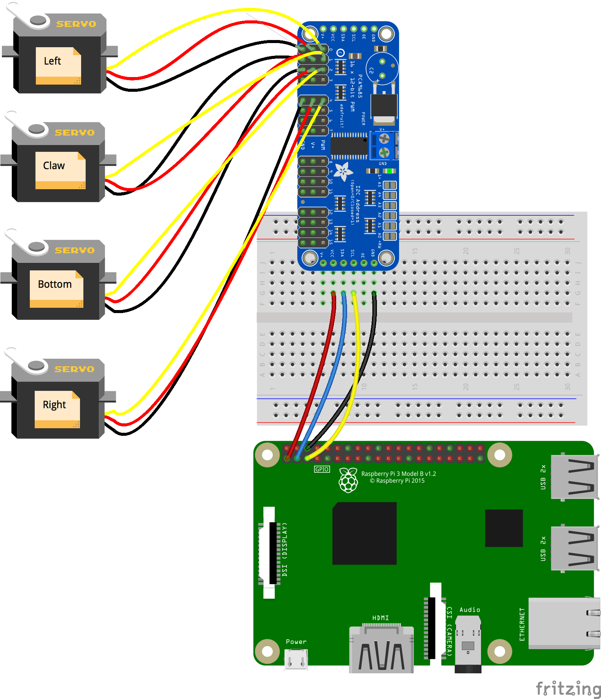

# Web Sockets and Robots

## Robot on wheels

The chassis and Motor HAT come from [Adafruit](https://learn.adafruit.com/simple-raspberry-pi-robot).

The code for the Motor HAT is all in Java, the web part (user interface)
runs on `Node.js`.

Drive a robot from a browser.

---

Install the required WebSocket node module
```
$ cd node
$ npm install
$ cd ..
```

Compile the Java code:
```
$ ../../gradlew shadowJar
```

Then start the node server and run the java code
```
$ cd node
$ node robot.server.js &
$ cd ..
$ ./robot.pilot.sh
```

Finally, from a browser (laptop, tablet, smart-phone), reach
`http://[server-name]:9876/data/robot.pilot.html`.


The software uses jQuery and WebSockets.

The hardware uses the Adafruit Motor Hat.

The `node.js` server code is in the `node` directory, see `robot.server.js`.

The Web interface main page is `robot.pilot.html`, served by `node.js` as well.

#### Architecture


The [Adafruit Motor Hat](https://www.adafruit.com/products/2348) drives the servos, attached on the [Chassis](https://www.adafruit.com/product/2939).
The code for the Java Motor HAT is in the [I2C-SPI project](https://github.com/OlivierLD/raspberry-coffee/tree/master/I2C-SPI/src/i2c/motor/adafruitmotorhat).

The `node` server is also an HTTP server, that serves the web pages used by the clients at the left of the diagram.

The `node` server can run on the Raspberry Pi , or on another machine (in which case the `ws.uri` System variable in the Java code must be tweaked to point to it).

The actions (buttons pushed and released, etc) on the user interface (browser) are translated into `JSON` objects sent to the
WebSocket server. When receiving a message, the server re-broadcasts it to the connected client(s).
They are then received by the `WebSocket client` that talks to the MotorHAT driver accordingly.

The `JSON` message look like this
```
{
  "command": "forward",
  "speed": 128
}
```
See the code for details.

## MeArm Robotic Arm
Same as above, but reach `http://[server-name]:9876/data/mearm.pilot.html`.





---
