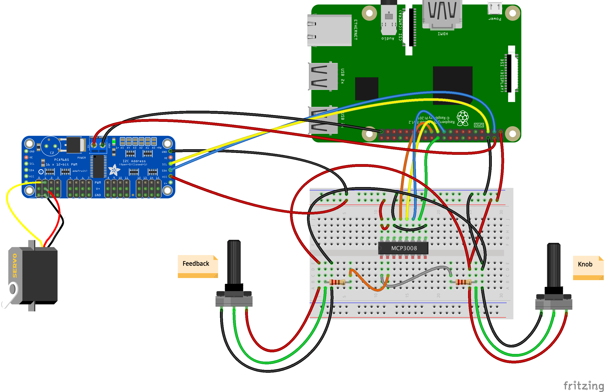
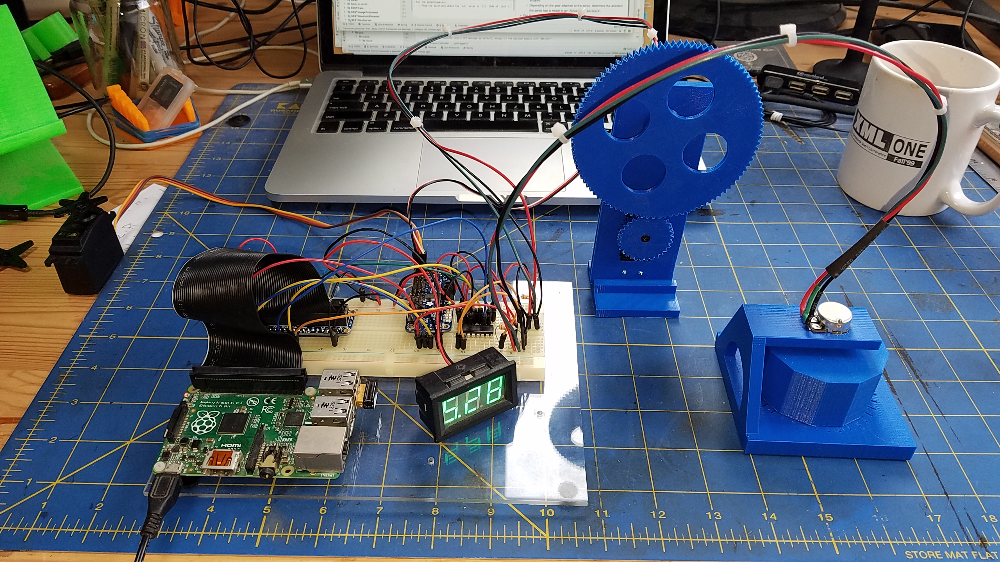
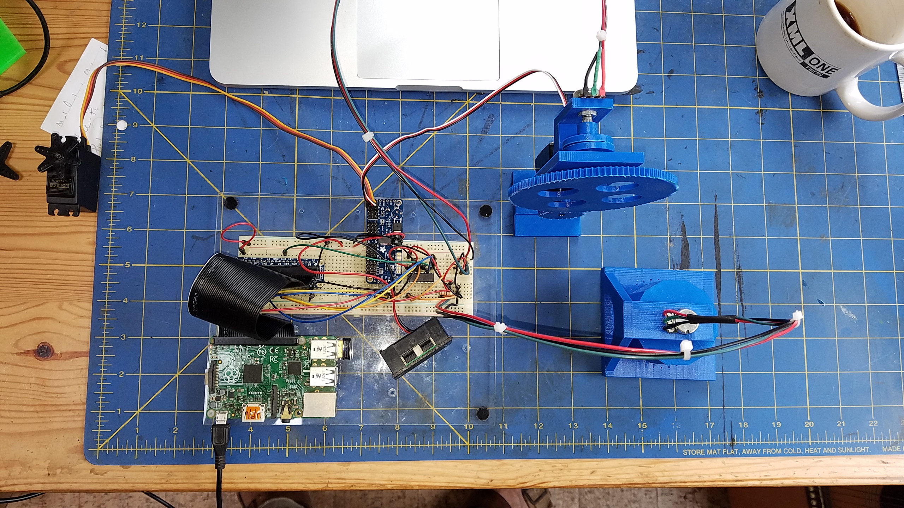
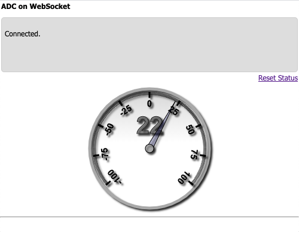

# Servos, Feedback potentiometers
We want to use a Continuous Servo to orient some panel (like a solar panel...),
and a feedback pot to know its actual position.

> _Note_: For this kind of orientation, we could maybe use Standard Servos.
> The thing is that they are quite limited in term of power. 
>
> We use Continuous Servos to be able to use gear ratios and other worm gear, 
> to de-multiply the load assigned to the servo.
>
> The same could apply to DC and Stepper Motors.   

We can also use some 3D-printed hardware, described in some other projects and repos.
- [Linear potentiometers](https://github.com/OlivierLD/raspberry-coffee/blob/master/ADC-benchmark/LINEAR_POTS.md)
- [Feedback POC](https://github.com/OlivierLD/3DPrinting/tree/master/OpenSCAD/FeedbackPOC)

## Wiring



#### ADC, MCP3008
We have 2 `B10K` linear potentiometers, one for the knob (channel 0) and one for the feedback (channel 1).

Resistors are 220 &Omega;.

```
Wiring of the MCP3008-SPI (without power supply):
 +---------++-----------------------------------------------+
 | MCP3008 || Raspberry Pi                                  |
 +---------++------+------------+------+---------+----------+
 |         || Pin# | Name       | Role | GPIO    | wiringPI |
 |         ||      |            |      | /BCM    | /PI4J    |
 +---------++------+------------+------+---------+----------+
 | CLK (13)|| #23  | SPI0_CLK   | CLK  | GPIO_11 | 14       |
 | Din (11)|| #19  | SPI0_MOSI  | MOSI | GPIO_10 | 12       |
 | Dout(12)|| #21  | SPI0_MISO  | MISO | GPIO_09 | 13       |
 | CS  (10)|| #24  | SPI0_CS0_N | CS   | GPIO_08 | 10       |
 +---------++------+------------+-----+----------+----------+

       +--------+ 
* CH0 -+  1  16 +- Vdd 
* CH1 -+  2  15 +- Vref 
  CH2 -+  3  14 +- aGnd 
  CH3 -+  4  13 +- CLK 
  CH4 -+  5  12 +- Dout 
  CH5 -+  6  11 +- Din 
  CH6 -+  7  10 +- CS 
  CH7 -+  8   9 +- dGnd 
       +--------+ 
       +-----+-----+--------------+-----++-----+--------------+-----+-----+
       | BCM | wPi | Name         |  Physical  |         Name | wPi | BCM |
       +-----+-----+--------------+-----++-----+--------------+-----+-----+
       |     |     | 3v3          | #01 || #02 |          5v0 |     |     |       
       |  02 |  08 | SDA1         | #03 || #04 |          5v0 |     |     |       
       |  03 |  09 | SCL1         | #05 || #06 |          GND |     |     |       
       |  04 |  07 | GPCLK0       | #07 || #08 |    UART0_TXD | 15  | 14  |       
       |     |     | GND          | #09 || #10 |    UART0_RXD | 16  | 15  |       
       |  17 |  00 | GPIO_0       | #11 || #12 | PCM_CLK/PWM0 | 01  | 18  |       
       |  27 |  02 | GPIO_2       | #13 || #14 |          GND |     |     |       
       |  22 |  03 | GPIO_3       | #15 || #16 |       GPIO_4 | 04  | 23  |       
       |     |     | 3v3          | #17 || #18 |       GPIO_5 | 05  | 24  |       
   Din |  10 |  12 | SPI0_MOSI    | #19 || #20 |          GND |     |     |       
  Dout |  09 |  13 | SPI0_MISO    | #21 || #22 |       GPIO_6 | 06  | 25  |       
   CLK |  11 |  14 | SPI0_CLK     | #23 || #24 |   SPI0_CS0_N | 10  | 08  | CS    
       |     |     | GND          | #25 || #26 |   SPI0_CS1_N | 11  | 07  |       
       |     |  30 | SDA0         | #27 || #28 |         SCL0 | 31  |     |       
       |  05 |  21 | GPCLK1       | #29 || #30 |          GND |     |     |       
       |  06 |  22 | GPCLK2       | #31 || #32 |         PWM0 | 26  | 12  |       
       |  13 |  23 | PWM1         | #33 || #34 |          GND |     |     |       
       |  19 |  24 | PCM_FS/PWM1  | #35 || #36 |      GPIO_27 | 27  | 16  |       
       |  26 |  25 | GPIO_25      | #37 || #38 |      PCM_DIN | 28  | 20  |       
       |     |     | GND          | #39 || #40 |     PCM_DOUT | 29  | 21  |       
       +-----+-----+--------------+-----++-----+--------------+-----+-----+
       | BCM | wPi | Name         |  Physical  |         Name | wPi | BCM |
       +-----+-----+--------------+-----++-----+--------------+-----+-----+
```

#### Servo driver, Adafruit's `PCA9685`
- Board `3.3V` to sensor `VCC`
- Board `GND` to sensor `GND`
- Board `SCL` to sensor `SCL`
- Board `SDA` to sensor `SDA`

A 5v power supply is required to feed the servos.

- A [Female DC power adapter](http://adafru.it/368) works fine
- I was also able to power it from the Raspberry Header (pins #2 (or #4) and #39) for 2 servos without problem.

## Hardware

|  |  |
|:-----------------------:|:-----------------------:|

## Software

### First requirements
Using the scripts `demo.interactive.servo.sh` and `feedback.mcp3008.sh`:
- **For the servo**
    - Choose a frequency (60 Hz is the default)
    - Find the `pwmValue` for the middle position - where the servo is stopped
    - Depending on the gear attached to the servo, determine the direction the servo has to rotate to go `forward` or `backeard`.
- **For the potentiometers**
    - Find the positions where the `adc` value is `512` (50% of `1024`).

### Required arguments
```
--servo-channel:0     # On the PCA9685
--knob-channel:0      # On the MCP3008
--feedback-channel:1  # On the MCP3008
--servo-freq:XX 
--servo-stop-pwm:XX
--servo-forward-pwm:XX 
--servo-backward-pwm:XX 
```

```
--min-diff:10
```

#### Find the servo pwmValues
Here we try with frequency `100 Hz`.
- `603` seems to be the value where the servo stops
- `632` seems a good speed forward
- `595` sounds like a good one backward

You need to find the right speed, not too slow, not too fast.

```
 $ ./demo.interactive.servo.sh --channel:1 --freq:100
Supported program arguments: --channel:14 --freq:60
Values above are default values.
Theoretical values: Min: 0410, Center: 0614, Max: 0819
System data:
	Core Voltage volt=1.2000V
	CPU Temp CPU Temp: 32.6 C
	CPU Load CPU Load: 54.00%
----------------------------
Servo #1, frequency 100 Hz.
----------------------------
Let's go. Enter 'S' to stop the servo, 'Q' to quit.
Commands are:
	S to Stop
	Q to Quit
	TH to Display theoretical values
	XXX to set the pwmValue on the servo
	[XXX:YYY] to go with pwmValues from XXX to YYY
	[XXX-SS.S] apply pwmValue XXX to the servo for SS second(s).
	Pulse XXX to get the pulse corresponding to XXX
You say: > 590
From value: 0590, pulse is 1.440
You say: > 603
From value: 0603, pulse is 1.472
You say: > 632
From value: 0632, pulse is 1.543
You say: > 595
From value: 0595, pulse is 1.453
You say: > s
You say: > q
Done, bye.
```

#### Scenario / Flowchart

1. Program starts, and loops on:
2. Read feedback servo
3. Read knob servo
4. If values are different
    - if (`knob` > `feedback`)
        1. move servo with `servo-forward-pwm` until `knob` and `feedback` values are identical
        2. stop the servo 
    - if (`knob` < `feedback`)
        1. move servo with `servo-backward-pwm` until
         `knob` and `feedback` values are identical
        2. stop the servo 

#### Other script
Use the script `feedback.mcp3008.sh`.
- Start with option 1:
```
$ ./feedback.mcp3008.sh 
   Read an MCP3008 ADC, for orientation (angle) feedback
   +----------------+
   | 1: Calibration |
   | 2: For real    |
   +------------+---+
   | Q: Bye     |
   +------------+
    You choose > 1
```
Then you get some display
```
Usage is ./feedback.mcp3008.sh --miso:9 --mosi:10 --clk:11 --cs:8 --channel:0
All arguments are optional. Values above are default values
 >> ! IMPORTANT: For miso, mosi, clk & cs, use BCM pin numbers
Usage is java feedback.one0one.MainMCP3008Sample33Feedback --miso:9 --mosi:10 --clk:11 --cs:8 --channel:0
Values above are default values (GPIO/BCM numbers).

Reading MCP3008 on channel 0
 Wiring of the MCP3008-SPI (without power supply):
 +---------++-----------------------------------------------+
 | MCP3008 || Raspberry Pi                                  |
 +---------++------+------------+------+---------+----------+
 |         || Pin# | Name       | Role | GPIO    | wiringPI |
 |         ||      |            |      | /BCM    | /PI4J    |
 +---------++------+------------+------+---------+----------+
 | CLK (13)|| #23  | SPI0_CLK   | CLK  | GPIO_11 | 14       |
 | Din (11)|| #19  | SPI0_MOSI  | MOSI | GPIO_10 | 12       |
 | Dout(12)|| #21  | SPI0_MISO  | MISO | GPIO_09 | 13       |
 | CS  (10)|| #24  | SPI0_CS0_N | CS   | GPIO_08 | 10       |
 +---------++------+------------+-----+----------+----------+
Raspberry Pi is the Master, MCP3008 is the Slave:
- Dout on the MCP3008 goes to MISO on the RPi
- Din on the MCP3008 goes to MOSI on the RPi
Pins on the MCP3008 are numbered from 1 to 16, beginning top left, counter-clockwise.
       +--------+ 
* CH0 -+  1  16 +- Vdd 
  CH1 -+  2  15 +- Vref 
  CH2 -+  3  14 +- aGnd 
  CH3 -+  4  13 +- CLK 
  CH4 -+  5  12 +- Dout 
  CH5 -+  6  11 +- Din 
  CH6 -+  7  10 +- CS 
  CH7 -+  8   9 +- dGnd 
       +--------+ 
       +-----+-----+--------------+-----++-----+--------------+-----+-----+
       | BCM | wPi | Name         |  Physical  |         Name | wPi | BCM |
       +-----+-----+--------------+-----++-----+--------------+-----+-----+
       |     |     | 3v3          | #01 || #02 |          5v0 |     |     |       
       |  02 |  08 | SDA1         | #03 || #04 |          5v0 |     |     |       
       |  03 |  09 | SCL1         | #05 || #06 |          GND |     |     |       
       |  04 |  07 | GPCLK0       | #07 || #08 |    UART0_TXD | 15  | 14  |       
       |     |     | GND          | #09 || #10 |    UART0_RXD | 16  | 15  |       
       |  17 |  00 | GPIO_0       | #11 || #12 | PCM_CLK/PWM0 | 01  | 18  |       
       |  27 |  02 | GPIO_2       | #13 || #14 |          GND |     |     |       
       |  22 |  03 | GPIO_3       | #15 || #16 |       GPIO_4 | 04  | 23  |       
       |     |     | 3v3          | #17 || #18 |       GPIO_5 | 05  | 24  |       
   Din |  10 |  12 | SPI0_MOSI    | #19 || #20 |          GND |     |     |       
  Dout |  09 |  13 | SPI0_MISO    | #21 || #22 |       GPIO_6 | 06  | 25  |       
   CLK |  11 |  14 | SPI0_CLK     | #23 || #24 |   SPI0_CS0_N | 10  | 08  | CS    
       |     |     | GND          | #25 || #26 |   SPI0_CS1_N | 11  | 07  |       
       |     |  30 | SDA0         | #27 || #28 |         SCL0 | 31  |     |       
       |  05 |  21 | GPCLK1       | #29 || #30 |          GND |     |     |       
       |  06 |  22 | GPCLK2       | #31 || #32 |         PWM0 | 26  | 12  |       
       |  13 |  23 | PWM1         | #33 || #34 |          GND |     |     |       
       |  19 |  24 | PCM_FS/PWM1  | #35 || #36 |      GPIO_27 | 27  | 16  |       
       |  26 |  25 | GPIO_25      | #37 || #38 |      PCM_DIN | 28  | 20  |       
       |     |     | GND          | #39 || #40 |     PCM_DOUT | 29  | 21  |       
       +-----+-----+--------------+-----++-----+--------------+-----+-----+
       | BCM | wPi | Name         |  Physical  |         Name | wPi | BCM |
       +-----+-----+--------------+-----++-----+--------------+-----+-----+
- Rotate the potentiometer to find the position where Volume is 50%
- Then move 90 degrees clockwise, and note the ADC value XXXX.
- Then move 90 degrees counter-clockwise, and note the ADC value YYYY.
You will use those values in the real world, using the runtime arguments --minus90:XXXX and --plus90:YYYY
Volume: 050.2% (ADC: 0514) => 1.658 V.
Volume: 050.4% (ADC: 0516) => 1.665 V.
Volume: 050.2% (ADC: 0514) => 1.658 V.
. . .
```
Turn the knob in position `-90`, and read the `ADC` value:
```
Volume: 019.5% (ADC: 0199) => 0.642 V.
Volume: 018.8% (ADC: 0192) => 0.619 V.
Volume: 018.0% (ADC: 0184) => 0.594 V.
Volume: 017.6% (ADC: 0180) => 0.581 V.
Volume: 017.0% (ADC: 0174) => 0.561 V.
Volume: 016.7% (ADC: 0171) => 0.552 V.
```
Here, this would be `171`. Next turn the knob in position `+90`, and do the same:
```
Volume: 019.5% (ADC: 0199) => 0.642 V.
Volume: 018.8% (ADC: 0192) => 0.619 V.
Volume: 018.0% (ADC: 0184) => 0.594 V.
Volume: 017.6% (ADC: 0180) => 0.581 V.
Volume: 017.0% (ADC: 0174) => 0.561 V.
Volume: 016.7% (ADC: 0171) => 0.552 V.
Volume: 017.0% (ADC: 0174) => 0.561 V.
Volume: 020.0% (ADC: 0205) => 0.661 V.
Volume: 024.9% (ADC: 0255) => 0.823 V.
Volume: 031.4% (ADC: 0321) => 1.035 V.
Volume: 036.9% (ADC: 0377) => 1.216 V.
Volume: 044.1% (ADC: 0451) => 1.455 V.
Volume: 053.3% (ADC: 0545) => 1.758 V.
Volume: 059.7% (ADC: 0611) => 1.971 V.
Volume: 066.0% (ADC: 0675) => 2.177 V.
Volume: 070.1% (ADC: 0717) => 2.313 V.
Volume: 071.4% (ADC: 0730) => 2.355 V.
Volume: 072.1% (ADC: 0738) => 2.381 V.
Volume: 072.3% (ADC: 0740) => 2.387 V.
Volume: 072.1% (ADC: 0738) => 2.381 V.
Volume: 072.5% (ADC: 0742) => 2.394 V.
Volume: 076.4% (ADC: 0782) => 2.523 V.
Volume: 081.1% (ADC: 0830) => 2.677 V.
Volume: 082.4% (ADC: 0843) => 2.719 V.
Volume: 083.1% (ADC: 0850) => 2.742 V.
Volume: 083.9% (ADC: 0858) => 2.768 V.
Volume: 085.0% (ADC: 0870) => 2.806 V.
Volume: 085.6% (ADC: 0876) => 2.826 V.
Volume: 085.8% (ADC: 0878) => 2.832 V.
Volume: 086.1% (ADC: 0881) => 2.842 V.
Volume: 086.3% (ADC: 0883) => 2.848 V.
Volume: 086.1% (ADC: 0881) => 2.842 V.
Volume: 086.3% (ADC: 0883) => 2.848 V.
```
This would be `883`.

Stop the program, and restart with option `2`:
```
$ ./feedback.mcp3008.sh 
Read an MCP3008 ADC, for orientation (angle) feedback
+----------------+
| 1: Calibration |
| 2: For real    |
+------------+---+
| Q: Bye     |
+------------+
 You choose > 2
```
Enter the values found above:
```
ADC value for -90 degrees > 171   
ADC value for +90 degrees > 883
```
Start playing with the knob, and see the corresponding angle values.
```
Usage is ./feedback.mcp3008.sh --miso:9 --mosi:10 --clk:11 --cs:8 --channel:0
 ! IMPORTANT: For miso, mosi, clk & cs, use BCM pin numbers
Usage is java feedback.one0one.MainMCP3008Sample33Feedback --miso:9 --mosi:10 --clk:11 --cs:8 --channel:0
Values above are default values (GPIO/BCM numbers).

--minus90: or --plus90: are not required for calibration
--minus90: or --plus90: are not required for calibration
Reading MCP3008 on channel 0
 Wiring of the MCP3008-SPI (without power supply):
 +---------++-----------------------------------------------+
 | MCP3008 || Raspberry Pi                                  |
 +---------++------+------------+------+---------+----------+
 |         || Pin# | Name       | Role | GPIO    | wiringPI |
 |         ||      |            |      | /BCM    | /PI4J    |
 +---------++------+------------+------+---------+----------+
 | CLK (13)|| #23  | SPI0_CLK   | CLK  | GPIO_11 | 14       |
 | Din (11)|| #19  | SPI0_MOSI  | MOSI | GPIO_10 | 12       |
 | Dout(12)|| #21  | SPI0_MISO  | MISO | GPIO_09 | 13       |
 | CS  (10)|| #24  | SPI0_CS0_N | CS   | GPIO_08 | 10       |
 +---------++------+------------+-----+----------+----------+
Raspberry Pi is the Master, MCP3008 is the Slave:
- Dout on the MCP3008 goes to MISO on the RPi
- Din on the MCP3008 goes to MOSI on the RPi
Pins on the MCP3008 are numbered from 1 to 16, beginning top left, counter-clockwise.
       +--------+ 
* CH0 -+  1  16 +- Vdd 
  CH1 -+  2  15 +- Vref 
  CH2 -+  3  14 +- aGnd 
  CH3 -+  4  13 +- CLK 
  CH4 -+  5  12 +- Dout 
  CH5 -+  6  11 +- Din 
  CH6 -+  7  10 +- CS 
  CH7 -+  8   9 +- dGnd 
       +--------+ 
       +-----+-----+--------------+-----++-----+--------------+-----+-----+
       | BCM | wPi | Name         |  Physical  |         Name | wPi | BCM |
       +-----+-----+--------------+-----++-----+--------------+-----+-----+
       |     |     | 3v3          | #01 || #02 |          5v0 |     |     |       
       |  02 |  08 | SDA1         | #03 || #04 |          5v0 |     |     |       
       |  03 |  09 | SCL1         | #05 || #06 |          GND |     |     |       
       |  04 |  07 | GPCLK0       | #07 || #08 |    UART0_TXD | 15  | 14  |       
       |     |     | GND          | #09 || #10 |    UART0_RXD | 16  | 15  |       
       |  17 |  00 | GPIO_0       | #11 || #12 | PCM_CLK/PWM0 | 01  | 18  |       
       |  27 |  02 | GPIO_2       | #13 || #14 |          GND |     |     |       
       |  22 |  03 | GPIO_3       | #15 || #16 |       GPIO_4 | 04  | 23  |       
       |     |     | 3v3          | #17 || #18 |       GPIO_5 | 05  | 24  |       
   Din |  10 |  12 | SPI0_MOSI    | #19 || #20 |          GND |     |     |       
  Dout |  09 |  13 | SPI0_MISO    | #21 || #22 |       GPIO_6 | 06  | 25  |       
   CLK |  11 |  14 | SPI0_CLK     | #23 || #24 |   SPI0_CS0_N | 10  | 08  | CS    
       |     |     | GND          | #25 || #26 |   SPI0_CS1_N | 11  | 07  |       
       |     |  30 | SDA0         | #27 || #28 |         SCL0 | 31  |     |       
       |  05 |  21 | GPCLK1       | #29 || #30 |          GND |     |     |       
       |  06 |  22 | GPCLK2       | #31 || #32 |         PWM0 | 26  | 12  |       
       |  13 |  23 | PWM1         | #33 || #34 |          GND |     |     |       
       |  19 |  24 | PCM_FS/PWM1  | #35 || #36 |      GPIO_27 | 27  | 16  |       
       |  26 |  25 | GPIO_25      | #37 || #38 |      PCM_DIN | 28  | 20  |       
       |     |     | GND          | #39 || #40 |     PCM_DOUT | 29  | 21  |       
       +-----+-----+--------------+-----++-----+--------------+-----+-----+
       | BCM | wPi | Name         |  Physical  |         Name | wPi | BCM |
       +-----+-----+--------------+-----++-----+--------------+-----+-----+
Function coefficients for f(x) = a.x + b: 
	a: 0.252809,
	b:-133.230337

Parameter validation:
ADC=0512 -> -3.792135°
ADC=0171 -> -90.000000°
ADC=0883 -> 90.000000°
ADC=0000 -> -133.230337°
ADC=1023 -> 125.393258°
Volume: 050.2% (0514) => 1.658 V, -03.29 degree(s)
Volume: 050.4% (0516) => 1.665 V, -02.78 degree(s)
Volume: 050.2% (0514) => 1.658 V, -03.29 degree(s)
Volume: 050.4% (0516) => 1.665 V, -02.78 degree(s)
Volume: 050.2% (0514) => 1.658 V, -03.29 degree(s)
Volume: 050.5% (0517) => 1.668 V, -02.53 degree(s)
Volume: 050.3% (0515) => 1.661 V, -03.03 degree(s)
Volume: 049.8% (0509) => 1.642 V, -04.55 degree(s)
Volume: 048.9% (0500) => 1.613 V, -06.83 degree(s)
Volume: 047.9% (0490) => 1.581 V, -09.35 degree(s)
Volume: 046.6% (0477) => 1.539 V, -12.64 degree(s)
Volume: 045.7% (0467) => 1.506 V, -15.17 degree(s)
Volume: 044.7% (0457) => 1.474 V, -17.70 degree(s)
Volume: 043.7% (0447) => 1.442 V, -20.22 degree(s)
Volume: 042.7% (0437) => 1.410 V, -22.75 degree(s)
. . .
```

##### Bonus: WebSockets
The setup can be splitted over 3 machines:
- One to host the button and its ADC software
- One to host the WebSocket server
- One to run the browser

Run it
- Requires a WS server, we will use `NodeJs` here: <https://www.w3schools.com/nodejs/nodejs_raspberrypi.asp>
- On one machine, setup and start the WebSocket/HTTP server, from the `src/main/node` folder
    - Do once: `$ npm install`
    - Then to start the server `$ node server.js`
- In the script `feedback.mcp3008.sh`, make sure you've set the `ws.uri` variable
    - Example `JAVA_OPTS="$JAVA_OPTS -Dws.uri=ws://192.168.42.6:9876/"`, where `192.168.42.6` is the IP of the machine hosting the WebSocket server
- Then start the `feedback.mcp3008.sh`, using option `2`:
```
$ ./feedback.mcp3008.sh 
Read an MCP3008 ADC, for orientation (angle) feedback
Use it to calibrate the button driving the wheel (option 1)
+----------------+
| 1: Calibration |
| 2: For real    |
+------------+---+
| Q: Bye     |
+------------+
 You choose > 2
Enter limit values (-90 and 90 degrees)
ADC value for -90 degrees > 171
ADC value for +90 degrees > 883
. . .
```
- And from a browser, somewhere on the same network, reach `http://192.168.42.6:9876/data/display.html`
     
- The HTML display changes when you move the button, in real time.        


#### Let's try, drive the wheel from the button
With the values found above:
```
$ ./feedback.pots.sh --servo-channel:1 --knob-channel:0 --feedback-channel:1 \ 
                     --servo-freq:100 --servo-stop-pwm:603 --servo-forward-pwm:595 \ 
                     --servo-backward-pwm:632 --min-diff:6
```
> Note the `--servo-forward-pwm:XXX ` and `--servo-backward-pwm:YYY`, values could be inverted, because of the hardware setting.
> 
> ⚠️ Do make sure you set those values correctly !!  
> This depends on the way the 2 potentiometers are set - the knob, and the feedback - and on the way the different wheels are turning.

You turn the knob one way or the other, and the big wheel follows.

The programs reads the value of the potentiometer of the knob, and asks the servo to turn the wheel until the value of
the potentiometer attached to it is the same.

This way, the [big wheel](#hardware) position is set by the potentiometer attached to it. The servo
does **_not_** know what its position is, it is told to start forward or backward, and then
to stop.

#### See it
[At work](https://www.youtube.com/embed/wB4MzNCep1o)

<!--
<iframe width="560" height="315" src="https://www.youtube.com/embed/wB4MzNCep1o" frameborder="0" allow="accelerometer; autoplay; encrypted-media; gyroscope; picture-in-picture" allowfullscreen></iframe>
-->
   
--- 
