# SunFlower Versions 2.0 a and b, and more
 

The goal of this project is to _**automatically**_ orient a solar panel, so it faces the sun as long as it is in the sky.  

There are pictures at the bottom of this page, scroll down!

---
> _Preamble_:
> 
> I started from  [this instructable](https://www.instructables.com/id/Ammo-Can-Solar-Power-Supply/), showing how to load a small (15Ah) portable battery
> with a small solar panel.
>
> Obviously, orienting the panel, so it faces the Sun improves the efficiency, a lot.
>
> The hardware described and used here can be 3D printed with the files generated by 
> the projects featured [here](https://github.com/OlivierLD/3DPrinting/tree/master/OpenSCAD/SolarPanelStand) and [here](https://github.com/OlivierLD/3DPrinting/tree/master/OpenSCAD/SolarPanelStand.v3). 
---

- The [first version](../SunFlower) used micro-servos to orient a small solar panel.
- Here we want to deal with bigger panels, this will require the usage of bigger motors, like stepper-motors.
- The required hardware is described in a [separate project](https://github.com/OlivierLD/3DPrinting/tree/master/OpenSCAD/SolarPanelStand).
- Stepper motors will be driven by an [Adafruit Motor Hat](https://www.adafruit.com/product/2348).
- Some code to look at is in [this folder](../SteppersPlayground), to play with the different options
of the stepper motors...

> Note: The position of the Sun is _**not** observed_ (from a photocell or any such sensor), it is _calculated_, from the 
> current position and time. See the `AstroComputer` class for details.
> As a result, even with an overcast sky, the device _will_ still face the Sun, and _yes_, it **does** make a difference.  

### Wiring
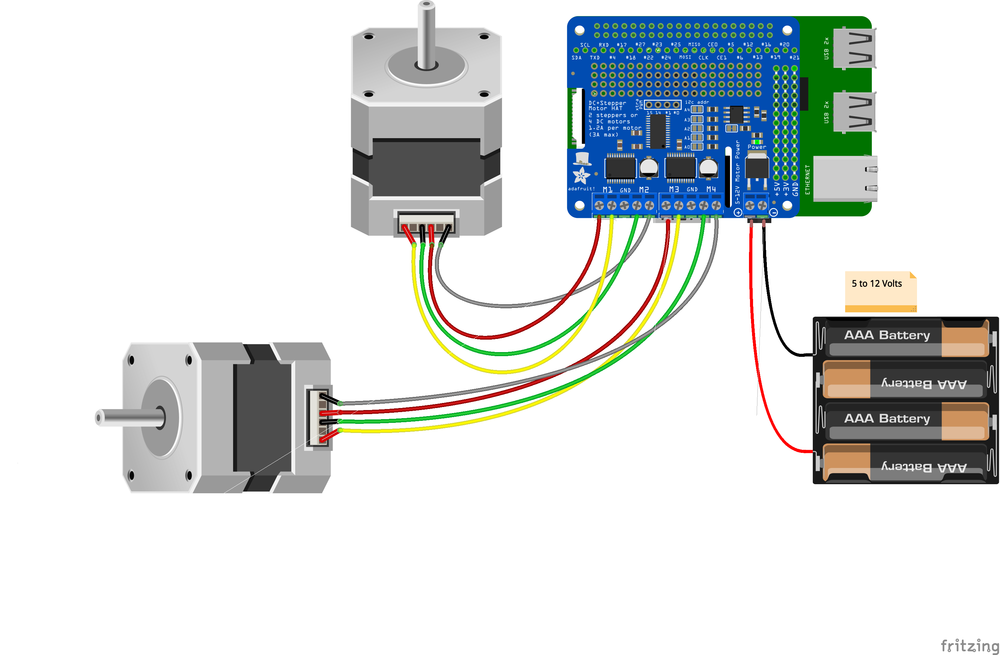

> Note: It is also possible to power the `Motor Hat` from a USB port of the Raspberry Pi.
> This way, only one power supply is required, it's the usual 5v for the Raspberry Pi. 

### Standard output
Simple standard output, just run `calibration.sh`.

#### With the `calibration` option
Takes its input from the Command Line Interface (CLI), not from the Astro Thread. Use it to calibrate the device,
to make sure it is working as expected.
```
$ ./calibrate.sh 
Starting SunFlowerDriver
------------------------------ C A L I B R A T I O N ----------------------------
To change the Azimuth (Z) value, enter 'Z=12.34', the value goes from 0 to 360.
To change the Elevation (E) value, enter 'E=23.45', the values goes from 0 to 90.
Enter 'PARK' to park the device.
Enter 'Q' to quit.
---------------------------------------------------------------------------------
Current status: Z=180.00, Elev.=90.00
> z=213
Current status: Z=213.00, Elev.=90.00
> 
. . .
``` 
 
## Two flavors
> _**Important Note**_: the celestial data calculation (to obtain the Sun's coordinates) use the current date as a parameter, which is probably the most important one.
> If your device is not connected to the Internet, it is your duty to provide an accurate date. To do so, use
> `date -s` from a terminal, like in 
> ```
> $ date -s "2022-08-10 17:04:29"
> ```

The two scripts `console.sh` and `server.sh` are similar, in that sense that they both drive the solar panel.
A small difference though, the `server.sh` provides a REST and HTTP access to the features, that can be accessed - and to some extent driven - from a Web UI.  
- `console.sh` runs `sunflower.main.ConsoleMain`
- `server.sh` runs `sunflower.main.SunFlowerServer`


### ANSI Console output
This console is designed _**not**_ to run in background mode (see `SunFlowerServer` for that), it orients the panel, as it displays the
orientation parameters.

Run `sunflower.main.ConsoleMain`, from the script `console.sh`.
```
- Positions -
+------+----------------------------+------+-----+
|      | Date                       | Z    |Elev |
+------+----------------------------+------+-----+
|Sun   |Tue Feb 04 14:37:42 PST 2020|216.67|27.60|
+------+----------------------------+------+-----+
|Device|Tue Feb 04 14:37:42 PST 2020|216.65|27.60|
+------+----------------------------+------+-----+
- Movements -
+-----+----------------------------+------+------+------+
|     | Date                       |from  |to    |diff  |
+-----+----------------------------+------+------+------+
|Elev.|Tue Feb 04 14:37:41 PST 2020| 28.10| 27.60|  0.50|
+-----+----------------------------+------+------+------+
|Z    |Tue Feb 04 14:37:35 PST 2020|216.15|216.65|  0.50|
+-----+----------------------------+------+------+------+
- Status -
+----------------------------+----------------------------------------------------------------+
| Date                       | Info                                                           |
+----------------------------+----------------------------------------------------------------+
|Tue Feb 04 14:33:22 PST 2020|Device Parked                                                   |
+----------------------------+----------------------------------------------------------------+
|Tue Feb 04 14:37:41 PST 2020|Move (2 steps) completed in 0.020 sec                           |
+----------------------------+----------------------------------------------------------------+
|Tue Feb 04 14:37:35 PST 2020|Move (11 steps) completed in 0.111 sec                          |
+----------------------------+----------------------------------------------------------------+
Hit Ctrl-C to stop the program

```
### HTTP Server (WiP) 
Same as above, but no UI in the console. Designed to run in background mode.
Data previously displayed on the terminal are accessible through REST requests.
See `server.sh` for details.
```
$ ./server.sh 
  >>> Running on port 8989
  Starting Program
  Hit Ctrl-C to stop the SunFlowerDriver program
  1,581,012,167,407 - Port open: 8989
  1,581,012,167,409 - http.HTTPServer now accepting requests

. . .
```
or
```
$ nohup ./server.sh > sf.log &
```
and to stop it:
```
$ ./killsf.sh
```

Example (early preview):
```
$ curl -X GET http://localhost:8989/sf/status
```
would produce
```json
{
    "MOVING_ELEVATION_START_2": {
        "date": "Mar 17, 2020 4:24:40 PM",
        "epoch": 1584487480619,
        "nbSteps": 2,
        "motorCommand": "BACKWARD",
        "motorNum": 2
    },
    "MOVING_ELEVATION_END": {
        "date": "Mar 17, 2020 4:24:40 PM",
        "epoch": 1584487480750,
        "nbSteps": 2,
        "elapsed": 131
    },
    "CELESTIAL_DATA": {
        "date": "Mar 17, 2020 4:26:33 PM",
        "epoch": 1584487593637,
        "azimuth": 239.6758144084604,
        "elevation": 31.927574791602833
    },
    "MOVING_AZIMUTH_END": {
        "date": "Mar 17, 2020 4:24:35 PM",
        "epoch": 1584487475614,
        "nbSteps": 0,
        "elapsed": 0
    },
    "MOVING_AZIMUTH_START": {
        "date": "Mar 17, 2020 4:24:35 PM",
        "epoch": 1584487475611,
        "deviceAzimuth": 239.0,
        "sunAzimuth": 239.5
    },
    "DEVICE_DATA": {
        "date": "Mar 17, 2020 4:26:33 PM",
        "devicePosition": {
            "latitude": 37.7489,
            "longitude": -122.507
        },
        "epoch": 1584487593637,
        "azimuth": 239.5,
        "elevation": 32.0,
        "azimuthOffset": 0.0,
        "elevationOffset": 0.0,
        "deviceHeading": 180.0
    },
    "MOVING_AZIMUTH_START_2": {
        "date": "Mar 17, 2020 4:24:35 PM",
        "epoch": 1584487475614,
        "nbSteps": 0,
        "motorCommand": "BACKWARD",
        "motorNum": 1
    },
    "DEVICE_INFO": {
        "date": "Mar 17, 2020 1:51:17 PM",
        "epoch": 1584478277383,
        "message": "Device was parked"
    },
    "MOVING_ELEVATION_START": {
        "date": "Mar 17, 2020 4:24:40 PM",
        "epoch": 1584487480616,
        "deviceElevation": 32.5,
        "sunElevation": 32.0
    }
}
```
As the REST server we use here is also an HTTP server, it is very easy to implement a Web UI,
using ES6 Promises to get to the REST data (WiP, there's a lot to do here).

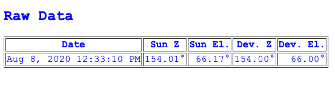

When the server is running, try reaching `http://<server.ip>:8989/web/index.html` from a browser.

### Date Simulation
The default date used for Celestial Computation is the current system date.

For development or demo, there is a possibility to simulate this date.

To simulate the date, you need to provide three system variables:
- `-Ddate.simulation=true`. default `false`
- `-Dstart.date.simulation=2020-03-06T20:00:00`. Duration Format. no default. Must be provided if `date.simulation` is `true`.
- `-Dincrement.per.second=600`. In seconds, no default, minimum `1`. Must be provided if `date.simulation` is `true`. Here - for example, this will increment the date by 10 minutes (600 seconds) every second.

### Heading input
If the device has to be carried by a vehicle in motion, we need to have the heading of the device.

Small magnetometers like an `HMC5883L` or an `LSM303` can do the job.
> _Note_: Those magnetometers **do require** a calibration, See [here](../../raspberry-io-pi4j/I2C-SPI/lsm303.calibration/README.md) for details. 
 
But the magnetometers can go crazy if they're too close to a magnet, and stepper motors heavily use magnets.

Having the magnetometer too close to the stepper motors is **not** a good idea.

This is where we use the `NMEA-multiplexer` project (part of [this repo](https://github.com/OlivierLD/ROB/blob/master/raspberry-sailor/NMEA-multiplexer/README.md)). We have another Raspberry Pi (a Raspberry Pi Zero does the job)
with a magnetometer attached to it, running the `NMEA-multiplexer`.
The `NMEA-multiplexer` can also serve as a REST server, storing NMEA data in a cache, queryable from a REST client.

|       HMC5883L                 |     HMC5883L                   |
|:------------------------------:|:------------------------------:|
| 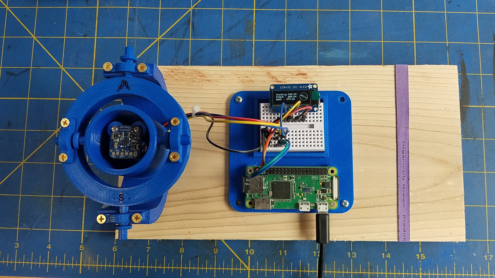 | 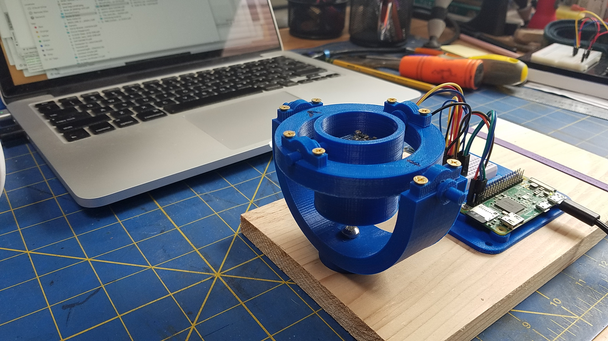 | 

> `STL` files for the gimbal can be found [here](https://github.com/OlivierLD/3DPrinting/tree/master/OpenSCAD/Gimbal).

#### Pulling Heading data
And this is what we do here, we've added two System properties:
```bash
JAVA_OPTS="${JAVA_OPTS} -Dping.nmea.server=true"
JAVA_OPTS="${JAVA_OPTS} -Dnmea.server.base.url=http://192.168.42.20:9991"
``` 
This tells the code driving the device to ping the NMEA server every second to get the heading from it.
In this case, it will do a REST request like 
```
GET http://192.168.42.20:9991/mux/cache
``` 
returning a `json` payload like
```json
{
    "NMEA_AS_IS": {
        "HDM": "$IIHDM,172,M*38",
        "XDR": "$IIXDR,A,178,D,PTCH,A,-160,D,ROLL*78"
    },
    "Damping": 1,
    "Current calculated with damping": {},
    "HDG Offset": 0.0,
    "Default Declination": {
        "angle": 14.0
    },
    "Deviation file name": "zero-deviation.csv",
    "HDG mag.": {
        "angle": 172.0
    },
    "BSP Factor": 1.0,
    "Max Leeway": 0.0,
    "AWS Factor": 1.0,
    "AWA Offset": 0.0,
    "NMEA": "$IIXDR,A,178,D,PTCH,A,-160,D,ROLL*78"
}
```
from which the heading is obtained, and used to calculate the azimuthal orientation of the panel. 
> See the `NMEADataThread`, in `FeatureRequestManager`.

#### Pushing
Instead of pulling the heading from wherever it is available, we could also use a push architecture.

In the `NMEA-multiplexer` project (part of this repo), there is this notion of `forwarder` that could be used here.
This project could implement the `forwarder` interface, and the `NMEA-multiplexer` could push
the required data to the `SunFlowerDriver` (Position & Heading), from the server, to the SunFlower.
> For inspiration, see the existing forwarder `nmea.forwarders.SolarPanelOrienter`, designed to work
> with the `SunFlower.v1`, the one working with micro-servos.

### The Device
> <u><i>Important note</i></u>: Those devices involve some ball bearings, specially for the azimuth motor.
> When delivered, the balls in the groove may be sticky. It's a good idea to clean them, and to keep them lubricated, as 
> they may block the rotation of the device if not, instead of facilitating it!

The software of this project is designed to drive [this sort of device](https://github.com/OlivierLD/3DPrinting/blob/master/OpenSCAD/SolarPanelStand.v2/stl/the.full.stand.stuck.stl).
Its 3D printing construction is detailed in [its repo](https://github.com/OlivierLD/3DPrinting/tree/master/OpenSCAD/SolarPanelStand.v2).

> Note: This project keeps track of several versions of the project, with external worm gear, with internal bevel gears,
> internal worm gear..., along with the lessons learned in each step.
> All versions are available here, with the appropriate comments.
> 
> This document will provide (some time soon) a list of all that.

#### The _real_ device
Here is an animation - stop-motion - of the real device (first prototype), on 231 minutes, starting before noon, ending after. Event if the sky was obviously not clear, 
orienting the panel does make a difference on the load. The first frames are too bright, it **was** sunny... 😎


In this animation - just to validate the concept, the Raspberry Pi driving the device, and the one taking the snapshots were both powered by the battery fed by the solar panel.

### Some pictures

<!--| At work                             | At work                           | -->

|    |  |
|:-----------------------------------:|:---------------------------------:|
|  |                                   |

### Notes
- For the Motor HAT power supply, 5V is enough. No need for 12V, and the motors seem to heat up with 12V.

### Bonus
The two versions, working together:
> Note: Below is the version 3, with a bevel gear instead of the worm gear.


## TODO
- An ANSI Console. &#9989; &nbsp;Done (...ish).
- A Web Console. WiP.
    - REST and/or WebSockets?
- A utility, to manually/interactively orient the panel from user's inputs. &#9989; &nbsp;Done.
- A `forwarder` for the `NMEA-multiplexer`, as in `SolarPanelOrienter`.
    - This would allow Heading input, position input.
- Small OLED screen for position and orientation data. &#9989; &nbsp;Done.  

## Subsequent versions
> Mostly Hardware evolutions.   

### Challenges
- With V2 (details [here](https://github.com/OlivierLD/3DPrinting/tree/master/OpenSCAD/SolarPanelStand.v2))
    - Aligning the worm gear axis with its pinion was not obvious. 
    - Moved to V3, with a beveled gear
- With V3 (See [here](https://github.com/OlivierLD/3DPrinting/tree/master/OpenSCAD/SunFlower/SolarPanelStand.v3) and [here](https://github.com/OlivierLD/3DPrinting/tree/master/OpenSCAD/SunFlower/SolarPanelStand.v3/stl))
    - The beveled gear pinion (3D printed, in PLA) was hard to lock in place. Some skating happens on the axis from time to time.
    - 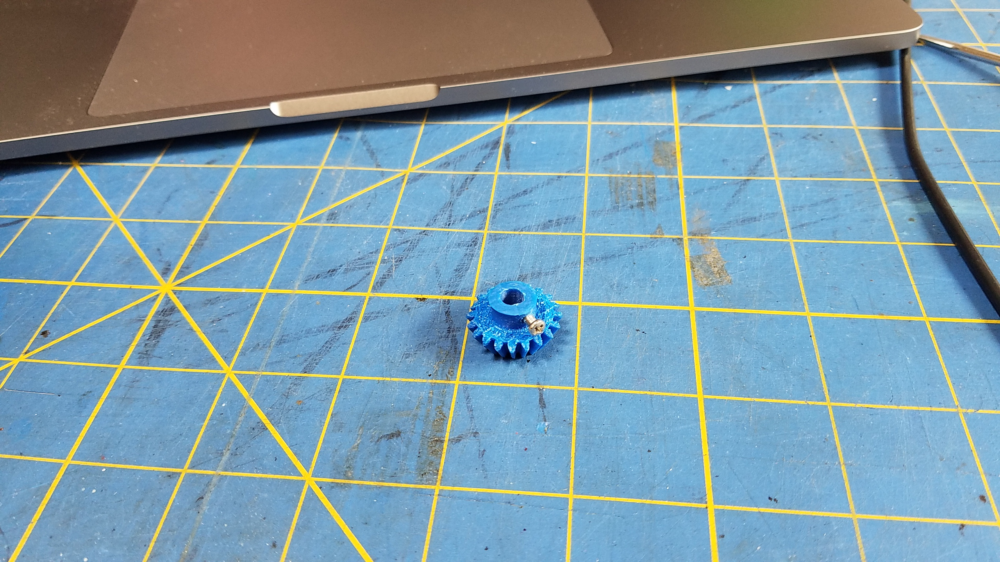
    - Moved to V4, with a short worm gear
- With V4 (See [here](https://github.com/OlivierLD/3DPrinting/tree/master/OpenSCAD/SunFlower/SolarPanelStand.v4) and [here](https://github.com/OlivierLD/3DPrinting/tree/master/OpenSCAD/SunFlower/SolarPanelStand.v4/stl))
    - Like above, gear hard to align correctly
    - Moved to V5 ([here](https://github.com/OlivierLD/3DPrinting/tree/master/OpenSCAD/SunFlower/SolarPanelStand.v5))
- V5 (current version, see [here](https://github.com/OlivierLD/3DPrinting/tree/master/OpenSCAD/SunFlower/SolarPanelStand.v5/stl)) 
    - **All metallic** gears (16 teeth for the pinion, 76 for the wheel gear)
    - Vertical axis for the Azimuth motor
    - Good results so far (July-2020)
    - 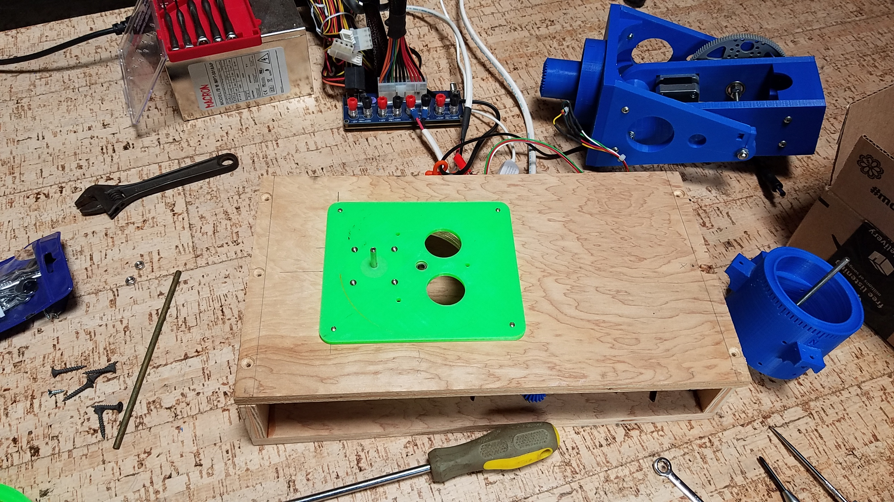
    - 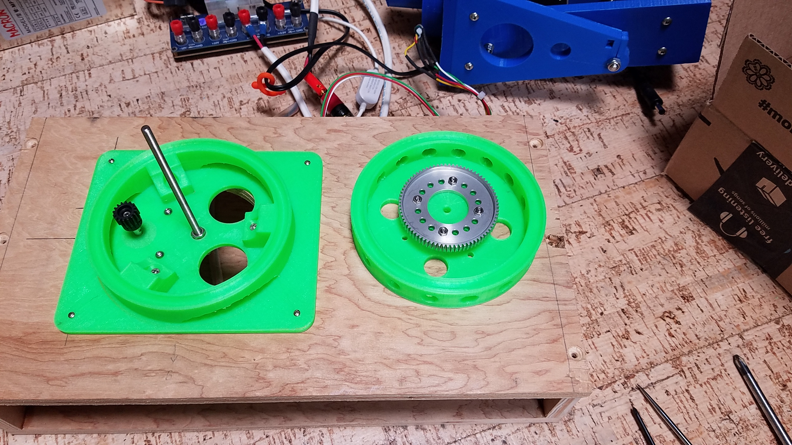
    - 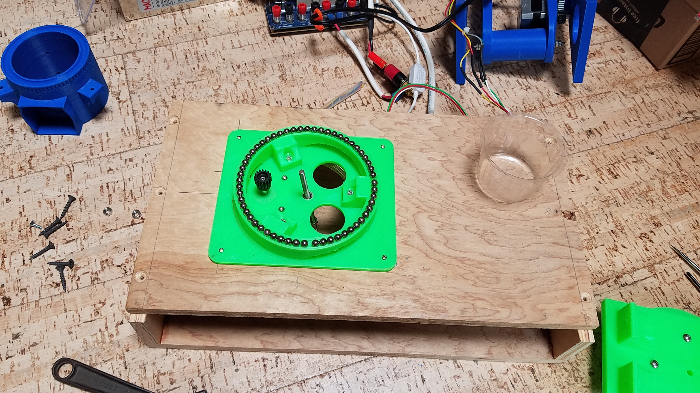
    - 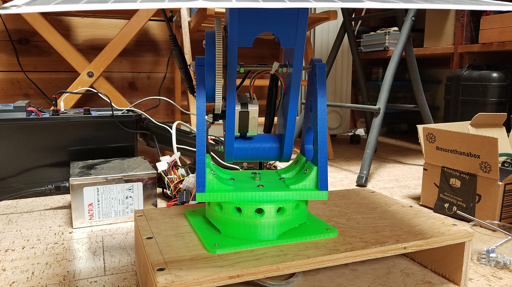
    - 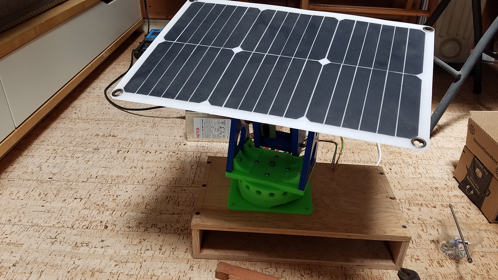
   
### Still progressing!
Here is an interesting setting, with a Raspberry Pi Zero:
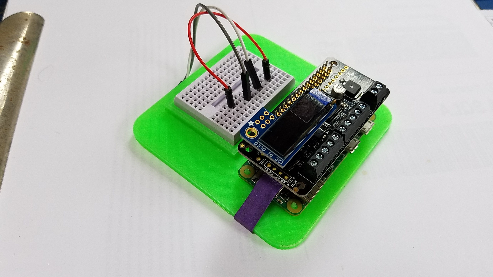

- There is a [Stepper Motor bonnet](https://www.adafruit.com/product/4280)
    - Works like the [Adafruit Motor Hat](https://www.adafruit.com/product/2348), used previously (same code), it is smaller and fits nicely on a Raspberry Pi Zero.
- With a [GPIO Stacking Header](https://www.adafruit.com/product/2223)
- A small [OLED I2C Screen](https://www.adafruit.com/product/3527)

3D-Printed stand
- There is a [3D-printed stand](./STL/ProjectBoxRPiZero.with.feet.stl) for the Raspberry Pi Zero.
            
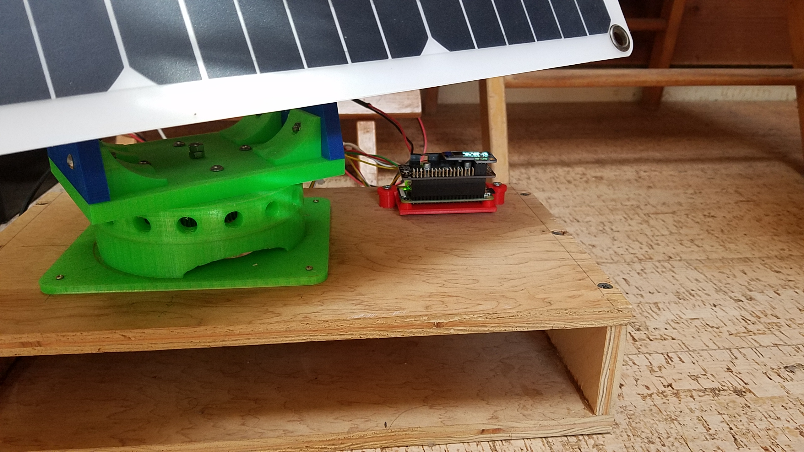
            
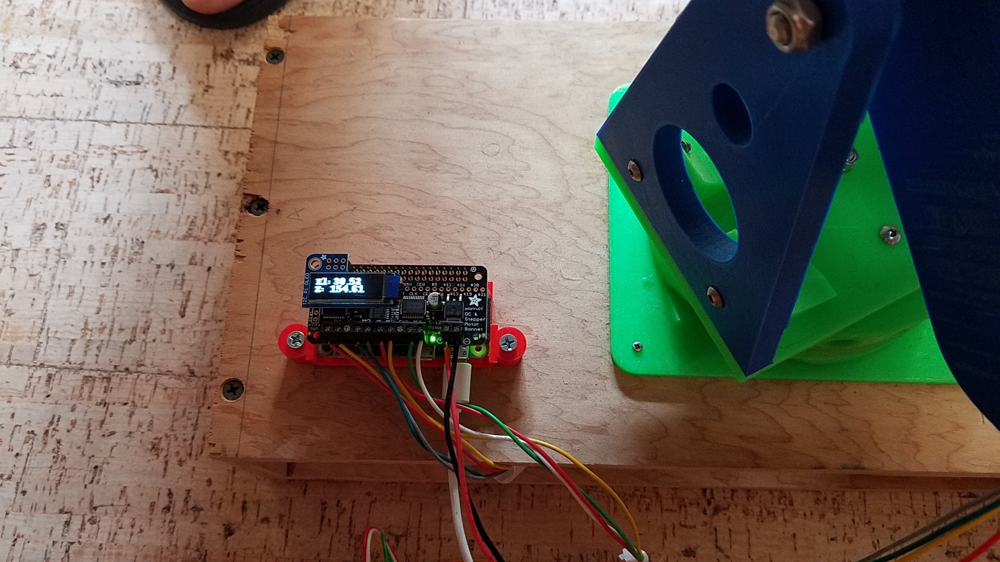

### A "Production" build script
- A build script, to produce a "production" tar-file, to deploy on the device, without having to use git and gradle on it.
- Use `./builder.sh` and follow instructions in the terminal.
  - Do pay attention to the version of the JDK. Small Raspberry Pis may not support JDK 11...

### TODO Next...
- Add a compass (magnetometer), to dynamically provide the device's orientation.
- Add a GPS, to dynamically provide the position.


---
