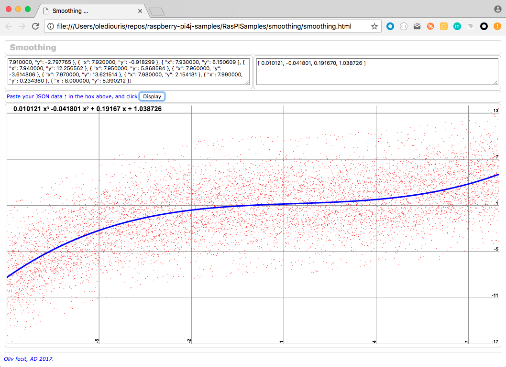
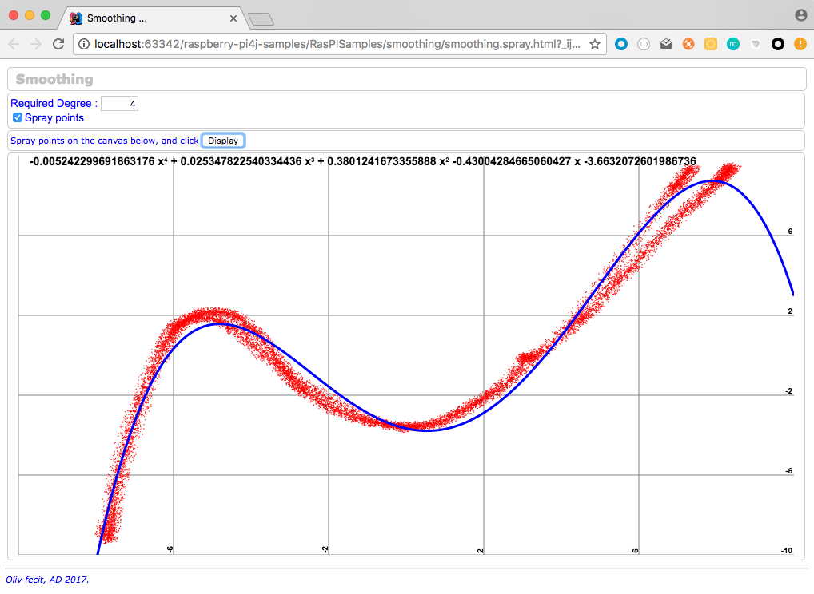

## Smoothing, rendering.
The class in this package `raspisamples.smoothing.LeastSquaresMethod.java` is using the Least Squares method to find the coefficients of a polynomial, so the difference between
the point of the curve (at a given abscissa) and the points of the cloud is as small as possible.

There is a Scala equivalent of this class, in `smoothing.LeastSquaresMethod.scala`.

For details on this method, see [here](http://www.efunda.com/math/leastsquares/leastsquares.cfm) and [here](http://www.lediouris.net/original/sailing/PolarCO2/index.html).

There is a web page to visualize the smoothing at work.

To make it work:

* See in the `main` method the way the `cloudGenerator` method is invoked.

```java
if (false) { // Turn to true to re-generate data
    BufferedWriter bw = new BufferedWriter(new FileWriter("cloud.csv"));
    cloudGenerator(bw, -8, 8, 0.01, new double[] {3, 4, 5, 6, 9}, 0.01, -0.04, 0.2, 1);
    bw.close();
}

if (true) {
    csvToJson("cloud.csv", "cloud.json");
}
```

The `cloudGenerator` is invoked as follow:
```java
cloudGenerator(bw, -8, 8, 0.01, new double[] {3, 4, 5, 6, 9}, 0.01, -0.04, 0.2, 1);
```
That means:

* generate a cloud of points
* from abscissa `-8`
* to abscissa `8`
* with a step of `0.01`
* with a tolerance of `3`, then `4`, `5`, `6`, and `9` (on `y`, up and down). That makes 5 iterations.
* use the polynomial coefficients `[0.01, -0.04, 0.2, 1]`.

The data are generated in a file named `cloud.csv`, it can be opened as a spreadsheet.
Turn the boolen to `true` for this to happen...

The method `csvToJson` can turn those data into a `json` object.

Now run the class
```bash
$> java -cp build/libs/RasPISamples-1.0-all.jar raspisamples.smoothing.LeastSquares
...

[ 0.009981, -0.041813, 0.208513, 1.085674 ]

Deg 3 -> 0.009981
Deg 2 -> -0.041813
Deg 1 -> 0.208513
Deg 0 -> 1.085674
$>
```

See the calculated coefficients (you required a degree 2 for the polynomial), put them in a `json` array:
```json
[ 0.009981, -0.041813, 0.208513, 1.085674 ]
```
Now, load the web page (available in this project) `smoothing/smoothing.html` in your browser,
paste the content of `cloud.json` in the box on the top left, paste the coefficient array in the box on the right,
and click the `Display` button:


---

There is also a pure `JavaScript` implementation that allows you to spray the points on the canvas, and then calculate the smoothed curve.
Just load `smoothing/smoothing.spray.html` in your browser.


---
