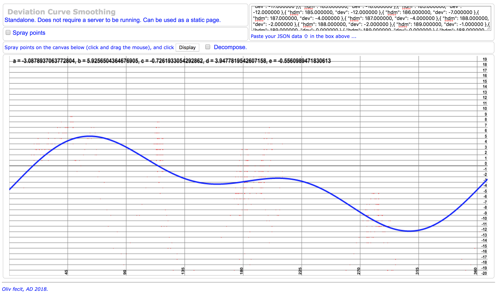

# Deviation Curve
The generic format of a deviation curve is
```
dev(Z) = a + (b . sin(Z)) + (c . cos(Z)) + (d . sin(2.Z)) + (e . cos(2.Z))
```
where `Z` is the Magnetic Heading (`HDM`).

All we need is to come up with the coefficients `a`, `b`, `c`, `d` and `e`.

From a log file, we need to extract the Course Over Ground (`COG`) and the Magnetic Heading (`HDM`), which is the
Compass Heading (`HDG`) corrected with the Magnetic Declination (`D`).

```
 HDM = HDG + D
```

Then for each `HDM`, we establish the difference with `COG`, so we end up with `n` tuples
like `(Z, diff)`, representing a cloud of points.

We will use the Least Square method to come up with the expected coefficients.

We will have a dimension 5 square matrix, and a dimension 1 array of 5 coefficients.
<!--
 Formula below done with https://www.codecogs.com/latex/eqneditor.php

 \begin{bmatrix}
  &n  &\sum_{i=0}^{n}\sin(r)  &\sum_{i=0}^{n}\cos(r)  &\sum_{i=0}^{n}\sin(2r)  &\sum_{i=0}^{n}\cos(2r) \\
  &\sum_{i=0}^{n}\sin(r)  &\sum_{i=0}^{n}\sin(r)^2  &\sum_{i=0}^{n}\sin(r)cos(r)  &\sum_{i=0}^{n}\sin(2r)sin(r))  &\sum_{i=0}^{n}\cos(2r)sin(r) \\
  &\sum_{i=0}^{n}\cos(r)  &\sum_{i=0}^{n}\cos(r)sin(r)  &\sum_{i=0}^{n}\cos(r)^2  & \sum_{i=0}^{n}\sin(2r)cos(r) &\sum_{i=0}^{n}\cos(2r)cos(r) \\
  &\sum_{i=0}^{n}\sin(2r)  &\sum_{i=0}^{n}\sin(2r)sin(r)  &\sum_{i=0}^{n}\sin(2r)cos(r)  &\sum_{i=0}^{n}\sin(2r)^2  &\sum_{i=0}^{n}\cos(2r)sin(2r) \\
  &\sum_{i=0}^{n}\cos(2r)  &\sum_{i=0}^{n}\cos(2r)sin(r)  &\sum_{i=0}^{n}\cos(2r)cos(r)  &\sum_{i=0}^{n}\cos(2r)sin(2r)  &\sum_{i=0}^{n}\cos(2r)^2
 \end{bmatrix}

 \begin{bmatrix}
  &\sum_{i=0}^{n}\ d \\
  &\sum_{i=0}^{n}\ d.sin(r) \\
  &\sum_{i=0}^{n}\ d.cos(r) \\
  &\sum_{i=0}^{n}\ d.sin(2r) \\
  &\sum_{i=0}^{n}\ d.cos(2r)
 \end{bmatrix}

 -->


in the system above, `r` is the heading, `d` is the deviation (&delta; between `HDG` and `HDM`).

### The log file
We need at least `HDG` and `RMC`
```
$IIHDG,126,,,10,E*16
...
$IIRMC,190402,A,0854.980,S,14006.028,W,00.0,008,031110,10,E,A*07
```

The specification of HDG is the following one:
```
 $xxHDG,x.x,x.x,a,x.x,a*hh
        |   |   | |   | |
        |   |   | |   | Checksum
        |   |   | |   Magnetic Variation direction, E = Easterly, W = Westerly
        |   |   | Magnetic Variation degrees
        |   |   Magnetic Deviation direction, E = Easterly, W = Westerly
        |   Magnetic Deviation, degrees
        Magnetic Sensor heading in degrees
```

The specification of RMC is the following one:
```
         1      2 3        4 5         6 7     8     9      10    11
  $xxRMC,123519,A,4807.038,N,01131.000,E,022.4,084.4,230394,003.1,W*6A
         |      | |        | |         | |     |     |      |     |
         |      | |        | |         | |     |     |      |     Variation sign
         |      | |        | |         | |     |     |      Variation value
         |      | |        | |         | |     |     Date DDMMYY
         |      | |        | |         | |     COG
         |      | |        | |         | SOG
         |      | |        | |         Longitude Sign
         |      | |        | Longitude Value
         |      | |        Latitude Sign
         |      | Latitude value
         |      Active or Void
         UTC

```

Notice that the `HDM` and `RMC` sentences _may_ return the Variation (`W` equals to `D + d`).
In the samples above, this is obviously only the Magnetic Declination (`D`).

### Example
The data file provided here as an example was done motoring in an anchorage, in [Taiohae, Nuku-Hiva](https://drive.google.com/open?id=1ZbZm1G1fODnCzGFsiip7Hf2SFc_gNRzX&usp=sharing).
Those data are raw NMEA Data.

#### Step by step
- Transform the NMEA data file into a json document:
  - run `./process.log.sh 2010-11-03.Taiohae.nmea`, this generates a `data.json` (default name).
- Open `deviation.tool.html` in a browser (it does not need a server to run).
- Paste the content of the `data.json` in the top right text box
- Click the [`Display`] button
- See the curve, along with its coefficients



---
