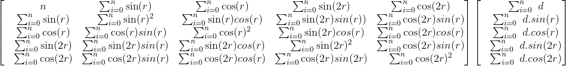

# Deviation Curve
The generic format of a deviation curve is
```
dev(Z) = a + (b . sin(Z)) + (c . cos(Z)) + (d . sin(2.Z)) + (e . cos(2.Z))
```
where `Z` is the Magnetic Heading (`HDM`).

All we need is to come up with the coefficients `a`, `b`, `c`, `d` and `e`.

From a log file, we need to extract the Course Over Ground (`COG`) and the Magnetic Heading (`HDM`), which is the
Compass Heading (`HDG`) corrected with the Magnetic Declination (`D`).

```
 HDM = HDG + D
```

Then for each `HDM`, we establish the difference with `COG`, so we end up with `n` tuples
like `(Z, diff)`, representing a could of points.

We will use the Least Square method to come up with the expected coefficients.

We will have a dimension 5 square matrix, and an dimension 1 array of 5 coefficients.



in the system above, `r` is the heading, `d` is the deviation (&delta; between `HDG` and `HDM`).
