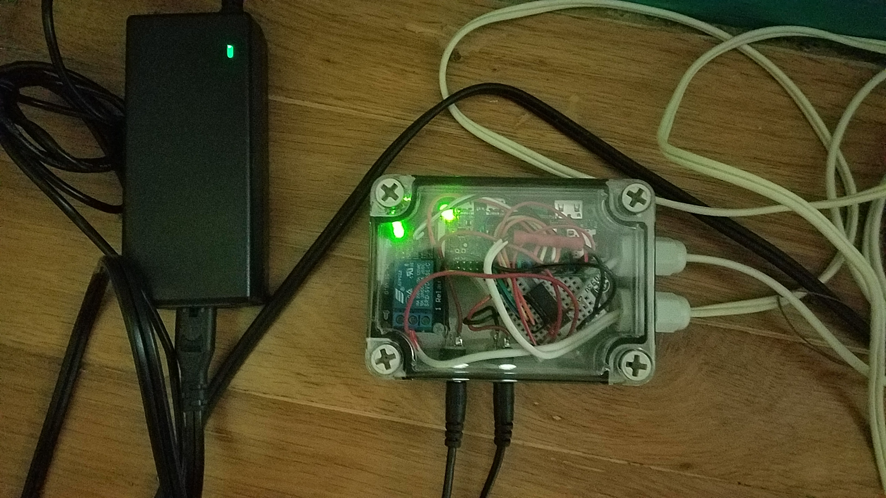
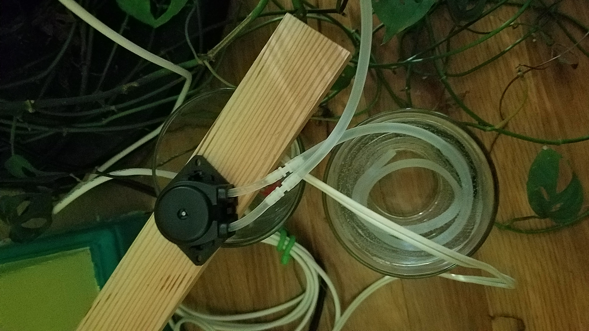
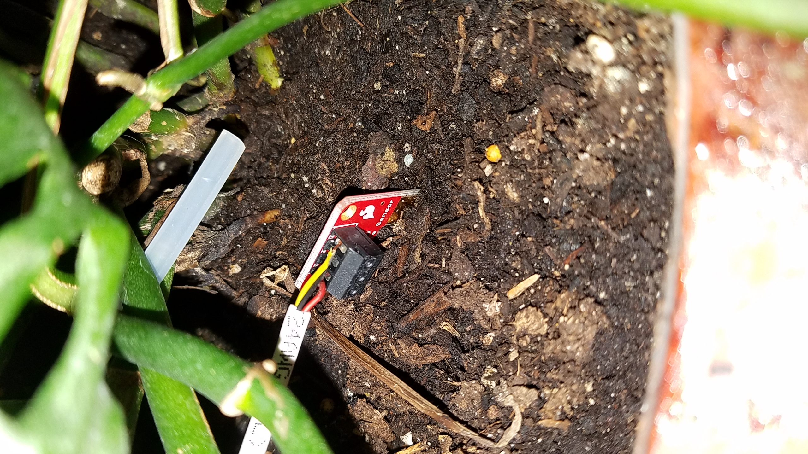
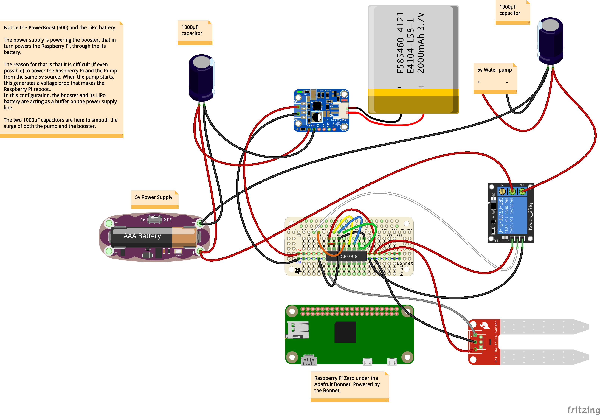
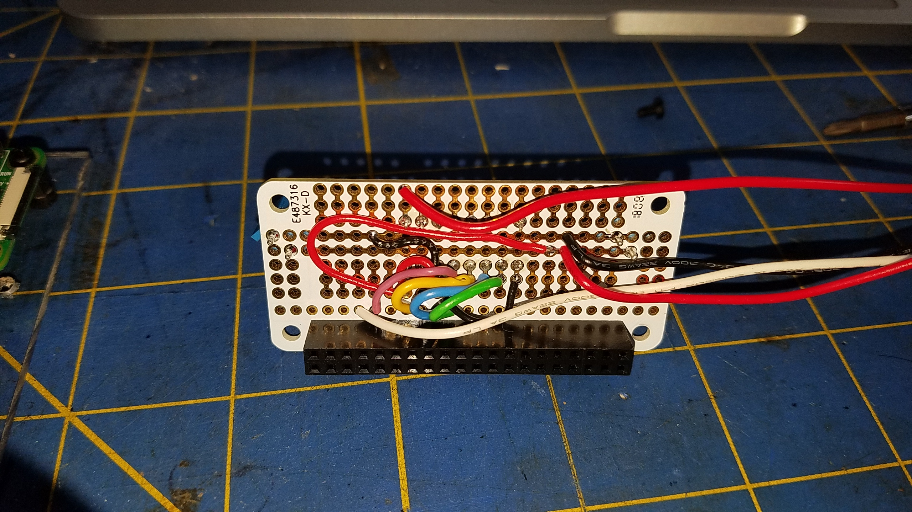
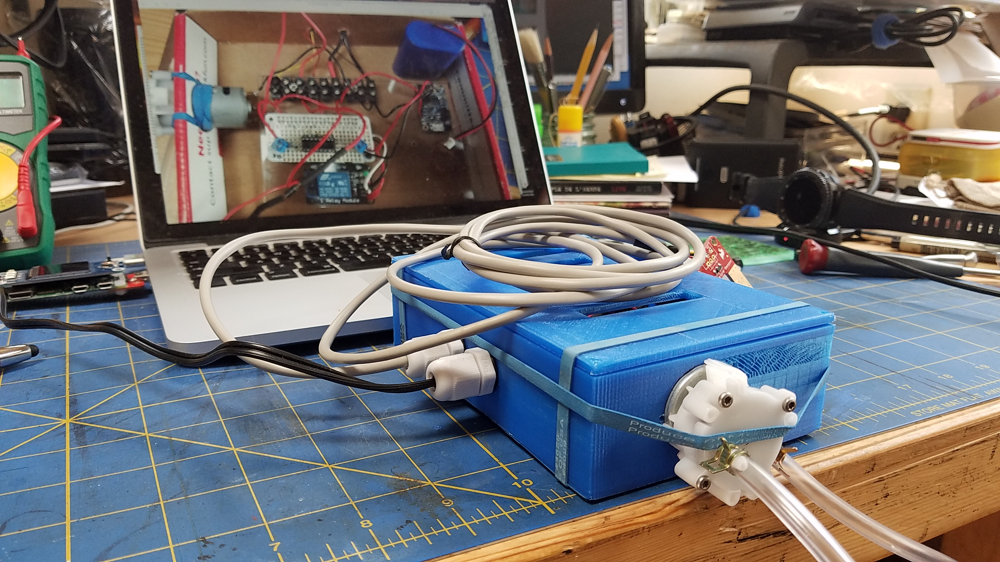
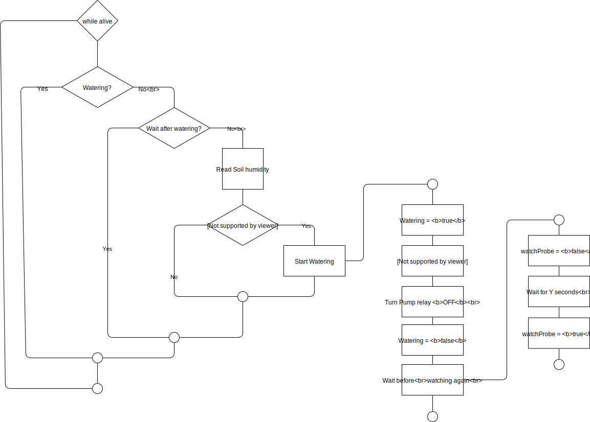

# WIP: Plant Watering System
## A real world project, hardware, software, 3D Printing

#### BOM
- Raspberry Pi Zero
- Adafruit Bonnet
- Sparkfun Soil Moisture Sensor
- MCP3008 and its socket
- Relay
- Power Booster 1000c
- Water Pump (2 versions, 12v, or 5v)
- Water hoses, clamps, wires, etc.

Early 3D files for the enclosure are in the [`3D`](./3D) directory.

<!--TODO Add a switch?-->

For the elaboration of the project, see [HISTORY.md](./HISTORY.md).

We want to interface a Moisture/Humidity sensor with
some kind or pump or valve to irrigate the plants in need.

#### March 24, 2019
With the MCP3008 and the _SparkFun Soil Moisture Sensor_ and a peristaltic pump (12v), it works!

| Assembling | In the Box |
|:----------:|:----------:|
|  |  |
 
| Pump & Tank | Soil Sensor |
|:-----------:|:-----------:|
|  |  | 

##### Working prototype
- Calibration is required for the MCP3008 & Soil Moisture Sensor. The value returned by the MCP3008 is a value between
0 and 1023, not necessarily reflecting the actual humidity.

###### To keep an eye on
- The size of the log file(s). Purge it from time to time if it is on.

##### Next
The above works, but it requires 2 power supplies
- 5v for the Raspberry
- 12v for the pump

Let's see if that can be done with only one 5v outlet. The - unexpected - challenge here, is the sharing of power.
If you just plug the Raspberry Pi and the Pump on the same 5v outlet, the Raspberry Pi will
just shutdown when the pump starts. Hence problem.

After several configurations, I finally managed to come up with one that seems to work.
If someone has a better idea, please do speak up! 

With an Adafruit Bonnet, and a 5v pump (same power supply as the RPi).

> 5v pump: <https://www.allelectronics.com/item/pmp-20/mini-water-pump/1.html>



> _Note_: wires are shown on top of the Bonnet, they are actually _under_ it.

> _Remark_: Notice the PowerBoost (500 or 1000) and the LiPo battery.
> The power supply is powering the Raspberry Pi and the booster, that in turn powers the pump, through its LiPo battery when the relay in on.
> The reason for that is that it is difficult (if even possible) to power the Raspberry Pi and the Pump from the same 5v source without caution. 
> When the pump starts, this generates a voltage drop that makes the Raspberry Pi reboot...
> Along the same lines, when the pump is primed, the power demand on start is higher than when the pump is not primed. In some (previous) configurations,
> the system was working OK when the pump was not primed (like the first tests), but was failing (rebooting) when the pump was already primed, 
> like during a subsequent watering.
> In this configuration, the booster and its LiPo battery are acting as a buffer on the power supply line, and dissociate the pump and the Raspberry Pi.
> I was not able to work around this problem with capacitors (this does not mean it is not possible)...

| Bonnet top | Bonnet bottom |
|:----------:|:-------------:|
|  |  |
| Card box prototype | Assembling |
|  |  |
| 3D printed enclosure | Closed | 
|  |  |
| Good to go | | 
|  | | 

#### June 2019: bonus
If after watering, the humidity does not go up, that may mean that the tank is empty.
In that case, you have the possibility to send an email to a list of recipients, telling them to do something about it. 

### Flowchart



<small>For the diagram above, I used [draw.io](https://www.draw.io/), cool tool.</small>

### REST
Most features are available through REST Services.
Any REST client (`PostMan`, `curl`, etc) can reach them.

To get the list of endpoints:
```
 $ curl http://[raspberrypi.address]:8088/pws/oplist
```
Get the program's parameters:
```
 $ curl -X GET http://192.168.42.5:8088/pws/pws-parameters
 {"humidityThreshold":75,"wateringTime":10,"resumeWatchAfter":120}
```

Set the program's parameters:
```
 $ curl -X PUT -H "Content-Type:application/json" -d "{\"humidityThreshold\":75,\"wateringTime\":10,\"resumeWatchAfter\":120}" http://192.168.42.5:8088/pws/pws-parameters 
```
or
```
 $ curl --request PUT --header "Content-Type:application/json" --data "{\"humidityThreshold\":75,\"wateringTime\":10,\"resumeWatchAfter\":120}" http://192.168.42.5:8088/pws/pws-parameters 
```
etc...

#### Web UI


#### Ideas to move on...
- A Web UI without external libraries (JQuery is great, but not required with ES6).

---
