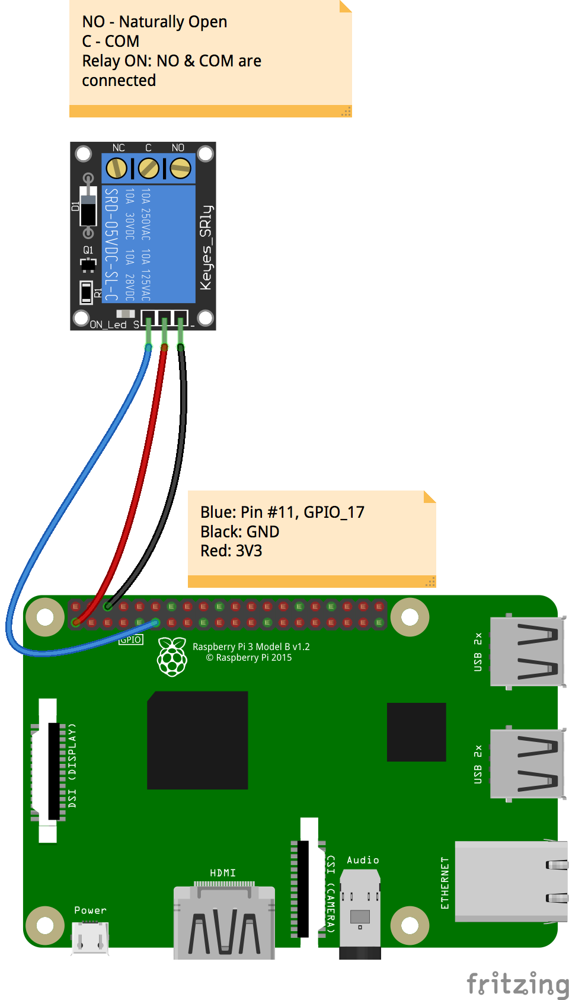
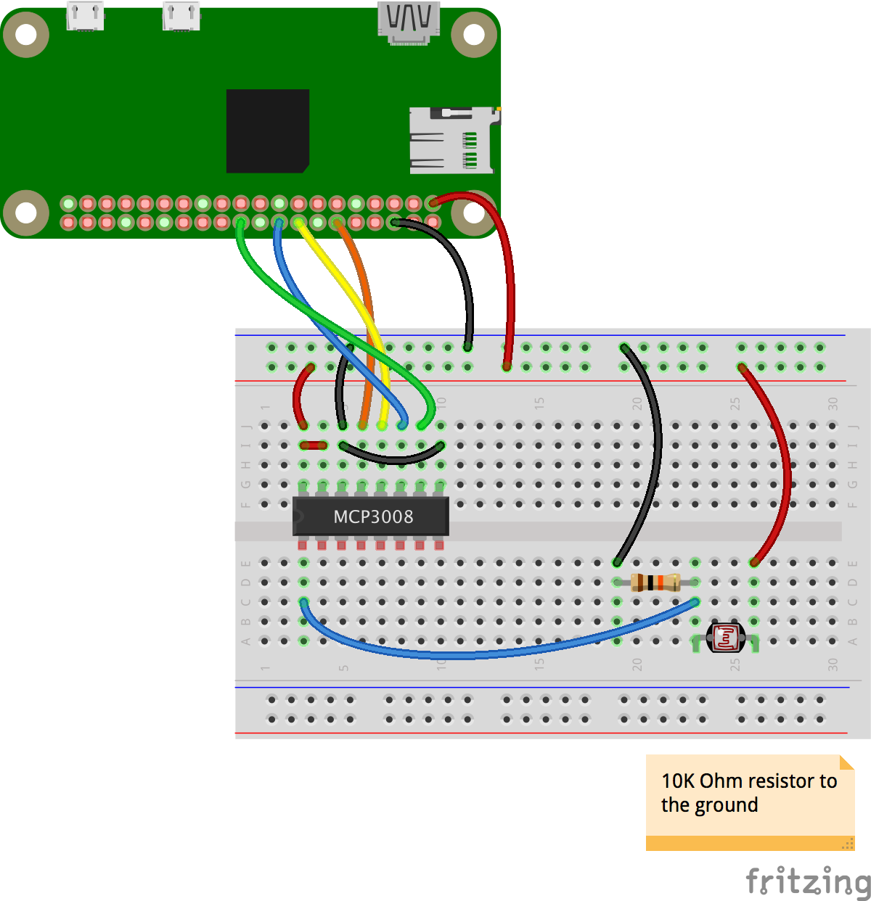
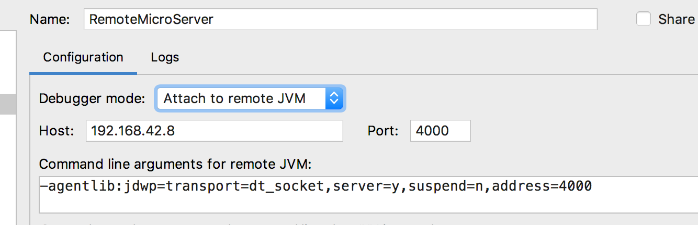
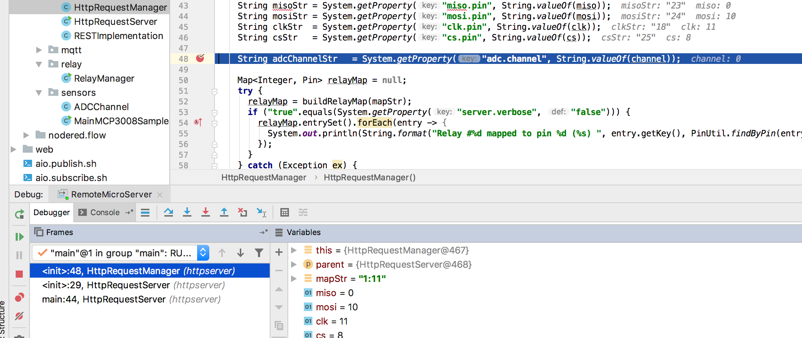
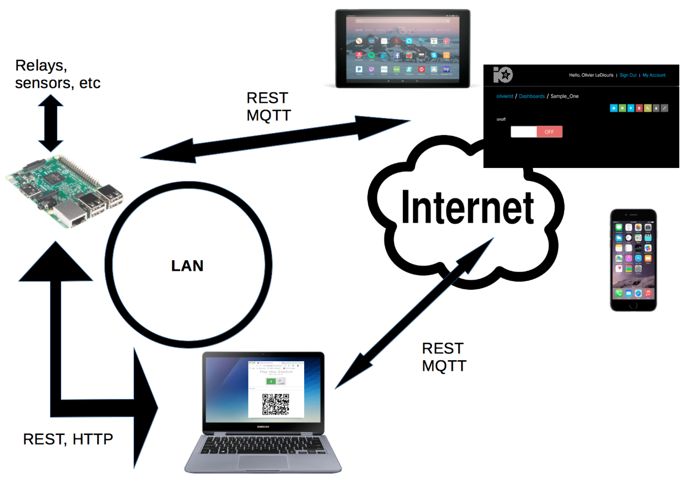
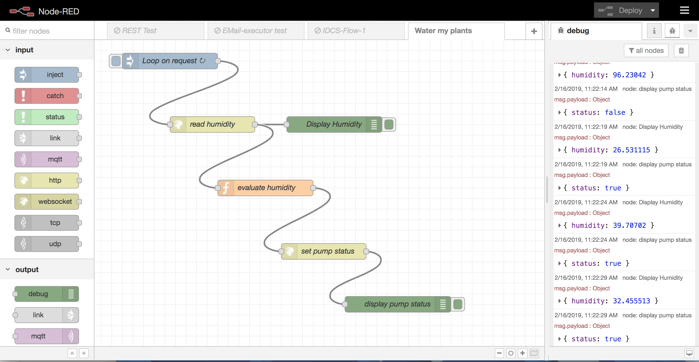

# From scratch to a sensor flow
_Synopsis_: We want to expose the values read by some sensors to a network (LAN, WAN, the Internet...), and be able
to interact with (drive) some devices like switches (flip them on or off), manually, or automatically.

This involves three major steps:
- Read/write on hardware (read sensor, drive relay)
- Expose hardware features (various protocols: REST, MQTT, etc) to a network
- Consume (from an app)!

## Sensors, IoT, FaaS, Micro-services...
All Open Source, Soft & Hard

| Software | Hardware |
|:--------:|:--------:|
|  |  |

### We will use
- in term of hardware
  - a light sensor (photo-resistor), like [this one](https://www.adafruit.com/product/161), ~ $0.95
  - a relay, like [this one](https://www.amazon.com/WINGONEER-KY-019-Channel-Module-arduino/dp/B06XHJ2PBJ/ref=sr_1_5?keywords=relay&qid=1550521549&s=gateway&sr=8-5). 5 for ~$9.00.
  - Breadboards, a 10K&Omega; resistor, wires, jumpers...,  the usual maker's stuff.
  - one or several Raspberry Pi computers. Any model would fit, Raspberry Pi Zero, A, B, all versions.
- in term of programming language
  - [Java](https://www.oracle.com/technetwork/java/index.html)
- in term of communication protocols
    - HTTP
    - REST
    - MQTT  
- in term of tools and frameworks
  - [Maven](https://maven.apache.org/) - a build tool for Java.
  - Third-party micro-servers, we have 3 possibilities (only one is needed, if you choose this route):
    - [Helidon](http://helidon.io) - Micro-service oriented.
    - [SpringBoot](https://spring.io/) - Micro-service oriented.
    - [fnProject](https://fnproject.io/) - FaaS (Function as a Service) oriented.
  - Possibly [Swagger](https://swagger.io/) - the de-facto standard in term of REST API documentation (and more).
  - [Node-RED](https://nodered.org/) - A very cool service orchestration (and more) tool based on NodeJS. 
- in term of reusable code
  - resources available in this repository (https://github.com/OlivierLD/raspberry-coffee/)
    - to use an Analog to Digital Converter
    - to interact with a relay
    - to get to the code of a tiny-micro-HTTP/REST-server  

Let's says you have:
- A photo resistor, to measure the ambient light
- A relay driving a power outlet, to turn a desk lamp on or off.

> The photo resistor is an analog device (not digital). We will need an Analog to Digital Converter (ADC) to read it from the Raspberry Pi (that does not have analog pins, as an Arduino would).
> We will use an [`MCP3008`](https://www.adafruit.com/product/856) ($3.75).
 
Those two devices are connected to a Raspberry Pi that can read data from the sensor, and drive the lamp through the relay.

Now, we want to expose those features to a network and build some logic around them, in order to turn the light on or off when needed.

REST clients can be programs, or web pages.

## Wiring

| Relay wiring | MCP3008 & light sensor wiring |
|:------------:|:-----------------------------:|
|  |  |
| Note: I use 3v3 for a one-relay board, and 5V for a two-relay board. | Notice the 10K &Omega; resistor |
  
The 2 devices can be wired on the same Raspberry Pi, or on different ones, as you like.
All they need to collaborate is to see each other on the network.  

## Create the Java REST services
We start from the code that allows you to read data emitted by various sensors,
many such examples are available in this repository.

With the devices wired as above, to see the output of the light sensor, run the script `lightsensor.cal.sh`: 
```
$ ./lightsensor.cal.sh --clk:18 --miso:23 --mosi:24 --cs:25 --channel:2
Read an ADC (MPC3008) for 3.3 Volt estimation
Usage is ./lightsensor.cal.sh --miso:9 --mosi:10 --clk:11 --cs:8 --channel:0
 For miso, mosi, clk & cs, use BCM pin numbers
Usage is java sensors.MainMCP3008Sample33 --miso:9 --mosi:10 --clk:11 --cs:8 --channel:0
Values above are default values (GPIO/BCM numbers).

Reading MCP3008 on channel 2
 Wiring of the MCP3008-SPI (without power supply):
 +---------++-----------------------------------------------+
 | MCP3008 || Raspberry Pi                                  |
 +---------++------+------------+------+---------+----------+
 |         || Pin# | Name       | Role | GPIO    | wiringPI |
 |         ||      |            |      | /BCM    | /PI4J    |
 +---------++------+------------+------+---------+----------+
 | CLK (13)|| #12  | PCM_CLK    | CLK  | GPIO_18 | 01       |
 | Din (11)|| #18  | GPIO_5     | MOSI | GPIO_24 | 05       |
 | Dout(12)|| #16  | GPIO_4     | MISO | GPIO_23 | 04       |
 | CS  (10)|| #22  | GPIO_6     | CS   | GPIO_25 | 06       |
 +---------++------+------------+-----+----------+----------+
Raspberry Pi is the Master, MCP3008 is the Slave:
- Dout on the MCP3008 goes to MISO on the RPi
- Din on the MCP3008 goes to MOSI on the RPi
Pins on the MCP3008 are numbered from 1 to 16, beginning top left, counter-clockwise.
       +--------+ 
  CH0 -+  1  16 +- Vdd 
  CH1 -+  2  15 +- Vref 
* CH2 -+  3  14 +- aGnd 
  CH3 -+  4  13 +- CLK 
  CH4 -+  5  12 +- Dout 
  CH5 -+  6  11 +- Din 
  CH6 -+  7  10 +- CS 
  CH7 -+  8   9 +- dGnd 
       +--------+ 
       +-----+-----+--------------+-----++-----+--------------+-----+-----+
       | BCM | wPi | Name         |  Physical  |         Name | wPi | BCM |
       +-----+-----+--------------+-----++-----+--------------+-----+-----+
       |     |     | 3v3          | #01 || #02 |          5v0 |     |     |       
       |  02 |  08 | SDA1         | #03 || #04 |          5v0 |     |     |       
       |  03 |  09 | SCL1         | #05 || #06 |          GND |     |     |       
       |  04 |  07 | GPCLK0       | #07 || #08 |    UART0_TXD | 15  | 14  |       
       |     |     | GND          | #09 || #10 |    UART0_RXD | 16  | 15  |       
       |  17 |  00 | GPIO_0       | #11 || #12 | PCM_CLK/PWM0 | 01  | 18  | CLK   
       |  27 |  02 | GPIO_2       | #13 || #14 |          GND |     |     |       
       |  22 |  03 | GPIO_3       | #15 || #16 |       GPIO_4 | 04  | 23  | Dout  
       |     |     | 3v3          | #17 || #18 |       GPIO_5 | 05  | 24  | Din   
       |  10 |  12 | SPI0_MOSI    | #19 || #20 |          GND |     |     |       
       |  09 |  13 | SPI0_MISO    | #21 || #22 |       GPIO_6 | 06  | 25  | CS    
       |  11 |  14 | SPI0_CLK     | #23 || #24 |   SPI0_CS0_N | 10  | 08  |       
       |     |     | GND          | #25 || #26 |   SPI0_CS1_N | 11  | 07  |       
       |     |  30 | SDA0         | #27 || #28 |         SCL0 | 31  |     |       
       |  05 |  21 | GPCLK1       | #29 || #30 |          GND |     |     |       
       |  06 |  22 | GPCLK2       | #31 || #32 |         PWM0 | 26  | 12  |       
       |  13 |  23 | PWM1         | #33 || #34 |          GND |     |     |       
       |  19 |  24 | PCM_FS/PWM1  | #35 || #36 |      GPIO_27 | 27  | 16  |       
       |  26 |  25 | GPIO_25      | #37 || #38 |      PCM_DIN | 28  | 20  |       
       |     |     | GND          | #39 || #40 |     PCM_DOUT | 29  | 21  |       
       +-----+-----+--------------+-----++-----+--------------+-----+-----+
       | BCM | wPi | Name         |  Physical  |         Name | wPi | BCM |
       +-----+-----+--------------+-----++-----+--------------+-----+-----+
Volume:  80% (0819) => 2.642 V
Volume:  79% (0813) => 2.623 V
Volume:  80% (0820) => 2.645 V
Volume:  76% (0783) => 2.526 V
Volume:  75% (0768) => 2.477 V
Volume:  69% (0714) => 2.303 V
Volume:  68% (0703) => 2.268 V
Volume:  67% (0689) => 2.223 V
Volume:  68% (0700) => 2.258 V
Volume:  67% (0691) => 2.229 V
Volume:  62% (0644) => 2.077 V
Volume:  53% (0548) => 1.768 V
Volume:  63% (0649) => 2.094 V
Volume:  59% (0610) => 1.968 V
Volume:  48% (0501) => 1.616 V
Volume:  47% (0491) => 1.584 V
Volume:  48% (0499) => 1.610 V
. . . 
```
Similarly, you can test the relay driver:
```
$ ./relay.test.sh 
Test the relay, manually
Relay #1 mapped to pin 11 (GPIO_0) 
Type Q at the prompt to quit
Q to quit, + to turn ON, - to turn OFF > +
Setting Relay#1 on
Q to quit, + to turn ON, - to turn OFF > -
Setting Relay#1 off
Q to quit, + to turn ON, - to turn OFF > +
Setting Relay#1 on
Q to quit, + to turn ON, - to turn OFF > -
Setting Relay#1 off
Q to quit, + to turn ON, - to turn OFF > q
Done.
```
Good. Now, we know that the devices are working, and we can interact with them.

We now need to expose their capabilities to an audience wider than only the guy(s) connected to the Raspberry Pi.

#### Micro Service?

We will explore several options.

We need some kind of server to run on the Raspberry Pi, so the outer world can reach it to get to the data and possibly interact with them.

- [Helidon](#helidon) is an implementation of such a micro-server, implementing SE (Micro-Framework) and MP (Micro-Profile) flavors.
- [SpringBoot](#springboot), Spring's implementation of Micro Services.
- [fnProject](#fnproject), FaaS server implementation, Docker based
- a [Custom micro-server](#using-a-light-custom-micro-http-server), part of this project
- NodeJS. This is another project, but this should work just fine. Look into [this repo](https://github.com/OlivierLD/node.pi).

<!-- Serverless... Actually means that the server can be anywhere, everywhere, etc.

FaaS, Function as a Service. -->

#### Helidon
2 flavors, MP and SE

##### Helidon-MP
MP stands for `micro-profile`. Relies on JAX-RS among other things.

You need `Maven` to be available on your system (it's there by default on the Raspberry Pi).

> Note: Below is the description of the steps to take to do it in full for yourself.
> The code to run is already in this project. You can actually jump to the section [`Run the server`](#run-the-server) if you do not 
> need to know how the code is elaborated.

Using `Maven`, let's create the require infrastructure.

You need network access to complete this step. If you are behind a firewall, you need to provide the 
proxy location by adding `-Dhttp.proxyHost=www-proxy.me.home -Dhttp.proxyPort=80 -Dhttps.proxyHost=www-proxy.me.home -Dhttps.proxyPort=80`
to the command below (replace `www-proxy.me.home` with the appropriate value).
```
$ mvn archetype:generate -DinteractiveMode=false \
      -DarchetypeGroupId=io.helidon.archetypes \
      -DarchetypeArtifactId=helidon-quickstart-mp \
      -DarchetypeVersion=1.0.0 \
      -DgroupId=io.helidon.examples \
      -DartifactId=helidon-mp-sensors \
      -Dpackage=rpi.sensors.mp
```
Notice above:
- the `artifactId`, will generate the code in a directory with that name
- the `package`, where the Java skeletons will be generated

The generated code only contains a simple "Greeting" service. You can run it right now.
The code is generated using `JAX-RS` annotations.

```
 $ cd helidon-mp-sensors
```
then (add proxy parameters if required)
```
 $ mvn package [ -U ] [ -Dmaven.test.skip=true ]
```
Eventually you have
```
[INFO] Building jar: target/helidon-mp-sensors.jar
[INFO] ------------------------------------------------------------------------
[INFO] BUILD SUCCESS
[INFO] ------------------------------------------------------------------------
[INFO] Total time:  21.787 s
[INFO] Finished at: 2019-02-16T08:03:13-08:00
[INFO] ------------------------------------------------------------------------
$
```
At this point, it's ready to run:
```
 $ java -jar target/helidon-mp-sensors.jar
 2019.02.16 08:06:02 INFO org.jboss.weld.Version !thread!: WELD-000900: 3.0.3 (Final)
 2019.02.16 08:06:02 INFO org.jboss.weld.Bootstrap !thread!: WELD-ENV-000020: Using jandex for bean discovery
 2019.02.16 08:06:03 INFO org.jboss.weld.Bootstrap !thread!: WELD-000101: Transactional services not available. Injection of @Inject UserTransaction not available. Transactional observers will be invoked synchronously.
 2019.02.16 08:06:03 INFO org.jboss.weld.Event !thread!: WELD-000411: Observer method [BackedAnnotatedMethod] private org.glassfish.jersey.ext.cdi1x.internal.CdiComponentProvider.processAnnotatedType(@Observes ProcessAnnotatedType) receives events for all annotated types. Consider restricting events using @WithAnnotations or a generic type with bounds.
 2019.02.16 08:06:03 WARN org.jboss.weld.Bootstrap !thread!: WELD-000146: BeforeBeanDiscovery.addAnnotatedType(AnnotatedType<?>) used for class org.glassfish.jersey.ext.cdi1x.internal.CdiComponentProvider$JaxRsParamProducer is deprecated from CDI 1.1!
 WARNING: An illegal reflective access operation has occurred
 WARNING: Illegal reflective access by org.jboss.classfilewriter.ClassFile$1 (file:/Users/olediour/repos/raspberry-pi4j-samples/Project.Trunk/REST.clients/REST.assembler/helidon-sensors/target/libs/jboss-classfilewriter-1.2.1.Final.jar) to method java.lang.ClassLoader.defineClass(java.lang.String,byte[],int,int)
 WARNING: Please consider reporting this to the maintainers of org.jboss.classfilewriter.ClassFile$1
 WARNING: Use --illegal-access=warn to enable warnings of further illegal reflective access operations
 WARNING: All illegal access operations will be denied in a future release
 2019.02.16 08:06:04 INFO org.jboss.weld.Bootstrap !thread!: WELD-ENV-002003: Weld SE container 8b62d29e-5ca4-426a-b089-a74267218f50 initialized
 2019.02.16 08:06:04 INFO io.helidon.microprofile.security.SecurityMpService !thread!: Security extension for microprofile is enabled, yet security configuration is missing from config (requires providers configuration at key security.providers). Security will not have any valid provider.
 2019.02.16 08:06:05 INFO io.helidon.webserver.NettyWebServer !thread!: Channel '@default' started: [id: 0x698b64fc, L:/0:0:0:0:0:0:0:0:8080]
 2019.02.16 08:06:05 INFO io.helidon.microprofile.server.ServerImpl !thread!: Server started on http://localhost:8080 (and all other host addresses) in 203 milliseconds.
 http://localhost:8080/greet
```
Your micro-service is running in `jetty`, on port `8080`. This port is defined in
the generated file `helidon-sensors/src/main/resources/META-INF/microprofile-config.properties` along
with other properties used at runtime.

You can see what the service is providing from any REST client:
```
 $ curl http://192.168.42.8:8080/greet
   {"message":"Hello World!"}
```
It works 👍.

To move beyond, see the [Helidon documentation](https://helidon.io/docs/latest/#/getting-started/02_base-example#Prerequisites).

Now the infrastructure is in place, we will replace this "Hello World" code with ours.

<!-- TODO Document the gradle path
> Note: if you'd rather use `gradle` than `maven`, to generate the require `build.gradle`, 
> from the directory where the generated `pom.xml` lives, just type
```
 $ ../../../../gradlew init
```
-->

##### Helidon-SE
Like above, use Maven to create the skeletons:
```
 $ mvn archetype:generate -DinteractiveMode=false \
       -DarchetypeGroupId=io.helidon.archetypes \
       -DarchetypeArtifactId=helidon-quickstart-se \
       -DarchetypeVersion=1.0.0 \
       -DgroupId=io.helidon.examples \
       -DartifactId=helidon-se-sensors \
       -Dpackage=rpi.sensors.se
```
> Note: `resources/application.yaml` contains parameters, like the http port.

> Just like for MP, the SE code is already in this project

###### Install required dependencies
We will use in our micro service resources from other modules in this project.

We thus need to `install` them in the local Maven repo.

From the directory `ADC`:
```
 $ pwd
 /home/pi/raspberry-coffee/ADC 
 $ ../gradlew install
 $ cd ../common-utils
 $ ../gradlew install
 $ 
```

We need to add those dependencies to the `pom.xml`.

First add one repository
```xml
 <repositories>

   <repository>
     <id>sonatype-repo</id>
     <url>https://oss.sonatype.org/content/groups/public/</url>
   </repository>

</repositories>
```
Then at the end of the `<dependencies>` section:
```xml
 <dependency>
   <groupId>oliv.raspi.coffee</groupId>
   <artifactId>ADC</artifactId>
   <version>1.0</version>
 </dependency>
```

> Note: I had to rename the PI4J jar file pulled in the `target/libs` directory from `pi4j-core-1.2-SNAPSHOT.jar` to `pi4j-core-1.2-20180423.162750-37.jar`.
> This is the name it has in the `MANIFEST.MF`.

Now we're ready to dive into the code.

#### For Helidon-MP 
- Change the name of `GreetingApplication.java` to `SensorApplication.java`
- Change the name of `GreetingProvider.java` to `SensorProvider.java`
- Change the name of `GreetResource.java` to `SensorResource.java`

For information
- `SensorApplication` will be the entry point of the micro-service
- `SensorResource` will define the REST interface
- `SensorProvider` will be the implementation, actually dealing with sensors and relay.

The source files, as they should eventually be running are provided in this project,
in the `helidon-mp-sensors` folder.

> Also notice the `helidon-mp-sensors/src/main/resources/META-INF/microprofile-config.properties` config file.

#### For Helidon-SE
The code is even simpler, it is located in the `helidon-se-sensors` folder.

> Also notice the `helidon-se-sensors/src/main/resources/application.yaml` config file.

<!-- Memory minimal footprint ~xxMb -->

###### Run the Helidon micro-server

Now you package and run your micro-service:
```
 $ mvn package [ -Dmaven.test.skip=true ]
 $ [sudo] java -jar target/helidon-mp-sensors.jar
```
or
```
 $ mvn package [ -Dmaven.test.skip=true ]
 $ [sudo] java -jar target/helidon-se-sensors.jar
```
depending on the flavor you chosed (se or mp). 

Helidon also has some Docker capabilities:
```
$ docker build -t helidon-sensors target
$ docker run --rm -p 8080:8080 helidon-sensors:latest
```

##### SpringBoot
```
$ cd springboot-sensors
$ ./gradlew clean build
$ java -Dserver.verbose=true -jar build/libs/sensors-spring-boot-0.1.0.jar --help
```

Then
```
GET http://localhost:8080/light/ambient
```

```
GET http://localhost:8080/relay/status/1
```

```
POST http://localhost:8080/relay/status/1
{ "status": true }
```

##### fnProject
- Still in development, but quite promising.
- Definitely `FaaS` oriented.
- `Docker` native.
- Also relies on `Maven`. 

WIP. 🚧

The [fnProject](http://fnproject.io) will tell you how to install it on your machine(s).
See http://fnproject.io/tutorials/install/.

Then see [this tutorial](http://fnproject.io/tutorials/JavaFDKIntroduction/#YourFirstFunction).
See the concept of `app`, to group functions under the same umbrella.

##### Using a light custom (micro) HTTP Server
Less snappy than `Swagger`, but eventually lighter, in term of footprint.

This one also acts as a Web Pages server (HTML, JavaScript, etc).

For small boards (like the Raspberry Pi Zero), this would be my preferred option.

Memory minimal footprint ~40Mb, all included (not only the HTTP Server part).

The code is located in this project, see the `httpserver` package.

Build it with
```
 $  ../../../gradlew shadowJar
```

Use the `start.server.sh` script to run it. Modify the script if needed, to set
the pins and the ADC channel.

> _Note_: For the fun, there is a Scala implementation (in this project) of a similar server.
> A Kotlin version might follow as well.
 
##### Remote debugging
That's one of the many goodies that come with Java, Java Platform Debugging Architecture (aka JPDA),
along with Java Debug Wire Protocol (JDWP).

See in `start.server.sh` how to activate it. Notice the `address` below.     
```bash
JAVA_OPTS="$JAVA_OPTS -client -agentlib:jdwp=transport=dt_socket,server=y,address=4000"
#
echo -e "Running with JAVA_OPT=$JAVA_OPTS"
sudo java -cp $CP $JAVA_OPTS httpserver.HttpRequestServer
```
I run the server on the Raspberry Pi (started as above), and I set breakpoint(s) in an IDE on a more beefy laptop, to see what it is actually doing.



Notice the server IP address (`192.168.42.8`), as well as the port (`4000`), matching the `address` in the server's runtime properties.

- Start the server with the right parameters
- Start the same program in your IDE



- The execution stops when a breakpoint is hit, and you can see (and change) variables values.

### Reaching the deployed services
The services deployed above should now be reachable, from any REST client:

- Helidon
```
curl GET http://192.168.42.8:8080/v1/sensors/ambient-light
{ "light":84.45748 }
```

- Custom micro-server
```
curl GET http://192.168.42.8:9999/light/ambient
{ "percent": 77.517105 }
```

Similarly, you can set or get the relay status.

Good!

## Internet of Things (IoT)

There are some IoT servers around, like [Adafruit-IO](https://io.adafruit.com/olivierld/dashboards/sample-one).
They can be free.

Such servers can be reached with various protocols, among them REST, and MQTT.

You need to have an account key, and have defined - for this demo - a feed named `onoff`.

Try this
- `./aio.publish.sh`
- `./aio.subscribe.sh`

Also, with the RESTServer started (`./start.server.sh`), try http://raspberry-pi:9999/web/index.html?key=[your-aio-key].


## The full picture


- The Raspberry Pi is connected to sensors and relays
- A micro-server is running on it
    - Can serve HTML pages
- Any machine connected on the same Local Area Network (LAN) can see the Raspberry Pi and use REST or HTTP to communicate with it
- Adafruit-IO is an IoT server on the Internet
    - The Raspberry Pi can use REST or MQTT to reach Adafruit-IO
    - Same for any machine anywhere on the Internet
    - Means that it is possible to change the value of a feed, and to be notified of changes.
        - If the Raspberry Pi subscribes to this kind of notification, anyone who changes the status of the `onoff` feed would be able to turn the light connected to the relay on or off.
- _Note that a web page served by the Raspberry Pi can reach the Adafruit-IO web site using REST._ This is called Cross Origin Resource Sharing (CORS).

<!-- 
  There is in web/index.html a QR code to the Adafruit-IO dashboard
  https://io.adafruit.com/olivierld/dashboards/sample-one 
-->      

## Build a flow using Node-RED

Node-RED will allow you to compose a work-flow, using services.
This will bring some logic to the data they return.
This is also called "service orchestration".

> _Note:_ What NodeRED is doing can obviously be done through a programming language, sure. But NodeRED
> is bringing a lot of flexibility to the story. Programmers will focus on interacting with the devices, and exposing 
> their features through REST and other protocols as services; orchestrating those services is another task - taken care of by NodeRED -
> that does not require any modification in the services. There is a clear demarcation between services and processes,
> this will most probably increase the quality of the final products. 

#### Use-case
We have 2 services:
- One to read the ambient light
- One to set or get the relay status

> We want the flow to read the ambient light on regular base, and to turn the light on if it is too dark, and 
> off if it is clear enough.

#### Building the flow
If Node-RED is not available on your machine, see on the [Node-RED web-site](https://nodered.org/) how to get it up and running.

Start node-red, on any machine you want, as long as you can see from it the machine(s) the services are running on.
```
 $ node-red
```
Open the GUI in your browser http://localhost:1880/

Compose your flow. It will contain HTTP Requests to the services defined above.

 . . . 

Here is the final flow



This will read the ambient light probe, and turn the lamp on as long as the light is below 60%.

The heart is the `evaluate light` function, very simple:
```javascript
let output = {};
output.payload = {};
if (msg.payload !== undefined) {
    if (msg.payload.light < 60) {
      output.payload.status = true;    
    } else {
      output.payload.status = false;    
    }
}

output.headers = {};
output.headers['Content-Type'] = 'application/json';

return output;
```

#### See it live
[YouTube](https://youtu.be/xr5hNT5UzBc) has it (~15 seconds).

This is the `Node-RED` flow running live.

You can see the light going on when the light sensor is covered (simulating darkness).

> We have been using here nodes pre-defined by Node-RED, to invoke REST services, write the function, etc.
> There are _many_ such pre-defined nodes. You can even ping an email inbox; you can turn the light on or off by sending an email.

### Using Swagger (aka Open API)
[`Swagger`](https://swagger.io/) has been designed to facilitate the development of REST Services.
You can start from the service definition (in `json` or `yaml` format, `yaml` being the easiest to deal with), and then
you can generate the skeleton of your implementation (in the language of your choice), for the client, for the server, _as well as the documentation_ of your services,
based on the `json` or `yaml` definition you started from.
This documentation part is a very cool feature.

Interestingly, even if you do not intend to implement your application in NodeJS, you may very well
run the NodeJS generator, just to have the documentation web pages up and running.

For example:
> Note: We provide here a simple `sensors.yaml`, as an example. This is the file the `gradle` task below will start from.

- From the directory this page you're reading lives in, run <!-- TODO Updte to OAS 3.0 -->
```
 $ ../../../gradlew swaggerNode
```
Among others, this will generate in its `node` directory a `package.json`.
Assuming you've installed NodeJS in your environment, do a 
```
 $ cd generated/node
 $ npm install
```
followed by a 
```
 $ node index.js
```
Then from a browser on the same machine, just reach http://localhost:8765/docs. 


Without doing more, you can even try out the services you've defined.

> Note: If you want to implement the rest of the project in `NodeJS`, this is certainly possible.
> For more details, see the [`Node Pi`](https://github.com/OlivierLD/node.pi) project.

The services can be invoke from any REST client. `curl`, `PostMan`, a browser (for the `GET` requests), your own code...

> Note: The UI above gives you the syntax of the `curl` requests, for example:
```
 $ curl -X GET --header 'Accept: application/json' 'http://localhost:8765/v1/sensors/relay'
```

---

#### Glossary

- API: **A**pplication **P**rogramming **I**nterface
- DBaaS: **D**ata **B**ase **a**s **a** **S**ervice
- FaaS: **F**unction **a**s **a** **S**ervice
- GPIO: **G**eneral **P**urpose **I**nput **O**utput
- HTML: **H**yper **T**ext **M**arkup **L**anguage
- HTTP: **H**yper **T**ext **T**ransfer **P**rotocol
- IDE: **I**ntegrated **D**evelopment **E**nvironment
- IoT: **I**nternet **o**f **T**hings
- JDWP: **J**ava **D**ebug **W**ire **P**rotocol
- JPDA: **J**ava **P**latform **D**ebugging **A**rchitecture
- LAN: **L**ocal **A**rea **N**etwork
- LoRa: **Lo**ng **Ra**nge
- MQTT: **M**essage **Q**ueuing **T**elemetry **T**ransport
- PaaS: **P**latform **a**s **a** **S**ervice
- REST: **RE**presentational **S**tate **T**ransfer
- SaaS: **S**oftware **a**s **a** **S**ervice
- SMS: **S**hort **M**essage **S**ervice
- SOA: **S**ervice **O**riented **A**rchitecture
- TCP: **T**ransmission **C**ontrol **P**rotocol
- TCP/IP: **T**ransmission **C**ontrol **P**rotocol / **I**nternet **P**rotocol
- UDP: **U**ser **D**atagram **P**rotocol
- WAN: **W**ide **A**rea **N**etwork

---
