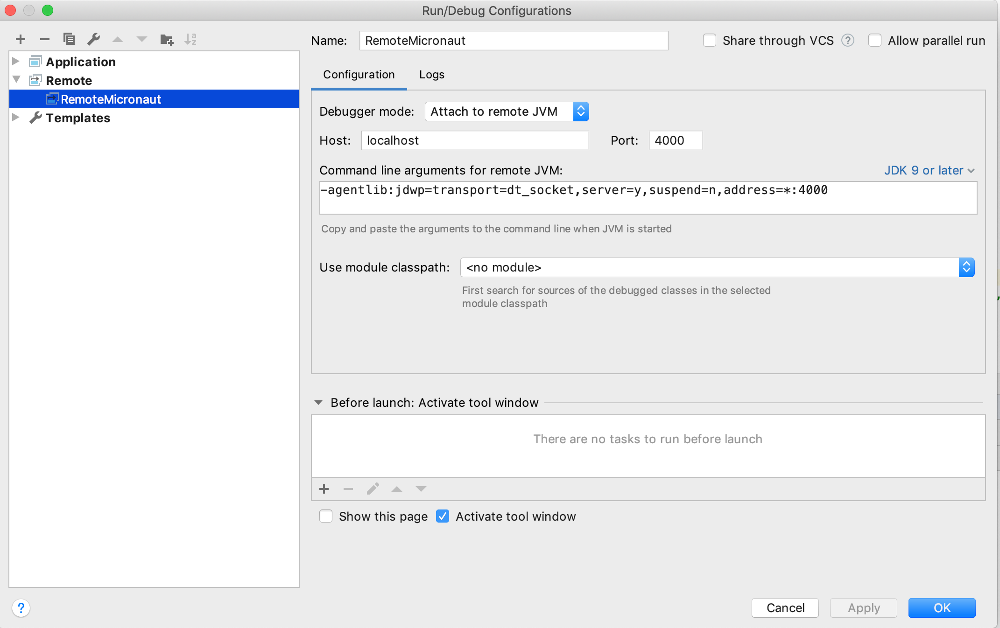

# Micronaut, serverless microservices.
Just like before, we want to expose features of the Raspberry Pi as a REST Service.
Here we want to read the ambient light (aka luminosity) from a photocell connected to and 
Analog to Digital Converter (`ADC`), and make it available to any REST client connected on the network the Raspberry Pi runs on.

We use Micronaut, available at [micronaut.io](https://micronaut.io/), where you'll find all the instructions you need
to install it.

## In Java
Then, make sure `sdkman` is started:
```bash
$ source "$HOME/.sdkman/bin/sdkman-init.sh"
```
And create your (java) app scaffolding:
```bash
$ mn create-app micronaut.sensors.sensors
```
This creates a new java project in a `sensors` folder, with a `micronaut.sensors` package.

> Note: From an IDE (like IntelliJ), it's much better to open the `sensors` directory as a new Project.
 
Then add a Controller
```java
package micronaut.sensors;

import io.micronaut.http.MediaType;
import io.micronaut.http.annotation.Controller;
import io.micronaut.http.annotation.Get;
import io.micronaut.http.annotation.Produces;

@Controller("/ambient-light") 
public class SensorsController {
    @Get 
    @Produces(MediaType.APPLICATION_JSON) 
    public String getLuminosity() {
        return "{ \"light\": 23.45 }"; 
    }
}
```
Add a test if needed...

```bash
$ ./gradlew test
$ ./gradlew run
```

```bash
$ curl -X GET http://localhost:8080/ambient-light
{ "light": 23.45 }
$
```

### Docker
> Important: do not miss the `shadowJar` step...
```bash
$ ./gradlew clean shadowJar
$ docker build . -t micronaut
$ docker run -p 8080:8080 micronaut
```
- The `-t` tags the image.

And from another shell
```bash
$ curl http://localhost:8080/ambient-light
. . .
```

### Configuration
In case your service needs some custom configuration, this step is well documented [here](https://guides.micronaut.io/micronaut-configuration/guide/index.html). 

Here we want to provide the physical number of
the GPIO pins the `ADC` is connected on, `MISO`, `MOSI`, `CLOCK` and `CHIP-SELECT` for the `SPI` interface, `Channel` for the analog data input. 

In the file `resources/application.yml`, add
```yaml
adc:
  clk: 18
  miso: 23
  mosi: 24
  cs: 25
  channel: 2
```
Create an _annotated_ matching bean, next to the Controller (or anywhere you want):
```java
package micronaut.sensors;

import io.micronaut.context.annotation.ConfigurationProperties;

@ConfigurationProperties("adc")
public class ADCConfiguration {
	private int clk;
	private int miso;
	private int mosi;
	private int cs;
	private int channel;

	public ADCConfiguration() {}

	public int getClk() {
		return clk;
	}

	public void setClk(int clk) {
		this.clk = clk;
	}

	public int getMiso() {
		return miso;
	}

	public void setMiso(int miso) {
		this.miso = miso;
	}

	public int getMosi() {
		return mosi;
	}

	public void setMosi(int mosi) {
		this.mosi = mosi;
	}

	public int getCs() {
		return cs;
	}

	public void setCs(int cs) {
		this.cs = cs;
	}

	public int getChannel() {
		return channel;
	}

	public void setChannel(int channel) {
		this.channel = channel;
	}
}
```
> Notice above:
> - the `ConfigurationProperties` annotation above, and the corresponding `yaml` structure.
> - the _empty_ constructor (no other is required)

Modify the Controller, add a constructor, receiving the configuration bean as parameter:
```java
. . .
public class SensorsController {

    private final ADCConfiguration adcConfiguration;

    public SensorsController(@Nullable ADCConfiguration adcConfiguration) {
        this.adcConfiguration = adcConfiguration;
        if (this.adcConfiguration != null) {
            System.out.println(String.format("ADC Config: Channel:%d, MISO:%d, MOSI:%d, CLK:%d, CS:%d",
                this.adcConfiguration.getChannel(),
                this.adcConfiguration.getMiso(),
                this.adcConfiguration.getMosi(),
                this.adcConfiguration.getClk(),
                this.adcConfiguration.getCs()));
        }
    }

    @Get
    @Produces(MediaType.APPLICATION_JSON)
    public String getLuminosity() {
. . .
```
Build and run, the first invocation of the REST service will show the configuration parameters as expected above,
as stored in the `yaml` document:
```
> Task :run
OpenJDK 64-Bit GraalVM CE 19.3.0 warning: forcing TieredStopAtLevel to full optimization because JVMCI is enabled
07:05:34.029 [main] INFO  io.micronaut.runtime.Micronaut - Startup completed in 1571ms. Server Running: http://localhost:8080
ADC Config: Channel:2, MISO:23, MOSI:24, CLK:18, CS:25
<=========----> 75% EXECUTING [4m 13s]
```

### Dependencies
This project will require the functionalities provided by the `ADC` module,
in the `raspberry-coffee` project.

From the ADC module (which belongs to the `raspberry-coffee` project), make sure you `install` it in your local Maven repo:
```bash
ADC$ ../gradlew clean install
```

From the Micronaut service project, add the dependency on ADC in `build.gradle`:
```groovy
dependencies {
  . . .
  compile 'oliv.raspi.coffee:ADC:1.0'
  . . .
}
```
Make sure `mavenLocal()` is in the repositories:
```groovy
repositories {
    mavenCentral()
    mavenLocal()
    maven { url "https://jcenter.bintray.com" }
}
```
Now, create - as featured in this project - the class `rpi.sensors.ADCChannel`, and instantiate it in the Controller's constructor:
```java
@Controller("/ambient-light")
public class SensorsController {

    private final ADCConfiguration adcConfiguration;
    private ADCChannel adcChannel;

    public SensorsController(@Nullable ADCConfiguration adcConfiguration) {
        this.adcConfiguration = adcConfiguration;
        if (this.adcConfiguration != null) {
            System.out.println(String.format("ADC Config: Channel:%d, MISO:%d, MOSI:%d, CLK:%d, CS:%d",
                this.adcConfiguration.getChannel(),
                this.adcConfiguration.getMiso(),
                this.adcConfiguration.getMosi(),
                this.adcConfiguration.getClk(),
                this.adcConfiguration.getCs()));
            this.adcChannel = new ADCChannel(
                this.adcConfiguration.getMiso(),
                this.adcConfiguration.getMosi(),
                this.adcConfiguration.getClk(),
                this.adcConfiguration.getCs(),
                this.adcConfiguration.getChannel());
        }
    }
    . . .
}
```
It can now be invoked by the operation in the service:
```java
    @Get
    @Produces(MediaType.APPLICATION_JSON)
    public String getLuminosity() {
        float volume = 0;
        if (this.adcChannel != null) {
            volume = this.adcChannel.readChannelVolume();
        }
        return String.format("{ \"light\": %05.02f }", volume);
    }
```

The service is ready to run, reading the luminosity (in `%`, instead of `[0..1023]`) from the ADC.
And the Docker step mentioned above works just the same, thanks to the `shadowJar` gradle task.

### Life Cycle Management
See the documentation [here](https://docs.micronaut.io/latest/guide/index.html#lifecycle).

The `Configuration` Bean can be annotated to trap events that can be used for life-cycle management
- `@PostConstruct`
- `@PreDestroy`

This way, I was able to free the ADC resources when the service is shut down.
Look into the code of `ADCConfiguration` for the details, and about the way it invokes the `ADCChannel.close()` method.
The instantiation of the `ADCChannel` Object has also been modified to happen in the `Configuration` Bean. This is probably not the only way to do this...

> Note: this works OK when the service runs in its Docker container. A [Ctrl-C] on a `./gradlew run` does not trap the `@PreDestroy` annotated method.

### Debugging
- Enable Annotation Processor if needed: <https://guides.micronaut.io/micronaut-microservices-services-discover-consul/guide/index.html>
- Even "locally", use Remote Debug. This obviously requires an IDE, we will use IntelliJ here. 

#### Locally
- Create a Remote-Debug profile in the IDE

- Notice the `port`. In the gradle script, as instructed above, add the required arguments to the `run` target:
```groovy
run.jvmArgs('-noverify', '-XX:TieredStopAtLevel=1', '-Dcom.sun.management.jmxremote',  '-agentlib:jdwp=transport=dt_socket,server=y,suspend=n,address=*:4000')
```
- Set some breakpoints in your code (in the IDE)
- Start the gradlew script, with its `run` target 
```bash
$ ./gradlew run
```
- Invoke the service, from `curl` or any REST client
```bash
$ curl -X GET http://localhost:8080/ambient-light 
```
- That's it! The debugger stops whenever a breakpoint is hit.
 
#### In the Docker image
- Create a Remote-Debug profile in the IDE, exactly as explained above
- Modify your `Dockerfile`:
```
EXPOSE 8080
CMD java -Dcom.sun.management.jmxremote -noverify ${JAVA_OPTS} -jar sensors.jar
```
becomes
```
EXPOSE 8080
EXPOSE 4000
CMD java -Dcom.sun.management.jmxremote -noverify ${JAVA_OPTS} -agentlib:jdwp=transport=dt_socket,server=y,suspend=n,address=*:4000 -jar sensors.jar
```
- Rebuild your image and restart the container (make sure you map the JDWP port)
```bash
$ docker build . -t micronaut
$ docker run -p 8080:8080 -p 4000:4000 micronaut
```
- Invoke the service, from `curl` or any REST client
```bash
$ curl -X GET http://localhost:8080/ambient-light 
```
- You're in! The debugger stops whenever a breakpoint is hit.

## In Kotlin
See [this doc](https://docs.micronaut.io/latest/guide/index.html#kotlin).

```bash
$ mn create-app sensors-kt --lang kotlin
```
Update `Kotlin` to its latest version `1.3.61` in 
- `build.gradle`
- `gradle.properties`

Next to `Application.kt`, create a `SensorsController.kt`:
```kotlin
package sensors.kt

import io.micronaut.http.MediaType
import io.micronaut.http.annotation.*

@Controller("/sensors")
class SensorsController {

	@Get("/ambient-light")
    @Produces(MediaType.APPLICATION_JSON)
	fun getLuminosity(): String {
		val light = 12.34;
		return "{ \"light\": $light }"
	}
}
```
Values are hard-coded, but you can already give it a try:
```bash
$ ./gradlew run
```
And from another prompt
```bash
$ curl http://localhost:8080/sensors/ambient-light
  { "light": 12.34 }
```
. . . 

## Next 
- Life cycle management (free resources on close...). &#9989; Done.
- Debugging. &#9989; Done.
- The same in Kotlin

---
