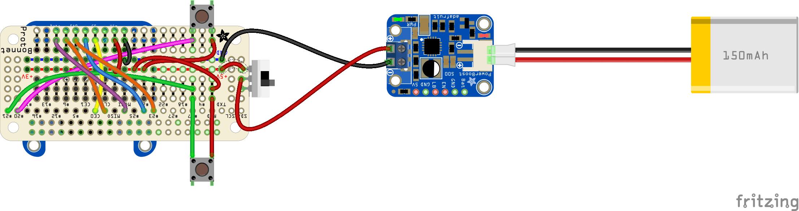
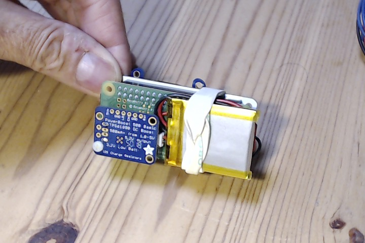
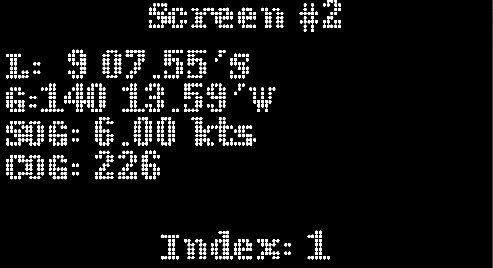
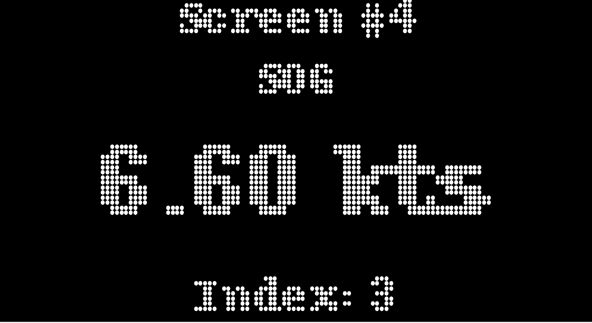

# TCP Watch
No need for a cell phone, no BlueTooth required.

### Context
We have a `NMEA.multiplexer` (or a `RESTNavServer`) running on a network we can see, doing some logging, calculations, rebroadcasting or what not,
that also gives access to the data it manages, though HTTP.

It can serve some Web pages, and host some REST services.

The Web pages can be shown in a browser, and this is _not_ the topic of this project.

What we have here is a Java REST client that reaches the REST service `GET /mux/cache` to get to the data,
and display them on a small screen (240x240).
The user has buttons to interact with the program, to scroll from screen to screen.

### Implementation 
Ping to the multiplexer (`GET /mux/cache`) returns something like this:
```json
{
  "NMEA_AS_IS": {
    "GGA": "$GPGGA,192308.929,3803.8233,N,12256.5032,W,1,09,1.0,-36.6,M,,,,0000*0C",
    "GSA": "$GPGSA,A,3,10,32,14,20,21,27,08,24,31,,,,1.6,1.0,1.2*3A",
    "RMC": "$GPRMC,192307.929,A,3803.8240,N,12256.5028,W,001.9,212.7,241118,,,A*7A",
    "GSV": [
      "$GPGSV,3,1,12,10,50,061,35,32,84,054,39,04,17,207,32,14,73,210,38*74",
      "$GPGSV,3,2,12,20,27,085,28,21,08,140,26,27,28,221,40,08,34,258,34*7C"
    ]
  },
  "Damping": 1,
  "Current calculated with damping": {},
  "HDG Offset": 0.0,
  "D": {
    "angle": -1.7976931348623157E308
  },
  "Position": {
    "lat": 38.063721666666666,
    "lng": -122.94171999999998
  },
  "Solar Time": {
    "date": "Nov 24, 2018 3:11:21 AM",
    "fmtDate": {
      "epoch": 0,
      "year": 0,
      "month": 0,
      "day": 0,
      "hour": 11,
      "min": 11,
      "sec": 21
    }
  },
  "Delta Altitude": 40.800000000000004,
  "Default Declination": {
    "angle": 0.0
  },
  "Deviation file name": "zero-deviation.csv",
  "SOG": {
    "speed": 1.9
  },
  "GPS Date \u0026 Time": {
    "date": "Nov 24, 2018 11:23:08 AM",
    "epoch": 1543087388000,
    "fmtDate": {
      "epoch": 1543087388000,
      "year": 2018,
      "month": 11,
      "day": 24,
      "hour": 19,
      "min": 23,
      "sec": 8
    }
  },
  "BSP Factor": 1.0,
  "GPS Time": {
    "date": "Nov 24, 2018 11:23:08 AM",
    "fmtDate": {
      "epoch": 0,
      "year": 0,
      "month": 0,
      "day": 0,
      "hour": 19,
      "min": 23,
      "sec": 8
    }
  },
  "Max Leeway": 0.0,
  "COG": {
    "angle": 212.7
  },
  "AWS Factor": 1.0,
  "Satellites in view": {
    "32": {
      "svID": 32,
      "elevation": 84,
      "azimuth": 54,
      "snr": 39
    },
    "18": {
      "svID": 18,
      "elevation": 43,
      "azimuth": 311,
      "snr": 0
    },
    "4": {
      "svID": 4,
      "elevation": 17,
      "azimuth": 207,
      "snr": 27
    },
    "20": {
      "svID": 20,
      "elevation": 27,
      "azimuth": 85,
      "snr": 29
    },
    "21": {
      "svID": 21,
      "elevation": 9,
      "azimuth": 140,
      "snr": 26
    },
    "8": {
      "svID": 8,
      "elevation": 34,
      "azimuth": 258,
      "snr": 39
    },
    "24": {
      "svID": 24,
      "elevation": 6,
      "azimuth": 36,
      "snr": 21
    },
    "10": {
      "svID": 10,
      "elevation": 50,
      "azimuth": 61,
      "snr": 34
    },
    "27": {
      "svID": 27,
      "elevation": 28,
      "azimuth": 221,
      "snr": 0
    },
    "11": {
      "svID": 11,
      "elevation": 27,
      "azimuth": 309,
      "snr": 0
    },
    "14": {
      "svID": 14,
      "elevation": 73,
      "azimuth": 210,
      "snr": 38
    },
    "31": {
      "svID": 31,
      "elevation": 16,
      "azimuth": 165,
      "snr": 38
    }
  },
  "Small Distance": 6934.030890023569,
  "AWA Offset": 0.0,
  "NMEA": "$GPGSV,3,2,12,20,27,085,28,21,08,140,26,27,28,221,40,08,34,258,34*7C",
  "Altitude": -36.6
}
```
or this:
```json
{
    "Damping": 30,
    "HDG Offset": 0,
    "To Waypoint": "RANGI   ",
    "CDR": {
        "angle": 357.39371834661836
    },
    "Daily": {
        "distance": 12.3
    },
    "Max Leeway": 10,
    "VMG on Wind": -4.666904755831213,
    "HDG c.": {
        "angle": 210
    },
    "CMG": {
        "angle": 219.01692220976113
    },
    "BSP": {
        "speed": 7.1
    },
    "TWA": {
        "angle": -130.1671406162612
    },
    "TWD": {
        "angle": 88
    },
    "Current calculated with damping": {
        "30000": {
            "bufferLength": 30000,
            "speed": {
                "speed": 0.6124102456146006
            },
            "direction": {
                "angle": 167.45821668777543
            },
            "nbPoints": 13,
            "oldest": "Sun, 2010 Nov 21 22:08:20 UTC",
            "latest": "Sun, 2010 Nov 21 22:08:50 UTC",
            "len": 30000
        },
        "60000": {
            "bufferLength": 60000,
            "speed": {
                "speed": 0.3454258586586602
            },
            "direction": {
                "angle": 179.68230779630707
            },
            "nbPoints": 20,
            "oldest": "Sun, 2010 Nov 21 22:07:54 UTC",
            "latest": "Sun, 2010 Nov 21 22:07:12 UTC",
            "len": 56000
        },
        "600000": {
            "bufferLength": 600000,
            "speed": {
                "speed": 0.30181447417337753
            },
            "direction": {
                "angle": 132.62965070665007
            },
            "nbPoints": 36,
            "oldest": "Sun, 2010 Nov 21 22:07:12 UTC",
            "latest": "Sun, 2010 Nov 21 22:08:50 UTC",
            "len": 98000
        }
    },
    "Position": {
        "lat": -9.1098,
        "lng": -140.21075000000002
    },
    "Log": {
        "distance": 3013
    },
    "Solar Time": {
        "date": "Jan 1, 1970, 4:48:01 AM",
        "fmtDate": {
            "epoch": 0,
            "year": 0,
            "month": 0,
            "day": 0,
            "hour": 12,
            "min": 48,
            "sec": 1
        }
    },
    "BSP Factor": 1,
    "Set and Drift": {
        "speed": 0.32,
        "angle": 121
    },
    "From Waypoint": "",
    "TWS": {
        "speed": 22.1
    },
    "GPS Time": {
        "date": "Jan 1, 1970, 2:08:52 PM",
        "fmtDate": {
            "epoch": 0,
            "year": 0,
            "month": 0,
            "day": 0,
            "hour": 22,
            "min": 8,
            "sec": 52
        }
    },
    "Distance to WP": {
        "distance": 561.6
    },
    "AWS Factor": 1,
    "Water Temperature": {
        "temperature": 26.5
    },
    "Small Distance": 0.1897343505190188,
    "NMEA": "$CCVDR,121.0,T,111.0,M,0.32,N*0B\r\n",
    "NMEA_AS_IS": {
        "VLW": "$IIVLW,03013,N,012.3,N*52\r",
        "VHW": "$IIVHW,,,210,M,07.1,N,,*61\r",
        "VDR": "$CCVDR,121.0,T,111.0,M,0.32,N*0B\r\n",
        "GLL": "$IIGLL,0906.588,S,14012.645,W,220852,A,A*5B\r",
        "RMB": "$IIRMB,A,3.00,R,,RANGI   ,,,,,561.60,230,06.5,V,A*01\r",
        "RMC": "$IIRMC,220850,A,0906.586,S,14012.643,W,06.6,223,211110,10,E,A*0D\r",
        "DPT": "$IIDPT,001.6,+0.7,*47\r",
        "HDG": "$IIHDG,210,,,10,E*10\r",
        "MWV": "$CCMWV,230.0,T,022.1,N,A*3B\r\n",
        "VWR": "$IIVWR,117,L,17.1,N,,,,*7F\r",
        "MTW": "$IIMTW,+26.5,C*39\r",
        "VWT": "$CCVWT,130.2,L,22.1,N,11.4,M,40.9,K*69\r\n",
        "MWD": "$CCMWD,088.0,T,078.0,M,22.1,N,11.4,M*4E\r\n"
    },
    "D": {
        "angle": 10
    },
    "XTE": {
        "distance": 3
    },
    "AWA": {
        "angle": -115
    },
    "Depth": {
        "depthInMeters": 2.299999952316284
    },
    "Bearing to WP": {
        "angle": 230
    },
    "W": {
        "angle": 9.01692220976113
    },
    "Speed to WP": {
        "speed": 6.5
    },
    "COG": {
        "angle": 223
    },
    "AWS": {
        "speed": 18.1
    },
    "HDG true": {
        "angle": 219.01692220976113
    },
    "AWA Offset": 0,
    "CSP": {
        "speed": 0.690195932562707
    },
    "d": {
        "angle": -0.9830777902388692
    },
    "Default Declination": {
        "angle": 14
    },
    "Deviation file name": "dp_2011_04_15.csv",
    "HDG mag.": {
        "angle": 209.01692220976113
    },
    "SOG": {
        "speed": 6.6
    },
    "Leeway": {
        "angle": 0
    },
    "GPS Date & Time": {
        "date": "Nov 21, 2010, 2:08:50 PM",
        "epoch": 1290377330000,
        "fmtDate": {
            "epoch": 1290377330000,
            "year": 2010,
            "month": 11,
            "day": 21,
            "hour": 22,
            "min": 8,
            "sec": 50
        }
    },
    "WayPoint pos": {
        "lat": 0,
        "lng": 0
    },
    "VMG to Waypoint": 6.550804600832724,
    "Steer": "R"
}
```

### Raspberry Pi Zero W and SSD1306
For now (March 2019), this is my favorite configuration, the most versatile.

Breadboard wiring:


Wiring with:
- [Adafruit Bonnet](https://www.adafruit.com/product/3203)
- [Power Booster](https://www.adafruit.com/product/1903)
- [Small slide switch](https://www.adafruit.com/product/805)
- [2 push buttons](https://www.adafruit.com/product/3101)
- [LiPo battery](https://www.adafruit.com/product/1578) (I actually use a 500mAh)

> Note: the wires are shown here on top of the bonnet for clarity. They are actually running _under_ it.
> And the screen is obviously soldered on top of it.




The real prototype (with its 500mAh LiPo battery):




#### Screenshots
| Screen 1 | Screen 2 | Screen 3 | Screen 4 | Screen 5 |
|:--------:|:--------:|:--------:|:--------:|:--------:|
|  |  |  |  |  |

The screens shown here are just examples. Its very easy to come up with your own ones.
I'll write more soon, possibilities are endless.

#### Video

YouTube has it: https://youtu.be/6Dz-3qKJtjk

#### Connect it to the Server's network
The Nav Server (like the one at [RESTNavServer](https://github.com/OlivierLD/raspberry-coffee/tree/master/RESTNavServer)) can emit its own network.
This TCP Watch we talk about here can connect to this network, to consume the data it produces, through REST apis.

As the network name and server IP address can change, this is something to adjust on the client side (the TCP Watch).

To do so, I use the Serial USB interface to connect to the Raspberry Pi.
> Note: You have to explicitly enable this interface on the Raspberry Pi, using `raspi-config` or the graphical tools available on the graphical desktop.

Once this interface is enabled, you use a USB cable from a laptop to the Raspberry Pi (to its USB port, _not_ the power one), and `ssh` to it:
```
 $ ssh pi@raspberry-tcp.local
``` 
where `raspberry-tcp` is the `hostname` of the Raspberry.

First you need to connect to the Server's network.
To see what network you are currently on, use `iwconfig`
```
$ iwconfig
lo        no wireless extensions.

wlan0     IEEE 802.11  ESSID:"Sonic-00e0_EXT"  
          Mode:Managed  Frequency:2.412 GHz  Access Point: 28:80:88:E2:C6:4A   
          Bit Rate=24 Mb/s   Tx-Power=31 dBm   
          Retry short limit:7   RTS thr:off   Fragment thr:off
          Power Management:on
          Link Quality=51/70  Signal level=-59 dBm  
          Rx invalid nwid:0  Rx invalid crypt:0  Rx invalid frag:0
          Tx excessive retries:435  Invalid misc:0   Missed beacon:0

$
```
As seen above, the current network (in this case) is `Sonic-00e0_EXT`.
We need to change that.

On recent versions of Raspian, look into `wpa_supplicant.conf`:
```
$ cat /etc/wpa_supplicant/wpa_supplicant.conf
ctrl_interface=DIR=/var/run/wpa_supplicant GROUP=netdev
update_config=1
country=US

network={
	ssid="Sonic-00e0_EXT"
	psk="xxxxxxxx"
	key_mgmt=WPA-PSK
}
```
Edit this file (I use `vi`), and change (or add) the network's `ssid` and `psk` to match the server config, and save your changes.

```
$ cat /etc/wpa_supplicant/wpa_supplicant.conf
ctrl_interface=DIR=/var/run/wpa_supplicant GROUP=netdev
update_config=1
country=US

network={
	ssid="Sonic-00e0_EXT"
	psk="xxxxxxxx"
	key_mgmt=WPA-PSK
}

network={
	ssid="RPi-Logger"
	psk="raspberrypi"
	key_mgmt=WPA-PSK
}

```
To activate your modifications, just run
```
 $ sudo wpa_cli -i wlan0 reconfigure
``` 
where `wlan0` is your wireless port, as seen above in `iwconfig`.
> _Note:_ Next time you boot, the new network will be used. You need to run the command above _only_ if
> you want the new network to be taken in account _before_ you reboot. 

Now you should be connected to the server's network, another run of `iwconfig` would tell you.

Then, to connect to the server itself, you need its IP address (run an `ifconfig` on it), and modify the file named `watch.ssd.sh`.
You need to change the line that says
```
BASE_URL="-Dbase.url=http://192.168.42.10:9999"
```
Change the IP and port to what it should be (like `192.168.127.1:8080`), and you're good to go.
Run the script, and you're done!
```
 $ ./watch.ssd.sh
```

Next, we'll see how to automatically start the watch when the Raspberry Pi boots.
This happens in the file named `/etc/rc.local`.

We will start the script named `watch.ssd.sh` at boot. We need to know what directory it lives in.
Let's say it is under the `pi` home directory, under `raspberry-coffee/Project.Trunk/REST.clients/TCP.Watch.01`.

Edit (sudo) the file `/etc/rc.local`, and add the following _before_ the `exit 0` command at the end:

```
cd ~pi/raspberry-coffee/Project.Trunk/REST.clients/TCP.Watch.01
nohup ./watch.ssd.sh &
cd -
``` 
>Note: the `nohup` command will generate a log file named `nihup.out`. Make sure you clean it from time to time, before it becomes too big...

That's it, next time you boot the Raspberry Pi, the TCP Watch will start.

---
