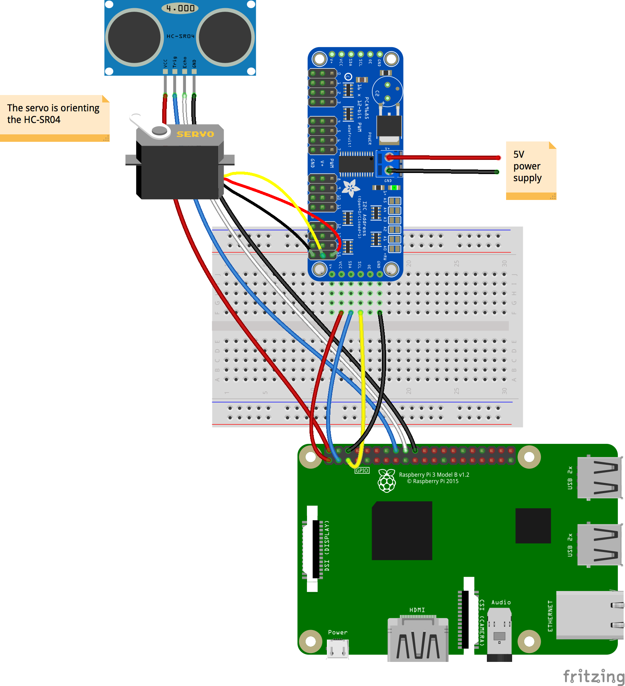
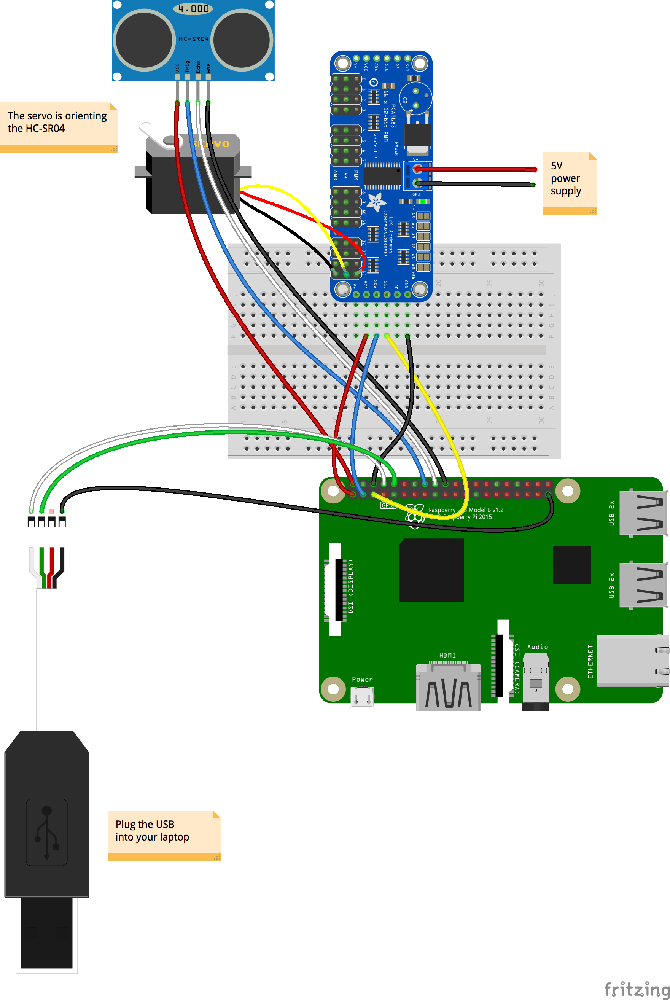
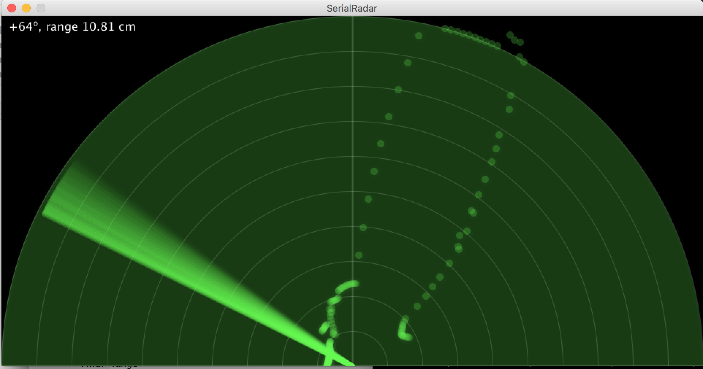

### Radar

> Radar is an acronym, meaning **RA**dio **D**irection **A**nd **R**ange.

With a `PCA9685` and a `HC-SR04` (ultrasound distance sensor).
A servo connected to the `PCA9685` rotates degree by degree from -90&deg; to +90&deg;. It supports the
`HC-SR04` that measures the distance for each position of the servo.

Wiring:


Hardware setting:


Servo enclosure [here](https://www.thingiverse.com/thing:1679838),
HC-SR04 enclosure [here](https://www.thingiverse.com/thing:452720).

Graphical User Interface will follow.

### Several Flavors
- Standalone
    Radar reading and User Interface on the Raspberry Pi
- Serial interface
- TCP interface.
- REST Interface. TODO

The different flavors are implemented through a `Consumer<DirectionAndRange>`.

> Note: All the required components are part of this project (Serial Port interface, TCP Reader, REST server).

Serial version requires extra hardware (USB cable), TCP and REST do not.

There is a Console Interface - spitting out the data read by the device, direction and range.
```
$ ./radar.sh
Running...
Driving Servo on Channel 15
Wait when scanning 20 ms
HC-SR04 wiring:
       +-----+-----+--------------+-----++-----+--------------+-----+-----+
       | BCM | wPi | Name         |  Physical  |         Name | wPi | BCM |
       +-----+-----+--------------+-----++-----+--------------+-----+-----+
       |     |     | 3v3          | #01 || #02 |          5v0 |     |     |
       |  02 |  08 | SDA1         | #03 || #04 |          5v0 |     |     |
       |  03 |  09 | SCL1         | #05 || #06 |          GND |     |     |
       |  04 |  07 | GPCLK0       | #07 || #08 |    UART0_TXD | 15  | 14  |
       |     |     | GND          | #09 || #10 |    UART0_RXD | 16  | 15  |
       |  17 |  00 | GPIO_0       | #11 || #12 | PCM_CLK/PWM0 | 01  | 18  |
       |  27 |  02 | GPIO_2       | #13 || #14 |          GND |     |     |
       |  22 |  03 | GPIO_3       | #15 || #16 |       GPIO_4 | 04  | 23  | Trigger
       |     |     | 3v3          | #17 || #18 |       GPIO_5 | 05  | 24  | Echo
       |  10 |  12 | SPI0_MOSI    | #19 || #20 |          GND |     |     |
       |  09 |  13 | SPI0_MISO    | #21 || #22 |       GPIO_6 | 06  | 25  |
       |  11 |  14 | SPI0_CLK     | #23 || #24 |   SPI0_CS0_N | 10  | 08  |
       |     |     | GND          | #25 || #26 |   SPI0_CS1_N | 11  | 07  |
       |     |  30 | SDA0         | #27 || #28 |         SCL0 | 31  |     |
       |  05 |  21 | GPCLK1       | #29 || #30 |          GND |     |     |
       |  06 |  22 | GPCLK2       | #31 || #32 |         PWM0 | 26  | 12  |
       |  13 |  23 | PWM1         | #33 || #34 |          GND |     |     |
       |  19 |  24 | PCM_FS/PWM1  | #35 || #36 |      GPIO_27 | 27  | 16  |
       |  26 |  25 | GPIO_25      | #37 || #38 |      PCM_DIN | 28  | 20  |
       |     |     | GND          | #39 || #40 |     PCM_DOUT | 29  | 21  |
       +-----+-----+--------------+-----++-----+--------------+-----+-----+
       | BCM | wPi | Name         |  Physical  |         Name | wPi | BCM |
       +-----+-----+--------------+-----++-----+--------------+-----+-----+
Channel 15 all set. Min:122, Max:615, diff:493
Injected Data Consumer >> Bearing +00, distance 4.39 cm
Injected Data Consumer >> Bearing +01, distance 4.44 cm
Injected Data Consumer >> Bearing +02, distance 4.35 cm
Injected Data Consumer >> Bearing +03, distance 4.39 cm
Injected Data Consumer >> Bearing +04, distance 4.34 cm
...
Injected Data Consumer >> Bearing +46, distance 57.82 cm
Injected Data Consumer >> Bearing +47, distance 57.81 cm
Injected Data Consumer >> Bearing +48, distance 60.84 cm
Injected Data Consumer >> Bearing +49, distance 63.87 cm
Injected Data Consumer >> Bearing +50, distance 63.88 cm
Injected Data Consumer >> Bearing +51, distance 66.91 cm
Injected Data Consumer >> Bearing +52, distance 66.87 cm
Injected Data Consumer >> Bearing +53, distance 69.90 cm
Injected Data Consumer >> Bearing +54, distance 69.85 cm
Injected Data Consumer >> Bearing +55, distance 31.50 cm
...
```

Graphical User Interfaces are done with Processing.

### Comments
It appeared that running the Processing UI on the Raspberry Pi itself was a bit too demanding (see the Processing sketches named `Radar` and `RadarJNI`).
That's actually why we came up with the Serial, TCP and REST versions, that allow
_another machine_ to listen to the data flow emitted by the Raspberry Pi.



That seems to be the right solution for this problem.

### Processing UI


See in the `Processing` module the sketches named `SerialRadar`, `TCPRadar`.

### TODO
- The same, but with a `VL53L0X`, more accurate.
- Direct Servo, _without_ the `PCA9685`.

---
