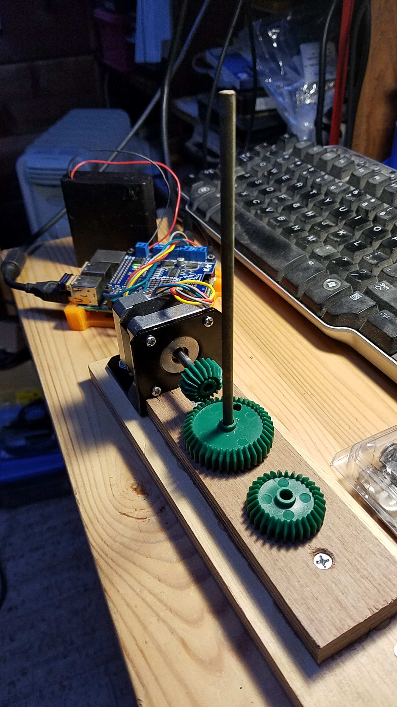

## Driving Stepper Motors with the Adafruit MotorHAT

I'm learning...

### First test ever
With `motorhat.StepperDemo`, launched by the script `one.stepper.sh`.

Using a [Stepper Motor (NEMA-17)](https://www.adafruit.com/product/324), a [Stepper Motor Mount](https://www.adafruit.com/product/1297), and some gears, from a [Gear Set](https://www.allelectronics.com/item/gr-86/4-gear-set/1.html).



The gears:
- 21 teeth on the motor
- 41 teeth on the brass shaft

Ratio is thus `21/41`, which is `0.512:1`.

> Ratio is the key. It applies to all kinds of settings: this one, worm gears, everything. You **MUST** know yours. You would be lost otherwise.
>> When transmitting directly from the motor's shaft, the ratio is `1:1`.
>

### Interactive interface
Steps per Revolution can be set from `35` to `200` (default is `200`).

```
$ ./interactive.stepper.sh
 
```
