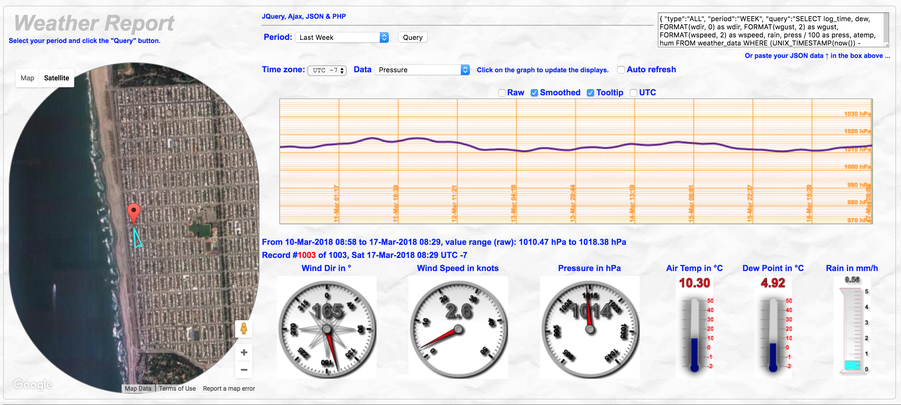
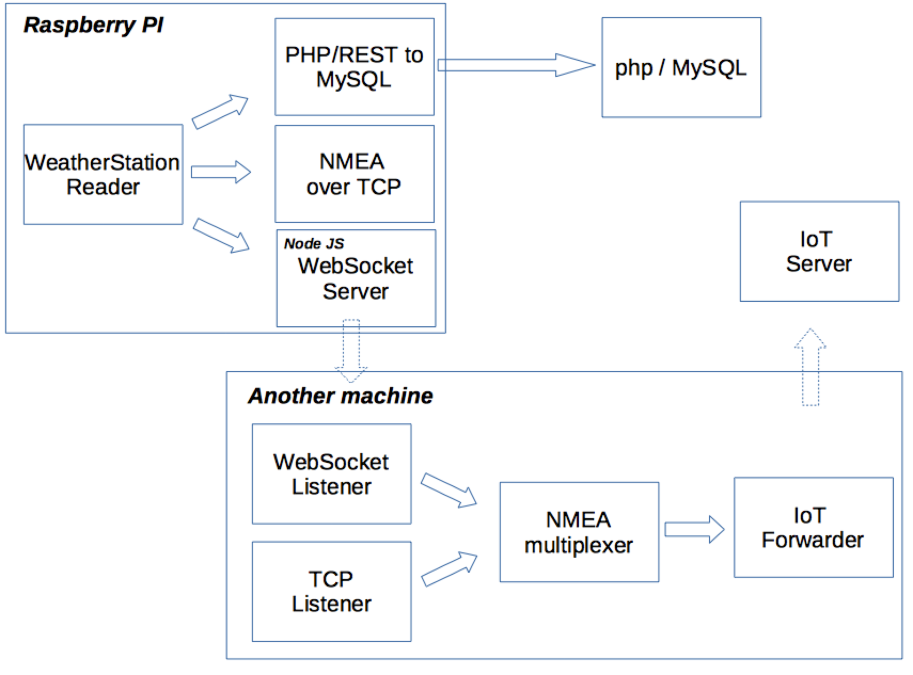

## Weather Station
---

### <a name="weatherstation"></a>Home Weather Station
This one uses the `SDLWeather80422` class, from the `WeatherStation` project.
You can
- Read the data from the station
- Simulate the data read from the station

Those data can then be rendered in different ways, with a Web Interface.
They are - for now - using a nodejs server and its WebSocket module, running on the Raspberry Pi.

After installing Node.js (try [this](http://www.lmgtfy.com/?q=install+node+js+raspberry+pi)) on the Raspberry Pi, in the `node` directory, install the WebSocket module:
```
Prompt> cd node
Prompt> npm install
```

Then you can start the node server:
```
Prompt> node weather.server.js
```

From another console, then start the process that will read the `SDLWeather80422`, and feed the WebSocket server:

```
Prompt> ./weather.station.reader.sh
```

You can also start a simulator, in case you  are not on the Raspberry Pi, and want to make some tests:
```
Prompt> ./weather.simulator.sh
```

Then you can visualize the data in a browser, using a URL like
`http://raspberrypi:9876/data/weather.station/index.html`

The analog console can be reached from `http://localhost:9876/data/weather.station/analog.all.html`,
and it supports query string parameters `border` and `theme`.

`border` can be `Y` or `N`, and `theme` can be `black` or `white`.

_For example_:`http://localhost:9876/data/weather.station/analog.html?border=N&theme=white`.

See [here](http://raspberrypi.lediouris.net/WeatherStation/readme.html).

> See also [this document](./src/java/weatherstation/README.md)

This implementation - just an example - uses:
- A Raspberry Pi A+ connected to the weather rack (wind vane, anemometer, rain meter, temperature, pressure)
- It runs the scripts and classes mentioned above, along with a `nodejs` WebSocket server
- It uses several [`Loggers`](https://github.com/OlivierLD/raspberry-pi4j-samples/blob/master/RasPISamples/src/java/weatherstation/logger/LoggerInterface.java) to feed:
  - A MySQL database through REST Services developed in `php`
  - An HTTP tiny server that contains the last available data as a `json` object
  - A WebSocket client pushing the last available data as a `json` object
  - A TCP server that also converts the data in `NMEA` sentences before streaming them on a given TCP port

The TCP channel, conveying NMEA Data, is compatible with the `NMEA.multiplexer` project and `Node-RED`.


Web Socket Interface


Web Component Interface, pinging the NMEA Cache (`NMEA.multiplexer`) through REST services.



Web Interface


On the roof!

#### My current setting
- A Raspberry Pi A+, connected on the `SDLWeather80422`. To start it,
run the `weather.menu.sh` script, choose option `N`, and then `W`.
```
+------------- Weather Station -----------------+
| N: Start Node server                          |
| W: Start Weather Station reader               |
| D: Start Weather Station dump                 |
| S: Show processes                             |
| K: Kill them all                              |
| Q: Quit                                       |
+-----------------------------------------------+
You Choose >
```
- An old laptop inside the house, running a `Raspberry Pi desktop` (Debian Stretch) image,
where I run the following script:
```
$ NMEA.multiplexer> ./mux.sh nmea.mux.weather.station.tcp.properties
```
If the Raspberry Pi's machine name is `weather-station` and the laptop's name is `home-station`,
then from anywhere is the house (house LAN), I can reach
```
 http://weather-station:9876/data/weather.station/analog.all.html
```

```
 http://home-station:9998/web/weather.station.html
```
as well as
```
 http://donpedro.lediouris.net/php/weather/reports.v2/weather.report.html
```
This last one can be reached from anywhere. See the screenshots for those URLs above.

##### To start everything:
Execute this one on the laptop:
```bash
#!/bin/bash
#
cd raspberry-pi4j-samples
echo Starting multiplexer
cd NMEA.multiplexer
nohup ./mux.sh nmea.mux.weather.station.tcp.properties &
echo Starting Snap loop
cd ../RasPISamples
nohup ./snap.loop.sh &
echo Starting NavServer
cd ../RESTNavServer
nohup ./runNavServer &
cd ..
echo Done!
#
```
Similarly, to stop everything, run a script like this:
```bash
#!/bin/bash
dokill() {
  ps -ef | grep $1 | grep -v grep | grep -v kill.servers.sh | awk '{ print $2 }' > km
  for pid in `cat km`
  do
    echo Killing process $pid
    sudo kill -15 $pid
  done
  rm km
}
#
dokill nmea.mux.GenericNMEAMultiplexer
dokill navrest.NavServer
dokill snap.loop.sh
#
```


##### Quick note
On another Raspberry Pi, with its own 7" screen, I have a permanent display of the data emitted by the station.

To do that, you need to start in Graphical mode, have Chromium installed, and boot to the Graphical Desktop.
To start Chromium when the Desktop starts, and load one or several URLs (in different tabs), edit the file named
`~/.config/lxsession/LXDE-pi/autostart`, and add at the end the following lines:
```
@chromium-browser --incognito --kiosk http://donpedro.lediouris.net/php/weather/reports.v2/weather.report.html \
                                      http://192.168.42.13:9876/data/weather.station/analog.all.html \
                                      http://192.168.42.13:9876/data/weather.station/digital.html \
                                      http://192.168.42.6:9999/web/samples/now.from.SF.html
```
It will start Chromium in `kiosk` (full screen) mode, and load the URLs mentioned above.

To disable the screen saver:
- Edit `/etc/lightdm/lightdm.conf`
- Have a/the line that starts with `xserver-command=` to look like `xserver-command=X -s 0 -dpms`

This will take effect after reboot. 

##### And more
- Added a camera
    - Snapshots posted on Adafruit-IO
    - Also accessible through email request (See `weatherstation.email.EmailWatcher`). You send a request by email, and receive the snapshot attached to the response. About that, do check out the email reader of `Node-RED`, it is really good.

