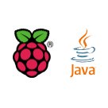

<h1> Raspberry Coffee</h1>

---

#### Java code and wirings for the Raspberry Pi, featuring reusable libraries and snippets ####

---

It uses the [`PI4J library`](http://pi4j.com), itself relying on [`WiringPi`](http://wiringpi.com/).  
The project - and its different modules - are built using [`Gradle`](https://gradle.org/).

### Java
Since 2019 or so, Java (JDK 11) comes with the RasPi OS.  
So you do not need to install it. To check its availability:
```
$ java -version
$ javac -version
```

### PI4J
PI4J is a Java library that will help you access `GPIO`, `I2C`, `SPI`, and other hardware protocols.
```
$ curl -s get.pi4j.com | sudo bash
```

### Gradle
The project comes with scripts `gradlew` (and its `gradlew.bat`, for Windows).  
The `w` stands for `wrapper`. When used - like in `./gradlew tasks --all`, the wrapper
will check if `gradle` is here, and install it if it is not there.
This installation is driven by the file `gradle/wrapper/gradle-wrapper.properties`.
This is the file to deal with, if an upgrade of the Gradle version is required.

> _<u>Note</u>_: We are using here the `shadowJar` Gradle plug-in. This plug-in allows the generation of what's also called a "fat-jar",
> a _**single**_ jar for all the application, including _**all**_ its dependencies.  
> That does indeed make deployment and distribution much easier.

> _<u>Another note</u>_: Some scripts will be featured here, to run the different modules.
> **Those scripts are written to run in the development environment**. They can be easily tweaked to run 
> in any other context.  
> _Example_:  
> The `NMEA-multiplexer` project has many dependencies, remote ones, and local ones:
> ```
>    implementation 'com.pi4j:pi4j-core:1.2'
>    implementation 'org.rxtx:rxtx:2.1.7'
>    implementation 'org.scala-lang:scala-library:2.13.3'
>    implementation "org.scala-lang:scala-compiler:2.13.3"
>    implementation 'org.eclipse.paho:org.eclipse.paho.client.mqttv3:1.0.2'
>    implementation 'org.java-websocket:Java-WebSocket:1.5.2'
>    implementation 'com.google.code.gson:gson:2.8.0'
>    implementation 'org.fusesource.jansi:jansi:1.11'
>    implementation 'oracle:xmlparser:2.0'
>    implementation 'org.yaml:snakeyaml:1.21'
>    implementation group: 'org.xerial', name: 'sqlite-jdbc', version: '3.34.0'
>    implementation group: 'org.json', name: 'json', version: '20190722'
>    implementation project(':http-tiny-server')
>    implementation project(':common-utils')
>    implementation project(':I2C-SPI')
>    implementation project(':AstroComputer')
>    implementation project(':LoRa')    // Needed for a publisher
> ```
> Building the module with a `../gradlew shadowJar` will generate a **_single jar file_** named `./build/libs/NMEA-multiplexer-1.0-all.jar`, 
> used for example in the script `ais.test.sh`:
> ```
> CP=./build/libs/NMEA-multiplexer-1.0-all.jar
> java -cp ${CP} nmea.consumers.client.AISClient
> ```
> You may very well run the **exact** same thing, by delivering only the script and the jar, together in the same folder,
> all you need to do is to change the location of the delivered jar-file (saying script and jar are in the same location):
> ```
> java -cp ./NMEA-multiplexer-1.0-all.jar nmea.consumers.client.AISClient
> ```
> 

### Gradle tweaks
From the root of this project, you can run a full build, that would also tell you if everything is working.
Just run
```
$ ./gradlew clean build
```
Depending on the size of the computer you are using (a laptop, a Raspberry Pi Zero, etc), you might want to skip
demanding steps (like Scala and Kotlin compilations), or the tests, if they are not required in your context.
To skip a task in Gradle, you need to use the `-x` (like eXclude) flag.  
Example, to skip the tests:
```
$ ./gradlew clean build -x test
```
To skip the Scala and Kotlin compilations, and the tests:
```
$ ./gradlew clean build -x test -x :RasPISamples:compileScala \
                                -x :OtherJVMLanguages:compileScala \
                                -x :http-client-paradigm:compileScala \
                                -x :http-client-paradigm:compileKotlin \
                                -x RESTClients:REST-assembler:compileScala \
                                -x :Project-Trunk:System-Languages:compileKotlin \
                                -x :Project-Trunk:System-Languages:compileScala \
                                -x :Project-Trunk:Weather-Station-Implementation:compileScala \
                                -x :Project-Trunk:REST-clients:REST-assembler:compileKotlin \
                                -x :Project-Trunk:REST-clients:REST-assembler:compileScala
```
Some parts of this project use `OpenCV`, that need to be installed separately. If you've not installed it,
or wish to skip those steps, use
```
$ ./gradlew clean build -x :opencv:compileJava -x :Project-Trunk:WebcamTemplate:compileJava
```

### Integrated Development Environment (IDE)
IDEs are not mandatory, but they make Java development easier. Several are available for free (NetBeans, Eclipse, IntelliJ, BlueJ, VisualCode...).
I like IntelliJ, but you can use anyone you want or prefer.

---

This being said, let's go.

---

### Get started, from scratch, now!
If `git` and `java` are available (and they should) on your Raspberry Pi, just run
```
bash -c "$(curl -L https://raw.githubusercontent.com/OlivierLD/raspberry-coffee/master/install.sh)"
```

---
This project contains Java code, many times translated from Python, dedicated to usually *one* board (like BMP180, LSM303, etc).
More consistent samples can be found in the RasPISamples module (being moved to the `Project-Trunk` module), where several components have been assembled together.
Do take a look, it also comes with a readme file.

---

Raspberry Pi's [Mechanical drawings](https://www.raspberrypi.org/documentation/hardware/raspberrypi/mechanical/README.md)

---
- [Main highlights](./Papers/README.md)
---

**Summary**
- [Setup a brand new Raspberry Pi](#setup-a-brand-new-raspberry-pi)
- [Java Virtual Machine](#java-virtual-machine-jvm)
- [How to build and run](#how-to-build-and-run)
- [Developing on the Raspberry Pi, or Developing for the Raspberry Pi ?](#developing-on-the-raspberry-pi-or-developing-for-the-raspberry-pi-)
- [Raspberry Pi, a possible thing of the Internet of Things...](#raspberry-pi-a-possible-thing-of-the-internet-of-things)
- [Project list, growing](#project-list-growing)

#### Setup a brand-new Raspberry Pi
To get started as quickly as possible, and not only for this project, from scratch.

##### Foundation Software
The goal here is to get ready with the minimal configuration you will be able to use to clone a git repository and start working on it.

Typically, you will need to have the minimal git tools and the right compilers. The code contained in the repo(s) will be responsible for
downloading the right dependencies at build time (`gradle` is definitely good at that).

##### Minimal setup
- Install Raspbian (not NOOBS) as explained at https://www.raspberrypi.org/learning/software-guide/quickstart/, and burn your SD card
    - Depending on the OS you burn the SD card from, the procedure varies. Well documented in the link above.
- Boot on the Raspberry with the new SD card, USB keyboard and HDMI screen attached to it (if this is an old RPi, use a USB WiFi dongle too)
    - It should boot to the Graphical Desktop.
- Connect to your local network
- Use RPi-Config (from the Desktop GUI, Menu > Preferences > Raspberry Pi Configuration) to:
    - enable needed interfaces (ssh, serial, spi, i2c, VNC, etc)
        - `ssh` and `VNC` will allow remote access to your Raspberry Pi, the others depend on the projects you want to work on.
        - This can be modified or reverted at any time.
    - setup config (keyboard, locale, etc)
    - change pswd, hostname
        - for the hostname, you might need to go a Terminal, reach `sudo raspi-config`, and use `Network > Hostname`.
- Reboot (and now, you can use `ssh` if it has been enabled above) and reconnect

- From a terminal, run the following commands:
```
$ sudo apt-get update
$ sudo apt-get install vim
```
- setup your `.bashrc` as needed, adding for example lines like
```
alias ll="ls -lisah"
```
- recent Raspbian releases come with a development environment that includes
    - JRE & JDK
    - git
    - python
    - C Compiler (gcc, g++)

```
#  Optional: sudo apt-get install -y curl git build-essential default-jdk
#  Optional too, to install nodejs and npm:
$ sudo su -
root# curl -sL https://deb.nodesource.com/setup_9.x | bash -
root# exit
$ sudo apt-get install -y nodejs
```
- make sure what you might need is installed, by typing:
```
$ java -version
$ javac -version
$ git --version
$ python --version
$ python3 --version
$ gcc -v
$ node -v
$ npm -v
```
- some utilities, to make sure they are present, type:
```
$ which scp
$ which curl
$ which wget
```
- You can use VNC (if enabled in the config above)
    - Run `vncserver` from a terminal, and use `VNC Viewer` from another machine to connect.

- You may also remove unwanted software, just in case you don't need them:
    - `$ sudo apt-get purge wolfram-engine`
    - `$ sudo apt-get purge minecraft-pi`
    - `$ sudo apt-get purge sonic-pi`
    - `$ sudo apt-get purge libreoffice*`
    - `$ sudo apt-get clean`
    - `$ sudo apt-get autoremove`

- If you need AI and Deep Learning (Anaconda, Jupyter notebooks, TensorFlow, Keras), follow [this link](https://medium.com/@margaretmz/anaconda-jupyter-notebook-tensorflow-and-keras-b91f381405f8).
    - or type:
    ```
    $ wget https://repo.anaconda.com/archive/Anaconda3-5.3.0-Linux-x86_64.sh
    ```
    - [Anaconda on Raspberry Pi](https://qiita.com/jpena930/items/eac02cb4e635bfba83d8)
    - [Jupyter Notebooks on Raspberry Pi](https://www.instructables.com/id/Jupyter-Notebook-on-Raspberry-Pi/)
        - Start Jupyter Notebooks by typing `jupyter notebook [--allow-root] --ip 0.0.0.0 --no-browser`
        - Then the command to use to reach Jupyter would show up in the console.
    - _Note:_ Training a Neural Network is a very demanding operation, that requires computing resources not granted on a Raspberry Pi. Installing Keras on a Raspberry Pi might not be relevant. OpenCV, though, would be an option to consider. Google it ;).

### Extra softs
- Docker
```
 $  curl -sSL https://get.docker.com | sh
```
- Go    
```
 $ wget https://dl.google.com/go/go1.9.2.linux-armv6l.tar.gz
 $ sudo tar -C /usr/local -xzf go1.9.2.linux-armv6l.tar.gz
 $ export PATH=$PATH:/usr/local/go/bin
 $ go version
 go version go1.9.2 linux/arm
```
- dep - Package manager for Go
```
 $ go get -u github.com/golang/dep/cmd/dep
 $ sudo cp ~/go/bin/dep /usr/local/bin/
 $ dep version
 dep:
  version : devel
  build date :
  git hash :
   go version : go1.9.2
  go compiler : gc
  platform : linux/arm
```    
- Fing CLI, nice to have.
    - Make sure you use the [`Fing CLI`](https://www.fing.com/products/development-toolkit) for your system, `dpkg --print-architecture` will tell you what to choose, `lscpu` too.
    - To know your architecture:
      - `uname -m`, `lscpu`
        - `AMRv7l` is 32 bits, `ARMv8` is 64 bits
      - `file /lib/systemd/systemd`, `getconf LONG_BIT`

##### Connect to the Raspberry Pi from your laptop, using a USB cable
It's easy, and convenient. See [here](https://www.thepolyglotdeveloper.com/2016/06/connect-raspberry-pi-zero-usb-cable-ssh/),
or [here](https://magpi.raspberrypi.org/articles/build-a-raspberry-pi-zero-keyring).

To connect to a Raspberry Pi Zero, all you need is a USB cable [A-to-microB](https://www.adafruit.com/product/592).

Some other devices can be nice to have:
- [USB to TTL Serial Cable - Debug / Console Cable for Raspberry Pi](https://www.adafruit.com/product/954)
- [Zero Stem for Pi Zero 1.3 and Pi Zero W 1.1](https://www.adafruit.com/product/3945)
- [Adafruit PiUART - USB Console and Power Add-on for Raspberry Pi](https://www.adafruit.com/product/3589)

Once your RPi is connected through a USB connection, after configuring it as explained, you can use `ssh` as follow:
```
$ ssh pi@raspberrypi.local
```
where `raspberrypi` is the `hostname` of the Raspberry. No wireless connection or IP address is required.

##### Mount a CD-ROM
See <https://snapcraft.io/install/cdrom/raspbian>

```
sudo apt update
sudo apt install snapd
```

```
sudo reboot
```

```
sudo snap install core
```

```
sudo snap install [--edge] cdrom
```

##### Raspberry Pi as an Access Point _and_ Internet access.
Your Raspberry Pi can be turned into an Access Point, this means that it generates its own network, so you can connect to it from other devices (other Raspberry Pis, laptops, tablets, smart-phones, ESP8266, etc).
It can be appropriate when there is no network in the area you are in, for example when sailing in the middle of the ocean, kayaking in a remote place, hiking in the boonies, etc.

Setting up the Raspberry Pi to be an access point is well documented on the [Adafruit website](https://learn.adafruit.com/setting-up-a-raspberry-pi-as-a-wifi-access-point/install-software).
[This one](http://hawksites.newpaltz.edu/myerse/2018/06/19/dhcp-daemon-on-raspberry-pi/) is also useful.

And [this too](https://learn.sparkfun.com/tutorials/setting-up-a-raspberry-pi-3-as-an-access-point).

As we said above, to enable `hostapd` to have your Raspberry Pi acting as a WiFi hotspot, you can follow
<a href="https://learn.adafruit.com/setting-up-a-raspberry-pi-as-a-wifi-access-point/install-software" target="adafruit">those good instructions</a> from the Adafruit website.

> _**Warning**_: Since Raspbian's Stretch release, **a lot** of things have changed for the network config. See [here](http://www.raspberryconnect.com/network/item/333-raspberry-pi-hotspot-access-point-dhcpcd-method).

**>>> Skip to the next section if you run Stretch or later** (as I am). Consider the Ethernet option ;)

The thing is that when the Raspberry Pi becomes a WiFi hotspot, you cannot use it to access the Internet, cannot use `apt-get install`, cannot use
`git pull origin master`, etc, that can rapidly become quite frustrating.

Now, for development purpose, you may very well need to have an Access Point **_and_** an Internet access (i.e. access to your local or wide area network).

For that, you need 2 WiFi adapters (yes, you could also use an Ethernet connection, which is a no brainer, we talk about WiFi here).
Recent Raspberry Pis are WiFi-enabled, you just need a WiFi dongle, that would fit on a USB port.
On older Raspberry Pis (not WiFi-enabled), you need 2 USB dongles.

The Raspberry Pi 3 and the Zero W already have one embedded WiFi port, I just added another one, the small USB WiFi dongle I used to use
on the other Raspberry Pis.
This one becomes named `wlan1`. All I had to do was to modify `/etc/network/interfaces`:

```
# interfaces(5) file used by ifup(8) and ifdown(8)

# Please note that this file is written to be used with dhcpcd
# For static IP, consult /etc/dhcpcd.conf and 'man dhcpcd.conf'

# Include files from /etc/network/interfaces.d:
source-directory /etc/network/interfaces.d

auto lo
iface lo inet loopback

iface eth0 inet manual

allow-hotplug wlan0
iface wlan0 inet static
  address 192.168.42.1
  netmask 255.255.255.0

#iface wlan0 inet manual
#    wpa-conf /etc/wpa_supplicant/wpa_supplicant.conf

allow-hotplug wlan1
iface wlan1 inet dhcp
wpa-ssid "ATT856"
wpa-psk "<your network passphrase>"
```
See the 4 lines at the bottom of the file, that's it!

> Note: above, `192.168.42.1` will be the address of your hotspot, aka gateway. Feel free to change it to anything else, like `192.168.127.1`...
> If that was the case, you also need to make sure that the entry you've added in `/etc/dhcp/dhcpd.conf` matches this address range:
```
subnet 192.168.127.0 netmask 255.255.255.0 {
  range 192.168.127.10 192.168.127.50;
  option broadcast-address 192.168.127.255;
  option routers 192.168.127.1;
  default-lease-time: 600;
  max-lease-time: 7200;
  option domain-name "local-pi";
  option domain-name-servers 8.8.8.8 8.8.4.4;
}
```
The lines to pay attention to are the ones with a `127` in it...

> Note: you might also want to modify the file `/etc/dhcpcd.conf`, add the following lines:
```

interface wlan0
static ip_address=192.168.127.1/24
# static ip6_address=fd51:42f8:caae:d92e::ff/64
static routers=192.168.127.1
static domain_name_servers=192.168.127.1

```

Now, when the `wlan1` is plugged in, this Raspberry Pi is a WiFi hotspot, *_and_* has Internet access.

This means that when you are on a Raspberry Pi with **two** WiFi adapters (the Raspberry Pi 3 with an extra dongle, where you do you developments from for example), you
have **two** WiFi interfaces, `wlan0` and `wlan1`.

When the same SD card runs on a Raspberry Pi with only **one** WiFi adapter (the Raspberry Pi Zero W you use to do some logging, when kayaking in the boonies for example),
you have only **one** WiFi interface `wlan0`, and the Raspberry Pi is a hotspot generating its own network, as defined by you in `/etc/hostapd/hostapd.conf`.

> Note: In some cases, I was not able to have `hostapd` to start at boot time... It was working fine from the command line though.
> I've cheated by putting an `hostapd /etc/hostapd/hostapd.conf &` in `/etc/rc.local`. It's not elegant, but it works.

Now you're ready to rock!

##### Bonus: Mount a USB drive on the Raspberry Pi
- <https://www.raspberrypi-spy.co.uk/2014/05/how-to-mount-a-usb-flash-disk-on-the-raspberry-pi/>

---
#### Java Virtual Machine (JVM)

_Note:_
Java code is compiled into `class` files, that run on a Java Virtual Machine (`JVM`). Java is not the only language that runs a `JVM`, this project also contains some small samples of
other JVM-aware languages, invoking and using the features of this project.

Those samples include Scala, Groovy, Kotlin..., and the list is not closed!

See in the [OtherJVMLanguages](https://github.com/OlivierLD/raspberry-coffee/tree/master/OtherJVMLanguages) directory, there is more about that.

---

#### How to build and run

_Note:_
This project uses `gradle` and `git`. `Gradle` will be installed automatically if it is not present on your system,
it uses the gradle wrapper (`gradlew`).

> To have a first idea of the structure of the project, use
```
 $ ./gradlew projects [--info]
```
> Sub-projects may have dependencies.
```
 $ cd Project-Trunk/REST-clients/REST-assembler
 $ ../../../gradlew dependencies [--info]
```

`Git` is usually installed on Linux and Mac, but not on all versions of Windows. On Windows, you need to install the [`git bash shell`](http://lmgtfy.com/?q=install+git+bash+shell+on+windows), and run _in it_ the commands mentioned in this document.
Recent versions of Windows (like Windows 10) seem to come with a git command available in  a Terminal. But this forward-slash/back-slash story
remains in your way, I have not tested it.

---
To build it, clone this project (this repo), make sure the script named `gradlew` is executable, and execute `gradlew`.
> _Note_: If you wish to access serial ports, a good library (beside PI4J) is `librxtx`:
>  ```bash
>  sudo apt-get install librxtx-java
> ```

```
 Prompt> git clone https://github.com/OlivierLD/raspberry-coffee.git
 Prompt> cd raspberry-coffee
 Prompt> chmod +x gradlew
 Prompt> ./gradlew [--daemon | --no-daemon] build [--info]
```
> _Note_: On small-memory boards, use `--no-daemon`, like in:
> ```
> ./gradlew --no-daemon clean build --info
> ```

---
> _Note_: We use git submodules, see <https://www.vogella.com/tutorials/GitSubmodules/article.html>  
> AstroComputer is a git submodule  
> Do a `git submodule update --init` from the root after a first clone.
```
From the root of the repo (raspberry-coffee)
$ git submodule add https://github.com/OlivierLD/AstroComputer.git
This creates an AstroComputer folder in raspberry-coffee

Add dependencies on the git submodule in settings.gradle (root of raspberry-coffee)
include(':AstroComputer')

Comment plug-in version in the build.gradle submodule:
plugins {
  id 'java'
  id 'scala'
  id 'idea'
  id 'maven'
  id 'com.github.johnrengelman.shadow' // version '6.0.0'
  id "application"
}
```
After pulling `raspberry-coffee` for the first time, do a `git clone https://github.com/OlivierLD/AstroComputer.git` (from the `raspberry-coffee` directory), and you should be good to go.
You can also do a `git submodule update --init`.
Then the submodule can be refreshed (pulled) like any other one.

---

>If you see a message like `VM is only supported on ARMv7+ VFP`, you probably need to downgrade your JDK (and JRE)
> from 11 to 8.

You are expecting an end like that one:
```
BUILD SUCCESSFUL in 55s
97 actionable tasks: 17 executed, 80 up-to-date
Prompt>
```
See the `gradle` web-site for info about Gradle.

We will also be using the `shadowJar` gradle plugin is several projects.
This plugin is aggregating the required classes _and all their dependencies_ into a single archive, called a `fat Jar`. This simplifies the syntax of the `classpath`.

Typically, this operation will be run like this:
```
 Prompt> cd RESTNavServer
 Prompt> ../gradlew build --info
 Prompt> ../gradlew clean shadowJar [--info]
```
The expected archive will be produced in the local `build/libs` directory.

> Note: On small machines (like Raspberry Pi Zero), you might want to exclude the Scala compilation (too demanding) on some modules:
> ```
> $ ../gradlew clean shadowJar -x :AstroComputer:compileScala
> ```

> _Important_ : If `JAVA_HOME` is not set at the system level, you can set it in `set.gradle.env` and execute it before running `gradlew`:
```
 Prompt> ../set.gradle.env
```

> _Note:_ If you are behind a firewall, you need a proxy. Mention it in all the files named <code>gradle.propetries</code>, and in <b>all</b> the <code>build.gradle</code> scripts, uncomment the following two lines:
<pre>
// ant.setproxy(proxyhost: "$proxyHost", proxyport: "$proxyPort") //, proxyuser="user", proxypassword="password")
// compileJava.dependsOn(tellMeProxy)
</pre>

Or you can also set it at runtime:
```
 Prompt> ../gradlew clean shadowJar -Dhttp.proxyHost=www-proxy.domain.com -Dhttp.proxyPost=80 -Dhttps.proxyHost=www-proxy.domain.com -Dhttps.proxyPost=80
```

---
### Developing _on_ the Raspberry Pi, or Developing _for_ the Raspberry Pi ?

To write code, the simplest editor is enough. I have used `vi` for ages, mostly because this was the only one available, but also because it _**is**_ indeed good enough.
`vi` (and `vim`) is (are) available on the Raspberry Pi, `nano` too, graphical editors like `gedit`, `geany` are even easier to use, on a grahical desktop.

All the code provided here can be built from Gradle (all gradle scripts are provided), _**on the Raspberry Pi**_ itself.
The Raspberry Pi is self-sufficient, if this is all you have, nothing is preventing you from accessing **_all_** the features presented here.

But let us be honest, Integrated Development Environments (IDE) are quite cool.
In my opinion, IntelliJ leads the pack, and Eclipse, JDeveloper, NetBeans follow. Cloud9 provides amazing features, on line.
Smaller ones like GreenFoot, BlueJ are also options to consider.


Those two last ones might be able to run on a Raspberry Pi, but forget about the others..., they use way too much RAM.
 The features they provide definitely increase productivity, and when you use them, you learn as you code. Code-insight, auto-completion
 and similar features are here to help. And I'm not even talking about the *remote debugging* features they provide as well.

 So, as the Raspberry Pi is not the only machine on my desk, I develop on a laptop using IntelliJ (with several GigaBytes of RAM, like 8, 16, ...), and I use `scp` to transfer the code to (and possibly from) the Raspberry Pi.
 Worst case scenario, I do a `git push` from the development machine, and a `git pull` from the Raspberry Pi.
 I found it actually faster and more efficient than developing directly on the Raspberry Pi.

##### Something to keep in mind

 The Java Virtual Machine (JVM) implements the Java Platform Debugging Architecture (JPDA). This allows **_remote debugging_**.
 In other words, you run the code on the Raspberry Pi,
 but you debug it (set breakpoints, introspect variable values, etc) on another machine (the one where the IDE runs).
 This is specially useful when the code interacts with sensors and other devices that are not supported from the laptop.
 This will make your life considerably easier than if you used another language missing it (like Python, C, and many others).
 It uses TCP between the debugger and the debuggee.

---

### Raspberry Pi, a possible thing of the Internet of Things...
  * The Raspberry Pi is a fully featured Linux computer, which can - as such - connect to the Internet.
  * The Raspberry Pi has a General Purpose Input Output (GPIO) interface that allows it to drive all kind of electronic components, from a simple LED to a complex robot, and including all kind of sensors (GPS, light resistors, pressure sensors, temperature sensors, all kinds!).
None of the above is new. Connecting to the Internet does not impress anyone anymore. Driving a robot, modern kitchens are full of robots, cars are loaded with electronic components...
**But** what if we put those two together, with the Raspberry Pi sitting in between.
**Then**, we can drive a robot over the Internet. And **this** is not that usual (yet).

---

The snippets provided in this project are here to help in this kind of context. Some will use the network aspect of the story, some others will interact with electronic components. The two aspects should be easy to bridge, that is the goal. If that was not the case, please let me know (email address of the left side).

---

#### Project list, growing...

Several projects are featured here:
  * Basic GPIO interaction
  * Two Leds
  * Use the Raspberry Pi to turn LEDs on and off, **through email** ([with doc](http://www.lediouris.net/RaspberryPI/email/readme.html))
  * Read Serial Port ([with doc](http://www.lediouris.net/RaspberryPI/serial/readme.html))
  * Read _and parse_ NMEA Data from a GPS ([with doc](http://www.lediouris.net/RaspberryPI/GPS/readme.html))
  * Read analog data with an Analog Digital Converter (ADC). ([with doc](http://www.lediouris.net/RaspberryPI/ADC/readme.html), with [node.js and WebSocket](http://www.lediouris.net/RaspberryPI/ADC/adc-websocket.html))
  * Drive servos using the  PCA9685. ([with doc](http://www.lediouris.net/RaspberryPI/servo/readme.html)).
  * Drive servos using the  PCA9685, **over the Internet**, with an Android client option. ([with doc](http://www.lediouris.net/RaspberryPI/servo/node.servo.html)).
  * Use the  LSM303. (I<sup>2</sup>C compass & accelerometer,  [with doc](http://www.lediouris.net/RaspberryPI/LSM303/readme.html)).
  * Use the  BMP180. (I<sup>2</sup>C temperature and pressure sensor,  [with doc](http://www.lediouris.net/RaspberryPI/BMP180/readme.html)).
  * Use the  BMP183. (SPI temperature and pressure sensor,  [with doc](http://www.lediouris.net/RaspberryPI/BMP183/readme.html)).
  * Use a relay, through email. ([with doc](http://www.lediouris.net/RaspberryPI/Relay.by.email/readme.html)).
  * Use a relay, through HTTP. ([with doc](http://www.lediouris.net/RaspberryPI/Relay.by.http/readme.html)).
  * Use a seven-segment display. ([with doc](http://www.lediouris.net/RaspberryPI/SevenSegment/readme.html)).
  * Use the  VCNL4000 (I<sup>2</sup>C proximity sensor).
  * Use the  TCS34725 (I<sup>2</sup>C color sensor, [demo](http://www.lediouris.net/RaspberryPI/TCS34725/readme.html)).
  * Use the  TSL2561 (I<sup>2</sup>C light sensor).
  * Use the  L3GD20 (I<sup>2</sup>C gyroscope, [demo](http://www.lediouris.net/RaspberryPI/L3GD20/readme.html)).
  * Use the  MCP4725 (I<sup>2</sup>C Digital to Analog Converter, [demo](http://www.lediouris.net/RaspberryPI/DAC/readme.html)).
  * ... and more.

---

All the doc - with more details than here - can be reached from [this page](http://raspberrypi.lediouris.net/).

## A Maven repo in GitHub
Yes, this is possible!

See [this](https://github.com/OlivierLD/raspberry-coffee/tree/repository).

## Why Java, why not something else?
Tricky question... Thanks for scrolling down that far.

The languages you use depend a lot on what you expect from your computer.

If you live on the hardware/sensors side of the world, you might prefer Python, as it is a simple language, close to scripting. 
The programs you will write will not be bigger than a couple of thousand lines.

If you are a mathematician, developing AI models, again Python might be your friend, it is well structured (I know, it's not 100% true... Ping me for details),
and close enough to your mind set. You don't need to learn what will give extra value to - say - the JVM languages.

Now, if you need _to scale_, if you need to run on small single board computers as well as on clouds of big machines,
then this is where JVM-based languages come on stage.
They also provide some remote-debugging features, you only have to see them once to love them.
Their consistency is also an asset, and you do not have to wait for the runtime to detect problems and errors (IDEs have made tremendous progresses in this area,
leveraging the potential of the JVM). Their structure allows you to write multi-million line programs (`C` does it too, by the way).

#### This being said...
This being said, choosing your favorite language does not necessary isolate you from the rest of the world.

All languages - or almost - understand HTTP and related technologies like REST (if yours does not, drop it).

Docker and similar technologies provide this _container_ abstraction.

Nothing is preventing you from using as many languages, frameworks and techniques you want, all you need is to
package your applications as HTTP/REST servers that can communicate with each others.
Bundling those servers into Docker images gives you even more flexibility.

It is very easy to invoke Python from Java (JSR 223), but the overhead of invoking it as a script is not negligible,
and there is no in-memory status or transient state, in this case.

HTTP/REST sounds much nicer. We **will** provide examples, Java pinging a Python server, and vice-versa.
> For now: there is a skeleton/template for a Python HTTP REST Server in 
> `http-tiny-server/src/main/python/http_server_skeleton.py`

Same works also for Scala (JVM based language), NodeJS, ... whatever understands HTTP.

It does indeed open **a lot** of possibilities.

The common protocol is REST over HTTP (JSON - or XML - is also nice to have, to format the conveyed data).

Then it becomes what latin was in Europe in the middle-age: a _common communication media_.

> The same must have happened in Arabic, Asian, and more communities, please don't get me wrong.

I like Java and related technologies.

You're welcome here, even if you don't!

--- 
 