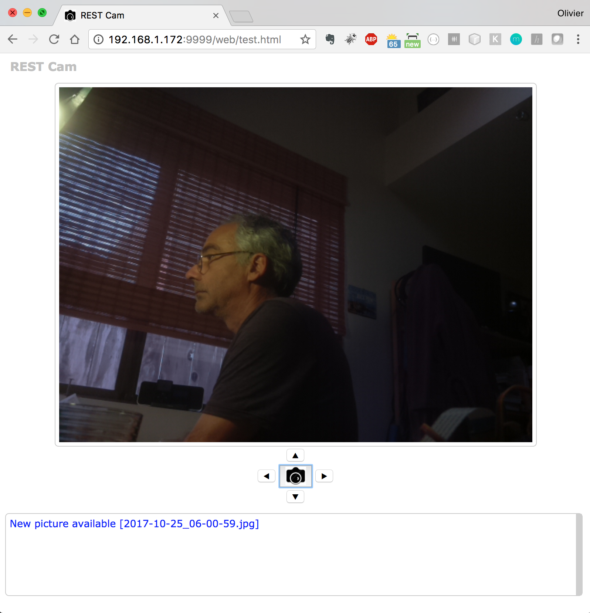

# Camera REST implementation

For remote access

Camera can be oriented with a PCA9685 connected on a [pan-tilt](https://www.adafruit.com/product/1967) module.


### To build
```bash
 $ cd RESTCam
 $ git pull origin master
 $ ../gradlew [--no-daemon] shadowJar
```

### To run, on the Raspberry Pi
```bash
 $ ./runCamServer.sh
```

Then a web page can be accessed remotely. From the Web UI, you can orient the camera, and take snapshots.

The REST server used here can be part of a bigger one (aggregated in a bigger one), see the `RESTNavServer` for an example.

---



---
